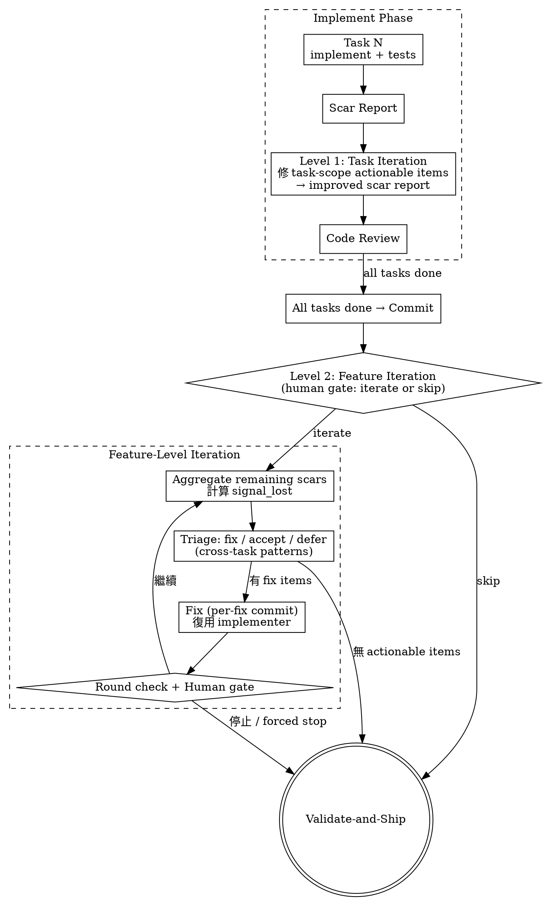

# Plan: Samsara Phase 4 — Auto Iteration (Dual-Level)

## Goal

建立雙層 iteration 機制：task-level（implementer 自修 scar items）和 feature-level（跨 task 的系統面問題），讓 scar report 從靜態文件變成 actionable resolution pipeline。

## Architecture

Phase 4 不是單一的新 skill，而是對兩個現有層面的增強：

```
Level 1: Task-level iteration（融入 implement）
  每個 task 的 implementer 完成後，自我審視 scar report，
  修復 task scope 內的 actionable items，產出 improved scar report。
  目標：每個 task 產出接近完善的 partial function。

Level 2: Feature-level iteration（新 skill，在 implement 和 validate-and-ship 之間）
  所有 tasks 完成後，aggregate 剩餘 scars，
  處理 cross-task patterns 和 feature composition 的 emergent rot。
  目標：處理只有在組裝後才看得見的系統面問題。
```

### Flow



## Components

### Level 1: Task-Level Iteration（修改現有 implement flow）

**修改 `agents/implementer.md`**：在 scar report 之後加入 self-iteration 步驟：

```
現有流程：
1-6. STEP 0 → death tests → unit tests → implement → all tests pass
7.   Scar report
8.   Report back

新增流程：
1-6. STEP 0 → death tests → unit tests → implement → all tests pass
7.   Scar report
8.   Self-iteration: 審視 scar items，修復 task-scope 內的 actionable items
9.   Updated scar report (resolved items 標記，新 items 加入)
10.  Report back
```

Self-iteration 的規則：
- 只修 **task scope 內**的 items（不跨 files 到其他 tasks 的範圍）
- Unverified assumptions → 嘗試 verify（寫 test 或檢查條件）
- Known shortcuts → 如果修的成本合理，修掉
- Silent failure conditions → 加 detection 或 handling
- 修不了的 → 標記為 `deferred_to_feature_iteration: true`
- 修完後的 scar report 有兩個 section：resolved_items + remaining_items

**修改 `skills/implement/SKILL.md`**：Per-Task Execution Order 加入 self-iteration 步驟。

### Level 2: Feature-Level Iteration（新 skill）

**新建 `skills/iteration/SKILL.md`**：

- **Entry gate**：implement 完成後，顯示 remaining scar items summary，問使用者 iterate 或 skip
- **Aggregate**：收集所有 tasks 的 remaining scar items（`deferred_to_feature_iteration: true` + 未 resolved 的 items），計算 signal_lost
- **Triage（human gate）**：每個 item 分類為 fix / accept / defer，focus on cross-task patterns
- **Fix**：復用 implementer agent，per-fix commit
- **Round check + Safety valve**：同原始設計（max 3 rounds, signal_lost 停滯偵測）
- **Exit → validate-and-ship**

### Signal Lost 計量

```
signal_lost = count(known_shortcuts)
            + count(silent_failure_conditions)
            + count(assumptions_made where verified == false)
```

Level 1 後 signal_lost 應該下降（task-level items resolved）。
Level 2 處理剩餘的 cross-task items。

### Iteration Log

Feature-level iteration 產出 `iteration-log.yaml`（格式同原始設計）。
Task-level iteration 不產出獨立 log — 結果直接反映在 updated scar report 中。

### Safety Valve（Level 2 only）

- 最大輪數：3 輪
- Signal lost 停滯：連續 2 輪不下降 → 提示
- 淨 scar 增加：fix 產出的新 scars > 修復的 scars → 提示

### Scar Schema 擴展

`scar-schema.yaml` 需要加入：
- `resolved_items` section — task-level iteration 已修復的 items
- `deferred_to_feature_iteration` flag — 標記推遲到 feature-level 的 items

## I/O Specification

### Level 1 (Task-Level)

- Input: 剛寫完的 scar report
- Output: Updated scar report（resolved_items + remaining_items）

### Level 2 (Feature-Level)

- Input: 所有 tasks 的 remaining scar items + index.yaml
- Output: iteration-log.yaml + updated code (per-fix commits) + updated scar reports

### Output (unknown)

- Level 1 中斷：scar report 可能是 partial — implementer 的 report status 會是 DONE_WITH_CONCERNS
- Level 2 中斷：同原始設計（per-fix commits preserved, iteration-log 不完整）

## Death Cases

1. **Cargo-cult self-iteration (Level 1)** — implementer 在 step 8 不做任何修復，直接把所有 items 標記 `deferred_to_feature_iteration`，把工作推給 Level 2
   - Detection: task scar report 中 resolved_items 為空且所有 items 都是 deferred
   - Code reviewer 應該質疑「為什麼 task-scope 內的 items 一個都沒修？」

2. **Cargo-cult triage (Level 2)** — 所有 items 標 accept
   - Detection: accept > 80% + zero fixes → warning

3. **Fix introduces new rot** — 兩個 level 都可能發生
   - Detection: net scar count 不降

4. **Scar schema mismatch** — non-conforming reports 被跳過
   - Detection: file count != triaged count

5. **Level 1 over-scope** — implementer 在 self-iteration 時修改了其他 tasks 的 files
   - Detection: code reviewer 檢查 diff 是否超出 task scope
