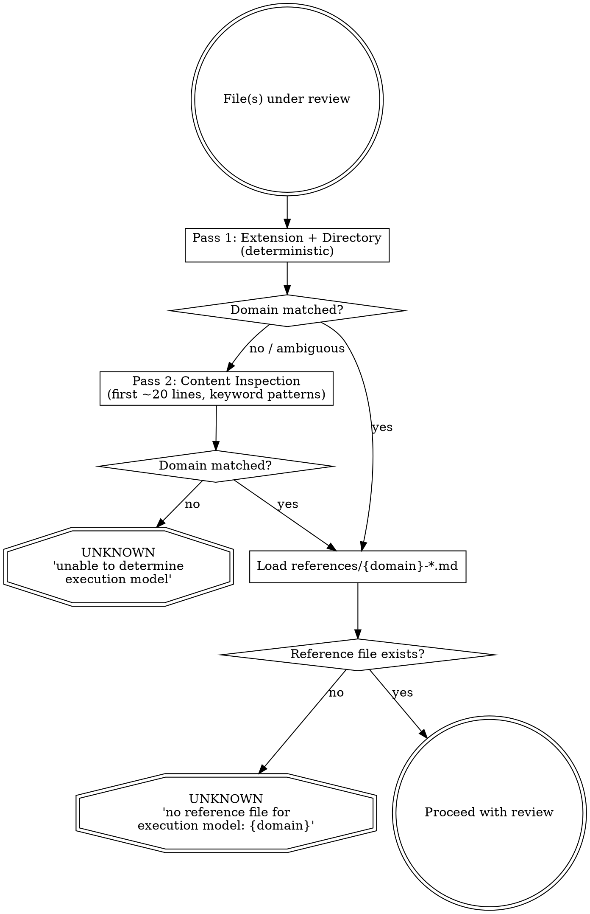

# Technical Plan: Execution Model Scope (Phase 6)

## Architecture

Two reviewer agents, both using the same router + reference file pattern:

```
code-quality-reviewer → references/{domain}-quality.md (structural principles)
code-reviewer         → references/{domain}-review.md  (behavioral patterns)
```

Both share the same two-pass router logic embedded as Step 0 in their agent definition.



## Router: Extension → Domain Mapping

### Pass 1 (deterministic)

| Pattern | Domain |
|---------|--------|
| `.py`, `.ts`, `.tsx`, `.js`, `.jsx`, `.go`, `.rs`, `.java`, `.rb`, `.c`, `.cpp`, `.cs`, `.kt`, `.swift` | code |
| `.tf`, `.tf.json`, `.tfvars`, `.tofu` | iac |
| `Dockerfile`, `*.dockerfile`, `Containerfile` | container |
| `.github/workflows/*.yml`, `.github/workflows/*.yaml`, `Jenkinsfile`, `.gitlab-ci.yml` | pipeline |
| `k8s/**/*.yaml`, `helm/**/*.yaml`, `charts/**/*.yaml` | orchestration |
| All other files | → proceed to Pass 2 |

### Pass 2 (content heuristic, first ~20 lines)

| Keyword patterns | Domain |
|-----------------|--------|
| `resource "`, `data "`, `variable "`, `terraform {`, `provider "` | iac |
| `FROM `, `RUN `, `COPY `, `ENTRYPOINT`, `CMD [` | container |
| `apiVersion:`, `kind: Deployment`, `kind: Service`, `kind: ConfigMap` | orchestration |
| `on:` + `jobs:` + `steps:` (combination) | pipeline |
| `dag = DAG(`, `@task`, `with DAG(`, `@dag` | pipeline (Airflow) |
| No match | → UNKNOWN |

## Reference File Design

### Applicability Declaration

Each reference file adds a new `## Applicability` section after `## Scope`:

```markdown
## Applicability

domain: iac
excluded_principles:
  - principle: I — Ghost Promises
    reason: "IaC modules have outputs but no interface contracts in the OOP sense. Module output misuse is covered by L (Silent Breach) instead."
  - principle: DRY — Duplication Is a Lie Splitting
    reason: "IaC duplication across environments is often intentional for blast-radius isolation. Flagging it as violation would produce false positives."
```

When reviewer reads an excluded principle, it outputs:
```
| I — Ghost Promises | UNKNOWN | Excluded by domain reference: IaC modules have outputs but no interface contracts in the OOP sense. |
```

### Reference File Map

| File | Reviewer | Domain | Status |
|------|----------|--------|--------|
| `references/code-quality.md` | code-quality-reviewer | code (imperative) | Existing — add Applicability section |
| `references/code-review.md` | code-reviewer | code (imperative) | New — extract from current agent definition |
| `references/iac-quality.md` | code-quality-reviewer | iac | New |
| `references/iac-review.md` | code-reviewer | iac | New |

### `code-reviewer` Refactoring

**Stays in agent definition:**
- Three Mother Rules (domain-agnostic judgment standard)
- Review procedure framework (Step 1-5 order)
- Output format
- Issue classification (Critical / Important / Suggestion)
- Constraints
- Reference File Protocol (new — same pattern as code-quality-reviewer)
- Step 0: Router (new)

**Extracted to `references/code-review.md`:**
- Step 1 (Deletion Analysis): specific patterns to look for
- Step 2 (Naming Honesty): specific dishonest name patterns
- Step 3 (Silent Rot Paths): specific rot patterns (try/catch swallowing, fallback without degraded mark, default filling unknown→known, retry without idempotency, timeout with silent continuation)
- Step 5 (Correctness): domain-specific correctness concerns

**Step 4 (Scar Report Integrity) stays in agent** — scar reports are samsara artifacts, domain-agnostic.

### `iac-quality.md` Principle Mapping

| Principle | Applicable? | IaC Reframing |
|-----------|------------|---------------|
| S — Death Responsibility | ✅ | A resource is responsible for exactly one reason to exist in the infrastructure |
| O — The Marked Bet | ✅ | `lifecycle { prevent_destroy }`, `ignore_changes` are marked bets on what won't change |
| L — Silent Breach | ✅ | Module replacement must not silently change resource behavior |
| I — Ghost Promises | ❌ Excluded | IaC modules have outputs, not interface contracts. Covered by L. |
| D — The Soundproof Wall | ✅ | Module wrapping must not make state drift harder to detect |
| Cohesion | ✅ | Resources in a module share a single lifecycle reason |
| Coupling | ✅ | Cross-module dependencies (data sources, remote state) must be visible |
| DRY | ❌ Excluded | Environment-level duplication is intentional for blast-radius isolation |
| Pattern | ✅ | "We use this module pattern" assumes your infra problem matches the original |

### `iac-review.md` Behavioral Patterns

| Step | Imperative (current) | IaC Adaptation |
|------|---------------------|----------------|
| 1. Deletion Analysis | Dead code, uncalled functions | Orphaned resources (in state but not in code), unused data sources, outputs no one reads |
| 2. Naming Honesty | `is_done` doesn't mean done | `allow_https` security group that allows all traffic, `private_subnet` that's actually public |
| 3. Silent Rot Paths | try/catch swallowing, fallback without marking | `default` values silently filling missing input, `ignore_changes` masking drift, `count = 0` silently removing, provider version unconstrained |
| 4. Scar Report | Unchanged (samsara artifact) | Unchanged |
| 5. Correctness | Logic errors, race conditions | Provider version constraints, state locking, resource dependency ordering, data source timing |

## Death Cases

### DC-1: Router misclassification (Silent failure)

**Trigger**: A `.yaml` file containing Kubernetes manifests has `resource:` as a YAML key (not Terraform `resource "..."`).
**The lie**: Router classifies it as IaC domain.
**The truth**: It's orchestration, not IaC. Wrong reference file loaded.
**Detection**: Content heuristics use multi-keyword patterns, not single keywords. Terraform pattern is `resource "` (with quote), not bare `resource:`.

### DC-2: Reference file missing (Unknown outcome)

**Trigger**: Router determines domain = "iac" but `iac-quality.md` was deleted or renamed.
**The lie**: Falls back to `code-quality.md` silently.
**The truth**: Wrong reference loaded, misleading verdicts produced.
**Detection**: Router explicitly checks file existence before loading. Missing file → UNKNOWN, not fallback.

### DC-3: Extraction regression (Silent failure)

**Trigger**: Extracting behavioral patterns from `code-reviewer.md` to `code-review.md` loses nuance.
**The lie**: Review appears to work for imperative code.
**The truth**: Some patterns that were in the agent definition didn't make it to the reference file.
**Detection**: Before/after comparison — review the same code with old and new agent, verdicts should match.

### DC-4: Excluded principle masking real issue (Degradation)

**Trigger**: DRY excluded for IaC, but a Terraform module has genuine harmful duplication (same security group rule copy-pasted, one gets updated, one doesn't).
**The lie**: DRY is excluded, so no concern raised.
**The truth**: The exclusion was for cross-environment duplication, not within-environment copy-paste.
**Detection**: Exclusion rationale must be specific enough to distinguish intentional duplication from harmful duplication. Review exclusion rationale against real cases.

## Assumptions

1. The router logic is described in natural language within the agent definition (markdown), not as executable code. The LLM executing the agent interprets the routing instructions.
2. C1-C8 outcome criteria remain unchanged across domains. Only which principles surface which outcomes may differ.
3. `code-quality.md` adding an Applicability section is backward-compatible — existing review behavior is unchanged since all 9 principles remain applicable for `domain: code`.
4. **Undocumented assumption (accepted gap from pre-thinking)**: Content inspection depth (~20 lines) is sufficient for domain detection. If a file has its identifying content deeper (e.g., a long header comment before the first `resource "` block), Pass 2 will miss it. Accepted because: (a) this is rare, (b) UNKNOWN is the honest fallback.
