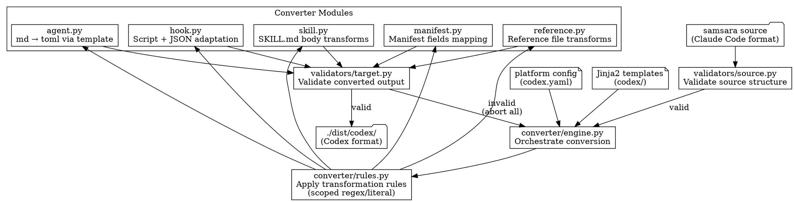

# Tech Plan: Multi-Platform Support (Phase 7)

## Summary

Config-driven 跨平台轉換框架。讀取 samsara Claude Code source + platform config，產生目標平台格式。Python CLI 提供 convert / install / update / validate。首先支援 Codex。

## Architecture

### Module Layout

```
samsara_cli/                             # Python package (underscore for import)
├── __init__.py
├── main.py                              # Typer CLI entry point
├── config/
│   ├── __init__.py
│   ├── schema.py                        # Pydantic models for platform config
│   ├── loader.py                        # Hydra compose API config loading
│   ├── config.yaml                      # Hydra base config with defaults
│   ├── platform/                        # Hydra config group (singular)
│   │   ├── claude-code.yaml             # Source platform definition
│   │   └── codex.yaml                   # Target platform definition
│   └── templates/                       # Jinja2 templates (not managed by Hydra)
│       └── codex/
│           ├── agent.toml.j2            # Agent md → toml
│           ├── hook.sh.j2              # Hook script
│           ├── manifest.json.j2         # Plugin manifest
│           └── hooks.json.j2            # Hooks config
├── converter/
│   ├── __init__.py
│   ├── engine.py                        # Conversion orchestrator
│   ├── rules.py                         # Transformation rules engine (regex/literal, scoped)
│   ├── skill.py                         # SKILL.md content transformation
│   ├── agent.py                         # Agent format conversion (md → toml)
│   ├── hook.py                          # Hook script + hooks.json adaptation
│   ├── manifest.py                      # Plugin manifest conversion
│   └── reference.py                     # Reference file handling
├── installer/
│   ├── __init__.py
│   ├── detect.py                        # Platform detection (which tools installed)
│   └── install.py                       # Installation + update logic (idempotent)
└── validators/
    ├── __init__.py
    ├── source.py                        # Validate source plugin structure
    └── target.py                        # Validate converted output against platform spec
```

> **Naming note**: Python package uses underscore (`samsara_cli`) for import compatibility. CLI entry point uses hyphen (`samsara-cli`) for user-facing command.

### Conversion Flow



### Platform Config Schema

Platform config 用 Hydra `compose` API 載入（不用 `@hydra.main`，避免和 Typer 衝突）。

#### Hydra Base Config

```yaml
# config/config.yaml
defaults:
  - platform: codex    # default platform selection

source:
  plugin_dir: ".claude-plugin"
  skills_dir: "skills"
  agents_dir: "agents"
  hooks_dir: "hooks"
  references_dir: "references"
```

#### Config Loader Pattern

```python
from hydra import compose, initialize
from omegaconf import OmegaConf, DictConfig

def load_platform_config(platform: str) -> PlatformConfig:
    with initialize(version_base="1.3", config_path="config"):
        cfg: DictConfig = compose(
            config_name="config",
            overrides=[f"platform={platform}"]
        )
    data = OmegaConf.to_container(cfg, resolve=True)
    return PlatformConfig(**data)
```

#### Platform Config (Codex)

```yaml
# config/platform/codex.yaml
platform:
  name: codex
  version_cmd: "codex --version"

paths:
  plugin_dir: ".codex-plugin"
  plugin_manifest: "plugin.json"
  skills_dir: "skills"
  agents_dir: "agents"
  hooks_file: "hooks.json"

install:
  project:
    target: "$CWD/.codex-plugin"
  global:
    marketplace_name: "samsara-local"
    marketplace_source: "~/.codex/plugins/samsara"
    plugin_name: "samsara"
    config_path: "~/.codex/config.toml"

formats:
  agent:
    type: toml
    template: "agent.toml.j2"
    fields_mapping:
      body: developer_instructions
    optional_fields: [model, sandbox_mode, mcp_servers, "skills.config"]

  hook_output:
    context_injection_field: "systemMessage"
    session_start_matchers: ["startup", "resume"]
    template: "hooks.json.j2"
    script_template: "hook.sh.j2"

  manifest:
    template: "manifest.json.j2"
    extra_fields:
      skills: "./skills/"

naming:
  skill_prefix: "samsara"
  separator: "-"  # samsara:research → samsara-research

permissions:
  sandbox_mode: "workspace-write"
  feature_flags:
    codex_hooks: true

transformations:
  # --- High priority: platform-specific syntax ---
  - id: skill_invocation
    scope: body
    type: regex
    match: 'invoke `samsara:([\\w-]+)`'
    replace: 'use the `$samsara-\\1` skill'
    priority: high

  - id: skill_invocation_variant
    scope: body
    type: regex
    match: 'invoke `samsara:([\\w-]+)` skill'
    replace: 'use the `$samsara-\\1` skill'
    priority: high

  - id: skill_tool_reference
    scope: body
    type: regex
    match: 'using the Skill tool'
    replace: 'using the `$skill-name` invocation syntax'
    priority: high

  - id: agent_dispatch_subagent_type
    scope: body
    type: regex
    match: 'subagent_type: "samsara:([\\w-]+)"'
    replace: 'agent named "samsara-\\1"'
    priority: high

  - id: agent_tool_reference
    scope: body
    type: regex
    match: 'Agent tool:'
    replace: 'Subagent dispatch:'
    priority: high

  - id: task_create
    scope: body
    type: regex
    match: 'TaskCreate\\b'
    replace: 'update_plan'
    priority: medium

  - id: task_update
    scope: body
    type: regex
    match: 'TaskUpdate\\b'
    replace: 'update_plan'
    priority: medium

  # --- Medium priority: tool name mapping ---
  - id: tool_read
    scope: body
    type: literal
    match: 'Read tool'
    replace: 'file reading (via exec_command with cat/nl)'
    priority: medium

  - id: tool_edit
    scope: body
    type: literal
    match: 'Edit tool'
    replace: 'apply_patch'
    priority: medium

  - id: tool_write
    scope: body
    type: literal
    match: 'Write tool'
    replace: 'apply_patch'
    priority: medium

  - id: tool_bash
    scope: body
    type: literal
    match: 'Bash tool'
    replace: 'exec_command'
    priority: medium

  - id: tool_ls
    scope: body
    type: literal
    match: 'LS tool'
    replace: 'exec_command with ls/find'
    priority: medium

  - id: tool_grep
    scope: body
    type: literal
    match: 'Grep tool'
    replace: 'exec_command with rg'
    priority: medium

  - id: tool_glob
    scope: body
    type: literal
    match: 'Glob tool'
    replace: 'exec_command with find/rg --files'
    priority: medium
```

### Transformation Strategy

兩層機制：

1. **Structured rules**（content transformation）：
   - Scoped（frontmatter / body）— 不會誤改 frontmatter
   - Typed（regex with capture groups / literal exact match）
   - Ordered（config 中的順序即執行順序）
   - 每條 rule 獨立可測試
   - Deterministic — same input + same rules = same output

2. **Jinja2 templates**（format conversion）：
   - Agent `.md` → `.toml`
   - Hook script output format
   - Plugin manifest
   - Hooks.json structure

### CLI Interface

```
samsara-cli convert --platform codex [--source ./] [--output ./dist/codex/]
samsara-cli install <platform> [--scope project|global] [--source ./dist/codex/]
samsara-cli update <platform> [--scope project|global]
samsara-cli validate --platform codex [--source ./dist/codex/]
samsara-cli list-platforms
```

- `convert`: Source → apply rules + templates → output to dist/
- `install`: Convert (if not done) → install to target scope
  - `--scope project` (default): copy `.codex-plugin/` to CWD
  - `--scope global`: copy to marketplace source dir + register in platform config.toml
- `update`: Re-convert + re-install (idempotent, no state tracking). Scope must match original install.
- `validate`: Check source or target structure against platform spec

#### Install Scope: project vs global

| | `--scope project` (default) | `--scope global` |
|---|---|---|
| **Files** | `.codex-plugin/` in CWD | `~/.codex/plugins/samsara/samsara/.codex-plugin/` |
| **Registration** | None (CWD auto-discover) | `config.toml`: `[marketplaces.samsara-local]` + `[plugins."samsara@samsara-local"]` |
| **Modifies config.toml** | No | Yes (with backup) |
| **Availability** | Current project only | All projects |

Global install flow:
1. `mkdir -p ~/.codex/plugins/samsara/samsara/.codex-plugin/`
2. Copy converted files
3. Backup `~/.codex/config.toml` → `config.toml.bak`
4. Append marketplace + plugin registration
5. Output post-install instructions (feature flags, restart)

### Error Handling

**All-or-nothing** — 任何 component 轉換失敗即全部 abort。部分安裝的 samsara（workflow chain 斷裂）比沒安裝更危險。

### Extension Points

新增平台：
1. 建立 `config/platform/<platform>.yaml`（Hydra config group entry）
2. 建立 `config/templates/<platform>/` 下的 Jinja2 templates
3. （optional）如果需要 platform-specific logic，在 converter module 加 platform hook
4. 跑 `samsara-cli convert --platform <platform>`

### Versioning

統一 samsara version — `plugin.json` 和 `pyproject.toml` 同步。CLI 是 samsara 的一部分，不是獨立 package。

### Testing

| Layer | 內容 | 環境 | 何時跑 |
|-------|------|------|--------|
| Unit | 每個 converter module, rules engine, config loader | Python | 每次 CI |
| Pipeline integration | Source → convert → validate → verify structure | Python | 每次 CI |
| Format validation | 轉換後檔案格式合法性（TOML parse, JSON schema, frontmatter） | Python | 每次 CI |
| Snapshot | Convert output vs committed expected output | Python | 每次 CI |
| Smoke test | Install to Codex → trigger skill → verify response | Codex CLI | Local only (`@pytest.mark.integration`) |

### Tool Mapping Reference

| Category | Claude Code | Codex | Priority |
|----------|------------|-------|----------|
| Shell execution | Bash | exec_command | Low |
| File read | Read | exec_command + cat/nl | Medium |
| File listing | LS | exec_command + ls/find | Medium |
| Pattern search | Glob | exec_command + find/rg --files | Medium |
| Code search | Grep | exec_command + rg | Medium |
| File edit | Edit / Write | apply_patch | Medium |
| Skill invocation | Skill tool | $skill-name syntax | **High** |
| Agent dispatch | Agent tool + subagent_type | Agent dispatch by name | **High** |
| Task management | TaskCreate / TaskUpdate | update_plan | Medium |
| Hooks | hookSpecificOutput.additionalContext | systemMessage | **High** |
| Permissions | Claude Code permission model | sandbox_mode + feature_flags | **High** |

### Components to Convert

| Component | Count | Source Format | Target Format | Converter |
|-----------|-------|--------------|---------------|-----------|
| Skills | 11 | SKILL.md (markdown) | SKILL.md (markdown, transformed) | skill.py |
| Agents | 6 | agents/*.md | agents/*.toml | agent.py |
| Hooks | 2 scripts + 1 config | bash + hooks.json | bash + hooks.json (adapted) | hook.py |
| References | 4 | references/*.md | references/*.md (transformed) | reference.py |
| Manifest | 1 | .claude-plugin/plugin.json | .codex-plugin/plugin.json | manifest.py |

### Death Cases

1. **Silent wrong mapping** — Transformation rule matches unintended text in SKILL.md body, producing subtly incorrect instructions. The skill loads but gives wrong guidance.
2. **Partial chain break** — One skill's transition statement fails to convert, breaking the workflow chain. User reaches a dead end mid-workflow with no error message.
3. **Agent dispatch mismatch** — Agent name in dispatch template doesn't match the converted agent file name. Codex fails to find the agent silently.
4. **Hook injection failure** — Session-start hook runs but Codex ignores `systemMessage` because hooks feature flag isn't enabled. Bootstrap never loads.
5. **Template rendering with stale data** — Jinja2 template references a field that source agent file doesn't have. Template renders with empty/default value silently.

### Assumptions

本計畫假設：
- Codex CLI v0.124.0+ 的 skill/agent/hook 機制在 Phase 7 期間不會有 breaking changes。若不成立，轉換後的 output 可能無法載入。
- Codex 的 `systemMessage` hook output 功能等同 Claude Code 的 `additionalContext`。若不成立，bootstrap injection 需要替代方案。
- Samsara source 結構不會在 Phase 7 期間大幅改變。若不成立，source validator 和 converter 需要同步更新。

### Undocumented Assumptions (from Planning Pre-thinking gaps)

- Codex 接受 `$samsara-research` 等帶 hyphen 的 skill 名稱作為 explicit invocation。未驗證 — 需在 smoke test 確認。
- Codex agent TOML 的 `developer_instructions` 欄位可以放大量 markdown content（samsara agents 有些超過 8KB）。未驗證長度限制。
