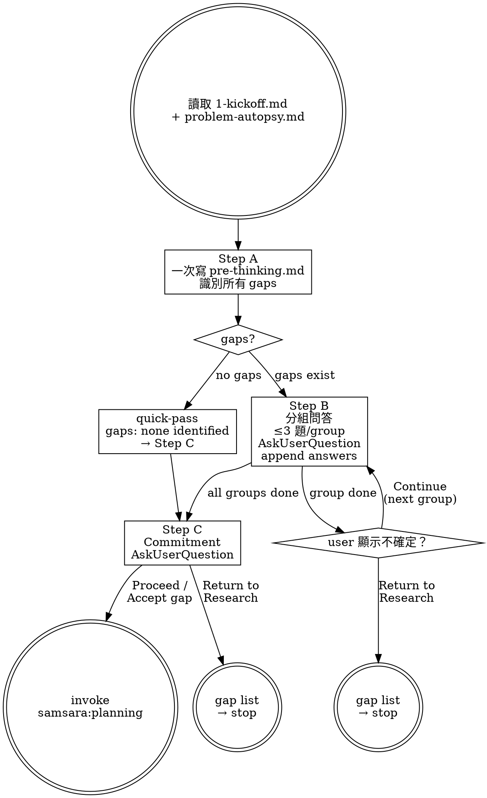

# Plan: extract-pre-thinking-step

## Step 1.5: Pre-thinking — Information Assumptions

```
Assumptions (all resolvable from research):
- research/SKILL.md transition update required (implicit Must-Have, added as Task 4)
- Death tests = behavioral scenario docs in death-tests.md (no test runner for skills)
- SKILL.md body ≤ 500 words; flow detail in support/flow.md
- K3b detection = absence of "## Step C — Commitment" section
- File-edit detection = read-before-write comparison per Step B append

No gaps. No uncertainties.
```

---

## Technical Specification

### System Description

A new samsara chain skill `samsara:pre-thinking` that runs unconditionally between research and planning. It surfaces user-LLM assumption gaps, asks questions in groups of ≤3 via AskUserQuestion, and produces an append-only audit log (`pre-thinking.md`). Planning is blocked until pre-thinking produces a complete commitment.

### I/O with Unknown Output

**pre-thinking skill:**

| State | Condition | Next action |
|-------|-----------|-------------|
| `success` | `pre-thinking.md` has `## Step C — Commitment` with `Proceed` or `Accept gap` | Invoke `samsara:planning` |
| `failure` | Commitment = `Return to Research` | Write gap list to Step C section; stop; user re-invokes `samsara:research` |
| `unknown` | Session ends before `## Step C — Commitment` is written | K3b interrupted state; next session reads file, detects missing section, informs user |

**planning skill (after patch):**

| State | Condition |
|-------|-----------|
| `proceed` | `pre-thinking.md` present with complete commitment section |
| `blocked` | `pre-thinking.md` absent or missing `## Step C — Commitment` → STOP, re-invoke `samsara:pre-thinking` |

### Death Cases

**DC-1: K3b Half-Finished Session**
- Trigger: Session ends during Step B (AskUserQuestion sent, answer not yet appended)
- Lie: `pre-thinking.md` has questions written → looks like pre-thinking ran
- Truth: No answers, no commitment. Planning would proceed with zero alignment.
- Detection: Check for `## Step C — Commitment` section. Absent = incomplete.

**DC-2: LLM Leading the Answers**
- Trigger: LLM writes questions with implied answers ("Should we use X (recommended)?") → user rubber-stamps
- Lie: `pre-thinking.md` shows user answers → looks like alignment happened
- Truth: LLM filled its own gaps under the cover of a question format.
- Detection: `pre_thinking_commitment_distribution` showing 100% Proceed + zero "Accept gap" across multiple features.

**DC-3: Quick-Pass Overuse**
- Trigger: LLM marks every research output as gap-free → always quick-passes
- Lie: `pre-thinking.md` created → chain compliance visible
- Truth: Gaps existed but weren't surfaced; smuggled into planning as implicit assumptions.
- Detection: Q count = 0 across all features (invocation rate ≈ 100% but always quick-pass).

**DC-4: File-Edit Silent Overwrite**
- Trigger: User edits `pre-thinking.md` during Step B; agent appends answers without noticing
- Lie: Step B appends LLM answers → file looks complete
- Truth: User's intent (their edits) overwritten silently.
- Detection: Read file before each append; compare to expected content from last write. Difference = user edited.

**DC-5: Group Overflow**
- Trigger: LLM puts > 3 questions in one AskUserQuestion call
- Lie: Questions are structured → looks like guided Q&A
- Truth: Cognitive overload → shallow answers → same problem as chat dump.
- Detection: Count questions per AskUserQuestion call. Must be ≤ 3.

**DC-6: Return to Research Without Gap List**
- Trigger: User selects "Return to Research"; agent terminates without writing gap list
- Lie: Session ended cleanly → looks like pre-thinking completed
- Truth: User doesn't know what to re-research. Gaps are invisible.
- Detection: When commitment = Return to Research, `## Step C — Commitment` section must contain explicit `unresolved_gaps` list.

**DC-7: Planning Reads Stale Pre-thinking**
- Trigger: Feature re-researched; pre-thinking re-run; old `pre-thinking.md` present; planning reads without checking timestamp
- Lie: Planning has `pre-thinking.md` in prerequisites → looks like chain complete
- Truth: Planning may have read alignment from a previous research cycle.
- Detection: `pre-thinking.md` includes session ISO timestamp; planning must cite it in `2-plan.md` Tech Spec assumptions.

### Assumptions (Undocumented — Accepted from Research)

- AskUserQuestion primitive confirmed in all current samsara clients (Codex CLI: `ask_user_question`; Gemini CLI v0.29.0+: `ask_user`)
- `header` field ≤ 12 chars in all AskUserQuestion calls for broadest client compatibility
- Samsara is single-developer use case — no concurrent writers to `pre-thinking.md`
- pre-thinking is ALWAYS invoked after research (unconditional chain)
- Session timestamp in `pre-thinking.md` uses ISO 8601 format

---

## File Map

### Create
| File | Purpose |
|------|---------|
| `skills/pre-thinking/SKILL.md` | Main skill definition (≤500 words body) |
| `skills/pre-thinking/support/flow.md` | Detailed A/B/C flow, group overflow, file-edit detection, K3b recovery |
| `skills/pre-thinking/templates/pre-thinking.md` | Append-only audit log template with section comments |
| `changes/2026-05-20_extract-pre-thinking-step/death-tests.md` | Behavioral verification scenarios (7 death cases) |

### Modify
| File | Changes |
|------|---------|
| `skills/planning/SKILL.md` | Remove Step 1.5; add `pre-thinking.md` to prerequisites with guard; update dot graph (remove prethink nodes, add blocked state) |
| `skills/research/SKILL.md` | Update transition: "invoke samsara:planning" → "invoke samsara:pre-thinking"; update dot graph `next` label |
| `skills/samsara-bootstrap/SKILL.md` | Add `pre_thinking` node to dot graph; change `research -> planning` to `research -> pre_thinking -> planning`; add pre-thinking to Chain Skills list |
| `skills/writing-skills/SKILL.md` | Add single-writer artifact invariant to Yin-Side Check section |

---

## Skill Design Specifications

### pre-thinking SKILL.md

**Frontmatter:**
```yaml
---
name: pre-thinking
description: Use when research output (1-kickoff.md + problem-autopsy.md) is complete and you need to surface user-LLM assumption gaps before planning — always runs between research and planning in the samsara chain
---
```

**Dot graph (core process):**


**Body content spec (yin constraints to enforce):**
- Step A: write in one shot, never partial; if no gaps write `gaps: none identified`; do NOT start asking questions yet
- Step B: always read file before appending; if file differs from last written state, incorporate user edits before appending; offer "Return to Research" option when uncertainty detected in answers
- Step C: always via AskUserQuestion — never infer commitment from conversation; if Accept gap, carry gap forward to planning as undocumented assumption in 2-plan.md

### pre-thinking.md Template Structure

```markdown
# Pre-thinking: <feature-name>

## Session: <ISO timestamp>

## Step A — Questions
<!-- LLM writes all gaps here in one shot at Step A. Never modified after Step A completes. -->

### Gap <n>: <short topic label>
**Question:** <specific, non-leading question>
**Hypothesis:** <LLM's current assumption — what it would assume if the user said nothing>

<!-- For quick-pass: -->
gaps: none identified — proceeding directly to commitment.

---

## Step B — Answers
<!-- LLM appends here after each AskUserQuestion group. Never overwrites Step A or prior groups. -->

### Group <n>: <theme>
**Q:** <question text (copied from Step A)>
**A:** <user's answer, verbatim or paraphrased — appended by LLM after AskUserQuestion>

---

## Step C — Commitment
<!-- LLM writes this section after final AskUserQuestion. Its presence signals session complete. -->

**Date:** <ISO timestamp>
**Decision:** <Proceed | Accept gap | Return to Research>
**Accepted gaps:** <list of gap labels, or "none">
**Unresolved gaps:** <list of gap labels with reason, or "none">
```

**Template invariants:**
- Step A written once, never modified after
- Step B is append-only (each group appended below previous)
- Step C written once, at session end
- Absence of `## Step C — Commitment` = K3b interrupted state
- No section is optional (quick-pass skips Step B but still writes Step A and Step C)

### flow.md Content Spec

Sections to include:
1. **Gap identification guidance** — what constitutes a real gap vs planning decision
2. **Group formation procedure** — how to cluster by similarity; what "similarity" means (topic domain, answer-interdependency, shared assumptions)
3. **Group overflow procedure** — if group has N > 3: split into ⌈N/3⌉ rounds; first round takes 3, last round takes remainder (≤3)
4. **File-edit detection procedure** — before each Step B append: read file, compare Step A section and all prior Step B groups to expected content. If different: print "I see you've edited pre-thinking.md. Incorporating your changes." Then proceed to append.
5. **K3b recovery procedure** — on session start, read pre-thinking.md: if file has content but no `## Step C — Commitment`, session was interrupted. Inform user, offer: Resume (continue from last group) / Restart (overwrite file with fresh Step A).
6. **Return to Research write format** — what exactly to write in Step C when commitment = Return to Research

### planning/SKILL.md Changes

**Prerequisites section update:**
Add after existing prerequisites:
```
- `pre-thinking.md` — user-LLM assumption alignment and commitment (required; if absent
  or `## Step C — Commitment` section missing, STOP and re-invoke `samsara:pre-thinking`)
```

**Dot graph update:**
Remove `prethink` and `human_pt` nodes. Change `start -> prethink` chain to:
```
start -> guard [label="pre-thinking.md\npresent + complete?"];
guard [label="pre-thinking\ncomplete?" shape=diamond];
guard -> spec [label="yes"];
guard -> blocked [label="no"];
blocked [label="STOP:\nre-invoke\nsamsara:pre-thinking" shape=doublecircle];
```

**Step 1.5 section:** Remove entirely (lines 50–101 in current SKILL.md).

### research/SKILL.md Changes

**Dot graph:** Change `next [label="invoke samsara:planning"]` to `next [label="invoke samsara:pre-thinking"]`.

**Transition section:** Change last line from "invoke `samsara:planning` skill" to "invoke `samsara:pre-thinking` skill."

### samsara-bootstrap/SKILL.md Changes

**Dot graph changes:**
- Add node: `pre_thinking [label="samsara:pre-thinking"];`
- Remove edge: `research -> planning [label="human gate"];`
- Add edges:
  ```
  research -> pre_thinking [label="human gate"];
  pre_thinking -> planning [label="human gate"];
  ```

**Chain Skills list:** Add after `samsara:planning` entry:
```
- **samsara:pre-thinking** — research 完成後、planning 前。顯化 user-LLM assumption gap，產出 pre-thinking.md audit log
```
Move `samsara:planning` to be listed after `samsara:pre-thinking` in chain order.

### writing-skills/SKILL.md Changes

**Yin-Side Check section:** Add as item 4 (after existing 3 questions):

```markdown
4. **Does this skill produce a persisted artifact?** If yes: who is the sole writer?
   - LLM must be the sole writer. User interaction goes through AskUserQuestion — answers
     are written to the artifact BY the LLM, not by the user directly.
   - Dual-writer artifacts (user + LLM both write to same file) introduce K3b
     cross-session half-finished state and race conditions. Do not design them.
```
