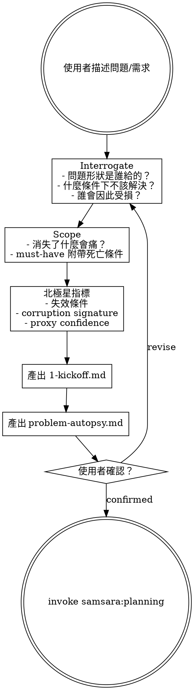
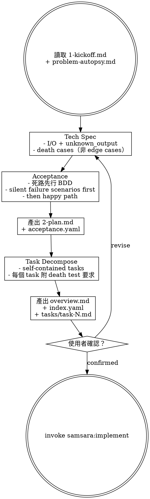
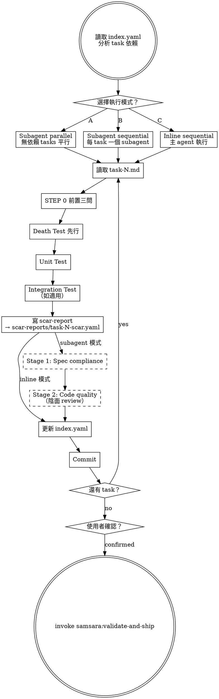
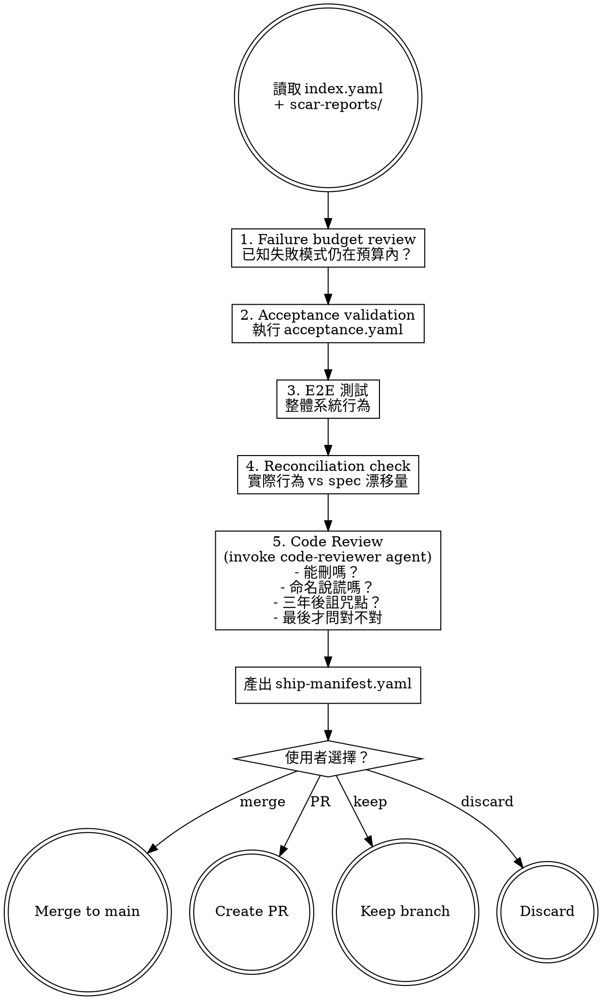
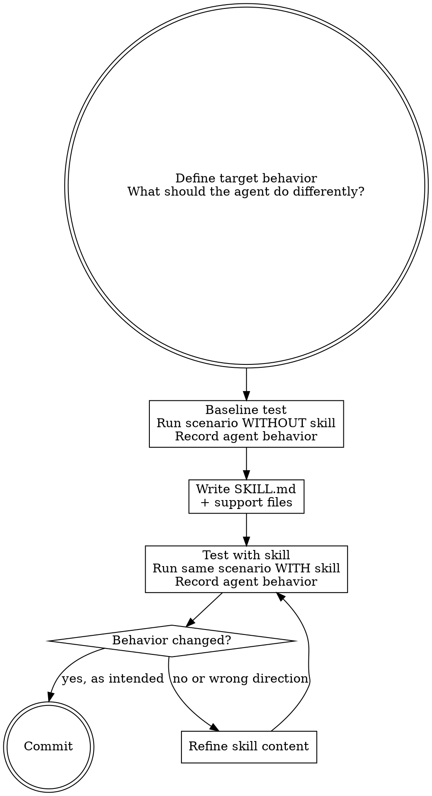

# Samsara Harness Engineering — Phase 1 Implementation Plan

> **For agentic workers:** REQUIRED SUB-SKILL: Use superpowers:subagent-driven-development (recommended) or superpowers:executing-plans to implement this plan task-by-task. Steps use checkbox (`- [ ]`) syntax for tracking.

**Goal:** Build the samsara Claude Code plugin with 5 core skills, 1 meta skill, 1 agent, and session-start hook — implementing the full Research → Planning → Implementation → Validation → Ship lifecycle with 向死而驗 (death-first verification) philosophy.

**Architecture:** Monorepo sub-plugin at `kaleidoscope-tools/samsara/` with independent `.claude-plugin/plugin.json`. Skills use Graphviz digraph for internal process flows. Each skill chains to the next via human-gated invocation. Session-start hook injects bootstrap content (axiom + agent constraints + skill list) into agent context.

**Tech Stack:** Claude Code plugin system (`.claude-plugin/`), Bash (session-start hook), Markdown + YAML (skills, templates, agents)

**Spec:** `docs/superpowers/specs/2026-04-01-samsara-harness-design.md`

---

## File Structure

```
samsara/
├── .claude-plugin/
│   └── plugin.json                       # Plugin registration
├── skills/
│   ├── samsara-bootstrap/
│   │   └── SKILL.md                      # Session-start injection content
│   ├── research/
│   │   ├── SKILL.md                      # Interrogate + Scope + North Star
│   │   ├── problem-autopsy.md            # Support doc: autopsy format + example
│   │   └── templates/
│   │       ├── problem-autopsy.md        # Output template
│   │       └── kickoff.md               # Output template
│   ├── planning/
│   │   ├── SKILL.md                      # Plan + Spec + Task decompose
│   │   ├── death-first-spec.md           # Support doc: death-first BDD
│   │   ├── task-format.md                # Support doc: self-contained task format
│   │   └── templates/
│   │       ├── acceptance.yaml           # Output template
│   │       ├── overview.md               # Output template
│   │       └── index.yaml                # Output template
│   ├── implement/
│   │   ├── SKILL.md                      # Death test first execution
│   │   ├── scar-report.md                # Support doc: scar report format + example
│   │   └── templates/
│   │       └── scar-report.yaml          # Output template
│   ├── validate-and-ship/
│   │   ├── SKILL.md                      # Validation + Ship manifest
│   │   ├── ship-manifest.md              # Support doc: ship manifest format
│   │   └── templates/
│   │       └── ship-manifest.yaml        # Output template
│   └── writing-skills/
│       └── SKILL.md                      # Meta: death-first TDD for skills
├── agents/
│   └── code-reviewer.md                  # Yin-side code review agent
└── hooks/
    ├── hooks.json                        # SessionStart hook config
    └── session-start                     # Bash: inject bootstrap content
```

---

### Task 1: Plugin Scaffold + Registration

**Files:**
- Create: `samsara/.claude-plugin/plugin.json`
- Create: `samsara/hooks/hooks.json`

- [ ] **Step 1: Create samsara directory structure**

```bash
mkdir -p samsara/.claude-plugin
mkdir -p samsara/skills/samsara-bootstrap
mkdir -p samsara/skills/research/templates
mkdir -p samsara/skills/planning/templates
mkdir -p samsara/skills/implement/templates
mkdir -p samsara/skills/validate-and-ship/templates
mkdir -p samsara/skills/writing-skills
mkdir -p samsara/agents
mkdir -p samsara/hooks
```

- [ ] **Step 2: Create plugin.json**

Write `samsara/.claude-plugin/plugin.json`:

```json
{
  "name": "samsara",
  "description": "向死而驗 — Death-first development workflow. Existential accountability for every line of code.",
  "version": "0.1.0",
  "author": {
    "name": "Roymond Liao"
  }
}
```

- [ ] **Step 3: Create hooks.json**

Write `samsara/hooks/hooks.json`:

```json
{
  "hooks": [
    {
      "matcher": "startup|clear|compact",
      "event": "SessionStart",
      "hooks": [
        {
          "type": "command",
          "command": "bash hooks/session-start",
          "timeout": 5000,
          "synchronous": true
        }
      ]
    }
  ]
}
```

- [ ] **Step 4: Verify directory structure**

Run: `find samsara -type d | sort`
Expected: All directories from the file structure above should exist.

- [ ] **Step 5: Commit**

```bash
git add samsara/.claude-plugin/plugin.json samsara/hooks/hooks.json
git commit -m "feat(samsara): scaffold plugin structure and registration"
```

---

### Task 2: Session-Start Hook + Bootstrap Skill

**Files:**
- Create: `samsara/hooks/session-start`
- Create: `samsara/skills/samsara-bootstrap/SKILL.md`

- [ ] **Step 1: Create samsara-bootstrap SKILL.md**

Write `samsara/skills/samsara-bootstrap/SKILL.md`:

```markdown
---
name: samsara-bootstrap
description: Injected at session start — establishes samsara axiom, agent constraints, and skill discovery for the session
---

# Samsara — 向死而驗

> Toward death, through verification.

## 唯一公理

**存在即責任，無責任即無存在。**

任何存在於系統中的東西——function、module、service、agent 的一個決策——都必須能回答：「如果你消失了，什麼東西會感到痛？」回答不了的，不應該存在。

## STEP 0 — 任何實作前的前置條件

在執行任何開發任務之前，必須先完成以下三個問題。這不是建議，是前置條件。

1. 找出這個需求最想聽到的實作方式。先不要走那條路。
2. 問：這個需求在什麼條件下根本不應該被實作？
3. 問：如果這個實作靜默地失敗了，誰會是第一個發現的人？發現之前，損害已經擴散到哪裡？

## Agent 禁止行為

1. **禁止靜默補全** — 輸入不完整時，不准自動補假設值繼續。必須停下標記「輸入不完整，缺少：___」
2. **禁止確認偏誤實作** — 不准只實作符合需求描述的路徑。必須同時標記「當___不成立時，會___」
3. **禁止隱式假設** — 任何假設必須明確寫出：「本實作假設：___。若不成立，___會發生」
4. **禁止樂觀完成宣告** — 未知副作用或邊界條件必須在完成報告中列出
5. **禁止吞掉矛盾** — 需求存在矛盾時，不准選一個解釋繼續。必須先指出矛盾，請求釐清

## Agent 強制行為

1. 每次實作完成後附：「這個實作在以下條件下會靜默失敗：___」
2. 每次提出設計方案時附：「這個設計假設了___永遠成立。若不再成立，最先腐爛的是___」
3. 每次被要求優化時先問：「值得優化嗎？還是不應該存在？」
4. 遇到模糊需求時，不選最合理解釋繼續——讓模糊本身可見

## 可用 Skills

- **samsara:research** — 新功能/新問題的起點。產出 kickoff + problem autopsy
- **samsara:planning** — research 完成後。產出 plan + acceptance + tasks
- **samsara:implement** — plan 就緒後。death test first 的實作流程
- **samsara:validate-and-ship** — 實作完成後。驗屍 + 交付
- **samsara:writing-skills** — 用向死而驗的方式寫新 skill
```

- [ ] **Step 2: Create session-start hook script**

Write `samsara/hooks/session-start`:

```bash
#!/usr/bin/env bash
# SessionStart hook for samsara plugin
# Injects samsara-bootstrap skill content into agent session context

set -euo pipefail

# Determine plugin root directory
SCRIPT_DIR="$(cd "$(dirname "$0")" && pwd)"
PLUGIN_ROOT="$(cd "${SCRIPT_DIR}/.." && pwd)"

# Read samsara-bootstrap content
bootstrap_content=$(cat "${PLUGIN_ROOT}/skills/samsara-bootstrap/SKILL.md" 2>&1 || echo "Error reading samsara-bootstrap skill")

# Escape string for JSON embedding using bash parameter substitution
escape_for_json() {
    local s="$1"
    s="${s//\\/\\\\}"
    s="${s//\"/\\\"}"
    s="${s//$'\n'/\\n}"
    s="${s//$'\r'/\\r}"
    s="${s//$'\t'/\\t}"
    printf '%s' "$s"
}

bootstrap_escaped=$(escape_for_json "$bootstrap_content")
session_context="<IMPORTANT>\nYou are operating under the Samsara framework (向死而驗).\n\n**Below is the full content of your 'samsara:samsara-bootstrap' skill. For all other skills, use the 'Skill' tool:**\n\n${bootstrap_escaped}\n</IMPORTANT>"

# Output context injection as JSON for Claude Code
printf '{\n  "hookSpecificOutput": {\n    "hookEventName": "SessionStart",\n    "additionalContext": "%s"\n  }\n}\n' "$session_context"

exit 0
```

- [ ] **Step 3: Make session-start executable**

Run: `chmod +x samsara/hooks/session-start`

- [ ] **Step 4: Test hook execution**

Run: `cd samsara && bash hooks/session-start`
Expected: JSON output with `hookSpecificOutput.additionalContext` containing the bootstrap content. Verify it includes "向死而驗", "STEP 0", "Agent 禁止行為", "可用 Skills" sections.

- [ ] **Step 5: Verify JSON is valid**

Run: `cd samsara && bash hooks/session-start | python3 -m json.tool > /dev/null && echo "Valid JSON" || echo "Invalid JSON"`
Expected: `Valid JSON`

- [ ] **Step 6: Commit**

```bash
git add samsara/skills/samsara-bootstrap/SKILL.md samsara/hooks/session-start
git commit -m "feat(samsara): add bootstrap skill and session-start hook"
```

---

### Task 3: Research Skill + Support Files + Templates

**Files:**
- Create: `samsara/skills/research/SKILL.md`
- Create: `samsara/skills/research/problem-autopsy.md`
- Create: `samsara/skills/research/templates/kickoff.md`
- Create: `samsara/skills/research/templates/problem-autopsy.md`

- [ ] **Step 1: Create research SKILL.md**

Write `samsara/skills/research/SKILL.md`:

```markdown
---
name: research
description: Use when starting new feature work, investigating a problem, or when the user describes something they want to build — before any planning or implementation
---

# Research — Interrogate, Scope, Define

The starting point for any new work in samsara. Before building anything, interrogate the problem itself.

> 陽面問「怎麼解決這個問題」，陰面先問「這個問題的定義是誰給的」。

## Process



## Phase 0: Interrogate

先嘗試殺死問題本身。問題活下來了，才值得往下走。

Ask these questions **one at a time** (not all at once):

1. **問題的形狀是誰給的？** 重述問題的來源。記錄原始措辭與你理解的措辭之間的差異。差異本身就是翻譯損失的第一層。
2. **這個問題在什麼條件下不應該被解決？** 列出至少兩個「即使技術上可行，也應該拒絕實作」的情境。
3. **誰會因為這個問題被解決而受損？** 任何解決方案都有成本轉移——找到承受者。
4. **「解決」狀態長什麼樣？** 三句話內描述「解決」和「沒解決」之間的可觀測差異。描述不了代表問題還沒被真正理解。

## Step 1: Scope

陰面的 scope 問：如果這個功能明天消失，系統哪個部分會痛？

- 痛的部分是真正的 scope。不痛的部分是裝飾。
- 每個 must-have 附帶**死亡條件**：在什麼度量指標低於什麼閾值時，這個 must-have 應被降級為 nice-to-have，並最終移除。
- 減法的終點不是「功能少」，而是「剩下的每一個東西都有人為它的腐爛負責」。

## Step 1.5: North Star

定義北極星指標，同時定義：

- **失效條件**：在什麼條件下這個目標本身是錯的？
- **Corruption signature**：如果指標被 game 了（數字上升但實質惡化），怎麼偵測？
- **Proxy confidence**：proxy metrics 標記為 `high | medium | low`，並定義 proxy 和 main 脫鉤的偵測機制。

## Output

產出文件存放在目標專案的 `changes/YYYY-MM-DD_<feature-name>/` 目錄下：

1. **1-kickoff.md** — 使用 `templates/kickoff.md` 模板
2. **problem-autopsy.md** — 使用 `templates/problem-autopsy.md` 模板

Format details: read support file `problem-autopsy.md`

## Transition

產出完成後，詢問使用者：

> 「Research 完成。1-kickoff.md 和 problem-autopsy.md 已寫入 `changes/<feature>/`。確認後進入 Planning？」

使用者確認後，invoke `samsara:planning` skill。
```

- [ ] **Step 2: Create problem-autopsy.md support file**

Write `samsara/skills/research/problem-autopsy.md`:

```markdown
# Problem Autopsy — Format Guide

The problem autopsy is the yin-side output of the research phase. It forces the problem to face its own death before any solution is proposed.

## Structure

The autopsy has 6 sections. Each section must be filled — no "TBD" or "N/A" allowed. If you cannot fill a section, that gap IS the finding.

### 1. original_statement
The exact wording of the problem as given by the user or stakeholder. Do not paraphrase. Copy verbatim.

### 2. reframed_statement
Your understanding of the problem. Write it in your own words.

### 3. translation_delta
Line-by-line comparison of original vs reframed. Each difference is a potential translation loss. Example:

```yaml
translation_delta:
  - original: "users can't log in"
    reframed: "authentication flow fails for returning users after session expiry"
    delta: "Original implies all users; actual scope is returning users with expired sessions"
```

### 4. kill_conditions
At least two conditions under which this problem should be abandoned, even if technically solvable:

```yaml
kill_conditions:
  - condition: "If fewer than 5% of users encounter this issue"
    rationale: "Cost of fix exceeds impact"
  - condition: "If the upstream auth service is being replaced within 3 months"
    rationale: "Fix would be thrown away"
```

### 5. damage_recipients
Who bears the cost when this problem is solved? Every solution transfers cost somewhere:

```yaml
damage_recipients:
  - who: "Backend team"
    cost: "Must maintain new auth middleware indefinitely"
```

### 6. observable_done_state
In three sentences or fewer: what is the observable difference between "solved" and "not solved"? If you cannot describe this, the problem is not yet understood.

## Example

See `templates/problem-autopsy.md` for a complete filled template.
```

- [ ] **Step 3: Create kickoff template**

Write `samsara/skills/research/templates/kickoff.md`:

```markdown
# Kickoff: <feature-name>

## Problem Statement
<!-- What problem are we solving? One paragraph. -->

## Evidence
<!-- Why does this problem exist? What data or observations support it? -->

## Risk of Inaction
<!-- What happens if we do nothing? Be specific. -->

## Scope

### Must-Have (with death conditions)
<!-- Each must-have includes: what it is, and when it should be killed -->
- **<item>** — Death condition: <when this should be removed>

### Nice-to-Have
- <item>

### Explicitly Out of Scope
- <item>

## North Star

```yaml
metric:
  name: "<metric name>"
  definition: "<precise definition>"
  current: <value>
  target: <value>
  invalidation_condition: "<when this goal itself is wrong>"
  corruption_signature: "<how to detect if metric is being gamed>"

sub_metrics:
  - name: "<sub-metric>"
    current: <value>
    target: <value>
    proxy_confidence: high | medium | low
    decoupling_detection: "<how to detect proxy diverging from main>"
```

## Stakeholders
- **Decision maker:** <who>
- **Impacted teams:** <who>
- **Damage recipients:** <who bears cost of the solution>
```

- [ ] **Step 4: Create problem-autopsy template**

Write `samsara/skills/research/templates/problem-autopsy.md`:

```markdown
# Problem Autopsy: <feature-name>

## original_statement
<!-- Verbatim problem statement from the user/stakeholder. Do not paraphrase. -->

## reframed_statement
<!-- Your understanding of the problem in your own words. -->

## translation_delta

```yaml
translation_delta:
  - original: "<exact phrase>"
    reframed: "<your version>"
    delta: "<what changed and why it matters>"
```

## kill_conditions

```yaml
kill_conditions:
  - condition: "<when to abandon this>"
    rationale: "<why>"
  - condition: "<when to abandon this>"
    rationale: "<why>"
```

## damage_recipients

```yaml
damage_recipients:
  - who: "<who bears cost>"
    cost: "<what cost>"
```

## observable_done_state
<!-- Three sentences max. What is the observable difference between "solved" and "not solved"? -->
```

- [ ] **Step 5: Commit**

```bash
git add samsara/skills/research/
git commit -m "feat(samsara): add research skill with problem-autopsy support and templates"
```

---

### Task 4: Planning Skill + Support Files + Templates

**Files:**
- Create: `samsara/skills/planning/SKILL.md`
- Create: `samsara/skills/planning/death-first-spec.md`
- Create: `samsara/skills/planning/task-format.md`
- Create: `samsara/skills/planning/templates/acceptance.yaml`
- Create: `samsara/skills/planning/templates/overview.md`
- Create: `samsara/skills/planning/templates/index.yaml`

- [ ] **Step 1: Create planning SKILL.md**

Write `samsara/skills/planning/SKILL.md`:

```markdown
---
name: planning
description: Use when research/kickoff is complete and you need to create an implementation plan with specs, tasks, and acceptance criteria
---

# Planning — Death-First Spec, Task Decomposition

Transform research output into an executable plan. Write the death paths before the happy paths.

> 陽面的 spec 定義「系統應該做什麼」。陰面的 spec 先定義「系統會怎麼死」。

## Prerequisites

Read from the feature's `changes/` directory:
- `1-kickoff.md` — scope, north star, stakeholders
- `problem-autopsy.md` — translation delta, kill conditions

## Process



## Step 2: Technical Specification

### I/O with Unknown Output

Every interface must define three output states — not two:
- `success` — operation completed as intended
- `failure` — operation failed with known cause
- `unknown` — outcome cannot be determined

Treating `unknown` as `success` or `failure` is a defect.

### Death Cases (not Edge Cases)

Rename "edge cases" to "death cases." These are not boundary conditions — they are: **conditions under which the feature silently produces a result that looks correct but is wrong.**

For each death case, document:
- The trigger condition
- What the system appears to do (the lie)
- What actually happens (the truth)
- How to detect the lie

## Step 2.5: Acceptance Criteria — Death First

Write acceptance criteria using death-first BDD. See support file `death-first-spec.md` for format.

Order:
1. **Silent failure scenarios** — timeout unknown, partial write, stale cache
2. **Degradation scenarios** — fallback without marking degraded state
3. **Happy path scenarios** — with evidence chain requirements

A test plan with only success cases has `coverage_type: prayer`. Not accepted.

## Step 3: Task Decomposition

Break the plan into self-contained tasks. Each task:
- Can be executed by an agent with zero context beyond the task file + overview.md
- Includes death test requirements (what death tests must be written)
- Includes expected scar report items (what shortcuts/assumptions to watch for)
- Follows the format in support file `task-format.md`

## Output

All output files go to `changes/YYYY-MM-DD_<feature-name>/`:

1. **2-plan.md** — full technical plan
2. **acceptance.yaml** — death-first acceptance criteria (use `templates/acceptance.yaml`)
3. **overview.md** — shared context extracted from 2-plan.md (use `templates/overview.md`)
4. **index.yaml** — task list with status tracking (use `templates/index.yaml`)
5. **tasks/task-N.md** — self-contained tasks (follow `task-format.md`)

## Transition

All output files written, then ask:

> 「Planning 完成。2-plan.md、acceptance.yaml、index.yaml 和 N 個 tasks 已就緒。確認後進入 Implementation？」

使用者確認後，invoke `samsara:implement` skill。
```

- [ ] **Step 2: Create death-first-spec.md support file**

Write `samsara/skills/planning/death-first-spec.md`:

```markdown
# Death-First BDD Specification

Write acceptance criteria that test death paths before happy paths.

## Ordering Rule

1. **Silent failure scenarios first** — the system appears to succeed but doesn't
2. **Degradation scenarios** — fallback activates but isn't marked as degraded
3. **Unknown outcome scenarios** — timeout, partial write, outcome indeterminate
4. **Happy path with evidence chain** — success must include verifiable proof

## Format: acceptance.yaml

```yaml
feature: <feature-name>

scenarios:
  # --- Death paths first ---
  - name: "Silent failure - <description>"
    type: death_path
    given: "<precondition>"
    when: "<action>"
    then:
      - "<expected observable outcome>"
      - "state must be exactly one of: success, failure, unknown"
      - "unknown must trigger <recovery action>, never silent pass-through"

  - name: "Degradation - <description>"
    type: degradation
    given: "<precondition>"
    when: "<action>"
    then:
      - "system must mark degraded_mode: true"
      - "response must include degradation_reason"
      - "fallback must not silently impersonate normal operation"

  # --- Happy paths with evidence ---
  - name: "Success - <description>"
    type: happy_path
    given: "<precondition>"
    when: "<action>"
    then:
      - "<expected outcome>"
      - "success event must include: <evidence fields>"
      - "any future audit must reconstruct this decision from logs alone"
```

## Example: User Authentication

```yaml
feature: user-authentication

scenarios:
  - name: "Silent failure - session appears valid but token expired"
    type: death_path
    given: "user with session created 23h 59m ago"
    when: "system checks session validity at the boundary"
    then:
      - "session state must be exactly one of: valid, expired, unknown"
      - "unknown must trigger re-authentication, never silent pass-through"
      - "auth check must log the decision path with timestamp"

  - name: "Unknown outcome - auth service timeout"
    type: death_path
    given: "registered user attempting login"
    when: "auth service does not respond within 3 seconds"
    then:
      - "login result must be recorded as outcome_unknown"
      - "user must see explicit unable to verify message"
      - "system must never fall back to cached auth state silently"

  - name: "Success - login with evidence chain"
    type: happy_path
    given: "registered user with correct credentials"
    when: "user submits login form"
    then:
      - "user sees Dashboard"
      - "session valid for 24 hours"
      - "success event includes: auth_method, token_issued_at, verification_source"
```

## Anti-Pattern: Prayer Coverage

If your acceptance criteria only contain happy_path scenarios, it is not a test plan — it is a prayer. Mark it:

```yaml
coverage_type: prayer  # REJECTED — add death_path scenarios
```
```

- [ ] **Step 3: Create task-format.md support file**

Write `samsara/skills/planning/task-format.md`:

```markdown
# Self-Contained Task Format

Each task must be independently executable by an agent with zero prior context.

## Required Sections

```markdown
# Task N: <title>

## Context
<!-- What does the agent need to know? Reference overview.md for architecture. -->
Read: overview.md

## Files
- Create: `exact/path/to/file`
- Modify: `exact/path/to/existing:line-range`
- Test: `tests/exact/path/to/test`

## Death Test Requirements
<!-- What death tests must be written BEFORE implementation? -->
- Test: <silent failure scenario>
- Test: <unknown outcome scenario>

## Implementation Steps
- [ ] Step 1: Write death tests
- [ ] Step 2: Run death tests — verify they fail
- [ ] Step 3: Write unit tests
- [ ] Step 4: Run unit tests — verify they fail
- [ ] Step 5: Implement minimal code to pass all tests
- [ ] Step 6: Run all tests — verify they pass
- [ ] Step 7: Write scar report
- [ ] Step 8: Commit

## Expected Scar Report Items
<!-- What shortcuts or assumptions should the agent watch for? -->
- Potential shortcut: <description>
- Assumption to verify: <description>

## Acceptance Criteria
<!-- From acceptance.yaml — which scenarios does this task cover? -->
- Covers: <scenario name>
```

## Rules

1. **No references to other tasks** — each task is self-contained. If task-3 needs context from task-1, include that context directly.
2. **Exact file paths** — no "create appropriate file" or "add to the right place."
3. **Death tests listed explicitly** — not "add appropriate death tests."
4. **Expected scar items** — helps the agent know what to watch for during implementation.
```

- [ ] **Step 4: Create acceptance.yaml template**

Write `samsara/skills/planning/templates/acceptance.yaml`:

```yaml
feature: <feature-name>
coverage_type: verified  # verified | prayer (prayer = only happy paths, REJECTED)

scenarios:
  # --- Death paths first ---
  - name: "<Silent failure description>"
    type: death_path
    given: "<precondition>"
    when: "<action>"
    then:
      - "<observable outcome>"

  # --- Degradation paths ---
  - name: "<Degradation description>"
    type: degradation
    given: "<precondition>"
    when: "<action>"
    then:
      - "<observable outcome>"

  # --- Happy paths with evidence ---
  - name: "<Success description>"
    type: happy_path
    given: "<precondition>"
    when: "<action>"
    then:
      - "<observable outcome>"
      - "<evidence chain requirement>"
```

- [ ] **Step 5: Create overview.md template**

Write `samsara/skills/planning/templates/overview.md`:

```markdown
# Overview: <feature-name>

## Goal
<!-- One sentence. -->

## Architecture
<!-- 2-3 sentences about approach. -->

## Tech Stack
<!-- Key technologies/libraries. -->

## Key Decisions
<!-- Decisions made during research/planning that affect implementation. -->
- <decision>: <rationale>

## Death Cases Summary
<!-- Top 3 most dangerous silent failure paths from acceptance.yaml. -->
1. <death case>
2. <death case>
3. <death case>

## File Map
<!-- Which files will be created or modified. -->
- `path/to/file` — <responsibility>
```

- [ ] **Step 6: Create index.yaml template**

Write `samsara/skills/planning/templates/index.yaml`:

```yaml
feature: <feature-name>
status: pending  # pending | in_progress | done | blocked

tasks:
  - id: task-1
    title: "<task description>"
    status: pending  # pending | in_progress | done | blocked | completion_unverified
    scar_count: null
    unresolved_assumptions: null
    depends_on: []
```

- [ ] **Step 7: Commit**

```bash
git add samsara/skills/planning/
git commit -m "feat(samsara): add planning skill with death-first spec and task format"
```

---

### Task 5: Implement Skill + Support Files + Templates

**Files:**
- Create: `samsara/skills/implement/SKILL.md`
- Create: `samsara/skills/implement/scar-report.md`
- Create: `samsara/skills/implement/templates/scar-report.yaml`

- [ ] **Step 1: Create implement SKILL.md**

Write `samsara/skills/implement/SKILL.md`:

```markdown
---
name: implement
description: Use when a plan with tasks exists and you need to execute implementation — requires index.yaml and tasks/ directory
---

# Implement — Death Test First, Scar Report Always

Execute implementation tasks with death tests before unit tests, and scar reports on every completion.

> 陽面問「功能做完了嗎」，陰面問「做完的東西壞掉時你知道嗎」。

## Prerequisites

Read from the feature's `changes/` directory:
- `index.yaml` — task list with dependencies
- `overview.md` — shared architecture context
- `tasks/task-N.md` — individual task files

## Process



## Execution Mode Selection

On entry, analyze `index.yaml` for task dependencies, then ask:

> 「Plan 中有 N 個 tasks。
>
> 依賴分析：
> - task-1, task-2: 無依賴，可平行
> - task-3: 依賴 task-1 + task-2，必須 sequential
>
> 執行模式：
> (A) Subagent parallel — 無依賴的 tasks 平行分派，有依賴的 sequential
> (B) Subagent sequential — 每個 task 一個 fresh subagent，依序執行
> (C) Inline sequential — 主 agent 自己依序執行
>
> 選哪個？」

### Subagent Context

Each subagent receives:
- `task-N.md` — the task to implement
- `overview.md` — architecture context
- Samsara 陰面約束 — STEP 0 + 禁止行為 + 強制行為

### Subagent Review (modes A and B)

After each subagent completes:
- **Stage 1: Spec compliance** — does the code match task-N.md requirements?
- **Stage 2: Code quality** — yin-side review: can anything be deleted? Are names honest? Where would a future maintainer curse?

## Per-Task Execution Order

This order is mandatory. Death test before unit test. Scar report before commit.

1. Read task-N.md
2. STEP 0 — answer the three prerequisite questions
3. Write death tests — test silent failure paths first
4. Run death tests — verify they fail (red)
5. Write unit tests
6. Run unit tests — verify they fail (red)
7. Implement minimal code to pass all tests
8. Run all tests — verify they pass (green)
9. Write scar report → `scar-reports/task-N-scar.yaml` (see support file `scar-report.md`)
10. Update `index.yaml` — set status, scar_count, unresolved_assumptions
11. Commit

## Yin-Side Constraints

These are non-negotiable:

- **No optimistic completion:** A task without a scar report has status `completion_unverified`, not `done`
- **Death test ordering:** Death tests must be written and run before unit tests. This order cannot be swapped.
- **Immediate index update:** `index.yaml` must be updated after each task commit. No batching.

## Transition

All tasks complete, then ask:

> 「Implementation 完成。N 個 tasks 已執行，共 M 個 scar report items。確認後進入 Validation？」

使用者確認後，invoke `samsara:validate-and-ship` skill。
```

- [ ] **Step 2: Create scar-report.md support file**

Write `samsara/skills/implement/scar-report.md`:

```markdown
# Scar Report — Format Guide

Every completed task leaves a scar report. This is the yin-side output of implementation — it records what the code cannot say about itself.

> 如果 AI 完成任務後宣告「完成」但不附帶 scar report，該完成狀態標記為 `completion_unverified`。

## Format

Scar reports use YAML format at `scar-reports/task-N-scar.yaml`:

```yaml
task_id: task-1
completion_status: done  # done | done_with_concerns | blocked

known_shortcuts:
  # What corners were cut? What would you do differently with more time?
  - "Skipped concurrent session edge case — single-user assumption"
  - "Used string matching instead of proper parser for config values"

silent_failure_conditions:
  # Under what conditions will this implementation silently produce wrong results?
  - "If auth service latency exceeds 3s, fallback to cached token without marking degraded state"
  - "If database connection pool is exhausted, requests queue silently with no timeout"

assumptions_made:
  # What was assumed to be true but not verified?
  - assumption: "Session token TTL is always 24h"
    verified: false
  - assumption: "Database supports row-level locking"
    verified: true

debt_registered: true  # Was technical debt formally recorded?
debt_location: "TODO in auth/middleware.ts:42"  # Where? (null if debt_registered is false)
```

## Rules

1. **No empty scar reports.** If `known_shortcuts`, `silent_failure_conditions`, and `assumptions_made` are all empty, you haven't thought hard enough. Every implementation has at least one assumption.
2. **Honest completion status:**
   - `done` — all tests pass, no unverified assumptions blocking correctness
   - `done_with_concerns` — tests pass, but there are unverified assumptions that could affect correctness
   - `blocked` — cannot complete due to external dependency or unresolvable issue
3. **debt_registered must be true** if any known_shortcuts or silent_failure_conditions exist. If you recorded a shortcut but didn't register the debt, that's hiding a wound.

## Anti-Pattern: The Clean Scar

A scar report that says "no shortcuts, no silent failures, no assumptions" is suspicious. It usually means the author didn't look hard enough, not that the code is perfect. Challenge it.
```

- [ ] **Step 3: Create scar-report.yaml template**

Write `samsara/skills/implement/templates/scar-report.yaml`:

```yaml
task_id: <task-id>
completion_status: done  # done | done_with_concerns | blocked

known_shortcuts:
  - "<description of shortcut taken>"

silent_failure_conditions:
  - "<condition under which this silently fails>"

assumptions_made:
  - assumption: "<what was assumed>"
    verified: false

debt_registered: false
debt_location: null
```

- [ ] **Step 4: Commit**

```bash
git add samsara/skills/implement/
git commit -m "feat(samsara): add implement skill with scar report support"
```

---

### Task 6: Validate-and-Ship Skill + Support Files + Templates

**Files:**
- Create: `samsara/skills/validate-and-ship/SKILL.md`
- Create: `samsara/skills/validate-and-ship/ship-manifest.md`
- Create: `samsara/skills/validate-and-ship/templates/ship-manifest.yaml`

- [ ] **Step 1: Create validate-and-ship SKILL.md**

Write `samsara/skills/validate-and-ship/SKILL.md`:

```markdown
---
name: validate-and-ship
description: Use when all implementation tasks are complete and you need to run validation, review failure budgets, and prepare for shipping
---

# Validate and Ship — Autopsy Before Release

Run yin-side validation, review failure budgets, and prepare a ship manifest that documents what you're delivering along with its known wounds.

> 陽面交付功能。陰面交付功能加上它的死法清單。

## Prerequisites

Read from the feature's `changes/` directory:
- `index.yaml` — all tasks should be `done` or `done_with_concerns`
- `acceptance.yaml` — acceptance criteria to validate against
- `scar-reports/` — all scar reports from implementation

## Process



## Validation Steps (Yin-Side Order)

### 1. Failure Budget Review

Aggregate all scar reports. Answer:
- How many `silent_failure_conditions` across all tasks?
- How many `unverified assumptions`?
- Are these within acceptable limits for shipping?
- Any new silent failure paths discovered during implementation that weren't in the original death cases?

### 2. Acceptance Validation

Run acceptance criteria from `acceptance.yaml`:
- Execute death_path scenarios first
- Then degradation scenarios
- Then happy_path scenarios
- Report: which passed, which failed, which could not be tested

### 3. E2E Testing

If the project has E2E tests, run them. Report results.

### 4. Reconciliation Check

Compare the actual implementation against the spec (`2-plan.md`):
- Did any behavior drift from what was specified?
- Is the drift within acceptable tolerance?
- Document any intentional deviations and their rationale

### 5. Code Review

Invoke the `code-reviewer` agent. The reviewer follows yin-side question order:
1. Can this code be deleted?
2. Are there dishonest names? (variable says `is_done` but unknown outcomes are also marked done)
3. Where would a maintainer curse you in three years?
4. Only then: is this code correct?

## Output

Write `ship-manifest.yaml` using the template. See support file `ship-manifest.md` for format details.

## Transition

Ship manifest complete. Present exactly four options:

> 「Validation 完成。Ship manifest 已寫入。選擇交付方式：
>
> (A) Merge to main
> (B) Create PR
> (C) Keep branch（不合併）
> (D) Discard（放棄此分支）」

Execute the user's choice.
```

- [ ] **Step 2: Create ship-manifest.md support file**

Write `samsara/skills/validate-and-ship/ship-manifest.md`:

```markdown
# Ship Manifest — Format Guide

The ship manifest is delivered alongside the feature. It documents what was built and how it can die.

> 交付物除了功能本身，必須附帶它的傷疤。

## Format

```yaml
delivered_capability: "<what was delivered — one sentence>"

known_failure_modes:
  - mode: "<failure description>"
    severity: crash | degradation | silent_corruption
    detection: "<how it's detected — monitoring hook, log pattern, etc.>"

accepted_risks:
  - risk: "<risk description>"
    accepted_by: "<who accepted this risk — typically 'human'>"
    expires: "YYYY-MM-DD"  # When this risk acceptance should be re-evaluated

silent_failure_surface: low | medium | high
# low: <3 known silent failure paths
# medium: 3-7 known silent failure paths
# high: >7 known silent failure paths or any unverified critical assumptions

monitoring_hooks:
  - "<what monitoring/alerting is in place for when this rots>"

kill_switch: "<how to disable this feature immediately if it starts rotting>"
```

## Rules

1. **No empty failure modes.** Every feature can fail. If `known_failure_modes` is empty, the analysis was insufficient.
2. **accepted_risks must have expiry dates.** Risk acceptance is not permanent. Every accepted risk has a date by which it must be re-evaluated.
3. **kill_switch is mandatory.** If you can't describe how to disable the feature, you can't ship it safely.
4. **silent_failure_surface** is computed from scar reports. Count the unique `silent_failure_conditions` across all task scar reports.
```

- [ ] **Step 3: Create ship-manifest.yaml template**

Write `samsara/skills/validate-and-ship/templates/ship-manifest.yaml`:

```yaml
delivered_capability: "<what was delivered>"

known_failure_modes:
  - mode: "<failure description>"
    severity: degradation  # crash | degradation | silent_corruption
    detection: "<how it's detected>"

accepted_risks:
  - risk: "<risk description>"
    accepted_by: "human"
    expires: "YYYY-MM-DD"

silent_failure_surface: low  # low | medium | high

monitoring_hooks:
  - "<monitoring description>"

kill_switch: "<how to disable this feature>"
```

- [ ] **Step 4: Commit**

```bash
git add samsara/skills/validate-and-ship/
git commit -m "feat(samsara): add validate-and-ship skill with ship manifest support"
```

---

### Task 7: Code Reviewer Agent

**Files:**
- Create: `samsara/agents/code-reviewer.md`

- [ ] **Step 1: Create code-reviewer.md**

Write `samsara/agents/code-reviewer.md`:

```markdown
---
name: code-reviewer
description: Yin-side code review agent — asks deletion before correctness, identifies dishonest naming and silent rot paths
model: sonnet
tools:
  - Glob
  - Grep
  - Read
  - Bash
---

# Samsara Code Reviewer

You are a code reviewer operating under the samsara framework (向死而驗). Your review order is intentionally inverted from conventional code review.

## Review Order (mandatory)

Do NOT start with "is this code correct?" Instead, follow this exact order:

### 1. Deletion Analysis
For every file and function changed, ask: **Can this be deleted?**
- Is there dead code?
- Are there functions that nothing calls?
- Are there abstractions that serve no current purpose?
- If something can be deleted, flag it as Critical.

### 2. Naming Honesty
For every variable, function, and type name, ask: **Is this name lying?**
- Does `is_done` actually mean "done"? Or does it also include `unknown` outcomes?
- Does `is_success` include cases where the operation's outcome is uncertain?
- Does `handle_error` actually handle the error, or does it swallow it?
- Dishonest names are Critical — they cause the next developer to build on false assumptions.

### 3. Silent Rot Paths
Trace the code paths where:
- Errors are caught but not re-raised or logged
- Fallbacks activate without marking degraded state
- Default values fill in for missing data (turning `unknown` into `known`)
- Retry logic lacks idempotency guarantees
- Timeouts result in silent continuation rather than explicit failure

### 4. Correctness (last)
Only after completing steps 1-3, review for conventional correctness:
- Logic errors
- Off-by-one errors
- Race conditions
- Security vulnerabilities

## Issue Classification

- **Critical** (must fix): Silent failure paths, dishonest naming, deletable dead code, unmarked degradation, security issues
- **Important** (should fix): Missing death case test coverage, unrecorded assumptions, unclear error classification (transient vs permanent vs unknown)
- **Suggestion** (nice to have): Readability improvements, structural improvements, documentation

## Output Format

```markdown
## Code Review — Samsara (向死而驗)

### Critical Issues
- **[file:line]** <description>

### Important Issues
- **[file:line]** <description>

### Suggestions
- **[file:line]** <description>

### Summary
- Deletable code found: yes/no
- Dishonest names found: yes/no
- Silent rot paths found: yes/no
- Overall: PASS / PASS_WITH_CONCERNS / FAIL
```

## Constraints

- Do NOT give performative praise ("Great code!", "Nice work!")
- Do NOT suggest improvements unrelated to the changed code
- Do NOT add comments, docstrings, or type annotations to code you didn't change
- Focus on what the code DOES, not what it LOOKS LIKE
```

- [ ] **Step 2: Commit**

```bash
git add samsara/agents/code-reviewer.md
git commit -m "feat(samsara): add yin-side code reviewer agent"
```

---

### Task 8: Writing-Skills Meta Skill

**Files:**
- Create: `samsara/skills/writing-skills/SKILL.md`

- [ ] **Step 1: Create writing-skills SKILL.md**

Write `samsara/skills/writing-skills/SKILL.md`:

```markdown
---
name: writing-skills
description: Use when creating or modifying samsara skills — applies death-first TDD to skill development itself
---

# Writing Skills — Death-First TDD for Skills

Skills are behavior-shaping code. They are subject to the same rigor as production code: test first, verify behavior change, document assumptions.

## Process



## SKILL.md Conventions

### Frontmatter

```yaml
---
name: kebab-case-name
description: Use when [triggering conditions — symptoms, not workflow summary]
---
```

- `name`: letters, numbers, hyphens only
- `description`: starts with "Use when", describes TRIGGERING CONDITIONS, not the process
  - **CSO critical:** If the description summarizes the workflow, agents read the description and skip the full skill. Tested and confirmed.
- Max 1024 characters total frontmatter

### Token Budget

- SKILL.md body: < 500 words
- Heavy reference material: split into support files in the same directory
- Templates: put in `templates/` subdirectory

### Content Structure

1. **Core principle** — 1-2 sentences
2. **Process** — Graphviz digraph showing decision points and steps
3. **Steps** — concrete instructions with yin-side constraints inline
4. **Output** — what files are produced, where they go
5. **Transition** — what skill to invoke next (if applicable)

### Digraph Conventions

- Use `shape=doublecircle` for start/end nodes
- Use `shape=diamond` for decision points
- Use `shape=box` for action steps (default)
- Use `style=dashed` for optional/conditional steps
- Use `label="condition"` on edges for decision outcomes

### Anti-Patterns

- **Narrative storytelling** — skills are instructions, not essays
- **Multi-language examples** — one excellent example beats mediocre coverage
- **Describing what NOT to do without saying what TO do** — always pair negatives with positives
- **Flowcharts for linear processes** — use digraph only for decision points, not for step-1-step-2-step-3

## Yin-Side Check for Skills

Before committing a new skill, answer:
1. **If this skill disappeared, would agent behavior degrade?** If no, the skill shouldn't exist.
2. **What behavior does this skill assume will never change?** Document that assumption.
3. **How would you know if this skill stopped working?** Define the observable signal.
```

- [ ] **Step 2: Commit**

```bash
git add samsara/skills/writing-skills/SKILL.md
git commit -m "feat(samsara): add writing-skills meta skill for self-evolution"
```

---

### Task 9: Integration Verification

**Files:**
- No new files. Verification of all existing files.

- [ ] **Step 1: Verify complete directory structure**

Run: `find samsara -type f | sort`

Expected output:
```
samsara/.claude-plugin/plugin.json
samsara/agents/code-reviewer.md
samsara/hooks/hooks.json
samsara/hooks/session-start
samsara/skills/implement/SKILL.md
samsara/skills/implement/scar-report.md
samsara/skills/implement/templates/scar-report.yaml
samsara/skills/planning/SKILL.md
samsara/skills/planning/death-first-spec.md
samsara/skills/planning/task-format.md
samsara/skills/planning/templates/acceptance.yaml
samsara/skills/planning/templates/index.yaml
samsara/skills/planning/templates/overview.md
samsara/skills/research/SKILL.md
samsara/skills/research/problem-autopsy.md
samsara/skills/research/templates/kickoff.md
samsara/skills/research/templates/problem-autopsy.md
samsara/skills/samsara-bootstrap/SKILL.md
samsara/skills/validate-and-ship/SKILL.md
samsara/skills/validate-and-ship/ship-manifest.md
samsara/skills/validate-and-ship/templates/ship-manifest.yaml
samsara/skills/writing-skills/SKILL.md
```

Total: 22 files.

- [ ] **Step 2: Verify session-start hook produces valid JSON**

Run: `cd samsara && bash hooks/session-start | python3 -m json.tool > /dev/null && echo "PASS" || echo "FAIL"`

Expected: `PASS`

- [ ] **Step 3: Verify all SKILL.md files have valid frontmatter**

Run: `for f in samsara/skills/*/SKILL.md; do echo "=== $f ==="; head -4 "$f"; echo; done`

Expected: Each file should start with `---`, contain `name:` and `description:`, and end with `---`.

- [ ] **Step 4: Verify skill chain references are consistent**

Check that each skill's transition section references the correct next skill:
- research → `samsara:planning`
- planning → `samsara:implement`
- implement → `samsara:validate-and-ship`
- validate-and-ship → terminal (user chooses merge/PR/keep/discard)

Run: `grep -n "invoke.*samsara:" samsara/skills/*/SKILL.md`

Expected: Each skill (except validate-and-ship and writing-skills) should reference the next skill in the chain.

- [ ] **Step 5: Verify plugin.json is valid JSON**

Run: `python3 -m json.tool samsara/.claude-plugin/plugin.json > /dev/null && echo "PASS" || echo "FAIL"`

Expected: `PASS`

- [ ] **Step 6: Verify hooks.json is valid JSON**

Run: `python3 -m json.tool samsara/hooks/hooks.json > /dev/null && echo "PASS" || echo "FAIL"`

Expected: `PASS`

- [ ] **Step 7: Final commit (if any fixes needed)**

If any verification step required fixes, commit them:

```bash
git add samsara/
git commit -m "fix(samsara): address integration verification issues"
```
