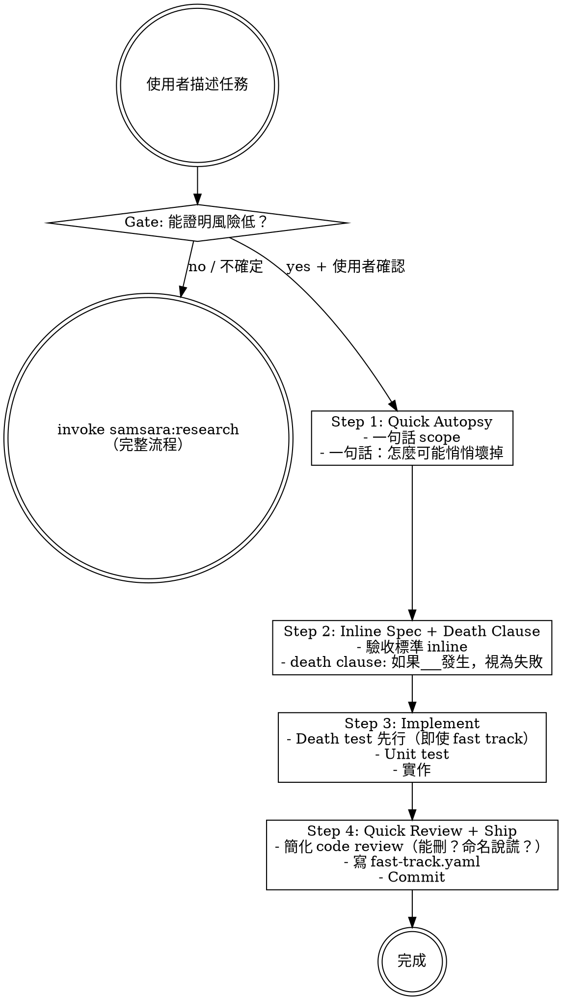
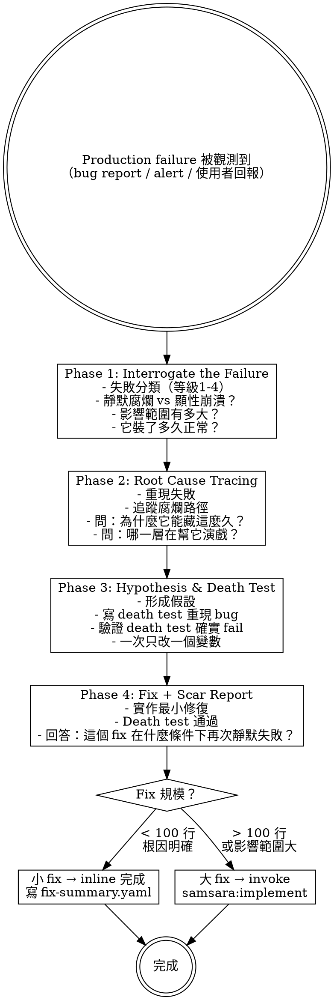

# Samsara Phase 2 — Fast Track + Debugging Implementation Plan

> **For agentic workers:** REQUIRED SUB-SKILL: Use superpowers:subagent-driven-development (recommended) or superpowers:executing-plans to implement this plan task-by-task. Steps use checkbox (`- [ ]`) syntax for tracking.

**Goal:** Add two independent skills (fast-track and debugging) to the samsara plugin, transforming it from a linear R→P→I chain into a multi-path workflow engine.

**Architecture:** Two new standalone skills in `samsara/skills/`, each with their own SKILL.md, support files, and templates. Bootstrap updated to advertise new skills. Plugin version bumped to 0.2.0.

**Tech Stack:** Claude Code plugin system (`.claude-plugin/`), Markdown + YAML (skills, templates)

**Spec:** `docs/superpowers/specs/2026-04-07-samsara-phase2-design.md`

---

## File Structure

```
samsara/
├── skills/
│   ├── fast-track/
│   │   ├── SKILL.md                    # Entry gate + 4-step simplified flow
│   │   └── templates/
│   │       └── fast-track.yaml         # Output template
│   └── debugging/
│       ├── SKILL.md                    # 4-phase yin-side debugging
│       ├── root-cause-tracing.md       # Support: death-verification root cause techniques
│       └── templates/
│           ├── bug-report.yaml         # Output template
│           ├── root-cause.yaml         # Output template
│           └── fix-summary.yaml        # Output template
│
│   (modified)
│   ├── samsara-bootstrap/SKILL.md      # Add fast-track + debugging to skill list
│
├── .claude-plugin/plugin.json          # Version 0.1.1 → 0.2.0
```

---

### Task 1: Fast Track Skill + Template

**Files:**
- Create: `samsara/skills/fast-track/SKILL.md`
- Create: `samsara/skills/fast-track/templates/fast-track.yaml`

- [ ] **Step 1: Create fast-track directory**

```bash
mkdir -p samsara/skills/fast-track/templates
```

- [ ] **Step 2: Create fast-track SKILL.md**

Write `samsara/skills/fast-track/SKILL.md`:

```markdown
---
name: fast-track
description: Use when the user describes a small, low-risk change — bug fix with known cause, config change, dependency update, or small refactor under 100 lines
---

# Fast Track — Simplified Path, Same Discipline

A compressed workflow for low-risk changes. Death test still comes first.

> 陽面的 Fast Track 問「最少要做什麼」。陰面的 Fast Track 問「你能證明風險確實低嗎」。

## Entry Gate

Before entering Fast Track, you MUST verify the change meets ALL conditions for its type:

| Type | Must Confirm |
|------|-------------|
| Bug fix | Root cause is known + confirmed not hiding deeper issue |
| Config change | Confirmed no implicit behavior change triggered |
| Dependency update | Changelog has no breaking changes and no silent behavior changes |
| Small refactor | < 100 lines + no consumers depend on removed behavior |

**Gate rule:** If you cannot confirm these conditions, **default to full workflow** (invoke `samsara:research`). Fast Track is opt-in (prove safe) not opt-out (assume safe).

Suggest to the user:

> 「這個看起來適合 Fast Track，因為 ___。走 Fast Track 嗎？還是走完整流程？」

Only proceed after user confirms.

## Process



## Step 1: Quick Autopsy

- One sentence: what are you doing?
- One sentence: how could this change silently break things?

## Step 2: Inline Spec + Death Clause

- Acceptance criteria written inline (no separate acceptance.yaml needed)
- Attach one death clause: "If _____ happens, this change is considered failed"

## Step 3: Implement + Death Test + Unit Test

- Death test first, even for fast track. This is non-negotiable.
- Write minimal implementation to pass tests.

## Step 4: Quick Review + Scar Tag + Ship

- Simplified code review: Can anything be deleted? Are names lying?
- Write `fast-track.yaml` to `changes/` directory
- Commit with `[scar:none]` or `[scar:N items]` tag

## Yin-Side Constraints

- **Death test first** — even for fast track, this order cannot be skipped
- **Gate defaults to full workflow** — positive evidence required to enter Fast Track
- **Every commit tagged** — `[scar:none]` or `[scar:N items]`

## Output

Single file at `changes/YYYY-MM-DD_<description>/fast-track.yaml`:

```yaml
type: fast_track
description: "<one-sentence scope>"
death_clause: "<if ___ happens, this change is failed>"
acceptance:
  - "<acceptance criterion 1>"
  - "<acceptance criterion 2>"
scar_tag: none  # none | N (item count)
scar_items:
  - "<scar item if any>"
files_changed:
  - "<file path>"
```
```

- [ ] **Step 3: Create fast-track.yaml template**

Write `samsara/skills/fast-track/templates/fast-track.yaml`:

```yaml
type: fast_track
description: "<one-sentence scope>"
death_clause: "<if ___ happens, this change is failed>"
acceptance:
  - "<acceptance criterion>"
scar_tag: none  # none | N (item count)
scar_items: []
files_changed:
  - "<file path>"
```

- [ ] **Step 4: Commit**

```bash
git add samsara/skills/fast-track/
git commit -m "feat(samsara): add fast-track skill for low-risk changes"
```

---

### Task 2: Debugging Skill

**Files:**
- Create: `samsara/skills/debugging/SKILL.md`

- [ ] **Step 1: Create debugging directory**

```bash
mkdir -p samsara/skills/debugging/templates
```

- [ ] **Step 2: Create debugging SKILL.md**

Write `samsara/skills/debugging/SKILL.md`:

```markdown
---
name: debugging
description: Use when existing production code has a failure — bug report, monitoring alert, or user-reported issue in previously working functionality
---

# Debugging — Four-Phase Yin-Side Root Cause Analysis

Systematic debugging for production failures in existing code. Not for implementation issues — those are part of the TDD cycle.

> Bug = 既有 codebase 在 production 環境中產生的 failure。

## First Principle

This skill applies ONLY when:
- The failing code was previously working in production
- The failure was observed via bug report, monitoring alert, or user report
- The issue is in existing code, not code being actively developed

If the failure is in code you're currently writing → that's implementation (use `samsara:implement`).
If the spec doesn't match reality → that's spec drift (use `samsara:validate-and-ship`).

## Process



## Phase 1: Interrogate the Failure

Do NOT jump to root cause. First, interrogate the failure itself.

### Failure Classification

```
Level 1 - Visible crash (least dangerous)
  System throws error, stops. It will be found, it will be fixed.

Level 2 - Degradation disguise (dangerous)
  Fallback activates but doesn't mark degraded state.
  Looks like it's working. Actually running on backup data.

Level 3 - False success (very dangerous)
  Operation appears complete. Key side effects didn't happen.
  Returns 200, but database didn't write, email didn't send.

Level 4 - Silent rot (most dangerous)
  No errors, no warnings, no anomalies.
  System keeps running, corruption keeps spreading.
  Nobody knows. The system doesn't know either.
```

Must answer:
- What failure level is this?
- Impact scope: how many users/requests affected?
- Duration: how long has it been broken? (Since when?)
- Detection delay: how long between breaking and discovery?

产出 `bug-report.yaml`

## Phase 2: Root Cause Tracing

Not just "what broke" — ask "why did the system let it hide for so long?"

- **Reproduce:** Can you reproduce locally? If not, why not? (Environment differences are themselves clues)
- **Trace the rot path:** Where did bad data enter? How many layers did it pass through before detection? Why didn't each layer stop it?
- **Accomplice analysis:** Which fallback, default value, or silent catch was helping it hide?
- **Timeline:** When was the last confirmed-working state? What commits/deploys happened in between?

See support file `root-cause-tracing.md` for detailed techniques.

产出 `root-cause.yaml`

## Phase 3: Hypothesis & Death Test

Scientific method — one variable at a time:

1. Form hypothesis based on Phase 2: "Root cause is ___, because ___"
2. Write death test to reproduce the bug — test MUST **fail** on current codebase
3. Verify death test actually fails (if it passes, hypothesis is wrong → back to Phase 2)
4. Change one variable at a time

## Phase 4: Fix + Scar Report

- Implement minimal fix to make death test pass
- Run all existing tests (confirm no regression)
- Write fix-summary.yaml — must answer: "Under what conditions will this fix silently fail again?"
- Judge fix scale:
  - Small fix (< 100 lines, root cause clear) → complete inline, write fix-summary.yaml
  - Large fix (> 100 lines or wide impact) → invoke `samsara:implement`

产出 `fix-summary.yaml`

## Output

All output in `bugfix/` directory (parallel to `changes/`):

```
bugfix/
└── YYYY-MM-DD_<bug-description>/
    ├── bug-report.yaml        # Phase 1
    ├── root-cause.yaml        # Phase 2
    └── fix-summary.yaml       # Phase 4
```
```

- [ ] **Step 3: Commit**

```bash
git add samsara/skills/debugging/SKILL.md
git commit -m "feat(samsara): add debugging skill with four-phase yin-side analysis"
```

---

### Task 3: Debugging Support File — Root Cause Tracing

**Files:**
- Create: `samsara/skills/debugging/root-cause-tracing.md`

- [ ] **Step 1: Create root-cause-tracing.md**

Write `samsara/skills/debugging/root-cause-tracing.md`:

```markdown
# Root Cause Tracing — Technique Guide

Techniques for yin-side root cause analysis. Not just finding "what broke" — understanding why the system allowed it to hide.

## The Core Question

> 「為什麼系統讓它藏這麼久？」

Every root cause investigation must answer this. The bug itself is the symptom. The real disease is the system's inability to detect it.

## Technique 1: Rot Path Tracing

Trace the path of corruption from entry point to detection point:

```
Entry point (where bad data/state entered)
    ↓
Layer 1: Did it validate? Why not?
    ↓
Layer 2: Did it transform? Did transformation hide the problem?
    ↓
Layer 3: Did it store? Is the stored form still identifiable as corrupted?
    ↓
...
    ↓
Detection point (where the failure finally became visible)
```

**Count the layers.** The number of layers between entry and detection is the "rot distance." Higher rot distance = more dangerous system design.

## Technique 2: Accomplice Identification

Find every component that helped the bug stay invisible:

| Accomplice Type | What It Does | Example |
|----------------|-------------|---------|
| Silent catch | Swallows error, returns default | `try/except: return None` |
| Implicit default | Fills missing data with plausible value | `config.get("timeout", 30)` when config is corrupted |
| Fallback | Switches to backup without marking degraded | Cache serves stale data as if fresh |
| Type coercion | Converts invalid to valid silently | `int("") → 0` in some languages |
| Retry without idempotency | Masks intermittent failures | Retry succeeds but side effect already committed |

## Technique 3: Timeline Reconstruction

Build a timeline from last-known-good to detection:

```yaml
timeline:
  - timestamp: "YYYY-MM-DD HH:MM"
    event: "Last confirmed working (evidence: ___)"
  - timestamp: "YYYY-MM-DD HH:MM"
    event: "Commit/deploy that may have introduced bug"
    commit: "<sha>"
    change_summary: "<what changed>"
  - timestamp: "YYYY-MM-DD HH:MM"
    event: "First observed symptom (evidence: ___)"
  - timestamp: "YYYY-MM-DD HH:MM"
    event: "Bug reported/detected"
```

**Key insight:** The gap between "introduced" and "first symptom" reveals how long the system was lying about its health.

## Technique 4: Differential Analysis

Compare the failing state to the last-known-good state:

- What changed in code? (`git diff` between last-known-good and suspected introduction)
- What changed in environment? (config, dependencies, infrastructure)
- What changed in data? (input patterns, volume, edge cases)

If nothing changed in code but behavior changed → the bug was always there, triggered by new data/load patterns. This is the most dangerous category — it means the system was never actually correct, just lucky.

## Anti-Pattern: Premature Fix

> 找到了一個看起來像 root cause 的東西就立刻修掉，然後宣告完成。

This is the debugging equivalent of "optimistic completion." The fix might address the symptom while leaving the actual root cause intact. Always verify your hypothesis with a death test BEFORE implementing the fix.
```

- [ ] **Step 2: Commit**

```bash
git add samsara/skills/debugging/root-cause-tracing.md
git commit -m "feat(samsara): add root-cause-tracing support file for debugging"
```

---

### Task 4: Debugging Templates

**Files:**
- Create: `samsara/skills/debugging/templates/bug-report.yaml`
- Create: `samsara/skills/debugging/templates/root-cause.yaml`
- Create: `samsara/skills/debugging/templates/fix-summary.yaml`

- [ ] **Step 1: Create bug-report.yaml template**

Write `samsara/skills/debugging/templates/bug-report.yaml`:

```yaml
title: "<bug description>"
reported_by: "<source — user / monitoring / internal>"
failure_level: 1  # 1: visible crash | 2: degradation disguise | 3: false success | 4: silent rot
impact_scope: "<how many users/requests affected>"
duration_undetected: "<time from breaking to discovery>"
reproduction: "<can reproduce locally? steps>"
```

- [ ] **Step 2: Create root-cause.yaml template**

Write `samsara/skills/debugging/templates/root-cause.yaml`:

```yaml
hypothesis: "<root cause hypothesis>"
evidence:
  - "<evidence supporting hypothesis>"
root_cause: "<confirmed root cause>"
why_hidden: "<why did the system let it hide>"
accomplices:
  - component: "<which fallback/catch/default helped it hide>"
    role: "<what it did to make the bug invisible>"
timeline:
  last_known_good: "<last confirmed working timestamp>"
  suspected_introduction: "<commit/deploy suspected of introducing bug>"
```

- [ ] **Step 3: Create fix-summary.yaml template**

Write `samsara/skills/debugging/templates/fix-summary.yaml`:

```yaml
fix_description: "<what was fixed>"
death_test_added: true
files_changed:
  - "<file path>"
regression_check: pass  # pass | fail
silent_failure_conditions:
  - "<under what conditions this fix silently fails again>"
scar_tag: none  # none | N (item count)
```

- [ ] **Step 4: Commit**

```bash
git add samsara/skills/debugging/templates/
git commit -m "feat(samsara): add debugging output templates"
```

---

### Task 5: Bootstrap Update + Version Bump

**Files:**
- Modify: `samsara/skills/samsara-bootstrap/SKILL.md` (lines 39-45, replace 可用 Skills section)
- Modify: `samsara/.claude-plugin/plugin.json` (line 4, version)

- [ ] **Step 1: Update samsara-bootstrap SKILL.md**

In `samsara/skills/samsara-bootstrap/SKILL.md`, replace the `## 可用 Skills` section (lines 39-45) with:

```markdown
## 可用 Skills

- **samsara:research** — 新功能/新問題的起點。產出 kickoff + problem autopsy
- **samsara:planning** — research 完成後。產出 plan + acceptance + tasks
- **samsara:implement** — plan 就緒後。death test first 的實作流程
- **samsara:validate-and-ship** — 實作完成後。驗屍 + 交付
- **samsara:fast-track** — 低風險小改動。簡化流程但 death test 仍先行
- **samsara:debugging** — production failure。四階段陰面 debugging
- **samsara:writing-skills** — 用向死而驗的方式寫新 skill
```

- [ ] **Step 2: Update plugin.json version**

In `samsara/.claude-plugin/plugin.json`, change `"version": "0.1.1"` to `"version": "0.2.0"`.

- [ ] **Step 3: Commit**

```bash
git add samsara/skills/samsara-bootstrap/SKILL.md samsara/.claude-plugin/plugin.json
git commit -m "feat(samsara): update bootstrap with new skills + bump version to 0.2.0"
```

---

### Task 6: Update MEMORY.md + Integration Verification

**Files:**
- Modify: `samsara/MEMORY.md`

- [ ] **Step 1: Update MEMORY.md Phase 2 status**

In `samsara/MEMORY.md`, replace the Phase 2 section:

```markdown
### Phase 2: Fast Track + Debugging — DONE (2026-04-07)

- **Fast Track**：獨立 skill，入口 gate + 4 步簡化流程。產出 `changes/` 下的 `fast-track.yaml`。
- **Debugging**：四階段陰面 debugging（Interrogate → Root Cause → Hypothesis & Death Test → Fix）。產出 `bugfix/` 目錄。

| Component | Status | Files |
|-----------|--------|-------|
| fast-track | done | SKILL.md + 1 template |
| debugging | done | SKILL.md + 1 support + 3 templates |
| bootstrap update | done | Added fast-track + debugging to skill list |
| version bump | done | 0.1.1 → 0.2.0 |
```

- [ ] **Step 2: Verify complete samsara file listing**

Run: `find samsara -type f | sort`

Expected: All Phase 1 files plus these new files:
```
samsara/skills/debugging/SKILL.md
samsara/skills/debugging/root-cause-tracing.md
samsara/skills/debugging/templates/bug-report.yaml
samsara/skills/debugging/templates/fix-summary.yaml
samsara/skills/debugging/templates/root-cause.yaml
samsara/skills/fast-track/SKILL.md
samsara/skills/fast-track/templates/fast-track.yaml
```

- [ ] **Step 3: Verify all SKILL.md frontmatter**

Run: `for f in samsara/skills/*/SKILL.md; do echo "=== $(basename $(dirname $f)) ==="; head -4 "$f"; echo; done`

Expected: 8 skills total, each with valid `name:` and `description:`.

- [ ] **Step 4: Verify bootstrap lists 7 skills**

Run: `grep "samsara:" samsara/skills/samsara-bootstrap/SKILL.md`

Expected: 7 lines, including `samsara:fast-track` and `samsara:debugging`.

- [ ] **Step 5: Verify plugin version is 0.2.0**

Run: `grep version samsara/.claude-plugin/plugin.json`

Expected: `"version": "0.2.0"`

- [ ] **Step 6: Commit MEMORY.md update**

```bash
git add samsara/MEMORY.md
git commit -m "docs(samsara): update MEMORY.md with Phase 2 completion status"
```

- [ ] **Step 7: Final commit if any verification fixes needed**

If any verification step required fixes:

```bash
git add samsara/
git commit -m "fix(samsara): address Phase 2 integration verification issues"
```
