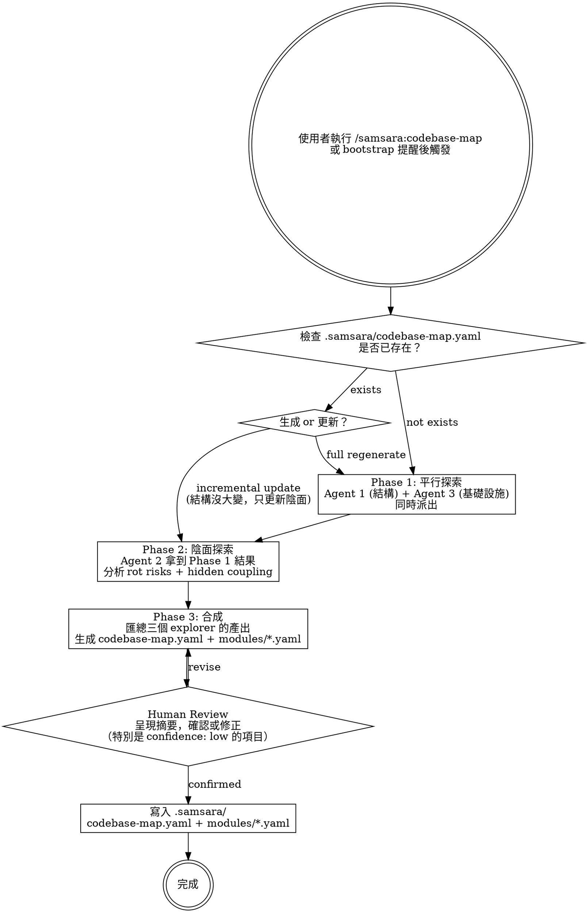

# Samsara Phase 3 — Codebase Map Implementation Plan

> **For agentic workers:** REQUIRED SUB-SKILL: Use superpowers:subagent-driven-development (recommended) or superpowers:executing-plans to implement this plan task-by-task. Steps use checkbox (`- [ ]`) syntax for tracking.

**Goal:** Add `codebase-map` skill with 3 explorer agents and a bootstrap check hook, enabling yin-side codebase analysis across all existing samsara skills.

**Architecture:** New `codebase-map` skill dispatches 3 explorer agents (structure + infra parallel, then yin-side sequential). Separate `check-codebase-map` hook script checks freshness at session start via `$CLAUDE_PROJECT_DIR`. Bootstrap updated with new skill. Plugin version 0.2.0 → 0.3.0.

**Tech Stack:** Claude Code plugin system (`.claude-plugin/`), Bash (hook scripts), Markdown + YAML (skills, agents, templates)

**Spec:** `docs/superpowers/specs/2026-04-07-samsara-phase3-codebase-map-design.md`

---

## File Structure

```
samsara/
├── skills/
│   └── codebase-map/
│       ├── SKILL.md                    # Skill flow: check → explore → synthesize → review → write
│       └── templates/
│           ├── codebase-map.yaml       # Layer 1+2 template
│           └── module.yaml             # Layer 3 template
├── agents/
│   ├── structure-explorer.md           # Agent 1: modules, paths, deps, interfaces
│   ├── yin-explorer.md                 # Agent 2: rot risks, coupling, assumptions
│   └── infra-explorer.md              # Agent 3: build, config, data flow
├── hooks/
│   └── check-codebase-map             # Freshness check script

Modified:
├── hooks/hooks.json                    # Add second SessionStart command
├── skills/samsara-bootstrap/SKILL.md   # Add codebase-map to skill list
├── .claude-plugin/plugin.json          # 0.2.0 → 0.3.0
```

---

### Task 1: Explorer Agents (3 files)

**Files:**
- Create: `samsara/agents/structure-explorer.md`
- Create: `samsara/agents/infra-explorer.md`
- Create: `samsara/agents/yin-explorer.md`

- [ ] **Step 1: Create structure-explorer.md**

Write `samsara/agents/structure-explorer.md`:

```markdown
---
name: structure-explorer
description: Explores codebase module boundaries, file structure, dependencies, and public interfaces
model: sonnet
tools:
  - Glob
  - Grep
  - Read
  - Bash
color: blue
---

# Structure Explorer

You are a codebase structure analyst. Your job is to map the architecture of a project: identify modules, trace dependencies, and document public interfaces.

## Exploration Process

1. **Identify project type**: Check for package.json, pyproject.toml, Cargo.toml, go.mod, Makefile, or other build markers
2. **Map module boundaries**: Find independent units — directories with their own package config, __init__.py, index files, or clear responsibility boundaries
3. **Trace dependencies**: For each module, identify what it imports from other modules (explicit dependencies only)
4. **Document interfaces**: For each module, list public entry points — exported functions, API endpoints, CLI commands, event handlers
5. **Identify key files**: For each module, list the 3-5 most important files (entry points, core logic, config)

## Output Format

Report your findings as YAML:

```yaml
modules:
  - name: "<module name>"
    path: "<directory path>"
    responsibility: "<one sentence — what this module does>"
    dependencies: [<list of other module names this imports from>]
    interfaces:
      - "<public API endpoint or exported function>"
    file_count: <number of files in module>
    key_files:
      - "<path to most important file>"
```

## Rules

- Only report modules you can verify exist — do not infer or guess
- Dependencies must be based on actual import/require statements you found
- Responsibility must be one sentence derived from code, not assumed from directory name
- If a directory's purpose is unclear, mark responsibility as "unclear — needs human input"
```

- [ ] **Step 2: Create infra-explorer.md**

Write `samsara/agents/infra-explorer.md`:

```markdown
---
name: infra-explorer
description: Explores build system, configuration sources, data flow patterns, and infrastructure dependencies
model: sonnet
tools:
  - Glob
  - Grep
  - Read
  - Bash
color: yellow
---

# Infrastructure Explorer

You are an infrastructure analyst. Your job is to map how a project is built, configured, and connected to external systems.

## Exploration Process

1. **Build system**: Identify build tool (npm, cargo, make, gradle, etc.), find test commands, build commands, and CI configuration
2. **Configuration sources**: Find where config comes from — env vars, yaml/json/toml files, secrets manager references. Distinguish runtime vs build-time config
3. **Data flow**: Trace how data enters the system (API endpoints, queue consumers, cron jobs, file watchers), how it's stored (database, cache, file system), and how it exits (API responses, notifications, exports)
4. **External services**: Identify all external dependencies — databases, caches, message queues, third-party APIs, cloud services

## Output Format

Report your findings as YAML:

```yaml
infrastructure:
  build:
    tool: "<npm / cargo / make / gradle / ...>"
    test_command: "<exact command to run tests>"
    build_command: "<exact command to build>"
    ci_config: "<path to CI config if exists>"
  config:
    sources:
      - type: "<env / yaml / json / toml / secrets>"
        path: "<file path or env var prefix>"
        scope: "<runtime / build-time / both>"
  data_flow:
    entry_points:
      - type: "<API / queue_consumer / cron / file_watcher>"
        description: "<what it receives>"
    storage:
      - type: "<database / cache / file_system>"
        technology: "<postgres / redis / s3 / sqlite / ...>"
        purpose: "<what it stores>"
    external_services:
      - name: "<service name>"
        purpose: "<what it does for this project>"
        connection: "<how it connects — SDK / REST / gRPC / ...>"
```

## Rules

- Only report what you can verify from code — do not guess external services from project name
- Test commands must be verified (check package.json scripts, Makefile targets, etc.)
- If you find credentials or secrets in config files, report the config source but NOT the actual values
```

- [ ] **Step 3: Create yin-explorer.md**

Write `samsara/agents/yin-explorer.md`:

```markdown
---
name: yin-explorer
description: Analyzes codebase for silent failure paths, hidden coupling, unverified assumptions, and rot risks — requires structure-explorer and infra-explorer results as input
model: sonnet
tools:
  - Glob
  - Grep
  - Read
  - Bash
color: red
---

# Yin-Side Explorer

You are a failure analyst operating under the samsara framework (向死而驗). Your job is not to understand what the code does — that's already done. Your job is to understand **how it can silently fail**.

> 陽面問「系統怎麼運作」。你問「系統在哪裡假裝自己在運作」。

## Context

You will receive the output of two prior agents:
- **structure-explorer**: module boundaries, dependencies, interfaces
- **infra-explorer**: build system, config, data flow, external services

Use their findings as your map. Your job is to find what they couldn't see.

## Exploration Process

For each module identified by structure-explorer:

### 1. Rot Risk Analysis
Search for patterns that enable silent failure:
- `try/catch` or `try/except` blocks that swallow errors (catch without re-raise or meaningful handling)
- Fallback logic that doesn't mark degraded state
- Default values filling in for missing data (`config.get("key", default)` where default masks corruption)
- Timeout handling that continues silently instead of failing explicitly
- Retry logic without idempotency guarantees

### 2. Hidden Coupling Analysis
Find dependencies that don't appear in import graphs:
- Shared database tables accessed by multiple modules (grep for table names across modules)
- Shared config keys used by multiple modules
- Event bus / pub-sub patterns where producer and consumer are in different modules
- Shared file system paths
- Implicit ordering dependencies (module A must run before module B, but nothing enforces this)

### 3. Assumption Inventory
Find hardcoded assumptions:
- Magic numbers and hardcoded values
- Environment-specific logic (`if env === 'production'`)
- Hardcoded timeouts, limits, thresholds
- Assumptions about data format, encoding, or schema that aren't validated

### 4. Death Impact Assessment
For each module, based on its position in the dependency graph and its interfaces:
- What breaks if this module is completely unavailable?
- What breaks if this module returns wrong data silently?
- How many other modules are affected directly? Indirectly?

## Failure Classification

Rate each rot risk by level:
```
Level 1 - Visible crash: System throws error, stops. Will be found.
Level 2 - Degradation disguise: Fallback activates, not marked as degraded.
Level 3 - False success: Operation appears complete, key side effects didn't happen.
Level 4 - Silent rot: No errors, no warnings, corruption keeps spreading.
```

## Confidence Rating

Rate each finding:
- **high**: Verified in code — found the exact line where this happens
- **medium**: Strong pattern match — the code structure suggests this but couldn't trace complete path
- **low**: Inferred from architecture — the coupling/risk is plausible but not code-verified

## Output Format

Report your findings as YAML:

```yaml
module_analysis:
  <module_name>:
    death_impact: "<what breaks if this module disappears or returns wrong data>"
    rot_risks:
      - zone: "<specific area — file:function or file:line-range>"
        failure_level: 1 | 2 | 3 | 4
        description: "<what happens — the lie the system tells>"
        confidence: high | medium | low
    hidden_coupling:
      - type: "<shared_table / shared_config / event_bus / shared_filesystem / implicit_ordering>"
        with: "<other module name>"
        risk: "<what breaks silently when one side changes>"
        confidence: high | medium | low
    assumptions:
      - assumption: "<what is assumed to be true>"
        evidence: "<file:line where found>"
        verified: false
```

## Rules

- Every rot_risk must reference a specific code location (file:line or file:function)
- Do not report general concerns — only findings backed by code evidence
- Confidence must be honest. If you're guessing, say `low`
- An empty finding for a module is acceptable — not every module has hidden risks. But challenge yourself: are you sure, or did you not look hard enough?
```

- [ ] **Step 4: Commit**

```bash
git add samsara/agents/structure-explorer.md samsara/agents/infra-explorer.md samsara/agents/yin-explorer.md
git commit -m "feat(samsara): add 3 explorer agents for codebase-map scanning"
```

---

### Task 2: Codebase Map Skill + Templates

**Files:**
- Create: `samsara/skills/codebase-map/SKILL.md`
- Create: `samsara/skills/codebase-map/templates/codebase-map.yaml`
- Create: `samsara/skills/codebase-map/templates/module.yaml`

- [ ] **Step 1: Create codebase-map directory**

```bash
mkdir -p samsara/skills/codebase-map/templates
```

- [ ] **Step 2: Create codebase-map SKILL.md**

Write `samsara/skills/codebase-map/SKILL.md`:

```markdown
---
name: codebase-map
description: Use when entering a new project for the first time, or when the codebase has changed significantly — generates a yin-side codebase map with structural analysis and silent failure surface assessment
---

# Codebase Map — Yin-Side Project Analysis

Generate a map of the project that answers both "what is this system?" (yang) and "where is this system pretending to be healthy?" (yin).

> 一般的 codebase map 是陽面的 —「系統長什麼樣」。Samsara 的 codebase map 回答「系統在哪裡假裝健康」。

## Process



## Phase 1: Parallel Exploration

Dispatch two agents simultaneously:

1. **structure-explorer** — modules, paths, dependencies, interfaces
2. **infra-explorer** — build system, config sources, data flow, external services

These two agents have no dependencies on each other. Dispatch in parallel.

## Phase 2: Yin-Side Exploration

After Phase 1 completes, dispatch:

3. **yin-explorer** — receives Phase 1 results as context. Analyzes rot risks, hidden coupling, assumptions, death impact for each module.

## Phase 3: Synthesis

After all three agents report back:

1. Merge structure-explorer output (modules, deps) + infra-explorer output (build, config, data flow) + yin-explorer output (rot risks, coupling, assumptions)
2. Generate summary: count rot_hotspots (top 3 by failure_level), count high_risk_coupling, count assumptions
3. Compute `silent_failure_surface`: low (<3 rot risks), medium (3-7), high (>7 or any level 4)
4. Generate `codebase-map.yaml` (Layer 1+2) from templates
5. Generate one `modules/<name>.yaml` (Layer 3) per module from templates

## Phase 4: Human Review

Present to user:
- Summary: module count, silent failure surface, top 3 rot hotspots
- List all `confidence: low` items — ask user to confirm or correct
- Ask: "Anything missing or wrong?"

After user confirms → write files to `.samsara/`

## Update Modes

When `.samsara/codebase-map.yaml` already exists, ask user:

> 「Codebase map 已存在（上次更新：YYYY-MM-DD）。選擇更新方式：
> (A) Full regenerate — 重跑三個 agent，完整重建
> (B) Incremental update — 只重跑陰面分析，保留結構不變」

## Output

Files written to target project:

```
project/.samsara/
├── codebase-map.yaml      # Layer 1+2: summary + module index + infrastructure
└── modules/               # Layer 3: per-module detail (yang + yin)
    ├── <module-1>.yaml
    ├── <module-2>.yaml
    └── ...
```

Use templates at `templates/codebase-map.yaml` and `templates/module.yaml`.
```

- [ ] **Step 3: Create codebase-map.yaml template**

Write `samsara/skills/codebase-map/templates/codebase-map.yaml`:

```yaml
project: "<project name>"
last_updated: "YYYY-MM-DD"
staleness_threshold_days: 7
generated_by: "samsara:codebase-map"

# --- Layer 1: Summary ---
summary:
  module_count: 0
  silent_failure_surface: low  # low | medium | high
  rot_hotspots:
    - "<module>: <rot risk description> (level N)"
  high_risk_coupling_count: 0
  assumption_inventory_count: 0

# --- Layer 2: Module Index ---
modules:
  - name: "<module name>"
    path: "<directory path>"
    responsibility: "<one sentence>"
    death_impact: unknown  # high | medium | low | unknown
    rot_risk_count: 0
    hidden_coupling_count: 0
    dependencies: []

# --- Infrastructure ---
infrastructure:
  build:
    tool: "<build tool>"
    test_command: "<command>"
    build_command: "<command>"
  config_sources:
    - "<source description>"
  data_flow:
    entry_points:
      - "<entry point>"
    storage:
      - "<storage technology>"
    external_services:
      - "<service name>"
```

- [ ] **Step 4: Create module.yaml template**

Write `samsara/skills/codebase-map/templates/module.yaml`:

```yaml
name: "<module name>"
path: "<directory path>"
responsibility: "<one sentence>"
last_analyzed: "YYYY-MM-DD"

# --- Yang side ---
dependencies: []
interfaces:
  - "<public API / entry point>"
key_files:
  - "<most important file>"

# --- Yin side ---
death_impact: "<what breaks if this module disappears>"

rot_risks:
  - zone: "<file:function or file:line-range>"
    failure_level: 1  # 1: visible crash | 2: degradation disguise | 3: false success | 4: silent rot
    description: "<what happens silently>"
    confidence: medium  # high | medium | low
    last_verified: "YYYY-MM-DD"

hidden_coupling:
  - type: "<shared_table / shared_config / event_bus / shared_filesystem / implicit_ordering>"
    with: "<coupled module>"
    risk: "<what breaks silently when one side changes>"
    confidence: medium  # high | medium | low

assumptions:
  - assumption: "<what is assumed>"
    evidence: "<file:line>"
    owner: "<who made this assumption>"
    verified: false
```

- [ ] **Step 5: Commit**

```bash
git add samsara/skills/codebase-map/
git commit -m "feat(samsara): add codebase-map skill with layered templates"
```

---

### Task 3: Check-Codebase-Map Hook Script

**Files:**
- Create: `samsara/hooks/check-codebase-map`

- [ ] **Step 1: Create check-codebase-map script**

Write `samsara/hooks/check-codebase-map`:

```bash
#!/usr/bin/env bash
# Check codebase-map freshness and inject status into session context
# Only injects when map is missing or stale — zero token cost when fresh

set -euo pipefail

codebase_map_status="not_applicable"

if [ -n "${CLAUDE_PROJECT_DIR:-}" ]; then
    map_file="${CLAUDE_PROJECT_DIR}/.samsara/codebase-map.yaml"
    if [ ! -f "$map_file" ]; then
        codebase_map_status="missing"
    else
        # macOS: stat -f %m, Linux: stat -c %Y
        last_modified=$(stat -f %m "$map_file" 2>/dev/null || stat -c %Y "$map_file" 2>/dev/null || echo 0)
        now=$(date +%s)
        age_days=$(( (now - last_modified) / 86400 ))
        if [ "$age_days" -gt 7 ]; then
            codebase_map_status="stale_${age_days}_days"
        else
            codebase_map_status="fresh_${age_days}_days"
        fi
    fi
fi

# Build context message based on status
case "$codebase_map_status" in
    missing)
        context_msg="Codebase Map Status: MISSING. 此專案尚無 codebase map，建議執行 /samsara:codebase-map 來生成。"
        ;;
    stale_*)
        days="${codebase_map_status#stale_}"
        days="${days%_days}"
        context_msg="Codebase Map Status: STALE (${days} days). Codebase map 已 ${days} 天未更新，建議執行 /samsara:codebase-map 來更新。"
        ;;
    fresh_*)
        # Fresh — no need to inject anything, zero token cost
        exit 0
        ;;
    not_applicable)
        # Not in a project directory — no need to inject
        exit 0
        ;;
esac

# Escape for JSON
escape_for_json() {
    local s="$1"
    s="${s//\\/\\\\}"
    s="${s//\"/\\\"}"
    s="${s//$'\n'/\\n}"
    s="${s//$'\r'/\\r}"
    s="${s//$'\t'/\\t}"
    printf '%s' "$s"
}

escaped_msg=$(escape_for_json "$context_msg")

printf '{\n  "hookSpecificOutput": {\n    "hookEventName": "SessionStart",\n    "additionalContext": "%s"\n  }\n}\n' "$escaped_msg"

exit 0
```

- [ ] **Step 2: Make executable**

```bash
chmod +x samsara/hooks/check-codebase-map
```

- [ ] **Step 3: Test — missing scenario**

```bash
cd /Users/yuyu_liao/personal/kaleidoscope-tools/samsara && CLAUDE_PROJECT_DIR=/tmp/test-project bash hooks/check-codebase-map
```

Expected: JSON output with "MISSING" message (since /tmp/test-project/.samsara/codebase-map.yaml doesn't exist).

- [ ] **Step 4: Test — fresh scenario**

```bash
mkdir -p /tmp/test-project/.samsara && touch /tmp/test-project/.samsara/codebase-map.yaml && CLAUDE_PROJECT_DIR=/tmp/test-project bash hooks/check-codebase-map; echo "Exit code: $?"
```

Expected: No JSON output, exit code 0 (fresh — zero token cost).

- [ ] **Step 5: Test — not applicable scenario**

```bash
unset CLAUDE_PROJECT_DIR && bash hooks/check-codebase-map; echo "Exit code: $?"
```

Expected: No JSON output, exit code 0.

- [ ] **Step 6: Clean up test fixtures**

```bash
rm -rf /tmp/test-project
```

- [ ] **Step 7: Commit**

```bash
git add samsara/hooks/check-codebase-map
git commit -m "feat(samsara): add check-codebase-map hook for session-start freshness check"
```

---

### Task 4: Update hooks.json + Bootstrap + Version Bump

**Files:**
- Modify: `samsara/hooks/hooks.json`
- Modify: `samsara/skills/samsara-bootstrap/SKILL.md` (line 47, add before writing-skills)
- Modify: `samsara/.claude-plugin/plugin.json` (line 4, version)

- [ ] **Step 1: Update hooks.json**

Replace the entire content of `samsara/hooks/hooks.json` with:

```json
{
  "hooks": {
    "SessionStart": [
      {
        "matcher": "startup|clear|compact",
        "hooks": [
          {
            "type": "command",
            "command": "bash \"${CLAUDE_PLUGIN_ROOT}/hooks/session-start\"",
            "timeout": 5000
          },
          {
            "type": "command",
            "command": "bash \"${CLAUDE_PLUGIN_ROOT}/hooks/check-codebase-map\"",
            "timeout": 3000
          }
        ]
      }
    ]
  }
}
```

- [ ] **Step 2: Update bootstrap SKILL.md**

In `samsara/skills/samsara-bootstrap/SKILL.md`, replace the `## 可用 Skills` section (lines 39-47) with:

```markdown
## 可用 Skills

- **samsara:research** — 新功能/新問題的起點。產出 kickoff + problem autopsy
- **samsara:planning** — research 完成後。產出 plan + acceptance + tasks
- **samsara:implement** — plan 就緒後。death test first 的實作流程
- **samsara:validate-and-ship** — 實作完成後。驗屍 + 交付
- **samsara:fast-track** — 低風險小改動。簡化流程但 death test 仍先行
- **samsara:debugging** — production failure。四階段陰面 debugging
- **samsara:codebase-map** — 生成/更新專案的陰面 codebase map。掃描 modules、分析靜默失敗面、隱性耦合
- **samsara:writing-skills** — 用向死而驗的方式寫新 skill
```

- [ ] **Step 3: Update plugin.json version**

In `samsara/.claude-plugin/plugin.json`, change `"version": "0.2.0"` to `"version": "0.3.0"`.

- [ ] **Step 4: Verify hooks.json is valid JSON**

Run: `python3 -m json.tool samsara/hooks/hooks.json > /dev/null && echo "PASS" || echo "FAIL"`

Expected: `PASS`

- [ ] **Step 5: Verify bootstrap lists 8 skills**

Run: `grep "samsara:" samsara/skills/samsara-bootstrap/SKILL.md | wc -l`

Expected: `8`

- [ ] **Step 6: Commit**

```bash
git add samsara/hooks/hooks.json samsara/skills/samsara-bootstrap/SKILL.md samsara/.claude-plugin/plugin.json
git commit -m "feat(samsara): update hooks, bootstrap, and version for codebase-map"
```

---

### Task 5: Update MEMORY.md + Integration Verification

**Files:**
- Modify: `samsara/MEMORY.md`

- [ ] **Step 1: Update MEMORY.md Phase 3 status**

In `samsara/MEMORY.md`, replace the Phase 3 section (from `### Phase 3: Codebase Map — NOT STARTED` to the line before `### Phase 4:`) with:

```markdown
### Phase 3: Codebase Map — DONE (2026-04-07)

獨立 skill `samsara:codebase-map` + 3 個 explorer agents + bootstrap hook 檢查。

**核心理念**：不只「系統長什麼樣」（陽面），更回答「系統在哪裡假裝健康」（陰面）。

| Component | Status | Files |
|-----------|--------|-------|
| codebase-map skill | done | SKILL.md + 2 templates |
| structure-explorer agent | done | agents/structure-explorer.md |
| infra-explorer agent | done | agents/infra-explorer.md |
| yin-explorer agent | done | agents/yin-explorer.md |
| check-codebase-map hook | done | hooks/check-codebase-map |
| hooks.json update | done | Added second SessionStart command |
| bootstrap update | done | Added codebase-map to skill list (8 total) |
| version bump | done | 0.2.0 → 0.3.0 |
```

- [ ] **Step 2: Verify complete file listing**

Run: `find samsara -type f | sort`

Expected: All Phase 1+2 files plus:
```
samsara/agents/infra-explorer.md
samsara/agents/structure-explorer.md
samsara/agents/yin-explorer.md
samsara/hooks/check-codebase-map
samsara/skills/codebase-map/SKILL.md
samsara/skills/codebase-map/templates/codebase-map.yaml
samsara/skills/codebase-map/templates/module.yaml
```

- [ ] **Step 3: Verify all agents have valid frontmatter**

Run: `for f in samsara/agents/*.md; do echo "=== $(basename $f) ==="; head -3 "$f"; echo; done`

Expected: 4 agents total (code-reviewer + 3 new explorers), each with `---` and `name:`.

- [ ] **Step 4: Verify all SKILL.md count**

Run: `find samsara/skills -name "SKILL.md" | wc -l`

Expected: `9` (Phase 1: 6 + Phase 2: 2 + Phase 3: 1)

- [ ] **Step 5: Verify plugin version**

Run: `grep version samsara/.claude-plugin/plugin.json`

Expected: `"version": "0.3.0"`

- [ ] **Step 6: Verify hook script is executable**

Run: `test -x samsara/hooks/check-codebase-map && echo "PASS" || echo "FAIL"`

Expected: `PASS`

- [ ] **Step 7: Commit MEMORY.md**

```bash
git add samsara/MEMORY.md
git commit -m "docs(samsara): update MEMORY.md with Phase 3 completion status"
```
