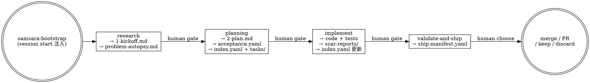
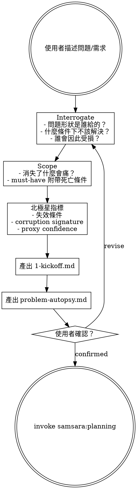
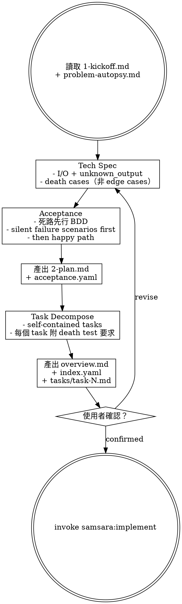
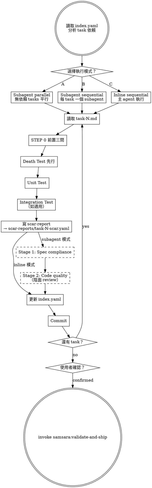
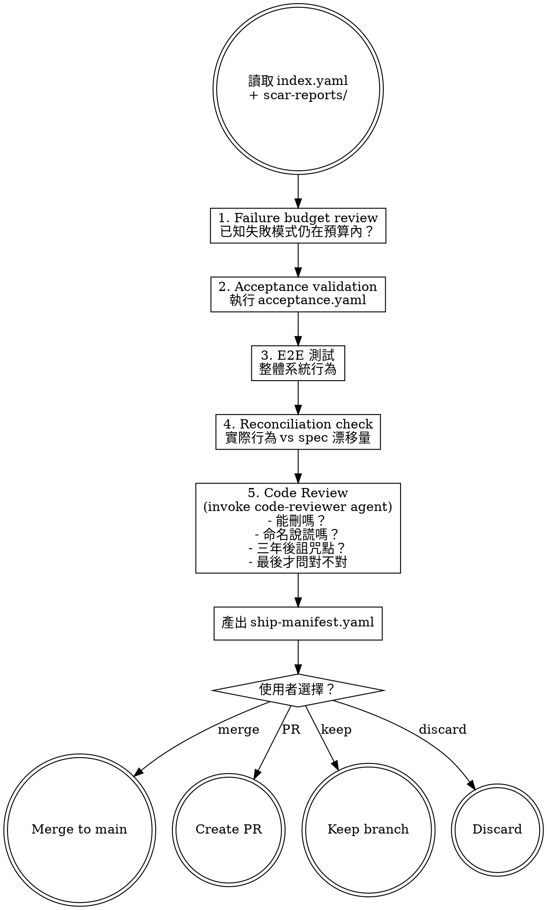

# Samsara Harness Engineering — Design Spec

> 向死而驗 — Toward death, through verification.

## Goal

打造一個基於「向死而驗」哲學的 AI harness engineering plugin，完全取代 superpowers 作為核心 workflow engine。以 Research → Planning → Implementation → Validation & Ship 的生命週期為骨幹，每個階段內建陰面約束，確保系統在腐爛時無法假裝自己還活著。

## Architecture

- **Plugin 形式**：Claude Code plugin（僅支援 Claude Code）
- **與 kaleidoscope-tools 的關係**：Monorepo 子模組，`kaleidoscope-tools/samsara/` 為獨立 plugin entry point，可單獨安裝
- **入口機制**：三個核心 skill + 鏈式流轉（research → planning → implement → validate-and-ship），每個階段結束時詢問使用者確認後 invoke 下一個 skill
- **哲學基底**：docs/samsara/ 中定義的「向死而驗」— 存在即責任、死路先行、scar report、failure budget

## Phase 分期

- **Phase 1**（本次實作）：Research → Planning → Implementation → Validation → Ship
- **Phase 2**（未來迭代）：Fast Track + Debugging
- **Phase 3**（未來迭代）：Auto iteration implementation

---

## Directory Structure

```
kaleidoscope-tools/
├── samsara/                              # 獨立 plugin entry point
│   ├── .claude-plugin/
│   │   └── plugin.json
│   ├── skills/
│   │   ├── samsara-bootstrap/
│   │   │   └── SKILL.md
│   │   ├── research/
│   │   │   ├── SKILL.md
│   │   │   ├── problem-autopsy.md        # 支援文件：autopsy 格式 + 範例
│   │   │   └── templates/
│   │   │       ├── problem-autopsy.md
│   │   │       └── kickoff.md
│   │   ├── planning/
│   │   │   ├── SKILL.md
│   │   │   ├── death-first-spec.md       # 支援文件：死路先行 BDD 寫法
│   │   │   ├── task-format.md            # 支援文件：self-contained task 格式
│   │   │   └── templates/
│   │   │       ├── acceptance.yaml
│   │   │       ├── overview.md
│   │   │       └── index.yaml
│   │   ├── implement/
│   │   │   ├── SKILL.md
│   │   │   ├── scar-report.md            # 支援文件：scar report 格式 + 範例
│   │   │   └── templates/
│   │   │       └── scar-report.yaml
│   │   ├── validate-and-ship/
│   │   │   ├── SKILL.md
│   │   │   ├── ship-manifest.md          # 支援文件：交付清單格式
│   │   │   └── templates/
│   │   │       └── ship-manifest.yaml
│   │   └── writing-skills/
│   │       └── SKILL.md
│   ├── agents/
│   │   └── code-reviewer.md
│   └── hooks/
│       ├── hooks.json
│       └── session-start
│
├── skills/                                # 現有 kaleidoscope-tools 領域 skills（不動）
├── .claude-plugin/plugin.json             # kaleidoscope-tools plugin 定義（不動）
└── ...
```

## Plugin Registration

```json
{
  "name": "samsara",
  "description": "向死而驗 — Death-first development workflow. Existential accountability for every line of code.",
  "version": "0.1.0",
  "author": { "name": "Roymond Liao" }
}
```

安裝方式：
```bash
# 只裝 samsara
claude plugin add /path/to/kaleidoscope-tools/samsara

# 或兩個都裝（samsara + kaleidoscope-tools 領域工具）
claude plugin add /path/to/kaleidoscope-tools
claude plugin add /path/to/kaleidoscope-tools/samsara
```

---

## Session Start Hook

### hooks.json

```json
{
  "hooks": [
    {
      "matcher": "startup|clear|compact",
      "event": "SessionStart",
      "hooks": [
        {
          "type": "command",
          "command": "bash hooks/session-start",
          "timeout": 5000,
          "synchronous": true
        }
      ]
    }
  ]
}
```

### session-start 腳本

偵測 `CLAUDE_PLUGIN_ROOT` 環境變數，讀取 `samsara-bootstrap` skill 內容，輸出 JSON `{ "additionalContext": "..." }` 注入到 session context。

---

## Bootstrap Injection Content

注入至 agent session context 的內容（~400-500 字 token 預算）：

```markdown
# Samsara — 向死而驗

## 唯一公理
存在即責任，無責任即無存在。

## STEP 0 — 任何實作前的前置條件
1. 找出這個需求最想聽到的實作方式。先不要走那條路。
2. 問：這個需求在什麼條件下根本不應該被實作？
3. 問：如果這個實作靜默地失敗了，誰會是第一個發現的人？

## Agent 禁止行為
1. 禁止靜默補全 — 輸入不完整必須停下標記
2. 禁止確認偏誤實作 — 必須同時標記「當___不成立時，會___」
3. 禁止隱式假設 — 假設必須被明確寫出
4. 禁止樂觀完成宣告 — 未知副作用必須列出
5. 禁止吞掉矛盾 — 矛盾必須先指出，請求釐清

## Agent 強制行為
1. 實作完成後附：「這個實作在以下條件下會靜默失敗：___」
2. 設計方案附：「這個設計假設了___永遠成立。若不再成立，最先腐爛的是___」
3. 被要求優化時先問：「值得優化嗎？還是不應該存在？」
4. 模糊需求不選最合理解釋繼續 — 讓模糊可見

## 可用 Skills
- samsara:research — 新功能/新問題的起點，產出 kickoff + problem autopsy
- samsara:planning — research 完成後，產出 plan + acceptance + tasks
- samsara:implement — plan 就緒後，death test first 的實作流程
- samsara:validate-and-ship — 實作完成後，驗屍 + 交付
- samsara:writing-skills — 用向死而驗的方式寫新 skill
```

---

## Skill Chain Flow

每個 skill 內部的流程採用 Graphviz **digraph** 格式描述。digraph 的節點/邊語意比 ASCII art 更結構化，AI agent 解析更準確。

### 全局鏈式流轉



每個階段結束時詢問使用者確認後才 invoke 下一個 skill。使用者也可直接跳到任意階段。

### 各 Skill 內部流程

每個 SKILL.md 中使用 `digraph` 描述該 skill 的內部流程（決策點、子步驟、產出）。以下為各 skill 的 digraph 設計：

**research 內部流程：**



**planning 內部流程：**



**implement 內部流程：**



**validate-and-ship 內部流程：**



---

## Skill Specifications

### research

**Frontmatter:**
```yaml
---
name: research
description: Use when starting new feature work, investigating a problem, or when the user describes something they want to build — before any planning or implementation
---
```

**職責：** Phase 0 (Interrogate) + Step 1 (Kickoff + Scope)

**陽面：**
- 理解問題、定義 scope、設定北極星指標

**陰面約束（內建）：**
- Interrogate：審問問題本身 — 形狀是誰給的？什麼條件下不該解決？誰會因為它被解決而受損？
- Scope：最小責任邊界 — 消失了什麼會痛？每個 must-have 附帶死亡條件
- 北極星：附帶失效條件 + corruption signature + proxy confidence level

**產出：**
- `changes/YYYY-MM-DD_<feature-name>/1-kickoff.md`
- `changes/YYYY-MM-DD_<feature-name>/problem-autopsy.md`

**流轉：** 產出完成 → 詢問使用者確認 → invoke `samsara:planning`

**支援文件：**
- `problem-autopsy.md`：autopsy report 的格式定義 + 範例

---

### planning

**Frontmatter:**
```yaml
---
name: planning
description: Use when research/kickoff is complete and you need to create an implementation plan with specs, tasks, and acceptance criteria
---
```

**職責：** Step 2 (Plan + Spec) + Step 3 (Task decompose)

**陽面：**
- 撰寫技術規範、定義 acceptance criteria、拆分 self-contained tasks

**陰面約束（內建）：**
- Tech Spec：每個 interface 定義 `unknown_output` 狀態；edge cases 改叫 death cases
- Acceptance：死路先行 BDD — 先寫 silent failure scenario，再寫 happy path；只有 success case 的測試計畫標記為 `coverage_type: prayer`
- Task 拆分：每個 task 附帶 death test 要求 + 預期 scar report 項目

**產出（全部在 `changes/YYYY-MM-DD_<feature-name>/` 下）：**
- `2-plan.md`
- `acceptance.yaml`（死路先行的可執行規範）
- `overview.md`（共享 context，從 2-plan.md 提取）
- `index.yaml`（task 列表 + 狀態追蹤）
- `tasks/task-N.md`（self-contained tasks）

**流轉：** 全部產出就緒 → 詢問使用者確認 → invoke `samsara:implement`

**支援文件：**
- `death-first-spec.md`：死路先行的 BDD 寫法 + Gherkin 範例
- `task-format.md`：self-contained task 格式規範

---

### implement

**Frontmatter:**
```yaml
---
name: implement
description: Use when a plan with tasks exists and you need to execute implementation — requires index.yaml and tasks/ directory
---
```

**職責：** Step 4 (Implementation)

**執行模式選擇（進入時詢問使用者）：**
- **(A) Subagent parallel** — 分析 task 依賴，無依賴的 tasks 平行分派 subagent，有依賴的 sequential
- **(B) Subagent sequential** — 每個 task 一個 fresh subagent，依序執行
- **(C) Inline sequential** — 主 agent 自己依序執行，不開 subagent

**每個 task 的執行順序：**
1. 讀取 task-N.md
2. STEP 0 前置三問
3. Death Test 先行
4. Unit Test
5. Integration Test（如適用）
6. 寫 scar report → `scar-reports/task-N-scar.yaml`
7. 更新 index.yaml（status, scar_count, unresolved_assumptions）
8. Commit
9. 下一個 task

**Subagent 模式下：**
- 每個 subagent 收到的 context：task-N.md + overview.md + samsara 陰面約束（STEP 0 + 禁止/強制行為）
- Stage 1 review: Spec compliance — code 是否符合 task-N.md 的要求
- Stage 2 review: Code quality — 陰面 review（能刪嗎？命名說謊嗎？）

**陰面約束（內建）：**
- 禁止樂觀完成宣告：沒有 scar report 的 task 標記為 `completion_unverified`
- Death test 先於 unit test，順序不可調換
- `index.yaml` 每個 task commit 後立即更新，不可批量

**產出：**
- Code + tests（在目標專案中）
- `scar-reports/task-N-scar.yaml`（每個 task 一份）
- `index.yaml` 持續更新

**流轉：** 所有 task 完成 → 詢問使用者確認 → invoke `samsara:validate-and-ship`

**支援文件：**
- `scar-report.md`：scar report 的格式定義 + 範例

---

### validate-and-ship

**Frontmatter:**
```yaml
---
name: validate-and-ship
description: Use when all implementation tasks are complete and you need to run validation, review failure budgets, and prepare for shipping
---
```

**職責：** Step 5 (Validation) + Step 6 (Ship)

**驗證順序（陰面排序）：**
1. Failure budget review — 已知失敗模式是否仍在預算內？有沒有新的靜默失敗？
2. Acceptance validation — 執行 acceptance.yaml 中的規範
3. E2E — 整體系統行為
4. Reconciliation check — 實際行為與 spec 之間的漂移量
5. Code Review — invoke `code-reviewer` agent
   - 第一問：這段 code 可以刪掉嗎？
   - 第二問：有沒有說謊的命名？
   - 第三問：三年後接手的人在哪裡詛咒你？
   - 最後才問：這段 code 對嗎？

**產出：**
- `ship-manifest.yaml`（delivered_capability, known_failure_modes, accepted_risks, silent_failure_surface, monitoring_hooks, kill_switch）

**流轉：** ship-manifest 完成 → 詢問使用者選擇：
- Merge to main
- Create PR
- Keep branch
- Discard

**支援文件：**
- `ship-manifest.md`：交付清單格式 + 範例

---

### writing-skills (Meta)

**Frontmatter:**
```yaml
---
name: writing-skills
description: Use when creating or modifying samsara skills — applies death-first TDD to skill development itself
---
```

**職責：** 用向死而驗的方式寫新 skill，確保 samsara 可以自我演化

- Baseline test → 寫 skill → 驗證 agent 行為改變
- CSO 規範：description 只寫觸發條件，不摘要流程
- Token 預算：SKILL.md < 500 字，重參考拆到支援文件

---

### code-reviewer agent

**職責：** 陰面 code review，被 validate-and-ship invoke

**Review 順序：**
1. 這段 code 可以刪掉嗎？
2. 有沒有說謊的命名？
3. 三年後接手的人在哪裡詛咒你？
4. 最後才問：這段 code 對嗎？

**Issue 分類：**
- Critical（must fix）：靜默失敗路徑、說謊的狀態/命名、未標記的降級
- Important（should fix）：缺少 death case 覆蓋、假設未被明確記錄
- Suggestion（nice to have）：可讀性、結構改善

---

## Output File Structure

每次啟動新 feature 時，產出集中在目標專案的 `changes/` 目錄下：

```
project/
└── changes/
    └── YYYY-MM-DD_<feature-name>/
        ├── 1-kickoff.md                  # research 產出
        ├── problem-autopsy.md            # research 產出（陰面）
        ├── 2-plan.md                     # planning 產出
        ├── acceptance.yaml               # planning 產出
        ├── overview.md                   # planning 產出
        ├── index.yaml                    # planning 產出 → implement 持續更新
        ├── tasks/
        │   ├── task-1.md                 # planning 產出
        │   ├── task-2.md
        │   └── ...
        ├── scar-reports/                 # implement 產出
        │   ├── task-1-scar.yaml
        │   ├── task-2-scar.yaml
        │   └── ...
        └── ship-manifest.yaml            # validate-and-ship 產出
```

## index.yaml Format

```yaml
feature: <feature-name>
status: in_progress  # pending | in_progress | done | blocked

tasks:
  - id: task-1
    title: "task description"
    status: done          # pending | in_progress | done | blocked | completion_unverified
    scar_count: 2
    unresolved_assumptions: 0
    depends_on: []

  - id: task-2
    title: "task description"
    status: in_progress
    scar_count: null
    unresolved_assumptions: null
    depends_on: [task-1]
```

## scar-report.yaml Format

```yaml
task_id: task-1
completion_status: done  # done | done_with_concerns | blocked
known_shortcuts:
  - "description of shortcut taken"
silent_failure_conditions:
  - "condition under which this implementation silently fails"
assumptions_made:
  - assumption: "what was assumed"
    verified: false
debt_registered: true
debt_location: "file:line reference"
```

## ship-manifest.yaml Format

```yaml
delivered_capability: "description of what was delivered"
known_failure_modes:
  - mode: "failure description"
    severity: degradation  # crash | degradation | silent_corruption
    detection: "how it's detected"
accepted_risks:
  - risk: "risk description"
    accepted_by: "human"
    expires: "YYYY-MM-DD"
silent_failure_surface: low  # low | medium | high
monitoring_hooks:
  - "monitoring description"
kill_switch: "how to disable this feature"
```

---

## Design Decisions Log

| # | Decision | Choice | Rationale |
|---|----------|--------|-----------|
| 1 | 與 superpowers 的關係 | 完全取代 | 建立獨立的哲學體系，不依賴外部 plugin |
| 2 | 平台支援 | 僅 Claude Code | 減少複雜度，Phase 1 專注核心流程 |
| 3 | 與 kaleidoscope-tools 的關係 | Monorepo 子模組 | 共用 repo 但可獨立安裝 |
| 4 | Skill 入口機制 | 三個獨立 skill + 鏈式流轉 | 借鑒 superpowers 模式，每個 skill 有精準 CSO description |
| 5 | 陰面約束位置 | 內建在各階段 skill | 和流程緊密耦合，不獨立抽離 |
| 6 | 通用約束位置 | bootstrap 注入 | 跨階段的 agent 行為規範在 session start 注入 |
| 7 | 狀態追蹤格式 | YAML | 語意清晰、agent 解析準確、和 acceptance.yaml 統一 |
| 8 | Templates 位置 | 各 skill 內部 | Self-contained、優化直覺 |
| 9 | Implement 執行模式 | 使用者選擇 parallel/sequential/inline | 不是所有 task 都適合 parallel，依賴分析 + 使用者決策 |
| 10 | 階段間流轉 | Human gate | 每個階段結束詢問使用者確認後才 invoke 下一個 |
| 11 | 流程描述格式 | Graphviz digraph | AI agent 解析節點/邊語意比 ASCII art 更準確，各 SKILL.md 內部流程統一用 digraph |
