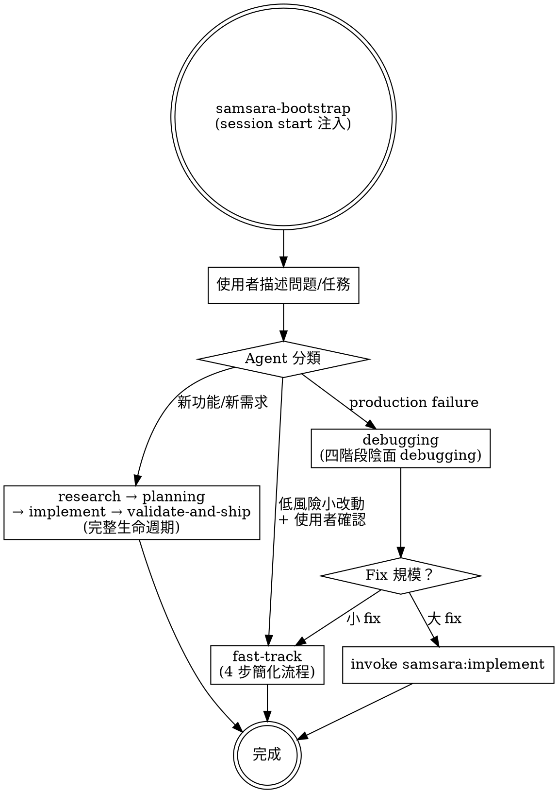
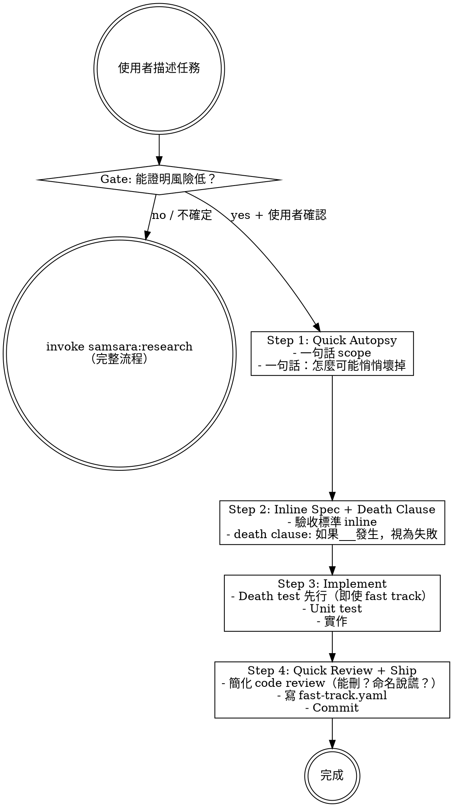
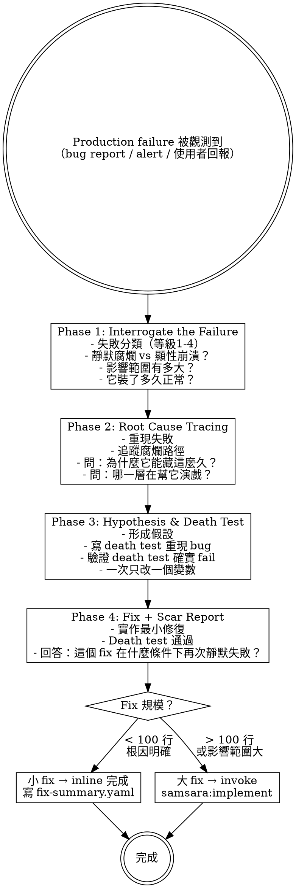

# Samsara Phase 2 — Fast Track + Debugging Design Spec

> 向死而驗 — Toward death, through verification.

## Goal

為 samsara plugin 加入兩個獨立 skill：Fast Track（低風險小改動的簡化路徑）和 Debugging（production failure 的四階段陰面 debugging）。兩者和 Phase 1 的完整生命週期（R→P→I→V&S）形成三條平行路徑。

## Architecture

- **Fast Track**：獨立 skill，有自己的入口 gate、流程、產出。不呼叫 research/planning/implement。
- **Debugging**：獨立 skill，不在 R→P→I 鏈上，可從任何場景被呼叫。Fix 階段可 invoke implement 或 fast-track。
- **Bootstrap 更新**：samsara-bootstrap 注入內容加入兩個新 skill 的描述。
- **Version**：plugin.json 0.1.1 → 0.2.0

---

## Global Skill Relationship

Phase 2 後，samsara 從線性鏈變成多路徑：



Agent 分析使用者意圖後建議走哪條路徑，使用者確認後進入。

---

## New Files

```
samsara/
├── skills/
│   ├── fast-track/
│   │   ├── SKILL.md                    # 入口 gate + 4 步簡化流程
│   │   └── templates/
│   │       └── fast-track.yaml         # 產出模板
│   └── debugging/
│       ├── SKILL.md                    # 四階段陰面 debugging
│       ├── root-cause-tracing.md       # 支援文件：向死而驗式根因分析
│       └── templates/
│           ├── bug-report.yaml         # 產出模板
│           ├── root-cause.yaml         # 產出模板
│           └── fix-summary.yaml        # 產出模板
```

**Modified files:**
- `skills/samsara-bootstrap/SKILL.md` — 加入 fast-track + debugging 到可用 Skills 清單
- `.claude-plugin/plugin.json` — version 0.1.1 → 0.2.0

**Total: 8 new files, 2 modified files.**

---

## Fast Track Skill Specification

### Frontmatter

```yaml
---
name: fast-track
description: Use when the user describes a small, low-risk change — bug fix with known cause, config change, dependency update, or small refactor under 100 lines
---
```

### Entry Gate

Agent 分析使用者描述後，判斷是否滿足 Fast Track 的全部條件：

| 類型 | 必須確認的條件 |
|------|---------------|
| Bug fix | 根因已知 + 已確認根因不在更深處 |
| Config 修改 | 已確認不觸發隱式行為變更 |
| Dependency 更新 | changelog 無 breaking change 且無靜默行為變更 |
| 小型 refactor | < 100 行 + 沒有消費者依賴被移除的行為 |

**Gate 規則**：如果 agent 無法確認這些條件，**預設走完整流程**（invoke `samsara:research`）。Fast Track 的 gate 是 opt-in（證明安全）而非 opt-out（假設安全）。

Agent 建議格式：

> 「這個看起來適合 Fast Track，因為 ___。走 Fast Track 嗎？還是走完整流程？」

使用者確認後進入。

### Process



### Steps

**Step 1: Quick Autopsy**
- 一句話描述要做什麼
- 一句話描述「這個改動怎麼可能悄悄壞掉」

**Step 2: Inline Spec + Death Clause**
- 驗收標準直接 inline（不需獨立 acceptance.yaml）
- 附帶一條 death clause：「如果 _____ 發生，此改動視為失敗」

**Step 3: Implement + Death Test + Unit Test**
- Death test 仍然先行，即使是 fast track
- 實作最小改動

**Step 4: Quick Review + Scar Tag + Ship**
- 簡化 code review（能刪嗎？命名說謊嗎？）
- 寫 `fast-track.yaml` 到 `changes/` 目錄
- Commit

### Yin-Side Constraints

- Death test 先行，即使 fast track
- Gate 預設走完整流程，需正面證據才能進 Fast Track
- 每個 commit 帶 `[scar:none]` 或 `[scar:N items]` tag

### Output

單一文件 `changes/YYYY-MM-DD_<description>/fast-track.yaml`：

```yaml
type: fast_track
description: "<一句話 scope>"
death_clause: "<如果___發生，此改動視為失敗>"
acceptance:
  - "<驗收標準 1>"
  - "<驗收標準 2>"
scar_tag: none  # none | N（items 數量）
scar_items:
  - "<如果有 scar items，列在這裡>"
files_changed:
  - "<file path>"
```

---

## Debugging Skill Specification

### Frontmatter

```yaml
---
name: debugging
description: Use when existing production code has a failure — bug report, monitoring alert, or user-reported issue in previously working functionality
---
```

### Definition

Debugging 的第一原則定義：

> **Bug = 既有 codebase 在 production 環境中產生的 failure。**

不是正在寫的 code 的問題（那是 implementation），不是 test 沒通過（那是 TDD cycle），不是 acceptance 不符（那是 spec 漂移）。來源可能是 bug report、monitoring alert、或使用者回報。

### Process



### Phase 1: Interrogate the Failure

不是直接找 root cause，先審問失敗本身。對應 Negative Space Engineering 的失敗分類學：

```
等級 1 - 顯性崩潰（最不危險）— 系統拋出錯誤，會被發現，會被修
等級 2 - 降級偽裝（危險）— fallback 啟動但沒標記降級狀態
等級 3 - 假成功（非常危險）— 操作表面完成，關鍵副作用沒發生
等級 4 - 靜默腐爛（最危險）— 沒有錯誤、沒有異常、持續擴散
```

必須回答：
- 這是哪個等級的失敗？
- 影響範圍：多少使用者/請求受影響？
- 持續時間：它裝了多久正常？（從什麼時候開始壞的？）
- 偵測延遲：從壞掉到被發現，中間過了多久？

### Phase 2: Root Cause Tracing

向死而驗式的 root cause — 不只找到「什麼壞了」，更要問「為什麼系統讓它藏這麼久」：

- **重現**：能在本地重現嗎？如果不能，為什麼不能？（環境差異本身就是線索）
- **追蹤腐爛路徑**：錯誤資料從哪個入口進來？經過幾層才被發現？每一層為什麼沒攔住？
- **共犯分析**：哪個 fallback、哪個 default value、哪個 silent catch 在幫它演戲？
- **時間線**：最後一次確認正常是什麼時候？中間有哪些 commit/deploy？

See support file `root-cause-tracing.md` for detailed technique guide.

### Phase 3: Hypothesis & Death Test

科學方法：
1. 根據 Phase 2 形成假設：「root cause 是 ___，因為 ___」
2. 寫 death test 重現 bug — test 必須在當前 codebase 上 **fail**
3. 驗證 death test 確實 fail（如果 pass 了，假設是錯的，回到 Phase 2）
4. 一次只改一個變數

### Phase 4: Fix + Scar Report

- 實作最小修復讓 death test pass
- 跑完所有既有 test（確認沒有 regression）
- 寫 fix-summary.yaml，必須回答：「這個 fix 在什麼條件下會再次靜默失敗？」
- 判斷 fix 規模：小 fix（< 100 行且根因明確）inline 完成，大 fix invoke `samsara:implement`

### Output

產出在 `bugfix/` 目錄（和 `changes/` 平行）：

```
bugfix/
└── YYYY-MM-DD_<bug-description>/
    ├── bug-report.yaml        # Phase 1 產出
    ├── root-cause.yaml        # Phase 2 產出
    └── fix-summary.yaml       # Phase 4 產出
```

### bug-report.yaml Format

```yaml
title: "<bug description>"
reported_by: "<source — user / monitoring / internal>"
failure_level: 1  # 1: 顯性崩潰 | 2: 降級偽裝 | 3: 假成功 | 4: 靜默腐爛
impact_scope: "<多少使用者/請求受影響>"
duration_undetected: "<從壞掉到被發現的時間>"
reproduction: "<能否本地重現，步驟>"
```

### root-cause.yaml Format

```yaml
hypothesis: "<root cause 假設>"
evidence:
  - "<支持假設的證據>"
root_cause: "<最終確認的根因>"
why_hidden: "<為什麼系統讓它藏這麼久>"
accomplices:
  - component: "<哪個 fallback/catch/default 在幫它演戲>"
    role: "<它做了什麼讓 bug 不可見>"
timeline:
  last_known_good: "<最後確認正常的時間>"
  suspected_introduction: "<懷疑引入的 commit/deploy>"
```

### fix-summary.yaml Format

```yaml
fix_description: "<修了什麼>"
death_test_added: true
files_changed:
  - "<file path>"
regression_check: pass | fail
silent_failure_conditions:
  - "<這個 fix 在什麼條件下再次靜默失敗>"
scar_tag: none | <N>
```

---

## Bootstrap Update

`samsara-bootstrap/SKILL.md` 的可用 Skills 清單更新為：

```markdown
## 可用 Skills
- **samsara:research** — 新功能/新問題的起點。產出 kickoff + problem autopsy
- **samsara:planning** — research 完成後。產出 plan + acceptance + tasks
- **samsara:implement** — plan 就緒後。death test first 的實作流程
- **samsara:validate-and-ship** — 實作完成後。驗屍 + 交付
- **samsara:fast-track** — 低風險小改動。簡化流程但 death test 仍先行
- **samsara:debugging** — production failure。四階段陰面 debugging
- **samsara:writing-skills** — 用向死而驗的方式寫新 skill
```

---

## Design Decisions Log

| # | Decision | Choice | Rationale |
|---|----------|--------|-----------|
| 1 | 優先順序 | 同時做 | Fast Track 和 Debugging 互相獨立 |
| 2 | Fast Track 入口 | 統一入口 + agent 建議 | 使用者確認後進入，gate 預設走完整流程 |
| 3 | Debugging 定義 | 既有 codebase 的 production failure | 第一原則思考：bug 來自既有 code，不是正在寫的 code |
| 4 | Debugging 深度 | 完整四階段 | 仔細了解 bug 原因，完整脈絡 |
| 5 | Fast Track 產出 | 單一 fast-track.yaml 在 changes/ | 不放 commit message，落地文件方便追蹤 |
| 6 | Debugging 產出 | bugfix/ 目錄 | 和 changes/ 平行，本質不同：修既有 vs 建新的 |
| 7 | Fast Track 架構 | 獨立 skill | 平行路徑而非 implement 子模式，gate 在任何階段之前 |
| 8 | Debugging fix 分流 | 小 fix inline / 大 fix invoke implement | 複用 implement 的 death test + scar report 機制 |
| 9 | Version | 0.1.1 → 0.2.0 | Minor bump，功能擴展 |
