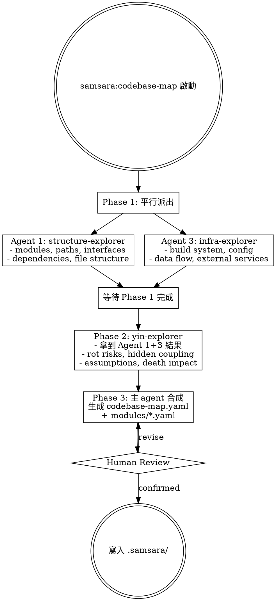
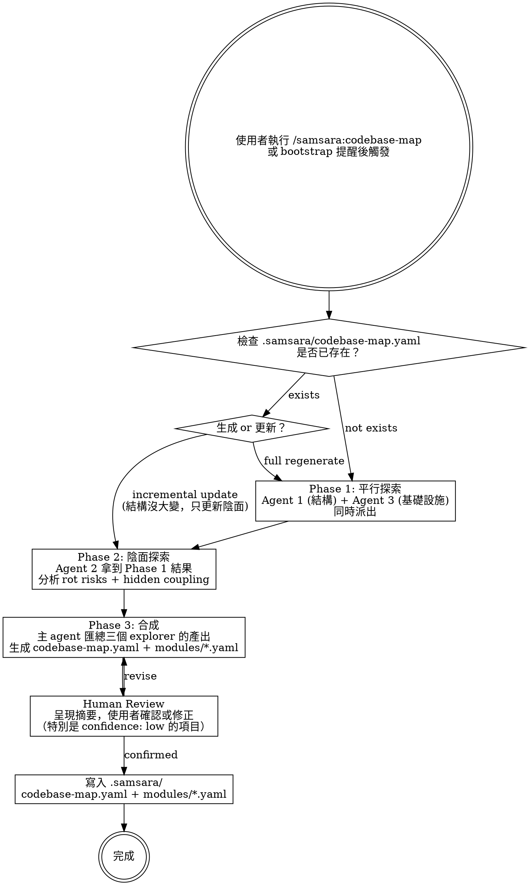
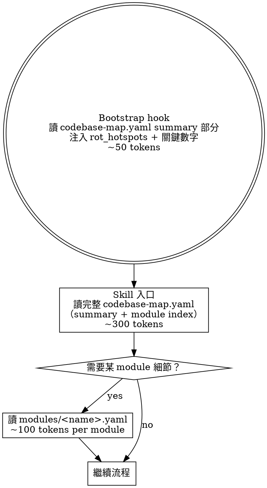

# Samsara Phase 3 — Codebase Map Design Spec

> 向死而驗 — Toward death, through verification.

## Goal

為 samsara plugin 加入 `codebase-map` skill，掃描目標專案生成陰面 codebase map。不只描述「系統長什麼樣」（陽面），更要回答「系統在哪裡假裝健康」（陰面）。透過分層載入機制控制 token 成本，讓所有現有 skills（research、planning、implement、debugging、fast-track）都能引用 codebase map 作為決策依據。

## Architecture

- **Skill**：獨立的 `samsara:codebase-map`，負責生成和更新
- **Agents**：3 個 explorer agents（結構、陰面、基礎設施），按維度分工
- **Bootstrap 檢查**：獨立的 `check-codebase-map` hook script，用 `$CLAUDE_PROJECT_DIR` 偵測目標專案，結果透過 `additionalContext` 疊加注入
- **分層載入**：兩層文件（codebase-map.yaml + modules/*.yaml），三段載入時機
- **Version**：plugin.json 0.2.0 → 0.3.0

---

## Core Concept: Yin-Side Codebase Map

一般的 codebase map 是陽面的 —「系統長什麼樣」。Samsara 的 codebase map 在每個 module 上附加四個陰面維度：

| 維度 | 問題 | 效益 |
|------|------|------|
| `death_impact` | 如果這個 module 消失，什麼會痛？ | 改善 scope 判斷、fast-track gate |
| `rot_risks` | 最可能在哪裡靜默腐爛？ | 縮短 debugging 搜索、planning 風險評估 |
| `hidden_coupling` | import 裡看不到的隱性依賴？ | 減少「改 A 壞 B」的盲區改動 |
| `assumptions` | 未驗證的假設是什麼？ | 讓隱式假設可見，避免基於錯誤前提決策 |

每個陰面項目附帶 `confidence: high | medium | low`，低信心項目在 human review 時特別標記。

---

## Scanning Strategy: Parallel Explorer Agents

### Agent 分工（按維度分，變體 A）



**Phase 1**（平行）：結構探索 + 基礎設施探索 — 互不依賴，同時跑
**Phase 2**（串行）：陰面探索 — 需要 Phase 1 的結果作為 context
**Phase 3**（合成）：主 agent 匯總，生成最終文件

---

## New Files

```
samsara/
├── skills/
│   └── codebase-map/
│       ├── SKILL.md                    # Skill 流程定義
│       └── templates/
│           ├── codebase-map.yaml       # Layer 1+2 模板
│           └── module.yaml             # Layer 3 模板
├── agents/
│   ├── structure-explorer.md           # Agent 1: 結構探索
│   ├── yin-explorer.md                 # Agent 2: 陰面探索
│   └── infra-explorer.md              # Agent 3: 基礎設施探索
├── hooks/
│   └── check-codebase-map             # 新 script: 檢查 codebase-map 狀態

Modified files:
├── hooks/hooks.json                    # 加入第二個 SessionStart command
├── skills/samsara-bootstrap/SKILL.md   # 加入 codebase-map skill 到清單
├── .claude-plugin/plugin.json          # version 0.2.0 → 0.3.0
```

**Total: 8 new files, 3 modified files.**

---

## Skill Specification

### Frontmatter

```yaml
---
name: codebase-map
description: Use when entering a new project for the first time, or when the codebase has changed significantly — generates a yin-side codebase map with structural analysis and silent failure surface assessment
---
```

### Process



### Update Modes

當 codebase-map 已存在時，使用者可以選擇：
- **Full regenerate** — 重跑三個 agent，完整重建
- **Incremental update** — 跳過 Phase 1（結構沒大變），只跑 Phase 2（陰面重新評估）+ Phase 3（更新差異）

---

## Agent Specifications

### Agent 1: structure-explorer

```yaml
---
name: structure-explorer
description: Explores codebase module boundaries, file structure, dependencies, and public interfaces
model: sonnet
tools: [Glob, Grep, Read, Bash]
---
```

**探索目標**：
- Module 識別：哪些目錄是獨立 module（判斷依據：package.json、__init__.py、go.mod、獨立 build target）
- 依賴圖：module 之間的 import/require 關係
- 公開 interfaces：每個 module 的 entry points（API endpoints、exported functions、CLI commands）
- 目錄結構：src/tests/config/docs 的組織方式

**產出格式**：
```yaml
modules:
  - name: "<module name>"
    path: "<directory path>"
    responsibility: "<one sentence>"
    dependencies: [<explicit imports>]
    interfaces:
      - "<public API / entry point>"
    file_count: <N>
    key_files:
      - "<most important files to read>"
```

### Agent 2: yin-explorer

```yaml
---
name: yin-explorer
description: Analyzes codebase for silent failure paths, hidden coupling, unverified assumptions, and rot risks — requires structure-explorer and infra-explorer results as input
model: sonnet
tools: [Glob, Grep, Read, Bash]
---
```

**接收**：Agent 1 + Agent 3 的產出作為 context

**探索目標**：
- **Rot risks**：每個 module 中最可能靜默腐爛的路徑 — 掃描 try/catch 不 re-raise、fallback 沒標記降級、default value 填充 unknown
- **Hidden coupling**：超出 import graph 的耦合 — shared DB tables、shared config keys、event bus、implicit state
- **Assumptions**：code 中的硬編碼值、magic numbers、環境假設
- **Death impact**：根據依賴圖 + interfaces，判斷每個 module 消失的影響範圍

**產出格式**：
```yaml
module_analysis:
  <module_name>:
    death_impact: "<如果消失，什麼會痛>"
    rot_risks:
      - zone: "<哪裡>"
        failure_level: 1 | 2 | 3 | 4
        description: "<怎麼壞>"
        confidence: high | medium | low
    hidden_coupling:
      - type: "<shared state / schema / config / event>"
        with: "<coupled module>"
        risk: "<改 A 怎麼靜默破壞 B>"
        confidence: high | medium | low
    assumptions:
      - assumption: "<假設什麼>"
        evidence: "<file:line>"
        verified: false
```

### Agent 3: infra-explorer

```yaml
---
name: infra-explorer
description: Explores build system, configuration sources, data flow patterns, and infrastructure dependencies
model: sonnet
tools: [Glob, Grep, Read, Bash]
---
```

**探索目標**：
- Build system：build tool、test command、build command
- Config：config 來源（env vars、yaml files、secrets manager）、runtime vs build-time
- Data flow：entry points、storage、external services
- Infra：database、cache、message queue

**產出格式**：
```yaml
infrastructure:
  build:
    tool: "<npm / cargo / make / ...>"
    test_command: "<how to run tests>"
    build_command: "<how to build>"
  config:
    sources:
      - type: "<env / yaml / json / secrets>"
        path: "<file or env var prefix>"
  data_flow:
    entry_points:
      - "<API / queue / cron>"
    storage:
      - type: "<database / cache / file>"
        technology: "<postgres / redis / s3>"
    external_services:
      - name: "<service name>"
        purpose: "<what it does>"
```

---

## Layered Loading (方案 C)

### File Structure

```
project/.samsara/
├── codebase-map.yaml      # Layer 1+2: summary + module index
└── modules/               # Layer 3: per-module detail
    ├── auth.yaml
    ├── billing.yaml
    └── ...
```

### Loading Strategy



**Token 成本估算（12 module 專案）**：
- Bootstrap 注入：~50 tokens
- Skill 入口：~300 tokens
- 深入 1 個 module：+~100 tokens
- 最大（全部 12 modules）：~1500 tokens

### codebase-map.yaml Format (Layer 1+2)

```yaml
project: "<project name>"
last_updated: "YYYY-MM-DD"
staleness_threshold_days: 7
generated_by: "samsara:codebase-map"

# --- Layer 1: Summary ---
summary:
  module_count: <N>
  silent_failure_surface: low | medium | high
  rot_hotspots:
    - "<module>: <最危險的靜默腐爛點> (level N)"
    - "<module>: <第二危險> (level N)"
    - "<module>: <第三危險> (level N)"
  high_risk_coupling_count: <N>
  assumption_inventory_count: <N>

# --- Layer 2: Module Index ---
modules:
  - name: "<module name>"
    path: "<directory path>"
    responsibility: "<one sentence>"
    death_impact: high | medium | low | unknown
    rot_risk_count: <N>
    hidden_coupling_count: <N>
    dependencies: [<explicit deps>]

# --- Infrastructure ---
infrastructure:
  build:
    tool: "<build tool>"
    test_command: "<command>"
  config_sources:
    - "<env / yaml / json>"
  data_flow:
    entry_points:
      - "<API / queue / cron>"
    storage:
      - "<technology>"
    external_services:
      - "<service name>"
```

### module.yaml Format (Layer 3)

```yaml
name: "<module name>"
path: "<directory path>"
responsibility: "<one sentence>"
last_analyzed: "YYYY-MM-DD"

# --- 陽面 ---
dependencies: [<explicit imports>]
interfaces:
  - "<public API / entry point>"
key_files:
  - "<most important files>"

# --- 陰面 ---
death_impact: "<如果消失，什麼會痛>"

rot_risks:
  - zone: "<哪裡>"
    failure_level: 1 | 2 | 3 | 4
    description: "<怎麼壞>"
    confidence: high | medium | low
    last_verified: "YYYY-MM-DD"

hidden_coupling:
  - type: "<shared state / schema / config / event>"
    with: "<coupled module>"
    risk: "<改 A 怎麼靜默破壞 B>"
    confidence: high | medium | low

assumptions:
  - assumption: "<假設什麼>"
    evidence: "<file:line>"
    owner: "<誰給的假設>"
    verified: false
```

---

## Bootstrap Hook Integration

### hooks.json Update

```json
{
  "hooks": {
    "SessionStart": [
      {
        "matcher": "startup|clear|compact",
        "hooks": [
          {
            "type": "command",
            "command": "bash \"${CLAUDE_PLUGIN_ROOT}/hooks/session-start\"",
            "timeout": 5000
          },
          {
            "type": "command",
            "command": "bash \"${CLAUDE_PLUGIN_ROOT}/hooks/check-codebase-map\"",
            "timeout": 3000
          }
        ]
      }
    ]
  }
}
```

兩個 script 各自輸出 `additionalContext`，Claude Code 自動串接（confirmed by docs: "Multiple hooks' values are concatenated"）。

### check-codebase-map Script

```bash
#!/usr/bin/env bash
# Check codebase-map freshness and inject status into session context

set -euo pipefail

codebase_map_status="not_applicable"

if [ -n "${CLAUDE_PROJECT_DIR:-}" ]; then
    map_file="${CLAUDE_PROJECT_DIR}/.samsara/codebase-map.yaml"
    if [ ! -f "$map_file" ]; then
        codebase_map_status="missing"
    else
        # macOS: stat -f %m, Linux: stat -c %Y
        last_modified=$(stat -f %m "$map_file" 2>/dev/null || stat -c %Y "$map_file" 2>/dev/null || echo 0)
        now=$(date +%s)
        age_days=$(( (now - last_modified) / 86400 ))
        if [ "$age_days" -gt 7 ]; then
            codebase_map_status="stale_${age_days}_days"
        else
            codebase_map_status="fresh_${age_days}_days"
        fi
    fi
fi

# Build context message based on status
case "$codebase_map_status" in
    missing)
        context_msg="Codebase Map Status: MISSING. 此專案尚無 codebase map，建議執行 /samsara:codebase-map 來生成。"
        ;;
    stale_*)
        days="${codebase_map_status#stale_}"
        days="${days%_days}"
        context_msg="Codebase Map Status: STALE (${days} days). Codebase map 已 ${days} 天未更新，建議執行 /samsara:codebase-map 來更新。"
        ;;
    fresh_*)
        # Fresh — no need to inject anything
        exit 0
        ;;
    not_applicable)
        # Not in a project directory — no need to inject
        exit 0
        ;;
esac

# Escape for JSON
escape_for_json() {
    local s="$1"
    s="${s//\\/\\\\}"
    s="${s//\"/\\\"}"
    s="${s//$'\n'/\\n}"
    s="${s//$'\r'/\\r}"
    s="${s//$'\t'/\\t}"
    printf '%s' "$s"
}

escaped_msg=$(escape_for_json "$context_msg")

printf '{\n  "hookSpecificOutput": {\n    "hookEventName": "SessionStart",\n    "additionalContext": "%s"\n  }\n}\n' "$escaped_msg"

exit 0
```

**Key behavior**：`fresh` 和 `not_applicable` 時 script exit 0 不輸出 JSON — 不注入任何 context，完全無 token 開銷。只有 `missing` 或 `stale` 時才注入提醒。

### Bootstrap SKILL.md Update

可用 Skills 清單加入：

```markdown
- **samsara:codebase-map** — 生成/更新專案的陰面 codebase map。掃描 modules、分析靜默失敗面、隱性耦合
```

---

## How Other Skills Use the Map

| Skill | 讀取層級 | 用途 |
|-------|---------|------|
| research | Layer 1+2 | Scope 判斷：改動影響哪些 module？death_impact 多大？ |
| planning | Layer 2 + Layer 3（相關 modules） | Death cases 設計：hidden_coupling 指出的模塊間靜默破壞路徑 |
| implement | Layer 3（當前 task 的 module） | STEP 0 回答：rot_risks 指出的已知靜默失敗路徑 |
| debugging | Layer 2 + Layer 3（疑似 modules） | Phase 2 Root Cause：rot_risks + hidden_coupling 縮短搜索範圍 |
| fast-track | Layer 1+2 | Gate 判斷：death_impact + hidden_coupling_count 判斷風險是否真低 |

---

## Design Decisions Log

| # | Decision | Choice | Rationale |
|---|----------|--------|-----------|
| 1 | 掃描策略 | 平行 code-explorer agents | 參考 feature-dev，比單 agent 更深入 |
| 2 | Agent 分工 | 按維度分 variant A | 結構 + infra 平行，陰面等前兩者完成（有依賴） |
| 3 | Bootstrap 檢查 | 獨立 hook script + additionalContext 疊加 | 職責分離、失敗隔離、可擴展 |
| 4 | 環境變數 | `$CLAUDE_PROJECT_DIR` | 官方 API，已在其他 hook 中驗證可用 |
| 5 | 分層載入 | 方案 C：兩層文件 | summary+index 在一個文件、detail 每 module 獨立 |
| 6 | 陰面維度 | death_impact + rot_risks + hidden_coupling + assumptions | 各有明確效益，都附 confidence 標記 |
| 7 | Confidence 標記 | high / medium / low | 低信心項目 human review 時特別標記 |
| 8 | 更新模式 | Full regenerate / Incremental update | 結構沒大變時可只更新陰面 |
| 9 | Hook 架構 | 多 script 各自輸出 additionalContext | Claude Code docs 確認 multiple hooks' values are concatenated |
| 10 | Version | 0.2.0 → 0.3.0 | Minor bump，新增 skill + agents |
