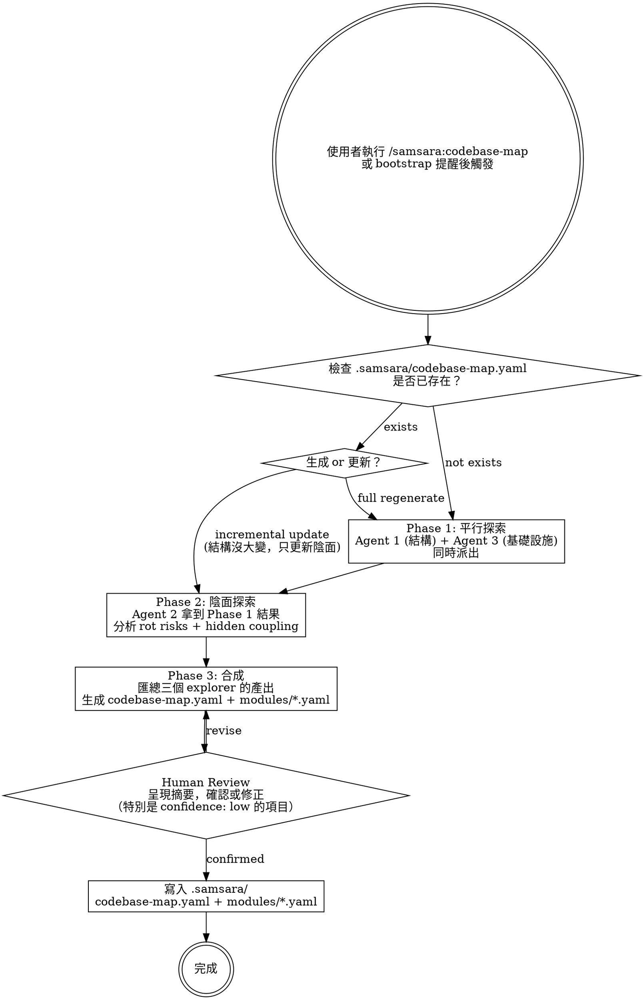

# Codebase Map — Yin-Side Project Analysis

Generate a map of the project that answers both "what is this system?" (yang) and "where is this system pretending to be healthy?" (yin).

> 一般的 codebase map 是陽面的 —「系統長什麼樣」。Samsara 的 codebase map 回答「系統在哪裡假裝健康」。

## Process



## Phase 1: Parallel Exploration

Dispatch two agents simultaneously:

1. **structure-explorer** — modules, paths, dependencies, interfaces
2. **infra-explorer** — build system, config sources, data flow, external services

These two agents have no dependencies on each other. Dispatch in parallel.

## Phase 2: Yin-Side Exploration

After Phase 1 completes, dispatch:

3. **yin-explorer** — receives Phase 1 results as context. Analyzes rot risks, hidden coupling, assumptions, death impact for each module.

## Phase 3: Synthesis

After all three agents report back:

1. Merge structure-explorer output (modules, deps) + infra-explorer output (build, config, data flow) + yin-explorer output (rot risks, coupling, assumptions)
2. Generate summary: count rot_hotspots (top 3 by failure_level), count high_risk_coupling, count assumptions
3. Compute `silent_failure_surface`: low (<3 rot risks), medium (3-7), high (>7 or any level 4)
4. Generate `codebase-map.yaml` (Layer 1+2) from templates
5. Generate one `modules/<name>.yaml` (Layer 3) per module from templates

## Phase 4: Human Review

Present to user:
- Summary: module count, silent failure surface, top 3 rot hotspots
- List all `confidence: low` items — ask user to confirm or correct
- Ask: "Anything missing or wrong?"

After user confirms → write files to `.samsara/`

## Update Modes

When `.samsara/codebase-map.yaml` already exists, ask user:

> 「Codebase map 已存在（上次更新：YYYY-MM-DD）。選擇更新方式：
> (A) Full regenerate — 重跑三個 agent，完整重建
> (B) Incremental update — 只重跑陰面分析，保留結構不變」

## Output

Files written to target project:

```
project/.samsara/
├── codebase-map.yaml      # Layer 1+2: summary + module index + infrastructure
└── modules/               # Layer 3: per-module detail (yang + yin)
    ├── <module-1>.yaml
    ├── <module-2>.yaml
    └── ...
```

Use templates at `templates/codebase-map.yaml` and `templates/module.yaml`.
