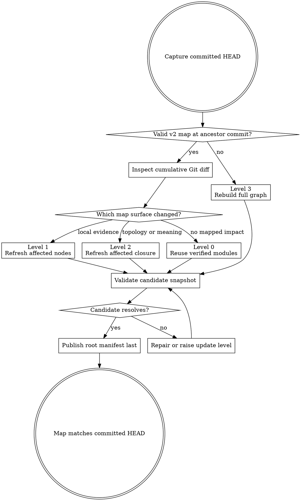

# Codebase Map — Committed Project Knowledge Graph

Map one committed Git snapshot: what exists, what each part provides, why it
exists, and how parts relate. Git owns repository facts; this skill owns the
structural and semantic graph for `source.commit`. The map is derived context,
not feature authority.

## Entry Contract

1. Require a Git repository with a valid `HEAD`. Do not map an unborn branch or
   non-Git directory.
2. Verify `.samsara/codebase-map.yaml` and
   `.samsara/codebase-map/<HEAD>/` are ignored with `git check-ignore`. Stop if
   either path could be committed; do not edit ignore rules automatically.
3. Resolve scan scope once by content role, not fixed folder names. Default
   `roots` to the project root unless the user supplies a narrower scope.
4. Exclude workflow artifacts under `changes/`, prior map output under
   `.samsara/`, VCS internals, caches, temporary files, binary payloads, and
   secret values. Record excluded or referenced-but-unscanned paths.

Codebase Map describes committed `HEAD` only. Never read or persist uncommitted
working-tree content. Feature workflows inspect their own working changes.

## Git Snapshot State

Read `source.commit` from `.samsara/codebase-map.yaml` and compare it with
`git rev-parse HEAD`:

- `CURRENT`: equal.
- `UPDATE_REQUIRED`: different.
- `MISSING`: no root manifest.
- `UNKNOWN`: Git, HEAD, schema, or recorded commit cannot be resolved.

Do not persist changed paths, commit lists, churn counts, thresholds, or state.
Git computes them when needed. A legacy map without `schema_version: 2` and
`source.commit` requires a Level 3 rebuild.

For every generation, create a detached temporary worktree at the captured
HEAD. Pass its root, the same resolved scan scope, and the captured commit to
every explorer. If HEAD changes before publish, reject the candidate.

```text
git rev-parse HEAD
git worktree add --detach <temporary-snapshot-root> <captured-HEAD>
```

Remove the temporary worktree after validation or failure:

```text
git worktree remove --force <temporary-snapshot-root>
```

Do not fall back to the working tree when worktree creation or cleanup fails.

## Update Level

Inspect the cumulative Git diff from the recorded commit to HEAD. File count
never selects the level.

```text
git merge-base --is-ancestor <recorded-commit> <captured-HEAD>
git diff --name-status --find-renames <recorded-commit>..<captured-HEAD>
git diff --find-renames <recorded-commit>..<captured-HEAD> -- <affected-paths>
```

Git reports paths, renames, and content changes. The workflow owner classifies
which recorded map surfaces those changes affect; it does not copy Git output
into the map.

- **Level 0 — Snapshot checkpoint:** no mapped structure, semantics, evidence,
  config, schema, flow, or risk changed. Reuse all module files.
- **Level 1 — Targeted refresh:** existing local nodes changed without module,
  public-interface, dependency, config, schema, or flow topology changes. The
  main agent refreshes affected nodes and evidence.
- **Level 2 — Structural incremental:** mapped topology or meaning changed.
  Dispatch only the Structure or Infrastructure explorer required by the diff,
  then Yin Explorer when failure surfaces may change. Refresh the affected
  dependency closure.
- **Level 3 — Full rebuild:** map missing or legacy, base commit invalid or not
  an ancestor, scope changed, module boundaries were broadly reorganized,
  impact cannot be classified, or incremental validation cannot recover.

Comments or formatting in a referenced file require Level 1 when line evidence
moves. Stable `path#symbol` evidence may allow Level 0 when it still resolves.

## Process


```dot
digraph codebase_map {
    node [shape=box];

    start [label="Capture committed HEAD" shape=doublecircle];
    usable [label="Valid v2 map at ancestor commit?" shape=diamond];
    diff [label="Inspect cumulative Git diff"];
    impact [label="Which map surface changed?" shape=diamond];
    checkpoint [label="Level 0\nReuse verified modules"];
    targeted [label="Level 1\nRefresh affected nodes"];
    structural [label="Level 2\nRefresh affected closure"];
    full [label="Level 3\nRebuild full graph"];
    validate [label="Validate candidate snapshot"];
    valid [label="Candidate resolves?" shape=diamond];
    repair [label="Repair or raise update level"];
    publish [label="Publish root manifest last"];
    done [label="Map matches committed HEAD" shape=doublecircle];

    start -> usable;
    usable -> full [label="no"];
    usable -> diff [label="yes"];
    diff -> impact;
    impact -> checkpoint [label="no mapped impact"];
    impact -> targeted [label="local evidence"];
    impact -> structural [label="topology or meaning"];
    checkpoint -> validate;
    targeted -> validate;
    structural -> validate;
    full -> validate;
    validate -> valid;
    valid -> repair [label="no"];
    repair -> validate;
    valid -> publish [label="yes"];
    publish -> done;
}
```

## Artifact Authority

`codebase-map.yaml` owns the source commit, scan scope, project summary, module
index, global nodes, cross-module relationships, business flows, and
infrastructure overview. Each `modules/<id>.yaml` owns only that module's local
nodes, internal relationships, interfaces, and yin findings.

- Every module index entry has one stable `id` and one `detail_ref`.
- Every node belongs to one module or `global_nodes`.
- Cross-module dependency exists only in `cross_module_relationships`.
- Business-flow steps cite node IDs and evidence.
- Structural facts use `path#symbol` when available; line refs are fallback.
- Unsupported responsibility, capability, flow, or risk stays `unknown`.
- Counts and Git diff metadata are derived on demand and are not stored.

## Build by Level

- Level 0 copies the prior module files into the new candidate generation and
  updates `source.commit`, generation metadata, and module `detail_ref` values.
  It does not rewrite semantic map content.
- Level 1 reads affected files from the detached worktree, updates their module
  fragments, and copies unaffected modules.
- Level 2 supplies the same snapshot scope to the relevant explorers. Their
  output matches template fragments; the main agent merges and de-duplicates
  without flattening structured evidence.
- Level 3 dispatches Structure and Infrastructure explorers in parallel, then
  Yin Explorer with both results and the same scope.

Deterministic paths, symbols, imports, calls, config refs, and Git state come
from the detached snapshot. LLM analysis may explain responsibility,
capability, flow, and risk only with cited snapshot evidence.

## Validate and Publish

Build a candidate directory containing `codebase-map.yaml` and `modules/`, then
run:

```text
uv run python <installed-codebase-map-skill-directory>/scripts/validate_codebase_map.py \
  --candidate <candidate-directory> \
  --project-root <project-root> \
  --snapshot-root <detached-worktree> \
  --expected-commit <captured-HEAD> \
  --publish
```

The companion checks schema, Git commit identity, ignored output paths, unique
IDs, module refs, edge endpoints, flow nodes, and evidence paths. It never
judges semantic quality. On success it publishes an immutable
`.samsara/codebase-map/<HEAD>/` generation and atomically replaces the root
manifest last. The publisher normalizes the root to block-style YAML so the
session hook can read `schema_version` and `source.commit` deterministically.

If validation, publication, or worktree cleanup fails, do not advance
`source.commit`. Preserve the previous root manifest and report the failure.
The main agent is the workflow owner; explorers return evidence only, and the
companion performs the owner's mechanical publish.

## Output

```text
.samsara/
├── codebase-map.yaml
└── codebase-map/<HEAD>/
    └── modules/<module-id>.yaml
```

This skill creates no `changes/` artifact and no Auto Mode gate.
