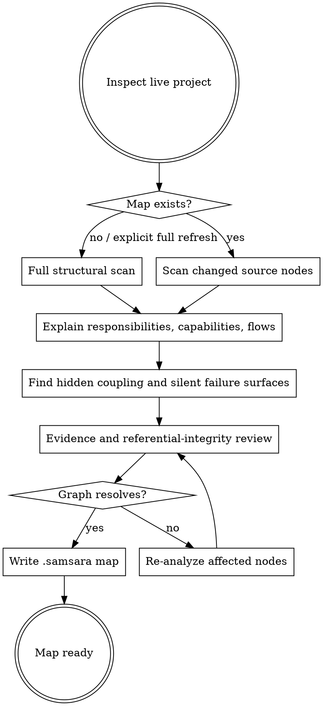

# Codebase Map — Project Knowledge Graph

Build a project-scoped, evidence-backed map of what exists, what each part
provides, why it exists, and how parts relate. It is derived context, not feature
authority; live code wins whenever the map drifts.

## Scan Scope

The main agent resolves scope once, before dispatch, by content role, not a fixed
folder name. Default `roots` to the project root unless the user supplies a
narrower scope. Record every user-supplied scope choice.

- Always exclude workflow artifacts under `changes/`, prior map output under
  `.samsara/`, VCS internals, caches, and temporary files. Do not read secret
  values or binary payloads; record only their verified role or config source.
- Classify generated code, vendored code, build output, docs, fixtures, and data
  by project behavior. Include them when they are built, shipped, imported,
  maintained, or affect runtime, tests, or schemas. Docs may explain semantics
  but never override live code.
- Record a referenced path outside `roots` or inside an exclusion as a
  `coverage_gap`; unscanned does not mean nonexistent.

Pass the same resolved scan scope to both explorers. Never use a feature plan or
decision log to describe what the codebase currently is.

## Triggers

- User invokes `samsara:codebase-map`.
- Pre-thinking auto-initiates refresh when source churn since `last_updated`
  exceeds `staleness_churn_threshold` (default 30). Churn excludes `changes/`,
  `docs/`, and `bugfix/`.

## Process


```dot
digraph codebase_map {
    node [shape=box];
    start [label="Inspect live project" shape=doublecircle];
    exists [label="Map exists?" shape=diamond];
    full [label="Full structural scan"];
    changed [label="Scan changed source nodes"];
    semantic [label="Explain responsibilities, capabilities, flows"];
    yin [label="Find hidden coupling and silent failure surfaces"];
    review [label="Evidence and referential-integrity review"];
    clean [label="Graph resolves?" shape=diamond];
    repair [label="Re-analyze affected nodes"];
    write [label="Write .samsara map"];
    done [label="Map ready" shape=doublecircle];

    start -> exists;
    exists -> full [label="no / explicit full refresh"];
    exists -> changed [label="yes"];
    full -> semantic;
    changed -> semantic;
    semantic -> yin -> review -> clean;
    clean -> repair [label="no"];
    repair -> review;
    clean -> write [label="yes"];
    write -> done;
}
```

## Build the Graph

1. Resolve Scan Scope, then dispatch `structure-explorer` and `infra-explorer`
   in parallel with that scope. Extract
   modules, files, significant functions/classes, entry points, provided
   interfaces, build/config sources, and evidence-backed dependency edges.
2. Dispatch `yin-explorer` with both results. Add hidden coupling, assumptions,
   death impact, and silent failure surfaces without replacing structural facts.
3. Synthesize:
   - `codebase-map.yaml`: project purpose, capabilities, module index, global
     nodes, relationships, business flows, infrastructure, and risk summary.
   - `modules/<name>.yaml`: module-local nodes, interfaces, relationships, and
     yin findings.
4. Check that every path and edge endpoint resolves or is disclosed as a
   `coverage_gap`, every relationship has an evidence ref, structural facts
   match live code, and unsupported semantics stay `unknown`. Re-analyze only
   failing nodes.

Deterministic source facts—paths, symbols, imports, calls, and config references—
must come from code inspection. LLM analysis may explain responsibility,
capability, business flow, and risk, but must cite those facts.

## Fail-Honest Write Contract

Write only after the evidence review succeeds. If refresh fails or aborts, do
not advance `last_updated`; preserve the prior map and mark it stale with a
recorded `stale_reason`. Partial output must not appear fresh.

## Output

```text
.samsara/
├── codebase-map.yaml
└── modules/<module>.yaml
```

Use `templates/codebase-map.yaml` and `templates/module.yaml`. The main agent is
the sole writer; explorers return evidence only. This skill creates no
`changes/` artifact and no auto-mode decision.
