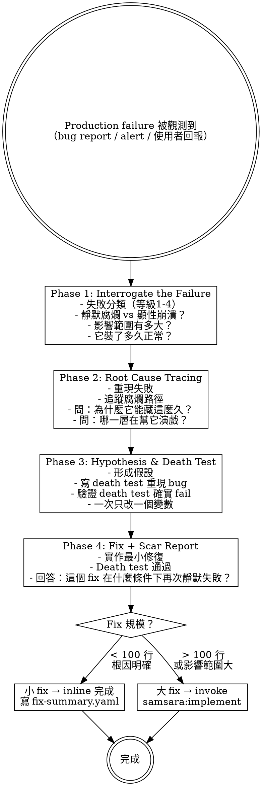

# Debugging — Four-Phase Yin-Side Root Cause Analysis

Systematic debugging for production failures in existing code. Not for implementation issues — those are part of the TDD cycle.

> Bug = 既有 codebase 在 production 環境中產生的 failure。

## First Principle

This skill applies ONLY when:
- The failing code was previously working in production
- The failure was observed via bug report, monitoring alert, or user report
- The issue is in existing code, not code being actively developed

If the failure is in code you're currently writing → that's implementation (use `samsara:implement`).
If the spec doesn't match reality → that's spec drift (use `samsara:validate-and-ship`).

## Process



## Phase 1: Interrogate the Failure

Do NOT jump to root cause. First, interrogate the failure itself.

### Failure Classification

```
Level 1 - Visible crash (least dangerous)
  System throws error, stops. It will be found, it will be fixed.

Level 2 - Degradation disguise (dangerous)
  Fallback activates but doesn't mark degraded state.
  Looks like it's working. Actually running on backup data.

Level 3 - False success (very dangerous)
  Operation appears complete. Key side effects didn't happen.
  Returns 200, but database didn't write, email didn't send.

Level 4 - Silent rot (most dangerous)
  No errors, no warnings, no anomalies.
  System keeps running, corruption keeps spreading.
  Nobody knows. The system doesn't know either.
```

Must answer:
- What failure level is this?
- Impact scope: how many users/requests affected?
- Duration: how long has it been broken? (Since when?)
- Detection delay: how long between breaking and discovery?

Output: `bug-report.yaml`

## Phase 2: Root Cause Tracing

Not just "what broke" — ask "why did the system let it hide for so long?"

- **Reproduce:** Can you reproduce locally? If not, why not? (Environment differences are themselves clues)
- **Trace the rot path:** Where did bad data enter? How many layers did it pass through before detection? Why didn't each layer stop it?
- **Accomplice analysis:** Which fallback, default value, or silent catch was helping it hide?
- **Timeline:** When was the last confirmed-working state? What commits/deploys happened in between?

See support file `root-cause-tracing.md` for detailed techniques.

Output: `root-cause.yaml`

## Phase 3: Hypothesis & Death Test

Scientific method — one variable at a time:

1. Form hypothesis based on Phase 2: "Root cause is ___, because ___"
2. Write death test to reproduce the bug — test MUST **fail** on current codebase
3. Verify death test actually fails (if it passes, hypothesis is wrong → back to Phase 2)
4. Change one variable at a time

## Phase 4: Fix + Scar Report

- Implement minimal fix to make death test pass
- Run all existing tests (confirm no regression)
- Write fix-summary.yaml — must answer: "Under what conditions will this fix silently fail again?"
- Judge fix scale:
  - Small fix (< 100 lines, root cause clear) → complete inline, write fix-summary.yaml
  - Large fix (> 100 lines or wide impact) → invoke `samsara:implement`

Output: `fix-summary.yaml`

## Output

All output in `bugfix/` directory (parallel to `changes/`):

```
bugfix/
└── YYYY-MM-DD_<bug-description>/
    ├── bug-report.yaml        # Phase 1
    ├── root-cause.yaml        # Phase 2
    └── fix-summary.yaml       # Phase 4
```
