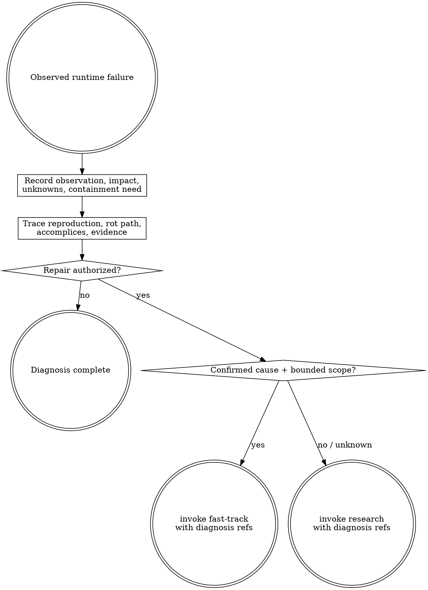

# Debugging — Diagnosis Authority

Debugging owns diagnosis and repair routing. It does not implement the repair;
the selected repair workflow owns code, tests, review, validation, and commit.

> Bug = 既有系統在 runtime 產生的可觀測 failure。

## Scope

Use this skill for failure in existing behavior, including latent defects exposed
by new data or load. Active implementation failures stay in Implement; validation
drift returns to Validate & Ship. When a delivered feature has an Evaluation
Contract, use its Primary evaluator and Feedback loop unless production evidence
disproves them.

Confirm repair authorization separately from diagnosis. A bug report authorizes
investigation, not code changes or external containment actions.

## Process


```dot
digraph debugging {
    node [shape=box];
    start [label="Observed runtime failure" shape=doublecircle];
    report [label="Record observation, impact,\nunknowns, containment need"];
    diagnose [label="Trace reproduction, rot path,\naccomplices, evidence"];
    route [label="Repair authorized?" shape=diamond];
    stop [label="Diagnosis complete" shape=doublecircle];
    bounded [label="Confirmed cause + bounded scope?" shape=diamond];
    fast [label="invoke fast-track\nwith diagnosis refs" shape=doublecircle];
    research [label="invoke research\nwith diagnosis refs" shape=doublecircle];

    start -> report -> diagnose -> route;
    route -> stop [label="no"];
    route -> bounded [label="yes"];
    bounded -> fast [label="yes"];
    bounded -> research [label="no / unknown"];
}
```

## Phase 1 — Observe

Write `bug-report.yaml`. Separate the observable result from inferred causes.
Classify failure level 1–4 with rationale. Record impact, duration, detection
delay, and evidence; use `unknown` plus the evidence needed instead of guessing.
If damage is continuing, identify containment, but do not execute it without
explicit authority.

## Phase 2 — Diagnose

Write `root-cause.yaml` and reference `bug-report.yaml`.

- Reproduce when possible; otherwise record why not.
- Trace the rot path from entry to detection and name each failed guard.
- Record hypothesis, supporting and refuting evidence, and
  `hypothesized | confirmed | unknown`.
- Explain why the system hid the failure.
- Record a failing death-test ref when one already exists; otherwise give the
  repair owner an executable death-test specification. Debugging does not add
  or modify test files.

Use `root-cause-tracing.md` for techniques, not as a second procedure authority.

## Phase 3 — Route Repair

- No repair authorization → `diagnosis_only`.
- Confirmed root cause, bounded scope, and Fast-track entry proof satisfied →
  invoke `samsara:fast-track` with both diagnosis refs.
- Structural, wide, unconfirmed, or unknown repair scope → invoke `samsara:research`.
  Research consumes the diagnosis refs and does not rewrite them.

Never invoke `samsara:implement` directly; Implement requires Planning artifacts.

Run:

```text
uv run python <installed-debugging-skill-directory>/scripts/validate_format.py bugfix/<bug>/
```

The validator checks format only; diagnosis and route correctness remain
judgment.

## Output

```text
bugfix/YYYY-MM-DD_<bug-description>/
├── bug-report.yaml
└── root-cause.yaml
```
