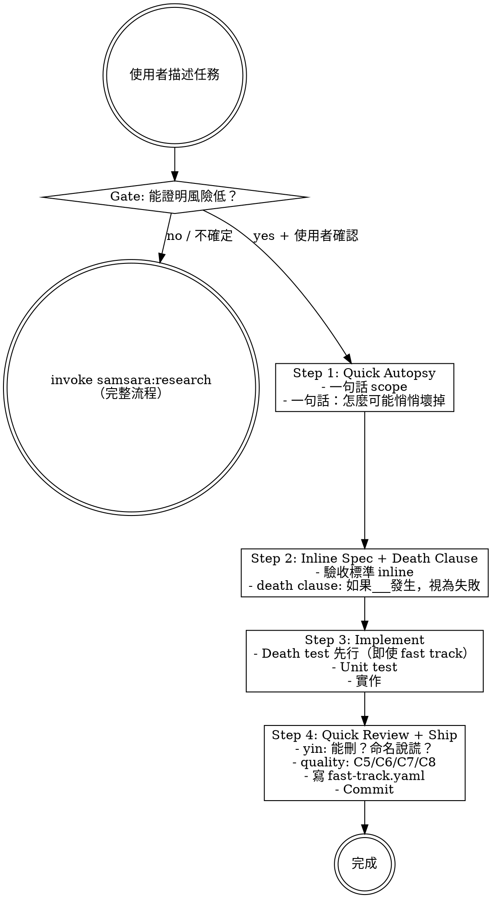

# Fast Track — Simplified Path, Same Discipline

A compressed workflow for low-risk changes. Death test still comes first.

> 陽面的 Fast Track 問「最少要做什麼」。陰面的 Fast Track 問「你能證明風險確實低嗎」。

## Entry Gate

Before entering Fast Track, you MUST verify the change meets ALL conditions for its type:

| Type | Must Confirm |
|------|-------------|
| Bug fix | Root cause is known + confirmed not hiding deeper issue |
| Config change | Confirmed no implicit behavior change triggered |
| Dependency update | Changelog has no breaking changes and no silent behavior changes |
| Small refactor | < 100 lines + no consumers depend on removed behavior |

**Gate rule:** If you cannot confirm these conditions, **default to full workflow** (invoke `samsara:research`). Fast Track is opt-in (prove safe) not opt-out (assume safe).

Suggest to the user:

> 「這個看起來適合 Fast Track，因為 ___。走 Fast Track 嗎？還是走完整流程？」

Only proceed after user confirms.

## Process



## Step 1: Quick Autopsy

- One sentence: what are you doing?
- One sentence: how could this change silently break things?

## Step 2: Inline Spec + Death Clause

- Acceptance criteria written inline (no separate acceptance.yaml needed)
- Attach one death clause: "If _____ happens, this change is considered failed"

## Step 3: Implement + Death Test + Unit Test

- Death test first, even for fast track. This is non-negotiable.
- Write minimal implementation to pass tests.

## Step 4: Quick Review + Scar Tag + Ship

Inline review — main agent self-checks both yin and quality. No subagent dispatch.

**Yin questions:**
- Can anything be deleted? (zero-cost deletion test)
- Are names lying? (do names describe what actually happens, including failures?)

**Quality questions** (selected from C5/C6/C7/C8 — the 4 criteria most likely to be violated in changes < 100 lines; full 8 criteria in `samsara/references/code-quality.md`):
- **C5 Reuse**: Did this change introduce a duplicate helper or inline logic that already has a single home elsewhere?
- **C6 Clear Structure**: Is every new boundary justified — "why here, not there"? Is any function/variable misplaced?
- **C7 Elegant Logic**: Are there extra variables, wrappers, or abstractions introduced that serve no protection?
- **C8 No Redundancy**: Does any new code state a fact already encoded somewhere else — two sources of truth for the same thing?

Selection rationale: For typical small changes (bug fix, config, dep update, small refactor under 100 lines), the quality risks most likely to be introduced silently are: duplicating logic that already exists (C5), placing code in the wrong boundary (C6), adding unnecessary abstraction (C7), and restating facts already encoded elsewhere (C8). C1 Readability is ambient and covered by the naming yin question. C2 Maintainability and C3 Extensibility are architectural concerns unlikely to surface in <100 lines. C4 Debuggability overlaps with the yin reviewer's silent-rot scope.

- Write `fast-track.yaml` to `changes/` directory
- Commit with `[scar:none]` or `[scar:N items]` tag

## Yin-Side Constraints

- **Death test first** — even for fast track, this order cannot be skipped
- **Gate defaults to full workflow** — positive evidence required to enter Fast Track
- **Every commit tagged** — `[scar:none]` or `[scar:N items]`
- **Quality symmetry** — fast-track's Step 4 review must check both yin (deletion, naming) and quality (C5/C6/C7/C8) faces; checking only one face is an incomplete review

## Output

Single file at `changes/YYYY-MM-DD_<description>/fast-track.yaml`.

Example:
```yaml
type: fast_track
description: "<one-sentence scope>"
death_clause: "<if ___ happens, this change is failed>"
acceptance:
  - "<acceptance criterion 1>"
  - "<acceptance criterion 2>"
scar_tag: none  # none | N (item count)
scar_items:
  - "<scar item if any>"
files_changed:
  - "<file path>"
quality_checklist:
  - criterion: "C5 Reuse"
    checked: false  # fill true only after active review — a specific observation is required in note
    note: "<what was observed — must be specific, not a template copy>"
  - criterion: "C6 Clear Structure"
    checked: false
    note: "<what was observed — must be specific, not a template copy>"
  - criterion: "C7 Elegant Logic"
    checked: false
    note: "<what was observed — must be specific, not a template copy>"
  - criterion: "C8 No Redundancy"
    checked: false
    note: "<what was observed — must be specific, not a template copy>"
```
