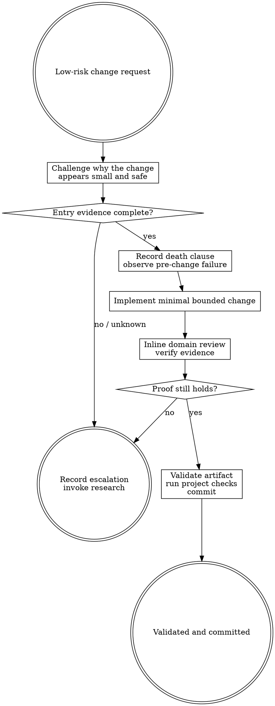

# Fast Track — Bounded Repair

Fast-track compresses implementation; entry requires bounded-risk evidence.
Line count is only a signal.

> 陰面的 Fast Track 問：「你能證明風險確實低嗎？」

## Entry Contract

Record route authority: explicit invocation, user confirmation, or Debugging
handoff. Prove:

- **No unresolved design question:** the requested behavior and ownership are
  already decided.
- **Bounded damage radius:** failure is observable, reversible, and limited to
  identified callers, configs, tests, and runtime surfaces.
- **No structural impact:** the change does not create or move a load-bearing
  seam, public contract, migration, authorization/security boundary, or shared
  mutation surface.
- **Deterministic verification:** an existing or new command can prove the death
  clause before and after the change.

Read before writing: inspect affected files, consumers, tests, config, and shared
state. Record evidence and unknowns. Any unproven condition escalates to Research.

## Yin-Side Lens

Before accepting the low-risk proof, ask:

- What makes this change look smaller than it is?
- Which assumption makes this change appear safe, and where is it verified?
- If it fails silently, who detects the failure first, and how far does damage spread?
- Which fallback, default, retry, or caller could hide the failure?
- Is it bounded by protection, or by an uninspected surface?

After implementation ask again: Can anything be deleted? Are names honest about
success, degradation, and failure? If the answer exposes hidden coupling or an
unverified assumption, Fast-track no longer applies.

## Process


```dot
digraph fast_track {
    node [shape=box];
    start [label="Low-risk change request" shape=doublecircle];
    yin [label="Challenge why the change\nappears small and safe"];
    proven [label="Entry evidence complete?" shape=diamond];
    research [label="Record escalation\ninvoke research" shape=doublecircle];
    death [label="Record death clause\nobserve pre-change failure"];
    implement [label="Implement minimal bounded change"];
    review [label="Inline domain review\nverify evidence"];
    clean [label="Proof still holds?" shape=diamond];
    validate [label="Validate artifact\nrun project checks\ncommit"];
    done [label="Validated and committed" shape=doublecircle];

    start -> yin -> proven;
    proven -> research [label="no / unknown"];
    proven -> death [label="yes"];
    death -> implement -> review -> clean;
    clean -> research [label="no"];
    clean -> validate [label="yes"];
    validate -> done;
}
```

## Execution

1. Create `changes/YYYY-MM-DD_<description>/fast-track.yaml` from the template.
   Preserve Debugging refs under `source_refs`; do not restate the diagnosis.
2. Define acceptance and the death clause. Run an existing check or add a death
   test, and record the observed failing pre-change result.
3. Implement only the bounded change. If scope expands, stop and escalate.
4. Use the reviewer domain router and domain reference (`code` or `iac`). Select
   principles from evidence, not a fixed C5-C8 subset. Record reference and
   evidence refs, findings, and unknowns; anything breaking the proof escalates.
5. Run project verification and:

   ```text
   uv run python <installed-fast-track-skill-directory>/scripts/validate_format.py changes/<fast-track>/
   ```

   This validator checks format only; risk and review adequacy remain judgment.
   Fix every format finding, then commit code, tests, and the record together.
   Completion means validated and committed, not deployed.

## Output

One `fast-track.yaml`. Fast-track has no Scar lifecycle: an unresolved item
invalidates the low-risk route and moves the work to Research.
