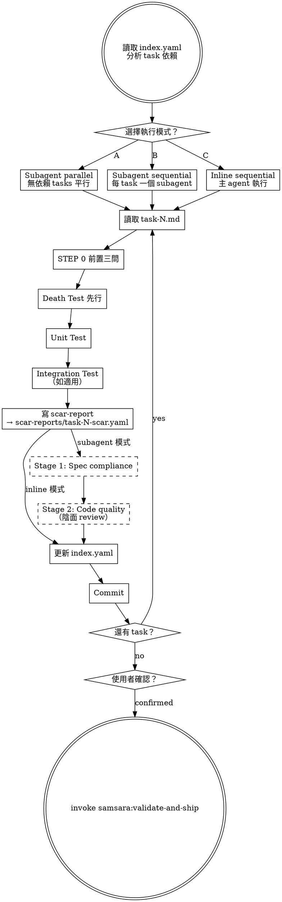

# Implement — Death Test First, Scar Report Always

Execute implementation tasks with death tests before unit tests, and scar reports on every completion.

> 陽面問「功能做完了嗎」，陰面問「做完的東西壞掉時你知道嗎」。

## Prerequisites

Read from the feature's `changes/` directory:
- `index.yaml` — task list with dependencies
- `overview.md` — shared architecture context
- `tasks/task-N.md` — individual task files

## Process

## Execution Mode Selection

On entry, analyze `index.yaml` for task dependencies, then ask:

> 「Plan 中有 N 個 tasks。
>
> 依賴分析：
> - task-1, task-2: 無依賴，可平行
> - task-3: 依賴 task-1 + task-2，必須 sequential
>
> 執行模式：
> (A) Subagent parallel — 無依賴的 tasks 平行分派，有依賴的 sequential
> (B) Subagent sequential — 每個 task 一個 fresh subagent，依序執行
> (C) Inline sequential — 主 agent 自己依序執行
>
> 選哪個？」

### Subagent Context

Each subagent receives:
- `task-N.md` — the task to implement
- `overview.md` — architecture context
- Samsara 陰面約束 — STEP 0 + 禁止行為 + 強制行為

### Subagent Review (modes A and B)

After each subagent completes:
- **Stage 1: Spec compliance** — does the code match task-N.md requirements?
- **Stage 2: Code quality** — yin-side review: can anything be deleted? Are names honest? Where would a future maintainer curse?

## Per-Task Execution Order

This order is mandatory. Death test before unit test. Scar report before commit.

1. Read task-N.md
2. STEP 0 — answer the three prerequisite questions
3. Write death tests — test silent failure paths first
4. Run death tests — verify they fail (red)
5. Write unit tests
6. Run unit tests — verify they fail (red)
7. Implement minimal code to pass all tests
8. Run all tests — verify they pass (green)
9. Write scar report → `scar-reports/task-N-scar.yaml` (see support file `scar-report.md`)
10. Update `index.yaml` — set status, scar_count, unresolved_assumptions
11. Commit

## Yin-Side Constraints

These are non-negotiable:

- **No optimistic completion:** A task without a scar report has status `completion_unverified`, not `done`
- **Death test ordering:** Death tests must be written and run before unit tests. This order cannot be swapped.
- **Immediate index update:** `index.yaml` must be updated after each task commit. No batching.

## Transition

All tasks complete, then ask:

> 「Implementation 完成。N 個 tasks 已執行，共 M 個 scar report items。確認後進入 Validation？」

使用者確認後，invoke `samsara:validate-and-ship` skill。
