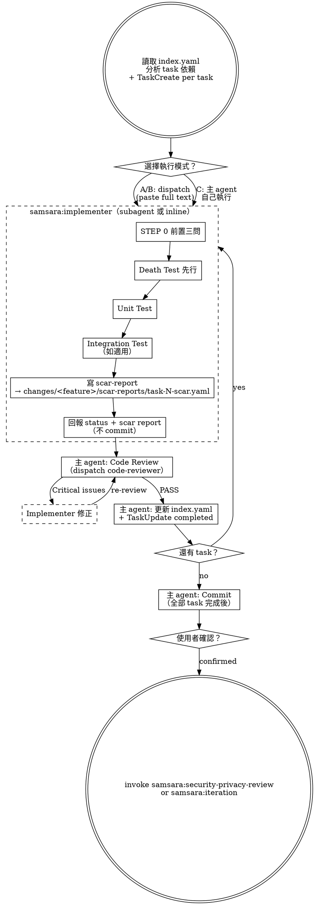

# Implement — Death Test First, Scar Report Always

Execute implementation tasks with death tests before unit tests, and scar reports on every completion.

> 陽面問「功能做完了嗎」，陰面問「做完的東西壞掉時你知道嗎」。

## Prerequisites

Read from the feature's `changes/` directory:
- `index.yaml` — task list with dependencies
- `overview.md` — shared architecture context
- `tasks/task-N.md` — individual task files

## Process



## Progress Tracking

On entry, after reading `index.yaml`, create a TaskCreate item for each task to provide real-time UI progress. `index.yaml` remains the source of truth — TaskCreate is its UI projection.

```
Read index.yaml
  → For each task: TaskCreate({ title: "Task N: {title}", status: "open" })

After each task's review passes:
  → Update index.yaml (status, scar_count)
  → TaskUpdate({ status: "completed" }) for the corresponding task
```

Always update both together. Never update one without the other.

## Execution Mode Selection

On entry, analyze `index.yaml` for task dependencies, create TaskCreate items for each task, then ask:

> 「Plan 中有 N 個 tasks。
>
> 依賴分析：
> - task-1, task-2: 無依賴，可平行
> - task-3: 依賴 task-1 + task-2，必須 sequential
>
> 執行模式：
> (A) Subagent parallel — 無依賴的 tasks 平行分派，有依賴的 sequential
> (B) Subagent sequential — 每個 task 一個 fresh subagent，依序執行
> (C) Inline sequential — 主 agent 自己依序執行
>
> 選哪個？」

### Subagent Context

Use `subagent_type: "samsara:implementer"` — the agent definition (`agents/implementer.md`) provides samsara constraints (STEP 0, 禁止行為, 強制行為, death test ordering, scar report format). You do NOT need to inject these into the prompt.

The prompt provides per-task context. Follow the template in `./dispatch-template.md`:
- `task-N.md` — **paste full text**, never tell subagent to read the file
- `overview.md` — **curate relevant sections**, not the entire file
- Related death cases and prior scar reports (if task has dependencies)

### Subagent Review (modes A and B)

After each subagent completes (status DONE or DONE_WITH_CONCERNS):

1. **Parallel code review** — dispatch BOTH reviewers in the **same message** to enable parallel execution:
   - `samsara:code-reviewer` (yin) — spec compliance, deletion analysis, naming honesty, silent rot paths, correctness
   - `samsara:code-quality-reviewer` (quality) — structural truth-telling: S/O/L/I/D + Cohesion/Coupling/DRY/Pattern

   See `./dispatch-template.md` for both dispatch templates.

2. **Aggregation rule** — main agent MUST receive BOTH review outputs before proceeding:
   - Both pass → proceed to index.yaml update
   - Either reviewer reports Critical issues → implementer fixes → re-review (dispatch both again)
   - Only one review output received → **FAIL with "missing reviewer" error** — do NOT assume absent reviewer = PASS. Re-dispatch the missing reviewer before proceeding.

3. Review passes (both) → main agent updates `index.yaml` (status, scar_count, unresolved_assumptions).

Do not proceed to next task with open Critical issues. Do not commit until all tasks complete.

## Per-Task Execution Order

This order is mandatory. Death test before unit test. Scar report before self-iteration before report.

### Implementer（subagent 或 inline）

1. STEP 0 — answer the three prerequisite questions
2. Write death tests — test silent failure paths first
3. Run death tests — verify they fail (red)
4. Write unit tests
5. Run unit tests — verify they fail (red)
6. Implement minimal code to pass all tests
7. Run all tests — verify they pass (green)
8. Write scar report → `changes/<feature>/scar-reports/task-N-scar.yaml` (read `templates/scar-schema.yaml` for the exact format; `<feature>` = the feature directory name from `changes/`)
9. Self-iteration (Level 1) — review scar items, fix task-scope actionable items
10. Update scar report — add `resolved_items` for fixed items, mark remaining items with `deferred_to_feature_iteration` flags where applicable
11. Run all tests — verify no regression from self-iteration fixes
12. Report back (do NOT commit)

### Main agent（review + bookkeeping）

13. **Parallel dispatch both reviewers in the same message** — `samsara:code-reviewer` (yin) and `samsara:code-quality-reviewer` (quality). See `./dispatch-template.md` for both dispatch templates.
    - Both outputs must arrive. A reviewer output that did not arrive is **not** the same as PASS or PASS_WITH_CONCERNS — it is an absent output. If only one review output is received → **FAIL with "missing reviewer" error**. Re-dispatch the missing reviewer (max 2 retries); if it still does not arrive, escalate and do not proceed.
14. If either reviewer reports Critical issues → implementer fixes → re-review (both reviewers again)
15. Update `index.yaml` — set status, scar_count, unresolved_assumptions + TaskUpdate the corresponding task to `completed`
16. Proceed to next task

### After all tasks complete

17. Commit all changes

## Yin-Side Constraints

These are non-negotiable:

- **No optimistic completion:** A task without a scar report has status `completion_unverified`, not `done`
- **Death test ordering:** Death tests must be written and run before unit tests. This order cannot be swapped.
- **Review before index update:** `index.yaml` is updated only after code-reviewer passes. No pre-review status changes.
- **Commit after all tasks:** Do not commit per-task. Commit once after all tasks complete and all reviews pass.

## Red Flags

**Never:**
- Make subagent read task or overview files (paste full text — see `./dispatch-template.md`)
- Use generic `general-purpose` subagent — always use `samsara:implementer`
- Skip yin-side review (dispatch `samsara:code-reviewer`)
- Skip `code-quality-reviewer` dispatch — both reviewers are required; skipping one means the review is incomplete
- Proceed to next task while code-reviewer or code-quality-reviewer has open Critical issues
- Dispatch multiple implementer subagents in parallel (file conflicts)
- Ignore subagent NEEDS_CONTEXT or BLOCKED status — provide context or escalate
- Accept a task as DONE without a scar report
- Let subagent commit — only the main agent commits, after all tasks complete
- Update index.yaml before both code-reviewer and code-quality-reviewer pass
- Assume an absent review output means PASS — missing reviewer output is always a FAIL

## Support Files

- `./dispatch-template.md` — prompt template for implementer and reviewer dispatch
- `./scar-report.md` — scar report format reference

## Transition

All tasks complete. Calculate remaining scar items:
- Count items across all `changes/<feature>/scar-reports/` where `deferred_to_feature_iteration: true` or items without `resolved_items` coverage
- These are the **feature-level items** that Level 1 self-iteration could not resolve

Then ask:

> 「Implementation 完成。N 個 tasks 已執行，共 M 個 scar report items（Level 1 self-iteration 已處理 R 個，剩餘 K 個 feature-level items）。
>
> (A) 進入 Iteration — 審視 feature-level scar items（cross-task patterns, system-level rot）
> (B) Skip — 直接進入 Security & Privacy Review（剩餘 items 由 validate-and-ship 的 failure budget review 處理）」

- 使用者選 A → invoke `samsara:iteration`
- 使用者選 B → invoke `samsara:security-privacy-review`
