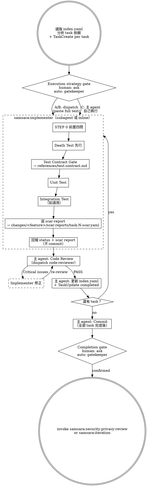

# Implement — Death Test First, Scar Report Always

Execute implementation tasks with death tests before unit tests, and scar reports on every completion.

> 陽面問「功能做完了嗎」，陰面問「做完的東西壞掉時你知道嗎」。

## Prerequisites

Read from the feature's `changes/` directory:
- `index.yaml` — task list with dependencies
- `overview.md` — shared architecture context
- `tasks/task-N.md` — individual task files

## Process



## Progress Tracking

On entry, after reading `index.yaml`, create a TaskCreate item for each task to provide real-time UI progress. `index.yaml` remains the source of truth — TaskCreate is its UI projection.

```
Read index.yaml
  → For each task: TaskCreate({ title: "Task N: {title}", status: "open" })

After each task's review passes:
  → Update index.yaml (status, scar_count)
  → TaskUpdate({ status: "completed" }) for the corresponding task
```

Always update both together. Never update one without the other.

## Execution Mode Selection

On entry, analyze `index.yaml` for task dependencies, create TaskCreate items
for each task, then use this execution strategy prompt:

> 「Plan 中有 N 個 tasks。
>
> 依賴分析：
> - task-1, task-2: 無依賴，可平行
> - task-3: 依賴 task-1 + task-2，必須 sequential
>
> 執行模式：
> (A) Subagent parallel — 無依賴的 tasks 平行分派，有依賴的 sequential
> (B) Subagent sequential — 每個 task 一個 fresh subagent，依序執行
> (C) Inline sequential — 主 agent 自己依序執行
>
> 選哪個？」

- If `Execution mode: human-in-the-loop`, ask the user this question and follow
  the selected strategy.
- If `Execution mode: auto`, do not ask the user. Use the Auto Mode Gate below
  to dispatch `samsara:auto-gatekeeper`, append the strategy decision to
  `auto-decisions.md`, and follow the recorded execution strategy.

### Subagent Context

Use `subagent_type: "samsara:implementer"` — the agent definition (`agents/implementer.md`) provides samsara constraints (STEP 0, 禁止行為, 強制行為, death test ordering, scar report format). You do NOT need to inject these into the prompt.

The prompt provides per-task context. Follow the template in `./dispatch-template.md`:
- `task-N.md` — **paste full text**, never tell subagent to read the file
- `overview.md` — **curate relevant sections**, not the entire file
- Related death cases and prior scar reports (if task has dependencies)

### Subagent Review (modes A and B)

After each subagent completes (status DONE or DONE_WITH_CONCERNS):

1. **Parallel code review** — dispatch BOTH reviewers in the **same message** to enable parallel execution:
   - `samsara:code-reviewer` (yin) — spec compliance, deletion analysis, naming honesty, silent rot paths, correctness
   - `samsara:code-quality-reviewer` (quality) — structural truth-telling: S/O/L/I/D + Cohesion/Coupling/DRY/Pattern

   See `./dispatch-template.md` for both dispatch templates.

2. **Aggregation rule** — main agent MUST receive BOTH review outputs before proceeding:
   - Both pass → proceed to index.yaml update
   - Either reviewer reports Critical issues → implementer fixes → re-review (dispatch both again)
   - Either reviewer reports `UNKNOWN` → **blocking review failure**; fix the missing/unreadable reference or unsupported domain condition, then re-review (dispatch both again)
   - Only one review output received → **FAIL with "missing reviewer" error** — do NOT assume absent reviewer = PASS. Re-dispatch the missing reviewer before proceeding.

3. Review passes (both) → main agent updates `index.yaml` (status, scar_count, unresolved_assumptions).

Do not proceed to next task with open Critical issues. Do not commit until all tasks complete.

## Per-Task Execution Order

This order is mandatory. Death test before unit test. Scar report before self-iteration before report.

### Implementer（subagent 或 inline）

1. STEP 0 — answer the four prerequisite questions
2. Write death tests — test silent failure paths first
3. Run death tests — verify they fail (red)
4. **Test Contract Gate (before unit tests)** — for each unit-test assertion,
   run the contract gate from `references/test-contract.md`. Every unit test must
   assert a behavioral contract, not implementation details. This gate runs BEFORE
   unit tests are written — do not skip to writing unit tests. See
   `references/test-contract.md` for the contract sources and the both-poles rules
   (over-fit and silent-green); it is the single source of truth — do not restate
   the source list here.
5. Write unit tests — each bound to a named contract per the gate
6. Run unit tests — verify they fail (red)
7. Implement minimal code to pass all tests
8. Run all tests — verify they pass (green)
9. Write scar report → `changes/<feature>/scar-reports/task-N-scar.yaml` (read `templates/scar-schema.yaml` for the exact format; `<feature>` = the feature directory name from `changes/`)
10. Self-iteration (Level 1) — review scar items, fix task-scope actionable items
11. Update scar report — add `resolved_items` for fixed items, mark remaining items with `deferred_to_feature_iteration` flags where applicable
12. Run all tests — verify no regression from self-iteration fixes
13. Report back (do NOT commit)

### Main agent（review + bookkeeping）

14. **Parallel dispatch both reviewers in the same message** — `samsara:code-reviewer` (yin) and `samsara:code-quality-reviewer` (quality). See `./dispatch-template.md` for both dispatch templates.
    - Both outputs must arrive. A reviewer output that did not arrive is **not** the same as PASS or PASS_WITH_CONCERNS — it is an absent output. If only one review output is received → **FAIL with "missing reviewer" error**. Re-dispatch the missing reviewer (max 2 retries); if it still does not arrive, escalate and do not proceed.
15. If either reviewer reports `UNKNOWN` or Critical issues → implementer fixes the blocking reference/domain issue or review finding → re-review (both reviewers again)
16. Update `index.yaml` — set status, scar_count, unresolved_assumptions + TaskUpdate the corresponding task to `completed`
17. Proceed to next task

### After all tasks complete

18. Commit all changes

## Yin-Side Constraints

These are non-negotiable:

- **No optimistic completion:** A task without a scar report has status `completion_unverified`, not `done`
- **Death test ordering:** Death tests must be written and run before unit tests. This order cannot be swapped.
- **Test Contract Gate before unit tests:** Every unit-test assertion must pass the contract gate in `references/test-contract.md` BEFORE the unit test is written. A unit test asserts a behavioral contract, not implementation details. This gate runs before unit tests, never after — a gate run after the test is already on disk cannot stop a tautological test from landing.
- **Review before index update:** `index.yaml` is updated only after code-reviewer passes. No pre-review status changes.
- **UNKNOWN blocks review completion:** Reviewer `UNKNOWN` is not a partial pass. It means a required reference/domain condition could not be verified; do not proceed, update `index.yaml`, or mark review complete until the condition is fixed and both reviewers are re-run.
- **Commit after all tasks:** Do not commit per-task. Commit once after all tasks complete and all reviews pass.
- **Structural honesty applies at generation, not only at review:** The implementer's 結構誠實 constraints (`agents/implementer.md`) — justify every boundary/abstraction by what breaks if it is removed, and refuse speculative generalization built for a single consumer — apply whether the implementer runs as a subagent (modes A/B) **or inline (mode C)**. In inline mode the agent definition is not loaded, so the main agent owns these constraints directly; do not skip them just because no subagent was dispatched.

## Red Flags

**Never:**
- Make subagent read task or overview files (paste full text — see `./dispatch-template.md`)
- Use generic `general-purpose` subagent — always use `samsara:implementer`
- Skip yin-side review (dispatch `samsara:code-reviewer`)
- Skip `code-quality-reviewer` dispatch — both reviewers are required; skipping one means the review is incomplete
- Proceed to next task while code-reviewer or code-quality-reviewer has open Critical issues
- Proceed to next task when either reviewer returned `UNKNOWN` because a reference was missing/unreadable or the execution domain was unsupported
- Dispatch multiple implementer subagents in parallel (file conflicts)
- Ignore subagent NEEDS_CONTEXT or BLOCKED status — provide context or escalate
- Accept a task as DONE without a scar report
- Skip the Test Contract Gate before writing unit tests — a unit test with no named contract is brittle or tautological by default
- Accept an **over-fit / brittle** unit test that reddens on a behavior-preserving refactor (pins implementation details)
- Accept a **silent-green / tautological** unit test (a vague test that asserts almost nothing and can never go red — it stays green when the behavior actually breaks) — guarding only the over-fit pole re-creates the disease at the silent-green pole
- Let subagent commit — only the main agent commits, after all tasks complete
- Update index.yaml before both code-reviewer and code-quality-reviewer pass
- Assume an absent review output means PASS — missing reviewer output is always a FAIL

## Support Files

- `./dispatch-template.md` — prompt template for implementer and reviewer dispatch
- `./scar-report.md` — scar report format reference
- `references/test-contract.md` — the canonical Test Contract Gate protocol (over-fit and silent-green poles, snapshot/spy/minimum-contract patterns); the Test Contract Gate points here rather than duplicating the catalog

## Transition

All tasks complete. Calculate remaining scar items:
- Count items across all `changes/<feature>/scar-reports/` where `deferred_to_feature_iteration: true` or items without `resolved_items` coverage
- These are the **feature-level items** that Level 1 self-iteration could not resolve

Then use the implementation completion prompt to decide the next workflow path:

> 「Implementation 完成。N 個 tasks 已執行，共 M 個 scar report items（Level 1 self-iteration 已處理 R 個，剩餘 K 個 feature-level items）。
>
> (A) 進入 Iteration — 審視 feature-level scar items（cross-task patterns, system-level rot）
> (B) Skip — 直接進入 Security & Privacy Review（剩餘 items 由 validate-and-ship 的 failure budget review 處理）」

- If `Execution mode: human-in-the-loop`, ask the user this question.
  - User chooses A → invoke `samsara:iteration`
  - User chooses B → invoke `samsara:security-privacy-review`
- If `Execution mode: auto`, do not ask the user. Use the Auto Mode Gate below
  to dispatch `samsara:auto-gatekeeper`, record the decision, and invoke the
  next skill named by the recorded decision.

## Auto Mode Gate

When the session context contains `Execution mode: auto`, keep the implementation
execution decisions but route them through `samsara:auto-gatekeeper` instead of
pausing for input.
Dispatch it with the Agent tool using `subagent_type: "samsara:auto-gatekeeper"`.

The gatekeeper must append an append-only entry to
`changes/<feature>/auto-decisions.md` before continuing. Use the canonical
schema in `references/auto-mode.md`; this stage must provide `prompt_type`,
`workflow_prompt`, and `gatekeeper_answer` for the entry.

Use the implementation completion choice as `workflow_prompt`: choose whether to
enter iteration for feature-level scar review or continue to security/privacy
review.

Also route the implementation execution-mode selection through the gatekeeper.
Use the original `(A) Subagent parallel / (B) Subagent sequential / (C) Inline sequential`
prompt as `workflow_prompt`; the gatekeeper answer chooses the
execution strategy and records why that strategy fits the task dependencies.

Then follow the recorded decision:

- `proceed` — invoke the next skill named by the gatekeeper answer:
  `samsara:iteration` or `samsara:security-privacy-review`.
- `revise` — revise implementation artifacts or scar reports, then re-run this
  gate.
- `reject` — stop the auto run and leave the rejection in `auto-decisions.md`.
- `accept_gap` — continue to the recorded next skill with the accepted gap visible
  in the next-stage context.
