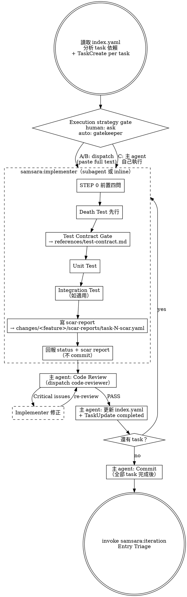

# Implement — Death Test First, Scar Report Always

Execute implementation tasks with death tests before unit tests, and scar reports on every completion.

> 陽面問「功能做完了嗎」，陰面問「做完的東西壞掉時你知道嗎」。

## Prerequisites

Read from the feature's `changes/` directory:
- `1-kickoff.md` — workflow-run execution mode
- `index.yaml` — task list with dependencies
- `overview.md` — derived shared-context projection with source refs
- `tasks/task-N.md` — individual task files

## Process


```dot
digraph implement {
    node [shape=box];
    compound=true;

    start [label="讀取 index.yaml\n分析 task 依賴\n+ TaskCreate per task" shape=doublecircle];
    mode [label="Execution strategy gate\nhuman: ask\nauto: gatekeeper" shape=diamond];

    subgraph cluster_implementer {
        label="samsara:implementer（subagent 或 inline）";
        style=dashed;
        step0 [label="STEP 0 前置四問"];
        death_test [label="Death Test 先行"];
        contract_gate [label="Test Contract Gate\n→ references/test-contract.md"];
        unit_test [label="Unit Test"];
        integration [label="Integration Test\n（如適用）"];
        scar [label="寫 scar-report\n→ changes/<feature>/scar-reports/task-N-scar.yaml"];
        report [label="回報 status + scar report\n（不 commit）"];
    }

    review [label="主 agent: Code Review\n（dispatch code-reviewer）"];
    fix [label="Implementer 修正" style=dashed];
    update [label="主 agent: 更新 index.yaml\n+ TaskUpdate completed"];
    more [label="還有 task？" shape=diamond];
    commit [label="主 agent: Commit\n（全部 task 完成後）"];
    entry [label="invoke samsara:iteration\nEntry Triage" shape=doublecircle];

    start -> mode;
    mode -> step0 [label="A/B: dispatch\n(paste full text)" lhead=cluster_implementer];
    mode -> step0 [label="C: 主 agent\n自己執行" lhead=cluster_implementer];

    step0 -> death_test;
    death_test -> contract_gate;
    contract_gate -> unit_test;
    unit_test -> integration;
    integration -> scar;
    scar -> report;

    report -> review;
    review -> update [label="PASS"];
    review -> fix [label="Critical issues"];
    fix -> review [label="re-review"];
    update -> more;
    more -> step0 [label="yes" lhead=cluster_implementer];
    more -> commit [label="no"];
    commit -> entry;
}
```

## Progress Tracking

On entry, after reading `index.yaml`, create a TaskCreate item for each task to provide real-time UI progress.

```
Read index.yaml
  → For each task: TaskCreate({ title: "Task N: {title}", status: "open" })

After each task's review passes:
  → Update index.yaml (status, scar_count)
  → TaskUpdate({ status: "completed" }) for the corresponding task
```

index.yaml 是唯一真實狀態（source of truth）；TaskCreate/TaskUpdate 是盡力而為的 UI 投影，投影未更新不構成流程錯誤，但 index.yaml 未更新是。

## Execution Strategy Selection

On entry, analyze `index.yaml` for task dependencies, create TaskCreate items
for each task, then use this execution strategy prompt:

> 「Plan 中有 N 個 tasks。
>
> 依賴分析：
> - task-1, task-2: 無依賴，可平行
> - task-3: 依賴 task-1 + task-2，必須 sequential
>
> 執行模式：
> (A) Subagent parallel — 無依賴的 tasks 平行分派，有依賴的 sequential
> (B) Subagent sequential — 每個 task 一個 fresh subagent，依序執行
> (C) Inline sequential — 主 agent 自己依序執行
>
> 選哪個？」

- If `Execution mode: human-in-the-loop`, ask the user this question and follow
  the selected strategy.
- If `Execution mode: auto`, do not ask the user. Use the Auto Mode Gate below
  to dispatch `samsara:auto-gatekeeper` with gate ID
  `implementation.strategy`, wait for its validated decision, and follow the
  recorded execution strategy.

Mode A runs one safe wave at a time. A task is **DAG-ready** only after every
`depends_on` task is complete. Tasks in the same wave must have pairwise-disjoint
declared write scopes from their `Files` sections, must not touch a shared
mutation surface (lockfile, migration registry, generated index, global
manifest, or equivalent), and must not have tests or implementation that rely
on another unfinished task in the wave. If any condition cannot be proven,
serialize those tasks.

### Subagent Context

Use `subagent_type: "samsara:implementer"` — the agent definition (`agents/implementer.md`) provides samsara constraints (STEP 0, 禁止行為, 強制行為, death test ordering, scar report format). You do NOT need to inject these into the prompt.

The prompt provides per-task context. Follow the template in `./dispatch-template.md`:
- `task-N.md` — **paste full text**, never tell subagent to read the file
- `overview.md` — **copy the complete compact Overview**; preserve all
  projections and source refs
- **Global thinking channel (L1/L2)** — COPY the complete compact Overview as
  L1, identify the task's `seam` without dropping other Real Seams, and copy
  `affects`/`anchors` from `index.yaml` into L2.
  - Copy, never compose: a dispatcher improvising "what's relevant" is the
    hand-curation blind spot the channel replaces.
  - Plans without these fields get an explicit `global_channel: absent` (see
    `./dispatch-template.md` Global Thinking Channel for the three states).
- Related death cases and prior scar reports (if task has dependencies)

### Subagent Review (modes A and B)

After each subagent completes (status DONE or DONE_WITH_CONCERNS):

1. **Parallel code review** — dispatch BOTH reviewers in the **same message** to enable parallel execution:
   - `samsara:code-reviewer` (yin) — spec compliance, deletion analysis, architectural placement (against placement/ownership authority resolved from the task's planning/design refs), naming honesty, silent rot paths, correctness
   - `samsara:code-quality-reviewer` (quality) — structural truth-telling: S/O/L/I/D + Cohesion/Coupling/DRY/Pattern

   See `./dispatch-template.md` for both dispatch templates.

2. **Aggregation rule** — main agent MUST receive BOTH review outputs before proceeding:
   - Both pass → proceed to index.yaml update
   - Either reviewer reports Critical issues → implementer fixes → re-review (dispatch both again)
   - **Arbitration path (reviewer block ≠ code gate):** a reviewer blocking on
     a Critical *structural judgment* is adversarial review, not a mechanical
     gate — it must stay arguable:
     1. The implementer disputes the Critical → it must refute **with
        evidence** (forced_by refs, live code, plan citations).
     2. The dispute goes to the arbiter: the **user** in human mode,
        **`samsara:auto-gatekeeper`** in auto mode. Use
        `implementation.review-arbitration.<task>.<round>` and wait for the
        Gatekeeper's validated decision.
     3. Neither side auto-wins: the reviewer cannot force the fix, the
        implementer cannot self-exempt. A block with a third-party arbitration
        path is arguable (healthy); a deterministic block with no arbiter is a
        code gate — the thing judgment must never get.
   - Either reviewer reports `UNKNOWN` → **blocking review failure**; fix the missing/unreadable reference or unsupported domain condition, then re-review (dispatch both again)
   - Only one review output received → **FAIL with "missing reviewer" error** — do NOT assume absent reviewer = PASS. Re-dispatch the missing reviewer before proceeding.

3. Review passes (both) → main agent updates `index.yaml` (status, scar_count, unresolved_assumptions).

During initial task execution, do not proceed to the next task with open
Critical issues and do not commit until all tasks complete. Iteration fix
re-entry follows the per-fix commit contract below.

## Iteration Fix Re-entry

When `samsara:iteration` invokes this skill with an iteration work order,
Implement retains its normal code/test/review authority; Iteration retains item
selection and lifecycle authority.

Require the work order fields defined by `skills/iteration/flow.md` Step 3:
`scar_ref`, affected task IDs, the complete compact Overview, affected PT/PL/AC
refs, seam/affects/anchors, PT-EVAL evidence when applicable, expected behavior,
and round state. Missing fields return `NEEDS_CONTEXT`; do not reconstruct them.

Treat one scar ref as one isolated work unit:

1. Use the Iteration Fix Variant in `dispatch-template.md`.
2. Run the normal death-test, Test Contract, implementation, dual-review,
   review-record, and arbitration paths. Reviewers receive the same authority
   refs as the implementer.
3. Return concrete evidence refs after both reviewers pass and before commit.
4. Let Iteration update only the original item's `status` and `iteration` map.
5. Run the scar validator. The main agent commits code, tests, scar state, and
   checkpoint together; the commit message cites `scar_ref`.

Implement may append newly discovered wounds to the affected task scar with a
new file-scoped ID, `status: open`, and `iteration: null`. It never rewrites an
existing wound's ID or original fields.

After the fix commit, return to the active Iteration round. Do not invoke a new
Iteration Entry Triage from this re-entry path.

## Per-Task Execution Order

This order is mandatory. Death test before unit test. Scar report before self-iteration before report.

### Implementer（subagent 或 inline）

1. STEP 0 — answer the four prerequisite questions
2. Write death tests — test silent failure paths first
3. Run death tests — verify they fail (red)
4. **Test Contract Gate (before unit tests)** — for each unit-test assertion,
   run the contract gate from `references/test-contract.md`. Every unit test must
   assert a behavioral contract, not implementation details. This gate runs BEFORE
   unit tests are written — do not skip to writing unit tests. See
   `references/test-contract.md` for the contract sources and the both-poles rules
   (over-fit and silent-green); it is the single source of truth — do not restate
   the source list here.
5. Write unit tests — each bound to a named contract per the gate
6. Run unit tests — verify they fail (red)
7. Implement minimal code to pass all tests
8. Run all tests — verify they pass (green)
9. Write scar report → `changes/<feature>/scar-reports/task-N-scar.yaml` (read `templates/scar-schema.yaml` for the exact format; `<feature>` = the feature directory name from `changes/`)
10. Self-iteration (Level 1) — review scar items, fix task-scope actionable items
11. Update scar report — every new actionable wound gets a stable file-scoped
    `scar_id`, `status: open`, and `iteration: null`. Mark Level 1 fixes in
    place with `status: resolved`, a one-line `resolution`, and
    `iteration: null` (`scar-schema.yaml` `resolved-in-place`). The older
    `resolved_items` and deferred-flag forms stay readable under
    `legacy-invalid` but are retired for new writes.
12. Run all tests — verify no regression from self-iteration fixes
13. Report back (do NOT commit)

### Main agent（review + bookkeeping）

14. **Parallel dispatch both reviewers in the same message** — `samsara:code-reviewer` (yin) and `samsara:code-quality-reviewer` (quality). See `./dispatch-template.md` for both dispatch templates.
    - Both outputs must arrive. A reviewer output that did not arrive is **not** the same as PASS or PASS_WITH_CONCERNS — it is an absent output. If only one review output is received → **FAIL with "missing reviewer" error**. Re-dispatch the missing reviewer (max 2 retries); if it still does not arrive, escalate and do not proceed.
15. If either reviewer reports `UNKNOWN` or Critical issues → implementer fixes the blocking reference/domain issue or review finding → re-review (both reviewers again)
16. Update `index.yaml` — set status, scar_count, unresolved_assumptions + TaskUpdate the corresponding task to `completed`
17. Proceed to next task

### After all tasks complete

18. **Run implement's format validator** — mechanical shape check of every scar report (parse, dual-face completeness, forced_by/seam resolution, systemic_ref dangling, debt consistency):

    ```bash
    uv run python <installed-implement-skill-directory>/scripts/validate_format.py changes/<feature>/ --repo-root <repo-root>
    ```

    Resolve the placeholder from this skill's installed skill directory; do
    not assume the target repository contains Samsara's source tree. Paste its
    output into the transition record — a missing validator output at handoff
    is a **visible missing**, never a silent skip. Findings are format facts:
    fix the scar reports (or return the underlying gap to the implementer) and
    re-run until clean. The validator never judges whether a decision was a
    good bet — that already happened in review.

19. Commit all changes

## Yin-Side Constraints

These are non-negotiable:

- **No optimistic completion:** A task without a scar report has status `completion_unverified`, not `done`
- **Death test ordering:** Death tests must be written and run before unit tests. This order cannot be swapped.
- **Test Contract Gate before unit tests:** Every unit-test assertion must pass the contract gate in `references/test-contract.md` BEFORE the unit test is written. A unit test asserts a behavioral contract, not implementation details. This gate runs before unit tests, never after — a gate run after the test is already on disk cannot stop a tautological test from landing.
- **Review before index update:** `index.yaml` is updated only after code-reviewer passes. No pre-review status changes.
- **UNKNOWN blocks review completion:** Reviewer `UNKNOWN` is not a partial pass. It means a required reference/domain condition could not be verified; do not proceed, update `index.yaml`, or mark review complete until the condition is fixed and both reviewers are re-run.
- **Commit after all tasks (initial task execution only):** Do not commit
  per-task. Commit once after all tasks complete and all reviews pass.
  Iteration Fix Re-entry follows its per-fix commit contract instead.
- **Inline mode (C) loads no agent definition — the main agent owns the
  implementer constraints directly.** In modes A/B `agents/implementer.md` is
  loaded for the subagent; in mode C it is not, but its constraints still
  apply at generation, not only at review. Do not skip them just because no
  subagent was dispatched:
  - Structural honesty (結構誠實): justify every boundary/abstraction by what
    breaks if it is removed; refuse speculative generalization built for a
    single consumer.
  - Read before you write: read the files you touch + their neighbors; copy
    existing patterns instead of inventing.
  - No silent dependency addition: ask whether the standard library or an
    existing dependency already covers it before adding one; record why a new
    one earns its place.

## Red Flags

**Never:**
- Make subagent read task or overview files (paste full text — see `./dispatch-template.md`)
- Use generic `general-purpose` subagent — always use `samsara:implementer`
- Skip yin-side review (dispatch `samsara:code-reviewer`)
- Skip `code-quality-reviewer` dispatch — both reviewers are required; skipping one means the review is incomplete
- Proceed to next task while code-reviewer or code-quality-reviewer has open Critical issues
- Proceed to next task when either reviewer returned `UNKNOWN` because a reference was missing/unreadable or the execution domain was unsupported
- Never dispatch a parallel wave without proving DAG readiness, disjoint
  declared write scopes, independent mutation surfaces, and no reliance on an
  unfinished task in the wave
- Ignore subagent NEEDS_CONTEXT or BLOCKED status — provide context or escalate
- Accept a task as DONE without a scar report
- Skip the Test Contract Gate before writing unit tests — a unit test with no named contract is brittle or tautological by default
- Accept an **over-fit / brittle** unit test that reddens on a behavior-preserving refactor (pins implementation details)
- Accept a **silent-green / tautological** unit test (a vague test that asserts almost nothing and can never go red — it stays green when the behavior actually breaks) — guarding only the over-fit pole re-creates the disease at the silent-green pole
- Let subagent commit — only the main agent commits, after all tasks complete
- Update index.yaml before both code-reviewer and code-quality-reviewer pass
- Assume an absent review output means PASS — missing reviewer output is always a FAIL
- Add a dependency without recording in the scar why the standard library or an existing dependency cannot do it — an unjustified dependency is deletable by default
- Write death tests before reading the files you are about to touch — a death test built on assumed (not read) conventions pins the wrong contract
- Compose the L1/L2 sections at dispatch time instead of copying them from planning's products (Overview projections with source refs, index.yaml `seam`/`affects`/`anchors`) — improvised projection re-creates the curation blind spot; a plan without the fields gets an explicit `global_channel: absent`, never a hand-written substitute
- Commit without running implement's format validator on the scar reports, or without pasting its output — a missing validator output is a visible missing at handoff, and committing over it converts it back into a silent skip
- Overrule a disputed Critical structural judgment yourself (either direction) — the arbitration path runs through the user (human mode) or `samsara:auto-gatekeeper` (auto mode), never reviewer-auto-wins or implementer self-exemption

## Support Files

- `./dispatch-template.md` — prompt template for implementer and reviewer dispatch
- `./scar-report.md` — scar report format reference
- `references/test-contract.md` — the canonical Test Contract Gate protocol (over-fit and silent-green poles, snapshot/spy/minimum-contract patterns); the Test Contract Gate points here rather than duplicating the catalog

## Transition

After all tasks pass review, the final Implement validator is clean, and the
single feature commit exists, invoke `samsara:iteration` **Entry Triage**.
Implement hands off the complete scar set and does not compute entry criteria,
compare scar wording, or apply a `signal_lost` threshold. Iteration owns the
cheap triage-only decision and whether fix rounds are necessary.

## Auto Mode Gate

Canonical protocol: `references/auto-mode.md` Stage Gate Protocol. The
Gatekeeper is the sole decision-log writer; Implement owns code, tests, review,
and implementation evidence.

- `workflow_prompt` sources: the implementation strategy selection —
  `(A) Subagent parallel / (B) Subagent sequential / (C) Inline sequential` —
  and disputed Critical review arbitration.
- Gate IDs: `implementation.strategy` and
  `implementation.review-arbitration.<task>.<round>`.
- Decision points this gate covers: strategy selection and arbitration.
- `proceed` applies the chosen strategy or arbitration ruling; `revise` revises
  implementation evidence then re-runs the relevant gate. `accept_gap` is
  allowed only for arbitration and keeps the accepted concern visible in the
  scar/review record; strategy selection allows only proceed/revise/reject.
