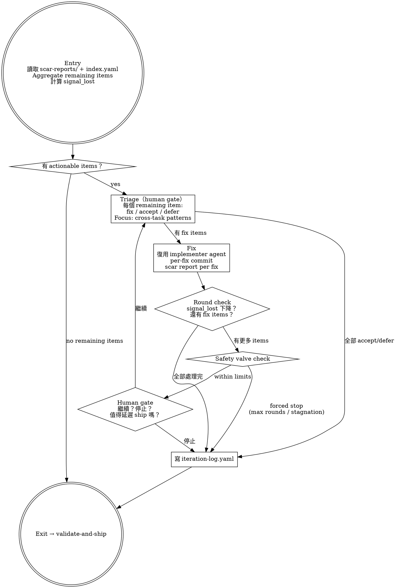

# Iteration — Feature-Level Scar Resolution

Aggregate remaining scar items from all tasks, triage cross-task patterns, fix system-level rot. This is Level 2 iteration — Level 1 (task-scope self-iteration) already happened inside each implementer.

> Level 1 問「這個 function 自己壞掉時知道嗎」。Level 2 問「這些 functions 組在一起時，哪裡在假裝健康」。

## Prerequisites

Read from the feature's `changes/` directory:
- `index.yaml` — task list with scar_count and unresolved_assumptions
- `scar-reports/task-N-scar.yaml` — all scar reports (post Level 1 self-iteration)

## Process



## Step 1: Aggregate Remaining Scars

Read all `scar-reports/task-N-scar.yaml` files. Collect remaining items:

1. Items with `deferred_to_feature_iteration: true` — explicitly deferred by Level 1
2. Items without `resolved_items` coverage — not addressed by Level 1
3. Items in non-conforming scar reports — **list as parse failures, do not skip silently**

Calculate initial `signal_lost`:
```
signal_lost = count(assumptions_made where verified == false)
            + count(silent_failure_conditions)
```

Only count items from the remaining set (exclude Level 1 resolved items).

**Parse failure handling:** If a scar report does not conform to `scar-schema.yaml` (e.g., markdown format, old plain-string format), list the file explicitly:

> 「以下 scar reports 無法解析：[files]。這些 files 的 items 未被計入 signal_lost。」

## Step 2: Triage (Human Gate)

Present all remaining items to the user, grouped by type:

```
Feature-level scar items (K items, signal_lost = N):

Cross-task patterns:
  - [items that appear in multiple task scars]

Deferred from Level 1:
  - [items explicitly deferred by implementers]

Unaddressed:
  - [items not covered by Level 1 resolved_items]

每個 item 需要分類：
  (F) Fix — 有 actionable code change
  (A) Accept — 已知風險，接受（必須附 expiry date + rationale）
  (D) Defer — 不在本次處理
```

User triages each item. AI can suggest classifications but user decides.

## Step 3: Fix (Per-Fix Commit)

For each item triaged as `fix`, ordered by signal_lost contribution (highest first):

1. Dispatch `samsara:implementer` with fix context (see Fix Dispatch Guidance below)
2. Implementer writes death test for the specific scar item → implements fix → scar report
3. Main agent: code review (dispatch `samsara:code-reviewer`)
4. If review passes → **per-fix commit** (commit message references original scar item)
5. Recalculate signal_lost after each fix

**Blocked fix fallback:** If implementer reports BLOCKED or NEEDS_CONTEXT for a fix item:
- Do NOT retry the same item in the next round
- Reclassify the item from `fix` to `defer` with reason: `"implementer blocked: <reason>"`
- Log the reclassification in iteration-log
- Continue to the next fix item

### Fix Dispatch Guidance

Fix dispatch differs from initial implementation dispatch. The dispatch-template pattern applies but the context is different:

| | Initial Impl Dispatch | Fix Dispatch |
|---|---|---|
| **Task context** | Paste full `task-N.md` | Paste the **scar item description** + the **file(s) involved** |
| **Architecture context** | Curate from `overview.md` | Curate from `overview.md` + include **relevant scar reports from other tasks** if the fix involves cross-task code |
| **Goal framing** | "Implement Task N: [title]" | "Fix scar item: [description]. The current code [does X], but it should [do Y] to address [silent failure / unverified assumption / shortcut]" |
| **Scope** | Defined by task file | Defined by the scar item — keep the fix minimal and focused |
| **Scar schema** | Paste `scar-schema.yaml` | Same — paste `scar-schema.yaml` (the fix also produces a scar report) |

**Key difference:** Fix dispatch must include enough surrounding code context for the implementer to understand the scar item. Read the relevant file(s) and paste the affected sections into the prompt.

## Step 4: Round Check + Safety Valve

After processing all fix items in this round:

**Safety valve checks:**
- **Max rounds:** 3 rounds. If reached → forced stop with remaining items listed.
- **Signal lost stagnation:** If signal_lost did not decrease for 2 consecutive rounds → emit warning:
  > 「signal_lost 連續 2 輪未下降（N → N'）。Iteration 可能在原地轉圈。建議停止。」
- **Net rot increase:** If this round's fixes produced more new scar items than they resolved → emit warning:
  > 「本輪 fix 產出 M 個新 scar items，修復了 K 個。淨 rot 增加。建議停止。」

**Human gate (if within limits):**
> 「Round R 完成。signal_lost: N → N'。修復了 K 個 items，剩餘 J 個。
>
> (A) 繼續下一輪
> (B) 停止，進入 Validation」

## Step 5: Write Iteration Log

Write `iteration-log.yaml` to the feature's `changes/` directory. Use template `templates/iteration-log.yaml`.

## Yin-Side Constraints

- **No silent skip:** Non-conforming scar reports must be explicitly listed, never silently excluded
- **Per-fix commit:** Each fix is an independent commit. No batching fixes into a single commit.
- **Triage is human judgment:** AI suggests, human decides. Do not auto-triage.
- **Safety valve is advisory:** Forced stop emits a warning and suggestion, but the human gate makes the final decision.
- **Accept requires expiry:** Every `accept` classification must include an `expiry_date` — risk acceptance is not permanent.

## Red Flags

**Never:**
- Skip triage and auto-fix all items (human gate is mandatory)
- Batch multiple fixes into one commit (per-fix commit is mandatory)
- Silently exclude scar reports that don't parse (list parse failures explicitly)
- Continue after safety valve triggers without human confirmation
- Accept items without expiry dates

**Watch for:**
- Accept ratio > 80% with zero fixes → cargo-cult triage warning
- All deferred items from Level 1 getting accepted at Level 2 without scrutiny
- Fixes that touch the same files as other pending fixes (potential conflicts)

## Support Files

- `./templates/iteration-log.yaml` — iteration log format

## Transition

Iteration complete (by human choice, all items processed, or safety valve). Then:

> 「Iteration 完成。R 輪執行，signal_lost: N₀ → N_final。K items fixed, J items accepted, D items deferred。進入 Validation。」

Invoke `samsara:validate-and-ship` skill.
