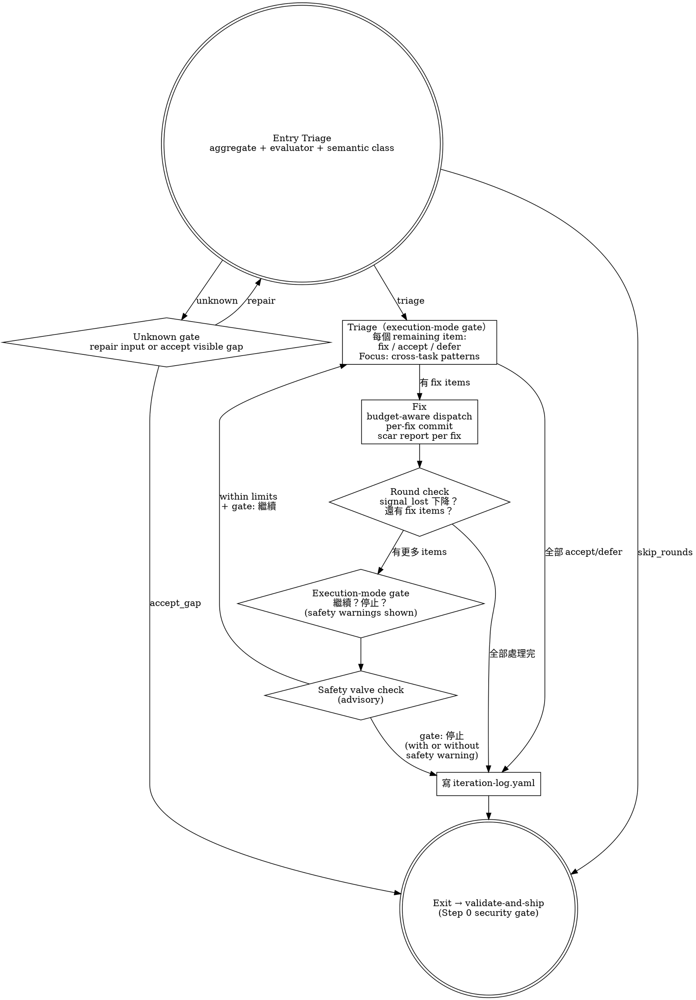

# Iteration — Feature-Level Scar Resolution

Aggregate remaining scar items from all tasks, triage cross-task patterns, fix system-level rot. This is Level 2 iteration — Level 1 (task-scope self-iteration) already happened inside each implementer.

> Level 1 問「這個 function 自己壞掉時知道嗎」。Level 2 問「這些 functions 組在一起時，哪裡在假裝健康」。

## Prerequisites

Read from the feature's `changes/` directory:
- `index.yaml` — task list with scar_count and unresolved_assumptions
- `pre-thinking.md` — Evaluation Contract with Primary evaluator and Feedback loop
- `scar-reports/task-N-scar.yaml` — all scar reports (post Level 1 self-iteration)

## Entry Triage

Iteration is the **sole owner** of entry triage. Every completed implementation
enters this cheap, triage-only pass; entering it does not start fix rounds.

1. Run Step 1 aggregation and parse/reference checks.
2. Run or inspect the recorded Primary evaluator using `PT-EVAL`.
3. Classify remaining items with full feature context:
   - **task-local** — one task owns the repair and no shared boundary changes;
   - **feature-level** — explicitly deferred here or requires shared authority;
   - **cross-task/system-level** — the same underlying cause crosses tasks,
     touches a shared boundary, or one task's scar affects another. Equivalent
     rot remains cross-task when wording differs;
   - **evaluator failure** — the canonical pass signal does not hold.

`signal_lost` describes remaining risk, helps prioritize fixes, compares rounds,
and detects stagnation. It never decides whether an item deserves repair.

Choose one result:

- **skip_rounds** — every scar/reference parses, the Primary evaluator passes,
  and there are no actionable remaining items. Resolved items do not remain;
  an accepted item is non-actionable only when a durable acceptance already
  names both `re_review_signal` and `owner`. Record the result, then invoke
  `samsara:validate-and-ship` without starting fix rounds.
- **triage** — one or more items need classification or repair, or the Primary
  evaluator fails. Continue to Step 2. If triage produces no fix items, write
  the log and proceed to validation; only fix items continue to Step 3 and
  start rounds.
- **unknown** — a scar/reference cannot be parsed or the evaluator cannot be
  performed. List the missing evidence and never skip by default. If
  `Execution mode: human-in-the-loop`, ask the user to repair the input or
  explicitly accept the visible gap. If `Execution mode: auto`, do not ask the user;
  dispatch `samsara:auto-gatekeeper` and record its decision.

Before any branch, write `index.yaml` `iteration_entry` with `result`,
`signal_lost`, `evaluator`, `reason`, and `reversible: true`. This durable,
reversible record is required even for `skip_rounds` and `unknown`; conversation
output alone is not a record.

## Process


```dot
digraph iteration {
    node [shape=box];

    entry [label="Entry Triage\naggregate + evaluator + semantic class" shape=doublecircle];
    unknown [label="Unknown gate\nrepair input or accept visible gap" shape=diamond];
    triage [label="Triage（execution-mode gate）\n每個 remaining item:\nfix / accept / defer\nFocus: cross-task patterns"];
    fix [label="Fix\nbudget-aware dispatch\nper-fix commit\nscar report per fix"];
    round_check [label="Round check\nsignal_lost 下降？\n還有 fix items？" shape=diamond];
    safety [label="Safety valve check\n(advisory)" shape=diamond];
    gate [label="Execution-mode gate\n繼續？停止？\n(safety warnings shown)" shape=diamond];
    log [label="寫 iteration-log.yaml"];
    exit [label="Exit → validate-and-ship\n(Step 0 security gate)" shape=doublecircle];

    entry -> triage [label="triage"];
    entry -> exit [label="skip_rounds"];
    entry -> unknown [label="unknown"];
    unknown -> entry [label="repair"];
    unknown -> exit [label="accept_gap"];
    triage -> fix [label="有 fix items"];
    triage -> log [label="全部 accept/defer"];
    fix -> round_check;
    round_check -> gate [label="有更多 items"];
    round_check -> log [label="全部處理完"];
    gate -> safety;
    safety -> triage [label="within limits\n+ gate: 繼續"];
    safety -> log [label="gate: 停止\n(with or without\nsafety warning)"];
    log -> exit;
}
```

## Step 1: Aggregate Remaining Scars

Read `pre-thinking.md` first and extract:
- **Primary evaluator** — the canonical feedback source
- **Pass signal / Fail signal**
- **Feedback loop** — the first correction path when the evaluator fails

If implementation appears complete but the Primary evaluator fails, add an
`evaluator failure` item to the remaining set. Do not disguise it as a
cross-task pattern or invent a new success standard during iteration.

Read all `scar-reports/task-N-scar.yaml` files. Collect remaining items:

1. Items with `deferred_to_feature_iteration: true` — explicitly deferred by Level 1
2. Items without `resolved_items` coverage AND without an in-place `status: resolved` marker — not addressed by Level 1. Both forms count as resolved: the newer in-place `status: resolved` + `resolution` form (`scar-schema.yaml` resolved-in-place), and the older separate `resolved_items` list, which remains valid per the legacy-invalid backward-compat extension.
3. Items in non-conforming scar reports — **list as parse failures, do not skip silently**

**systemic_ref resolution:** For each item written as `systemic_ref: <id>` (see `scar-schema.yaml` systemic-ref), resolve `<id>` against `.samsara/systemic-scars.yaml`:
- Registry exists and `<id>` is present → treat the item using the registry entry's `description` for triage context.
- Registry exists and `<id>` is NOT present (dangling reference) → **list as a parse failure**, naming the scar report file and the dangling id explicitly. Never silently skip a dangling systemic_ref.
- Registry file is missing or unreadable → every `systemic_ref` item is marked `unknown` and **passes through the gate** — it is still counted in `signal_lost` like any other item, it is not dropped, and it is not itself treated as a parse failure. A missing registry file must never cause systemic_ref items to silently disappear from aggregation.

**Scar format generations (read-side canonical):** items are identified by field shape alone — no `schema_version` field is used. A future generation MUST keep a shape-unambiguous signature vs Gen 1-3 — shape inference is the only version signal:
- **Gen 1 — plain string:** bare strings instead of objects. Plain string format backward compatibility — do not reject or silently skip plain string format items (the exact DC3 failure mode this guard prevents). Missing deferred flag = false; missing resolved_items = no self-iteration.
- **Gen 2 — description dict:** the `{description, deferred_to_feature_iteration}` object form; resolution tracking (`resolved_items` list vs in-place `status: resolved`) is already described under item 2 above.
- **Gen 3 — what/bites_when slots:** fixed-slot form; read identically to Gen 2 for triage.

All three generations count toward `signal_lost` identically — `deferred_to_feature_iteration`, `status: resolved`/`resolved_items`, and `systemic_ref` semantics read the same regardless of generation. The legacy-generation reading guarantees continue to apply unchanged to every pre-existing scar report on disk; the newer forms are additive, not a replacement — an aggregator must accept old and new forms side by side in the same feature.

Calculate initial `signal_lost`:
```
signal_lost = count(known_shortcuts)
            + count(silent_failure_conditions)
            + count(assumptions_made where verified == false)
```

All three scar categories contribute. Only count items from the remaining set (exclude Level 1 resolved items — both the `resolved_items`-list form and the in-place `status: resolved` form).

**Parse failure handling:** two conditions are parse failures — list each
file (and, for dangling refs, the id) explicitly:
- The scar report does not conform to `scar-schema.yaml` (e.g. markdown format
  instead of YAML). This is NOT the old plain-string
  `known_shortcuts`/`silent_failure_conditions` format —
  the legacy-invalid backward-compat rule requires counting the old plain-string format normally, never treating it as a parse failure.
- The report contains a dangling `systemic_ref`.

> 「以下 scar reports 無法解析：[files]。這些 files 的 items 未被計入 signal_lost。」
> 「以下 systemic_ref 懸空：[file: id, ...]。這些 items 未被計入 signal_lost，比照非 conforming items 處理。」

## Step 2: Triage (Human Gate)

Use the same triage prompt for both execution modes:

```
Feature-level scar items (K items, signal_lost = N):

Cross-task patterns:
  - [items that appear in multiple task scars]

Deferred from Level 1:
  - [items explicitly deferred by implementers]

Unaddressed:
  - [items not covered by Level 1 resolved_items]

每個 item 需要分類：
  (F) Fix — 有 actionable code change
  (A) Accept — 已知風險，接受（必須附 re-review signal：什麼可觀測訊號出現時重審 + 誰負責（owner）+ rationale）
  (D) Defer — 不在本次處理
```

- If `Execution mode: human-in-the-loop`, present all remaining items to the
  user, grouped by type. The user triages each item; AI can suggest
  classifications but the user decides.
- If `Execution mode: auto`, do not ask the user. Use the Auto Mode Gate below
  to dispatch `samsara:auto-gatekeeper` for triage, append the decision to
  `auto-decisions.md`, and follow the recorded fix / accept / defer
  classification for each item.

When a remaining item maps to the Evaluation Contract, prefer the documented Feedback loop as the first suggested fix path.

## Step 3: Fix (Per-Fix Commit)

For each item triaged as `fix`, ordered by signal_lost contribution (highest first):

1. Build `iteration_budget_context` for this fix (see Iteration Budget Context below)
2. Dispatch `samsara:implementer` with fix context + `iteration_budget_context` (see Fix Dispatch Guidance below)
3. Implementer writes death test for the specific scar item → implements fix → scar report
4. Main agent: parallel dispatch `samsara:code-reviewer` AND `samsara:code-quality-reviewer` with the same `iteration_budget_context` (single message, two Agent calls, no shared state). The yin dispatch MUST resolve the affected task's `planning_refs` and `decision_refs` from `index.yaml`, then paste applicable placement/ownership entries from `2-plan.md` and `pre-thinking.md`. Never source decision authority from the derived Overview; missing refs are a finding.
5. Await both review outputs — **aggregation rule applies** (see below)
6. If both reviewers PASS → **per-fix commit** (commit message references original scar item)
7. Recalculate signal_lost after each fix

### Iteration Budget Context

Every implementer and reviewer dispatch MUST include an `iteration_budget_context` built from current runtime state. Do not copy placeholder values; compute every field before dispatch.

| Field | Purpose |
|---|---|
| `round` | Current iteration round number |
| `max_rounds` | Safety valve round limit |
| `remaining_rounds` | Rounds left before the max-round safety valve |
| `signal_lost_before` | Current signal_lost before this fix |
| `stagnation_count` | Consecutive rounds where signal_lost did not decrease |
| `net_rot_previous_round` | New scar items minus resolved scar items in the previous round |
| `reviewer_retry_budget_remaining` | Remaining re-dispatch attempts for missing reviewer output |
| `expected_signal_reduction` | Scar categories this fix is expected to reduce |
| `strategy_hint` | One of `explore`, `converge`, `minimal_fix` |

Dispatch envelope shape:
```yaml
iteration_budget_context:
  round: "<current round number>"
  max_rounds: "<configured max rounds>"
  remaining_rounds: "<max_rounds - round>"
  signal_lost_before: "<current signal_lost>"
  stagnation_count: "<current stagnation count>"
  net_rot_previous_round: "<previous round net rot, or 0 for round 1>"
  reviewer_retry_budget_remaining: "<remaining reviewer re-dispatch attempts>"
  expected_signal_reduction: ["<known_shortcuts | silent_failure_conditions | unverified_assumptions>"]
  strategy_hint: "<explore | converge | minimal_fix>"
```

**Strategy hints:**
- `explore` — early round, budget available: identify the smallest fix that proves the scar is real
- `converge` — signal_lost is flat or remaining_rounds is 1: prioritize death test + focused fix, avoid broad cleanup
- `minimal_fix` — safety valve is near/active or retry budget is low: only address the named scar item; report residual risk instead of expanding scope

Sub-agents must treat remaining budget as a strategy signal. Before spending another review retry or validation run, state what uncertainty it resolves.

### Review Aggregation Rule (Per-Fix)

Both reviewers must PASS before the per-fix commit is allowed. Either reviewer returning FAIL blocks the commit.

| Outcome | Action |
|---|---|
| Both PASS | Per-fix commit allowed |
| Either FAIL | Block per-fix commit — implementer must fix and re-review |
| Missing reviewer (only one output received) | **FAIL with "missing reviewer" error** — block per-fix commit, log the missing reviewer by name, re-dispatch (max 2 retries); if still missing after retries, escalate and do not proceed |

**Missing reviewer handling:** absent reviewer output is never PASS. This is a
structural block, not an advisory warning — follow the table row above.

**Re-review rule:** After implementer fixes issues from FAIL, dispatch both reviewers in parallel again. Do not dispatch only the reviewer that failed — both must re-review after any code change.

**Budget-aware review:** Reviewer dispatch MUST include current round and retry budget. When retry budget is low, reviewers still block correctness/security/privacy regressions, but should separate blocking issues from non-blocking cleanup so the main agent can make a bounded decision.

**Blocked fix handling:** If implementer reports BLOCKED or NEEDS_CONTEXT for a fix item:
- Do NOT retry the same item automatically in the next round
- Use the blocked-fix prompt:
  > 「Fix item "[description]" 被 implementer 回報 BLOCKED: [reason]。(A) 提供更多 context 重試 (B) 重新分類為 defer」
- If `Execution mode: human-in-the-loop`, present the prompt to the user. The
  user decides; do not auto-reclassify without human judgment.
- If `Execution mode: auto`, do not ask the user. Use the Auto Mode Gate below
  to dispatch `samsara:auto-gatekeeper`, append the decision to
  `auto-decisions.md`, and follow the recorded retry or defer decision.
- Log the outcome in iteration-log

### Fix Dispatch Guidance

Fix dispatch differs from initial implementation dispatch. The dispatch-template pattern applies but the context is different:

| | Initial Impl Dispatch | Fix Dispatch |
|---|---|---|
| **Task context** | Paste full `task-N.md` | Paste the **scar item description** + the **file(s) involved** |
| **Architecture context** | Copy cited projections from `overview.md` | Copy cited projections from `overview.md` + include **relevant scar reports from other tasks** if the fix involves cross-task code |
| **Goal framing** | "Implement Task N: [title]" | "Fix scar item: [description]. The current code [does X], but it should [do Y] to address [silent failure / unverified assumption / shortcut]" |
| **Scope** | Defined by task file | Defined by the scar item — keep the fix minimal and focused |
| **Scar schema** | Paste `scar-schema.yaml` | Same — paste `scar-schema.yaml` (the fix also produces a scar report) |
| **Budget context** | Task-level plan constraints | Paste computed `iteration_budget_context` and require `budget_spent`, `evidence_gained`, `residual_risk` in the result |

**Key difference:** Fix dispatch must include enough surrounding code context for the implementer to understand the scar item. Read the relevant file(s) and paste the affected sections into the prompt.

**Fix result budget report:** Implementer output must include:
```yaml
budget_spent:
  validation_runs: "<count>"
  reviewer_retries_consumed: "<count>"
evidence_gained:
  - "<death test, review finding, or concrete observation>"
residual_risk:
  - "<known remaining risk, or []>"
```

## Step 4: Round Check + Safety Valve

After processing all fix items in this round:

**Safety valve checks:**
- **Max rounds:** 3 rounds. If reached → forced stop with remaining items listed.
- **Signal lost stagnation:** If signal_lost did not decrease for 2 consecutive rounds → emit warning:
  > 「signal_lost 連續 2 輪未下降（N → N'）。Iteration 可能在原地轉圈。建議停止。」
- **Net rot increase:** If this round's fixes produced more new scar items than they resolved → emit warning:
  > 「本輪 fix 產出 M 個新 scar items，修復了 K 個。淨 rot 增加。建議停止。」

**Round continuation gate (if within limits):**
> 「Round R 完成。signal_lost: N → N'。修復了 K 個 items，剩餘 J 個。
>
> (A) 繼續下一輪
> (B) 停止，進入 Validation」

- If `Execution mode: human-in-the-loop`, ask the user this question and follow
  the selected next step.
- If `Execution mode: auto`, do not ask the user. Use the Auto Mode Gate below
  to dispatch `samsara:auto-gatekeeper`, append the decision to
  `auto-decisions.md`, and follow the recorded continue or stop decision.

## Step 5: Write Iteration Log

Write `iteration-log.yaml` to the feature's `changes/` directory. Use template `templates/iteration-log.yaml`.

## Yin-Side Constraints

- **No silent skip:** Non-conforming scar reports must be explicitly listed, never silently excluded
- **Per-fix commit:** Each fix is an independent commit. No batching fixes into a single commit.
- **Triage is a recorded gate decision:** human mode asks the user; auto mode
  records the gatekeeper decision before classification is applied.
- **Safety valve is advisory:** Forced stop emits a warning and suggestion, but
  the active execution-mode gate makes the final decision.
- **Accept requires a re-review signal, not an expiry date:** every `accept`
  must include a `re_review_signal` (the observable condition that triggers
  re-review) and an `owner` (who is responsible for noticing it). No mechanism
  in this repo has ever read or acted on an `expiry_date` — a time-driven
  re-review promise is an alarm clock that never rings.
- **Legacy `expiry_date` is tolerated on read:** Historical `iteration-log.yaml` entries or scar reports carrying the old `expiry_date` field are read without error and without requiring backfill to `re_review_signal`/`owner` — this is a read-time compatibility guarantee only; new `accept` entries must use `re_review_signal` + `owner`.

## Red Flags

**Never:**
- Skip triage and auto-fix all items (an execution-mode gate decision is mandatory)
- Batch multiple fixes into one commit (per-fix commit is mandatory)
- Silently exclude scar reports that don't parse (list parse failures explicitly)
- Continue after safety valve triggers without the active execution-mode gate decision
- Accept items without a re-review signal and an owner
- Skip `code-quality-reviewer` dispatch — both reviewers are required per fix; skipping one means the review is incomplete
- Assume an absent review output means PASS — missing reviewer output is always a FAIL

**Watch for:**
- Accept ratio > 80% with zero fixes → cargo-cult triage warning
- All deferred items from Level 1 getting accepted at Level 2 without scrutiny
- Fixes that touch the same files as other pending fixes (potential conflicts)

## Support Files

- `./templates/iteration-log.yaml` — iteration log format

## Transition

Iteration complete (by human choice, all items processed, or safety valve). Then:

> 「Iteration 完成。R 輪執行，signal_lost: N₀ → N_final。K items fixed, J items accepted, D items deferred。進入 Validate & Ship（Step 0 security gate）。」

Invoke `samsara:validate-and-ship` skill.

## Auto Mode Gate

Canonical protocol: `references/auto-mode.md` Stage Gate Protocol —
dispatch, the append-only decision log, and what `proceed`/`revise`/
`reject`/`accept_gap` mean all live there; this section only names what
Iteration adds.

- `workflow_prompt` source: the iteration completion transition, including
  the current signal_lost, fixed item count, accepted item count, and
  deferred item count.
- Decision points this gate covers — not only the final transition; each
  point appends its own `auto-decisions.md` entry before the iteration flow
  follows the recorded decision:
  - Entry Triage `unknown` when scar/reference parsing or the evaluator is unavailable
  - triage of remaining scar items into fix / accept / defer
  - blocked-fix handling when an implementer reports BLOCKED or NEEDS_CONTEXT
  - round continuation after signal_lost changes
  - safety valve decisions when round limits or stagnation warnings trigger
- Final transition: `proceed` — invoke `samsara:validate-and-ship`; `revise`
  revises iteration output; `accept_gap` validates with the gap visible.
- Entry Triage `unknown`: `revise` repairs and re-runs triage; `proceed` requires
  a resolved re-run; `accept_gap` is the durable route to validation.
