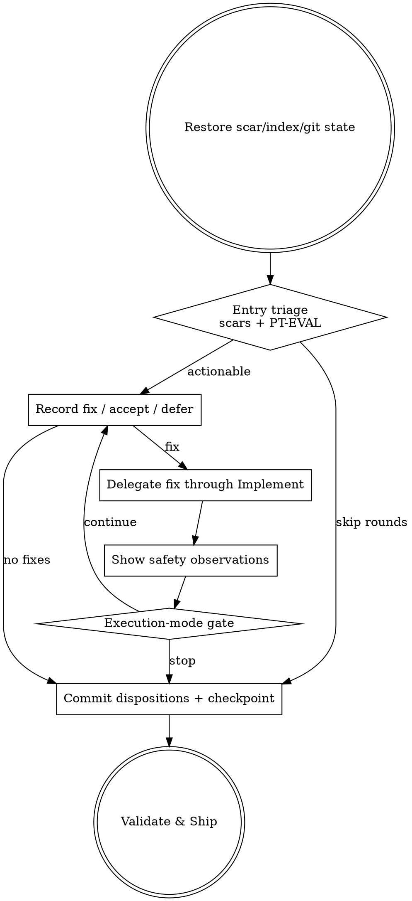

# Iteration — Feature-Level Scar Resolution

Scar reports are the item-level SSOT. Iteration reads them directly, applies feature-level judgment, and records each disposition on the original item. It never creates a second item inventory.

## Authority

- Implement owns initial task wounds, wounds found during fix execution, and code/test/review execution.
- Iteration solely owns Level 2 entry triage and `status`/`iteration` updates.
- Iteration may append evaluator/triage-discovered wounds to the affected task scar.
- `PT-EVAL` is the canonical Primary evaluator and Feedback loop source.
- The `iteration_entry` mapping in `index.yaml` is the compact feature checkpoint.
- `changes/<feature>/review-record.md` supplies reviewer verdict reasoning and arbitration evidence; Iteration consumes it but does not modify it.
- `changes/<feature>/auto-decisions.md` supplies prior auto-mode gate decisions when auto mode was used; Iteration consumes it but does not modify prior entries.
- Git history is the chronological record.
- Validate & Ship reads final scar state without reclassifying it.

Read `flow.md` completely. It is the sole executable Iteration procedure. This graph is a derived overview; `flow.md` wins if they differ.

```dot
digraph iteration {
    node [shape=box];
    start [label="Restore scar/index/git state" shape=doublecircle];
    entry [label="Entry triage\nscars + PT-EVAL" shape=diamond];
    classify [label="Record fix / accept / defer"];
    fix [label="Delegate fix through Implement"];
    safety [label="Show safety observations"];
    gate [label="Execution-mode gate" shape=diamond];
    commit [label="Commit dispositions + checkpoint"];
    ship [label="Validate & Ship" shape=doublecircle];

    start -> entry;
    entry -> commit [label="skip rounds"];
    entry -> classify [label="actionable"];
    classify -> fix [label="fix"];
    classify -> commit [label="no fixes"];
    fix -> safety;
    safety -> gate;
    gate -> classify [label="continue"];
    gate -> commit [label="stop"];
    commit -> ship;
}
```

## Output

- Updated items in `changes/<feature>/scar-reports/`.
- Updated `iteration_entry` checkpoint in `changes/<feature>/index.yaml`.
- Committed fixes and disposition evidence.

Write durable instruction artifacts in English. Ask questions and report results in the user's language.

## Transition

Invoke `samsara:validate-and-ship` only after `flow.md`'s format, commit, and clean-working-tree gate passes.

## Auto Mode Gate

Canonical protocol: `references/auto-mode.md` Stage Gate Protocol.

- `workflow_prompt` sources: entry triage, item disposition, blocked-fix handling, round continuation, and safety valve observations.
- Decision points: repair/accept visible input gaps; fix/accept/defer; retry/defer a blocked fix; continue/stop after the safety valve.
- `proceed` — invoke `samsara:validate-and-ship` only when the committed transition gate is satisfied.
- `revise` repairs evidence or continues the recorded fix path; `reject` stops; `accept_gap` must remain visible on the scar item and in `auto-decisions.md`.
