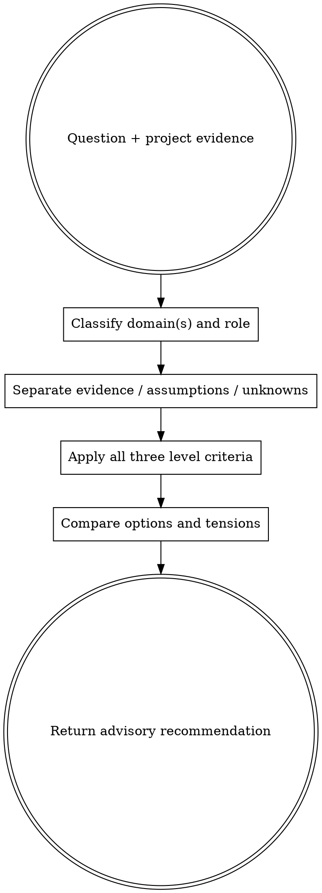

# Multi-Level Engineering Advisory

Analyze one question through Senior, Staff, and Principal engineering
accountabilities. Preserve each level's domain-specific criteria while separating
verified evidence from projection. This skill advises; it does not decide.

## Process

## 🎯 Domain and Role Identified

Select every material domain; name one primary domain and preserve cross-domain
effects.

- **Software Development → Software Engineer:** code, architecture, patterns, APIs, testing, deployment.
- **AI/ML/Deep Learning → AI/ML Research Engineer:** models, training, inference, datasets, embeddings, GPUs, LLMs.
- **Infrastructure/Cloud/DevOps → DevOps/Platform Engineer:** cloud, containers, CI/CD, IaC, monitoring, networking.
- **Data Engineering → Data Engineer / Data Architect:** pipelines, ETL, warehouses, streams, schemas, orchestration.
- **Security → Security Engineer:** authentication, authorization, encryption, vulnerabilities, compliance, threat models.
- **Product/System Design → Systems Architect:** requirements, UX, scale, stakeholders, trade-offs, roadmaps.

## 2. Evidence Discipline

Classify every material claim as `evidence | assumption | unknown`. Cite project
evidence. No evidence means `unknown`; state what would resolve it. Do not invent
an unsupported timeline, number, industry claim, organizational priority, or
future requirement. Apply startup, enterprise, market, and roadmap context only
when supplied or evidenced.

## 3. Level Criteria

Analyze all three levels. Mark an individual criterion `not applicable` or
`unknown` with a reason; do not silently omit it.

### 🔹 Senior Level Perspective

**Focus:** technical excellence and implementation.

- **Technical Analysis:** mechanics, interfaces, data/control flow.
- **Best Practices:** proven patterns applicable to this codebase.
- **Immediate Concerns:** failures and constraints requiring attention now.
- **Risk Assessment:** technical risks, detection, and mitigation.
- **Actionable Steps:** concrete, ordered implementation steps; add estimates
  only when evidence supports them.

### 🔸 Staff Level Perspective

**Focus:** system-wide technical strategy.

- **Systemic View:** boundaries and ecosystem fit.
- **Cross-Team Impact:** ownership, dependencies, and coordination.
- **Technical Strategy:** 3–6 month direction when project evidence supports
  that horizon.
- **Trade-off Analysis:** options, business context, reversibility.
- **Mentorship Angle:** knowledge transfer and capability growth.
- **Technical Debt Consideration:** maintainability and compounding cost.

### 🔷 Principal Level Perspective

**Focus:** organizational strategy and long-range forces.

- **Strategic Vision:** alignment with explicit company or organizational goals.
- **Industry Context:** evidenced market or ecosystem forces only.
- **Organizational Impact:** ownership, team shape, hiring, capabilities.
- **Innovation Opportunities:** evidence-backed differentiation or leverage.
- **Executive Communication:** decision, consequence, and uncertainty framing.
- **Multi-Year Roadmap:** 6–12 month placement only when roadmap evidence exists.
- **Build vs Buy vs Partner:** strategic control and resourcing choices.

## Output

Return domain and role selection; evidence, assumptions, and unknowns; the three
level analyses; comparable options with trade-offs, failure conditions, and
reversibility; then synthesize alignment, tensions, recommended path, and
priorities by impact and urgency.

The result is advisory only. This skill does not choose a gate decision, write
workflow artifacts, or persist state. The caller verifies evidence and owns the
final decision.
