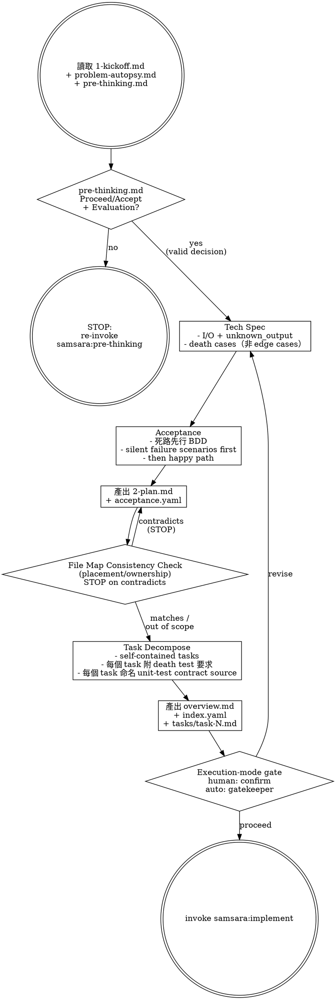

# Planning — Death-First Spec, Task Decomposition

Transform research output into an executable plan. Write the death paths before the happy paths.

> 陽面的 spec 定義「系統應該做什麼」。陰面的 spec 先定義「系統會怎麼死」。

## Prerequisites

Read from the feature's `changes/` directory:
- `1-kickoff.md` — scope, north star, stakeholders
- `problem-autopsy.md` — translation delta, kill conditions
- `pre-thinking.md` — user-LLM design alignment, Evaluation Contract, and commitment

**Guard:** If `pre-thinking.md` is absent, missing Evaluation Contract, missing `## Step C — Commitment`, or has `Decision: Return to Research`, **STOP**. Do not proceed to Step 2: Technical Specification. Re-invoke `samsara:pre-thinking` or `samsara:research` as directed by the unresolved gaps. Proceed only when Step C contains `Decision: Proceed` or `Decision: Accept gap`.

## Process

## Step 2: Technical Specification

### Pre-thinking Commitments Consumed

Before writing the technical plan, copy the following from `pre-thinking.md` into `2-plan.md`:
- **Decision:** `Proceed` or `Accept gap`
- **Accepted gaps:** labels and consequences, or `none`
- **System design constraints:** task-shaping design decisions from Step A/B
- **Primary evaluator:** the single canonical agent-evaluable method
- **Pass signal / Fail signal:** observable criteria
- **Feedback loop:** first action if the Primary evaluator fails

Planning must decompose tasks to satisfy the Primary evaluator. Acceptance criteria and task files can add engineering tests, but they cannot replace or contradict this evaluator.

### I/O with Unknown Output

Every interface must define three output states — not two:
- `success` — operation completed as intended
- `failure` — operation failed with known cause
- `unknown` — outcome cannot be determined

Treating `unknown` as `success` or `failure` is a defect.

### Death Cases (not Edge Cases)

Rename "edge cases" to "death cases." These are not boundary conditions — they are: **conditions under which the feature silently produces a result that looks correct but is wrong.**

For each death case, document:
- The trigger condition
- What the system appears to do (the lie)
- What actually happens (the truth)
- How to detect the lie

## Step 2.5: Acceptance Criteria — Death First

Write acceptance criteria using death-first BDD. See support file `death-first-spec.md` for format.

Order:
1. **Silent failure scenarios** — timeout unknown, partial write, stale cache
2. **Degradation scenarios** — fallback without marking degraded state
3. **Happy path scenarios** — with evidence chain requirements

A test plan with only success cases has `coverage_type: prayer`. Not accepted.

## Step 3: File Map Consistency Check — STOP Gate

Before decomposing tasks, cross-check the File Map paths against the Key Decisions you drafted for `overview.md`. Task files bake in File Map paths, so a contradiction that survives this step propagates into every task (ISSUE-001: four tasks were built in the wrong location before a human caught it).

**Scope: placement/ownership decisions only.** A Key Decision that fixes *where code lives* or *who owns it* (e.g. "X is shared, not samsara-exclusive"; "this is a framework change, not plugin-specific") is in scope. Do NOT force every Key Decision to correspond to a path — a non-placement decision (e.g. "use churn not mtime") is **out of scope** for this check; classify it as such rather than straining it against the paths.

For each placement/ownership Key Decision, classify the File Map against it as exactly one of three states:
- **matches** — every relevant path is consistent with the decision
- **contradicts** — at least one path violates the decision
- **out of scope** — the decision does not constrain any path

If you are unsure whether a Key Decision constrains placement, treat it as **in scope**: a false STOP costs one re-check, but a missed STOP ships the contradiction into every task.

**STOP on `contradicts`:** if any placement/ownership decision is contradicted by the File Map, **do not proceed to task decomposition**. Resolve it first — correct the File Map paths or revise the Key Decision — then re-run this check. A contradiction is a hard block, not an advisory note.

**Anti-bias:** when drafting the File Map, **derive** each path from the Key Decisions, not from the path of least resistance. Do not default to existing infrastructure locations just because they already exist — that default is exactly how a plan drifts away from a placement decision it already made.

## Step 4: Task Decomposition

Break the plan into self-contained tasks. Each task:
- Can be executed by an agent with zero context beyond the task file + overview.md
- Includes death test requirements (what death tests must be written)
- Names its unit-test contract source — the observable contract a unit test may assert (public API/return value, documented artifact shape, or a source from `references/test-contract.md`) — alongside the death test requirements. The contract is named UPSTREAM here so the implementer asserts it instead of inferring a contract from the current implementation. See the `Unit Test Contract` section in support file `task-format.md`.
- Includes expected scar report items (what shortcuts/assumptions to watch for)
- Follows the format in support file `task-format.md`

## Output

All output files go to `changes/YYYY-MM-DD_<feature-name>/`:

1. **2-plan.md** — full technical plan
2. **acceptance.yaml** — death-first acceptance criteria (use `templates/acceptance.yaml`)
3. **overview.md** — shared context extracted from 2-plan.md (use `templates/overview.md`)
4. **index.yaml** — task list with status tracking (use `templates/index.yaml`)
5. **tasks/task-N.md** — self-contained tasks (follow `task-format.md`)

## Transition

All output files written, then use the planning completion prompt to decide the
next workflow path:

> 「Planning 完成。2-plan.md、acceptance.yaml、index.yaml 和 N 個 tasks 已就緒。確認後進入 Implementation？」

- If `Execution mode: human-in-the-loop`, ask the user this question. After
  confirmation, invoke `samsara:implement`; if the user asks for revision,
  revise the planning artifacts and ask again.
- If `Execution mode: auto`, do not ask the user. Use the Auto Mode Gate below
  to dispatch `samsara:auto-gatekeeper`, record the decision, and follow the
  recorded decision.

## Auto Mode Gate

When the session context contains `Execution mode: auto`, keep the planning
completion question but route it through `samsara:auto-gatekeeper` rather than
pausing for human input.
Dispatch it with the Agent tool using `subagent_type: "samsara:auto-gatekeeper"`.

The gatekeeper must append an append-only entry to
`changes/<feature>/auto-decisions.md` before continuing. Use the canonical
schema in `references/auto-mode.md`; this stage must provide `prompt_type`,
`workflow_prompt`, and `gatekeeper_answer` for the entry.

Use the original transition prompt as `workflow_prompt`:

> 「Planning 完成。2-plan.md、acceptance.yaml、index.yaml 和 N 個 tasks 已就緒。確認後進入 Implementation？」

Then follow the recorded decision:

- `proceed` — invoke `samsara:implement`.
- `revise` — revise the plan artifacts, then re-run this gate.
- `reject` — stop the auto run and leave the rejection in `auto-decisions.md`.
- `accept_gap` — invoke `samsara:implement` with the recorded gap visible in the
  implementation context.
