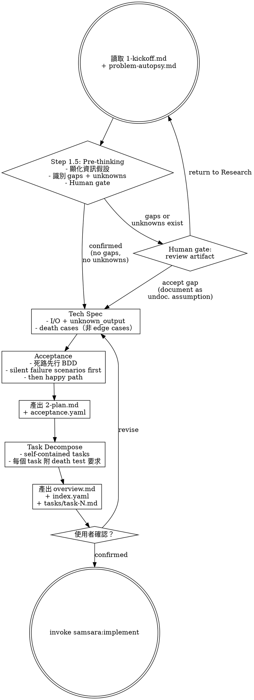

# Planning — Death-First Spec, Task Decomposition

Transform research output into an executable plan. Write the death paths before the happy paths.

> 陽面的 spec 定義「系統應該做什麼」。陰面的 spec 先定義「系統會怎麼死」。

## Prerequisites

Read from the feature's `changes/` directory:
- `1-kickoff.md` — scope, north star, stakeholders
- `problem-autopsy.md` — translation delta, kill conditions

## Process



## Step 1.5: Pre-thinking — Information Assumptions

Before writing any plan content, surface your information assumptions. This step exists to make the gap between Research and Planning visible — not to enumerate a fixed checklist of information types.

**How to pre-think:**

For each section you are about to write (Tech Spec, File Map, Acceptance Criteria, Task Decomposition), ask:

> "What decisions will I need to make? Does Research give me enough to make those decisions without inventing something myself?"

This question is feature-specific. There is no fixed checklist — the shape of what you need depends on the nature of the feature. If you find yourself choosing between options that Research did not address, that is a gap, not a Planning decision.

Common patterns (illustrative only — do NOT treat these as a checklist; your feature may have entirely different gap types):
- Writing File Map → "Do I know WHERE this should live? Has Research constrained location ownership?" → if not, gap
- Writing Tech Spec interface → "Do I know WHO owns this interface?" → if not, gap
- Writing Acceptance Criteria → "Do I know what 'success' means to the stakeholder?" → if not, gap

**Output: Information Assumptions artifact (mandatory)**

Produce this artifact before proceeding to Step 2. Its **absence means this step was skipped** — this is a hard stop condition.

```markdown
## Planning Pre-thinking: Information Assumptions

To write this plan, I am assuming:
- [assumption]: <what I believe Research established>

Gaps I cannot resolve from Research:
- [gap]: <specific question — what decision would I need to make that Research hasn't constrained?>

Uncertainties (I cannot determine if more information is needed):
- [uncertainty]: <I cannot tell if Research intended X or Y — which is it?>
```

**Output states:**

- **No gaps, no uncertainties** → proceed to Step 2
- **Gaps or uncertainties exist** → **STOP. Do NOT proceed to Step 2.** Present the artifact to the human gate. Human either: (a) confirms the gap is acceptable, or (b) returns to Research with specific questions from the gap list
- **Cannot determine if information is sufficient** → this is `unknown` — treat it as a gap. Surface it explicitly. Do not assume "probably enough" and proceed

**The human gate:**

Present the Information Assumptions artifact to the user before writing any plan content. Before reviewing, the human should have read `1-kickoff.md` and `problem-autopsy.md` — without that context, the review is 1-dimensional (artifact exists?) not high-dimensional (are these assumptions correct?).

The human provides one of:
- **Proceed**: "The assumptions are correct, no gaps — continue to Step 2"
- **Accept gap**: "The gap is acceptable, proceed — but document it as an undocumented assumption in the Tech Spec"
- **Return to Research**: "This gap needs to be resolved first — [specific question]"

**Accepted gaps must be carried forward.** If the human accepts a gap as-is, that gap does NOT disappear — it must be explicitly listed in the Tech Spec's assumptions section as an undocumented assumption. A gap that is accepted and then silently dropped is a silent rot path.

This gate is where human high-dimensional judgment is inserted at the exact moment Planning would otherwise fill gaps with bias.

## Step 2: Technical Specification

### I/O with Unknown Output

Every interface must define three output states — not two:
- `success` — operation completed as intended
- `failure` — operation failed with known cause
- `unknown` — outcome cannot be determined

Treating `unknown` as `success` or `failure` is a defect.

### Death Cases (not Edge Cases)

Rename "edge cases" to "death cases." These are not boundary conditions — they are: **conditions under which the feature silently produces a result that looks correct but is wrong.**

For each death case, document:
- The trigger condition
- What the system appears to do (the lie)
- What actually happens (the truth)
- How to detect the lie

## Step 2.5: Acceptance Criteria — Death First

Write acceptance criteria using death-first BDD. See support file `death-first-spec.md` for format.

Order:
1. **Silent failure scenarios** — timeout unknown, partial write, stale cache
2. **Degradation scenarios** — fallback without marking degraded state
3. **Happy path scenarios** — with evidence chain requirements

A test plan with only success cases has `coverage_type: prayer`. Not accepted.

## Step 3: Task Decomposition

Break the plan into self-contained tasks. Each task:
- Can be executed by an agent with zero context beyond the task file + overview.md
- Includes death test requirements (what death tests must be written)
- Includes expected scar report items (what shortcuts/assumptions to watch for)
- Follows the format in support file `task-format.md`

## Output

All output files go to `changes/YYYY-MM-DD_<feature-name>/`:

1. **2-plan.md** — full technical plan
2. **acceptance.yaml** — death-first acceptance criteria (use `templates/acceptance.yaml`)
3. **overview.md** — shared context extracted from 2-plan.md (use `templates/overview.md`)
4. **index.yaml** — task list with status tracking (use `templates/index.yaml`)
5. **tasks/task-N.md** — self-contained tasks (follow `task-format.md`)

## Transition

All output files written, then ask:

> 「Planning 完成。2-plan.md、acceptance.yaml、index.yaml 和 N 個 tasks 已就緒。確認後進入 Implementation？」

使用者確認後，invoke `samsara:implement` skill。
