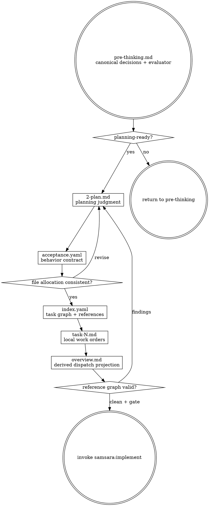

# Planning — Project Decisions into Executable Work

Transform approved design authority into task boundaries, observable acceptance,
and a validated execution graph. Planning may map and annotate upstream decisions;
it must not recreate them.

> 陽面的 spec 定義「系統應該做什麼」。陰面的 spec 先定義「系統會怎麼死」。

## Prerequisites

Read `1-kickoff.md`, `problem-autopsy.md`, and a planning-ready
`pre-thinking.md` from `changes/<feature>/`.

## Instruction Ownership

- `flow.md` is the sole owner of executable procedure and failure handling.
- `templates/plan.md` owns the Planning judgment record shape.
- `templates/acceptance.yaml` owns observable acceptance shape.
- `templates/overview.md` owns the derived dispatch projection shape.
- `templates/index.yaml` owns the execution reference graph shape.
- `task-format.md` owns the task work-order shape.

If this summary conflicts with `flow.md`, `flow.md` wins.

## Artifact Graph

```dot
digraph planning {
    node [shape=box];
    pre [label="pre-thinking.md\ncanonical decisions + evaluator" shape=doublecircle];
    guard [label="planning-ready?" shape=diamond];
    plan [label="2-plan.md\nplanning judgment"];
    acceptance [label="acceptance.yaml\nbehavior contract"];
    map [label="file allocation consistent?" shape=diamond];
    index [label="index.yaml\ntask graph + references"];
    tasks [label="task-N.md\nlocal work orders"];
    overview [label="overview.md\nderived dispatch projection"];
    validate [label="reference graph valid?" shape=diamond];
    implement [label="invoke samsara:implement" shape=doublecircle];
    back [label="return to pre-thinking" shape=doublecircle];

    pre -> guard;
    guard -> plan [label="yes"];
    guard -> back [label="no"];
    plan -> acceptance -> map;
    map -> index [label="yes"];
    map -> plan [label="revise"];
    index -> tasks -> overview -> validate;
    validate -> implement [label="clean + gate"];
    validate -> plan [label="findings"];
}
```

## Step Index

1. Validate upstream commitment, stable IDs, gaps, and `PT-EVAL`.
2. Record Planning decisions as `PL-D*` entries with upstream source refs.
3. Write evidence-backed acceptance scenarios and file allocation.
4. Decompose tasks; create DAG, projections, and task work orders.
5. Generate Overview from referenced sources; never decide inside it.
6. Validate references and graph shape before the transition gate.

Exact procedures: `flow.md`.

## Output

Write `2-plan.md`, `acceptance.yaml`, `overview.md`, `index.yaml`, and
`tasks/task-N.md` under `changes/<feature>/`.

## Transition

Follow `flow.md` §7. A clean reference graph may proceed to
`samsara:implement`; findings revise Planning artifacts first.

## Auto Mode Gate

Canonical protocol: `references/auto-mode.md` Stage Gate Protocol.

- `workflow_prompt` source: the Planning completion prompt defined in `flow.md`.
- Decision points: Planning completion after clean validation.
- `proceed` invokes `samsara:implement`; `revise` updates artifacts and re-runs
  validation; `accept_gap` proceeds only with the gap visible.
