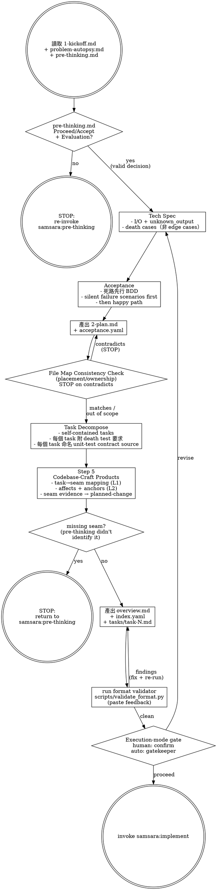

# Planning — Death-First Spec, Task Decomposition

Transform research output into an executable plan. Write the death paths before the happy paths.

> 陽面的 spec 定義「系統應該做什麼」。陰面的 spec 先定義「系統會怎麼死」。

## Prerequisites

Read from the feature's `changes/` directory:
- `1-kickoff.md` — scope, north star, stakeholders
- `problem-autopsy.md` — translation delta, kill conditions
- `pre-thinking.md` — user-LLM design alignment, Evaluation Contract, and commitment

**Guard:** If `pre-thinking.md` is absent, missing Evaluation Contract, missing `## Step 6 — Commitment`, or has `Decision: Return to Research`, **STOP**. Do not proceed to Step 2: Technical Specification. Re-invoke `samsara:pre-thinking` or `samsara:research` as directed by the unresolved gaps. Proceed only when Step 6 contains `Decision: Proceed` or `Decision: Accept gap`.

## Process


```dot
digraph planning {
    node [shape=box];

    start [label="讀取 1-kickoff.md\n+ problem-autopsy.md\n+ pre-thinking.md" shape=doublecircle];
    guard [label="pre-thinking.md\nProceed/Accept\n+ Evaluation?" shape=diamond];
    blocked [label="STOP:\nre-invoke\nsamsara:pre-thinking" shape=doublecircle];
    spec [label="Tech Spec\n- I/O + unknown_output\n- death cases（非 edge cases）"];
    acceptance [label="Acceptance\n- 死路先行 BDD\n- silent failure scenarios first\n- then happy path"];
    plan [label="產出 2-plan.md\n+ acceptance.yaml"];
    consistency [label="File Map Consistency Check\n(placement/ownership)\nSTOP on contradicts" shape=diamond];
    decompose [label="Task Decompose\n- self-contained tasks\n- 每個 task 附 death test 要求\n- 每個 task 命名 unit-test contract source"];
    craft [label="Step 5\nCodebase-Craft Products\n- task→seam mapping (L1)\n- affects + anchors (L2)\n- seam evidence → planned-change"];
    seam_gap [label="missing seam?\n(pre-thinking didn't\nidentify it)" shape=diamond];
    seam_stop [label="STOP:\nreturn to\nsamsara:pre-thinking" shape=doublecircle];
    output [label="產出 overview.md\n+ index.yaml\n+ tasks/task-N.md"];
    validate [label="run format validator\nscripts/validate_format.py\n(paste feedback)"];
    gate [label="Execution-mode gate\nhuman: confirm\nauto: gatekeeper" shape=diamond];
    next [label="invoke samsara:implement" shape=doublecircle];

    start -> guard;
    guard -> spec [label="yes\n(valid decision)"];
    guard -> blocked [label="no"];
    spec -> acceptance;
    acceptance -> plan;
    plan -> consistency;
    consistency -> decompose [label="matches /\nout of scope"];
    consistency -> plan [label="contradicts\n(STOP)"];
    decompose -> craft;
    craft -> seam_gap;
    seam_gap -> seam_stop [label="yes"];
    seam_gap -> output [label="no"];
    output -> validate;
    validate -> gate [label="clean"];
    validate -> output [label="findings\n(fix + re-run)"];
    gate -> next [label="proceed"];
    gate -> spec [label="revise"];
}
```

## Step 2: Technical Specification

### Pre-thinking Commitments Consumed

Before writing the technical plan, copy the following from `pre-thinking.md` into `2-plan.md`:
- **Decision:** `Proceed` or `Accept gap`
- **Accepted gaps:** labels and consequences, or `none`
- **System design constraints:** task-shaping design decisions from Step 4
- **L1 (core identity + real seams):** the Step 6 handoff — these are the **Key Decisions single source**; cite them, do NOT re-derive or add new placement decisions. Copy the core identity into `overview.md`'s Core Identity section and the real seams into Key Decisions → Real Seams verbatim (with their evidence tiers: `already-happened` / `domain-essential`). Planning strengthens a seam to `planned-change` only after task decomposition — see Step 5: Codebase-Craft Products.
- **Primary evaluator:** the single canonical agent-evaluable method
- **Pass signal / Fail signal:** observable criteria
- **Feedback loop:** first action if the Primary evaluator fails

Planning must decompose tasks to satisfy the Primary evaluator. Acceptance criteria and task files can add engineering tests, but they cannot replace or contradict this evaluator.

### I/O with Unknown Output

Every interface must define three output states — not two:
- `success` — operation completed as intended
- `failure` — operation failed with known cause
- `unknown` — outcome cannot be determined

Treating `unknown` as `success` or `failure` is a defect.

### Death Cases (not Edge Cases)

Rename "edge cases" to "death cases." These are not boundary conditions — they are: **conditions under which the feature silently produces a result that looks correct but is wrong.**

For each death case, document:
- The trigger condition
- What the system appears to do (the lie)
- What actually happens (the truth)
- How to detect the lie

## Step 2.5: Acceptance Criteria — Death First

Write acceptance criteria using death-first BDD. See support file `death-first-spec.md` for format.

Order:
1. **Silent failure scenarios** — timeout unknown, partial write, stale cache
2. **Degradation scenarios** — fallback without marking degraded state
3. **Happy path scenarios** — with evidence chain requirements

A test plan with only success cases has `coverage_type: prayer`. Not accepted.

## Step 3: File Map Consistency Check — STOP Gate

Before decomposing tasks, cross-check the File Map paths against the Key Decisions you drafted for `overview.md`. Task files bake in File Map paths, so a contradiction that survives this step propagates into every task (ISSUE-001: four tasks were built in the wrong location before a human caught it).

**Scope: placement/ownership decisions only.** A Key Decision that fixes *where code lives* or *who owns it* (e.g. "X is shared, not samsara-exclusive"; "this is a framework change, not plugin-specific") is in scope. Do NOT force every Key Decision to correspond to a path — a non-placement decision (e.g. "use churn not mtime") is **out of scope** for this check; classify it as such rather than straining it against the paths.

For each placement/ownership Key Decision, classify the File Map against it as exactly one of three states:
- **matches** — every relevant path is consistent with the decision
- **contradicts** — at least one path violates the decision
- **out of scope** — the decision does not constrain any path

If you are unsure whether a Key Decision constrains placement, treat it as **in scope**: a false STOP costs one re-check, but a missed STOP ships the contradiction into every task.

**STOP on `contradicts`:** if any placement/ownership decision is contradicted by the File Map, **do not proceed to task decomposition**. Resolve it first — correct the File Map paths or revise the Key Decision — then re-run this check. A contradiction is a hard block, not an advisory note.

**Anti-bias:** when drafting the File Map, **derive** each path from the Key Decisions, not from the path of least resistance. Do not default to existing infrastructure locations just because they already exist — that default is exactly how a plan drifts away from a placement decision it already made.

## Step 4: Task Decomposition

Break the plan into self-contained tasks. Each task:
- Can be executed by an agent with zero context beyond the task file + overview.md
- Includes death test requirements (what death tests must be written)
- Names its unit-test contract source — the observable contract a unit test may assert (public API/return value, documented artifact shape, or a source from `references/test-contract.md`) — alongside the death test requirements. The contract is named UPSTREAM here so the implementer asserts it instead of inferring a contract from the current implementation. See the `Unit Test Contract` section in support file `task-format.md`.
- Includes expected scar report items (what shortcuts/assumptions to watch for)
- Follows the format in support file `task-format.md`

## Step 5: Codebase-Craft Products — Seam Mapping, Affects Projection, Anchors

Planning **consumes** pre-thinking's L1 (core identity + real seams); it does not create structural decisions. After task decomposition, produce three things — all of them mappings or annotations of what pre-thinking already decided:

1. **Per-task seam mapping (L1 position)** — for each task in `index.yaml`, set `seam` to the semantic name of the seam this task sits on or creates. The name must resolve to a seam declared in `overview.md` Key Decisions → Real Seams (semantic names like `parser-boundary`, never opaque codes — a code forces the reader to look it up, which is friction against evidence visibility). A task with no structural touch gets `seam: null`. One seam per task: a task that genuinely spans multiple seams is a decomposition signal — consider re-splitting the task (soft signal, not a hard block).

2. **Seam evidence strengthening (planned-change tier)** — pre-thinking could only mark seams `already-happened` / `domain-essential`; task decomposition is what creates the **planned-change** evidence tier. For each declared seam, if downstream tasks will extend it (visible in `affects`), add those task ids to the seam's `planned:` line in Real Seams. This is an **annotation, not a new decision** — the seam remains pre-thinking's; planning only adds the evidence tier that becomes available at this stage.

3. **L2 reverse projection (`affects` + `anchors`)** — for each task, fill in `index.yaml`:
   - **`affects`** — which downstream tasks will build on this task's structure, each with a one-line `needs` naming what they need from this boundary. Sources: (a) tasks sharing the same seam naturally affect each other; (b) `depends_on` edges where the downstream extends the upstream's structure; (c) planning's own decomposition knowledge. **`affects` ≠ `depends_on`:** structural impact (reverse: me → my consumers) vs ordering (forward: me → my prerequisites); a task can affect another with no ordering dependency, and an ordering dependency is not necessarily a structural extension. A `needs` that merely restates ordering ("runs after me") is noise.
   - **`anchors`** — the files the implementer must read before writing: path + one-line why (pointers, not content — this keeps raw content narrow while awareness stays broad). Planning selects them with its global view — callers, sibling modules, the pattern already in use nearby — precisely the neighbors the implementer would not know to look for. When `depends_on` is non-empty, include the interface files of each depended-on task: the implementer reads **live signatures** to honor upstream contracts, never a prose summary that would drift. Anchors are a starting set, never a whitelist.

**Single-source STOP gate:** if decomposition reveals the feature needs a seam pre-thinking did not identify, that is a **design-decision gap** — STOP and return to `samsara:pre-thinking` to add it (same shape as the File Map Consistency STOP). Do not invent a new seam in planning: a seam declared outside the single source is the ISSUE-001 pathology — the same decision living in two places with no cross-check.

**Projection volume (soft, consumption-driven):** projections stay small because downstream consumption disciplines them, not because of a line-count gate (a hard count trains gaming the number). Every `affects` entry should later be citable by an implementer structural decision (`forced_by` in the scar report); an entry no implementer ever consumes is over-projection. Conversely, a later task having to **tear down** a prior task's structure to connect is the under-projection death signal — record it as a scar pointing at the missed `affects`. A task whose `affects` list grows large signals decomposition entanglement — re-split the tasks rather than trimming the projection to look small.

## Format Validation — planning's format-validate script

After writing `overview.md` and `index.yaml`, run the validator script shipped with this skill, passing the feature directory:

```bash
python scripts/validate_format.py changes/YYYY-MM-DD_<feature-name>/
```

(Resolve `scripts/validate_format.py` relative to this skill's directory.)

- **What it checks is FORMAT only** — machine-decidable facts where a machine with no domain understanding gets the right answer every time: `index.yaml` parses; every task `seam` resolves to a seam declared in `overview.md` Real Seams (no dangling seam ids); every `affects.task` points to a task id that exists in `index.yaml`; every `affects` entry has a non-empty `needs`; every `anchors` entry has `path` + `why`; every `depends_on` id resolves.
- **What it never checks is JUDGMENT** — whether a seam is the right boundary, whether an `affects` names a real structural need, whether an anchor list is complete. Those belong to pre-thinking and the reviewers. Classification is the teeth policy: format gets the hardest available teeth precisely because it does not touch judgment; judgment never gets a code gate.
- The script returns **line-level feedback** (which seam id dangles, which `affects` points at nothing), not a bare pass/fail — fix and re-run until clean.
- **Paste the validator output into the transition record.** The pasted output is the falsifiable trace: at handoff, a missing validator output is a **visible missing**, never a silent skip.

## Output

All output files go to `changes/YYYY-MM-DD_<feature-name>/`:

1. **2-plan.md** — full technical plan
2. **acceptance.yaml** — death-first acceptance criteria (use `templates/acceptance.yaml`)
3. **overview.md** — shared context extracted from 2-plan.md (use `templates/overview.md`; carries the L1 Core Identity and Real Seams declarations)
4. **index.yaml** — task list with status tracking and per-task `seam` / `affects` / `anchors` from Step 5 (use `templates/index.yaml`)
5. **tasks/task-N.md** — self-contained tasks (follow `task-format.md`)

Then run the format validator (see Format Validation above) and carry its clean output into the transition.

## Transition

All output files written, then use the planning completion prompt to decide the
next workflow path:

> 「Planning 完成。2-plan.md、acceptance.yaml、index.yaml 和 N 個 tasks 已就緒。確認後進入 Implementation？」

- If `Execution mode: human-in-the-loop`, ask the user this question. After
  confirmation, invoke `samsara:implement`; if the user asks for revision,
  revise the planning artifacts and ask again.
- If `Execution mode: auto`, do not ask the user. Use the Auto Mode Gate below
  to dispatch `samsara:auto-gatekeeper`, record the decision, and follow the
  recorded decision.

## Auto Mode Gate

Canonical protocol: `references/auto-mode.md` Stage Gate Protocol — dispatch, the append-only decision log, and what `proceed`/`revise`/`reject`/`accept_gap` mean all live there; this section only names what Planning adds.

- `workflow_prompt` source: the transition prompt below.

  > 「Planning 完成。2-plan.md、acceptance.yaml、index.yaml 和 N 個 tasks 已就緒。確認後進入 Implementation？」

- Decision points this gate covers: the planning completion transition (one decision point).
- `proceed` invokes `samsara:implement`; `revise` re-runs the relevant step; `accept_gap` continues to `samsara:implement` with the accepted gap visible.
