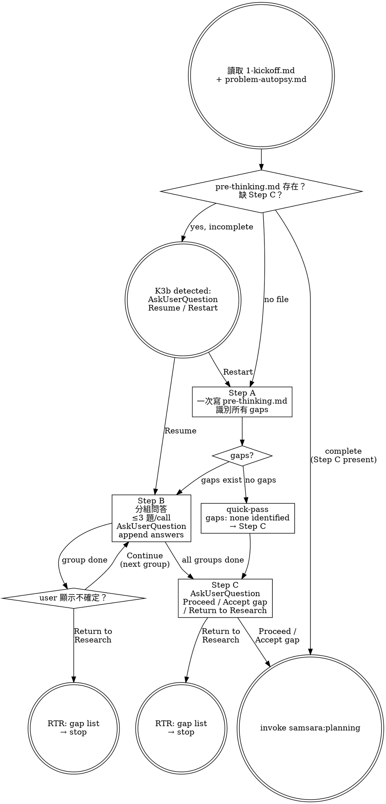

# Pre-thinking — Surface Gaps Before Planning

Surface the gap between what research established and what planning would need to assume. Make that gap visible to the human before any plan is written.

## Prerequisites

Read from `changes/<feature>/`:
- `1-kickoff.md` — scope, north star, stakeholders
- `problem-autopsy.md` — translation delta, kill conditions

## Process

## Step A — Gap Identification

Read both research artifacts. Identify every decision planning would need to make that research has not constrained. Write all gaps to `pre-thinking.md` in one shot — do NOT start AskUserQuestion before Step A write is complete. If no gaps exist, write `gaps: none identified` and skip Step B entirely. See `support/flow.md` for gap identification criteria.

## Step B — Question Groups

Group gaps by topic domain and answer-interdependency (≤3 questions per AskUserQuestion call). After each call, append answers to `pre-thinking.md` below all existing content — never rewrite or truncate. Read the file before each append; if the file differs from the last-written state, incorporate user edits before appending. See `support/flow.md` §2 for group formation rules, §3 for group overflow procedure, §4 for file-edit detection, §7 for AskUserQuestion header constraint (≤12 chars).

## Step C — Commitment

Collect the final commitment via AskUserQuestion with options: Proceed / Accept gap / Return to Research.

**Step C commitment must be collected via AskUserQuestion — never inferred from conversation context.**

When commitment = Return to Research: write `## Step C — Commitment` section with `Decision: Return to Research` and a non-empty `unresolved_gaps` list referencing specific Step A gap labels. Do NOT invoke `samsara:planning`. See `support/flow.md` for exact write format.

When commitment = Proceed or Accept gap: invoke `samsara:planning`.

## Yin Constraints

- **LLM is the sole writer to pre-thinking.md. User responds via AskUserQuestion only.**
- **Presence of `## Step C — Commitment` signals session complete. Absence = K3b interrupted state — on session start, check for this section before proceeding.**
- **Step A is written in one shot. Do NOT start AskUserQuestion before Step A write is complete.**

## Output

`changes/<feature>/pre-thinking.md` — single file, LLM sole writer. Presence of `## Step C — Commitment` = session complete.
