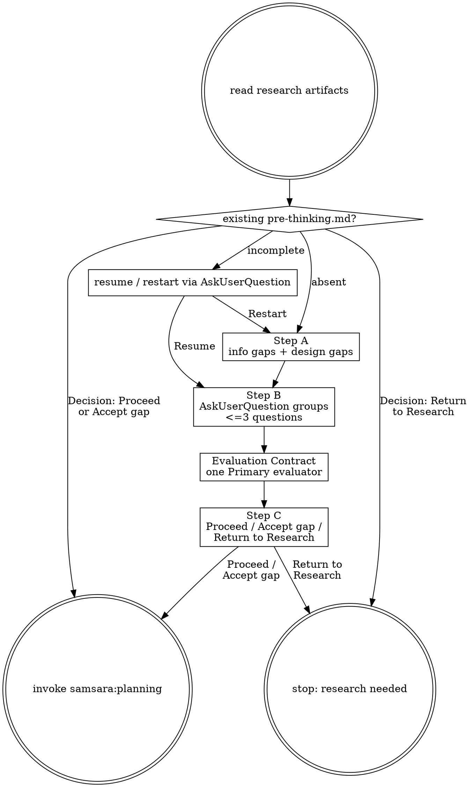

# Pre-thinking — Align Design and Evaluation Before Planning

Surface the assumptions planning would otherwise smuggle in: missing information, task-shaping design choices, and the single agent-evaluable standard that will drive feedback.

## Prerequisites

Read from `changes/<feature>/`:
- `1-kickoff.md`
- `problem-autopsy.md`

## Process

## Step A — Design and Gap Map

Write `pre-thinking.md` from the template. Identify two categories: information gaps (research did not establish a needed fact) and design decision gaps (multiple valid designs remain and the choice changes task decomposition, artifact contracts, ownership, or failure modes). If no gaps exist, write `gaps: none identified`, but continue to Evaluation Contract.

## Step B — Question Groups

Ask gap questions in groups of at most 3 via AskUserQuestion. Questions must be non-leading. Append answers only after reading `pre-thinking.md`; if it differs from the last-written state, acknowledge and incorporate edits before appending.

## Evaluation Contract

Evaluation is never optional. Ask the user to define exactly one agent-evaluable Primary evaluator: how the agent can perform or inspect it, pass signal, fail signal, feedback loop, and any out-of-scope validation. TDD/death tests may support it, but they are not the Primary evaluator unless the user explicitly chooses them as the only standard.

## Step C — Commitment

Collect commitment via AskUserQuestion. Only `Decision: Proceed` or `Decision: Accept gap` may invoke `samsara:planning`. `Decision: Return to Research` writes unresolved gaps and stops. See `flow.md` for exact formats.

## Output

`changes/<feature>/pre-thinking.md`. A run is planning-ready only when Step C contains `Decision: Proceed` or `Decision: Accept gap` and a complete Evaluation Contract.
