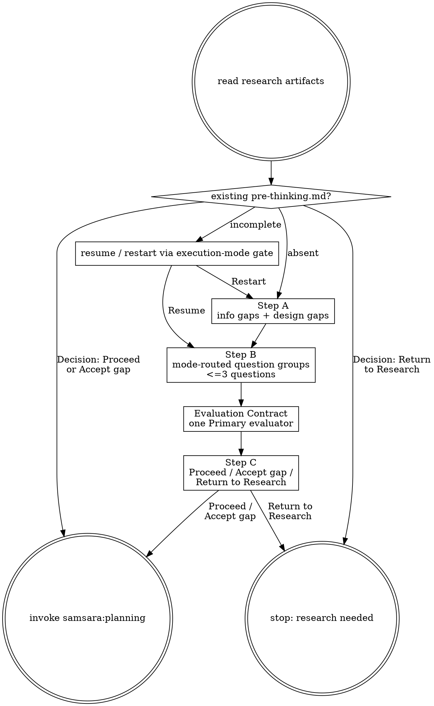

# Pre-thinking — Align Design and Evaluation Before Planning

Surface the assumptions planning would otherwise smuggle in: missing information, task-shaping design choices, and the single agent-evaluable standard that will drive feedback.

## Prerequisites

Read from `changes/<feature>/`:
- `1-kickoff.md`
- `problem-autopsy.md`

## Process

## Step A — Design and Gap Map

Write `pre-thinking.md` from the template. Identify two categories: information gaps (research did not establish a needed fact) and design decision gaps (multiple valid designs remain and the choice changes task decomposition, artifact contracts, ownership, or failure modes). If no gaps exist, write `gaps: none identified`, but continue to Evaluation Contract.

### Atomic Context Boundary

Before declaring Step A complete, derive the useful system facts from live codebase artifacts:

- module ownership and responsibility boundaries
- public interfaces and runtime entrypoints
- config/env sources and deployment/runtime assumptions
- external services, data flow, and side-effect boundaries
- existing tests or evaluators that define current behavior

Check `.samsara/codebase-map.yaml` first when it exists. Use it as derived
context, not as truth over the live codebase: if the map and live artifacts
disagree, live artifacts win and the drift must be surfaced. If the map is
missing or stale, either run targeted local inspection for the task scope or
record an information gap recommending `samsara:codebase-map`.

If any of these facts are needed for planning and cannot be verified from the
live codebase, record an information gap. Do not let yin/yang framing substitute
for this map; yin and yang are review lenses, while boundary and environment
facts are prerequisite design context.

## Step B — Question Groups

Route gap question groups by execution mode. Questions must be non-leading and
grouped at most 3 at a time.

- If `Execution mode: human-in-the-loop`, ask each group via AskUserQuestion.
  Append answers only after reading `pre-thinking.md`; if it differs from the
  last-written state, acknowledge and incorporate edits before appending.
- If `Execution mode: auto`, do not ask the user. Use the Auto Mode Gate below
  to dispatch `samsara:auto-gatekeeper` for each question group, append the
  decision to `auto-decisions.md`, and write the gatekeeper answer back to
  `pre-thinking.md`.

## Evaluation Contract

Evaluation is never optional. Route the evaluator definition by execution mode:

- If `Execution mode: human-in-the-loop`, ask the user to define exactly one
  agent-evaluable Primary evaluator: how the agent can perform or inspect it,
  pass signal, fail signal, feedback loop, and any out-of-scope validation.
- If `Execution mode: auto`, do not ask the user. Use the Auto Mode Gate below
  to dispatch `samsara:auto-gatekeeper`; the gatekeeper must select exactly one
  agent-evaluable Primary evaluator and record the decision before the workflow
  continues.

TDD/death tests may support it, but they are not the Primary evaluator unless
the human user or recorded gatekeeper decision explicitly chooses them as the
only standard.

## Step C — Commitment

Route commitment by execution mode:

- If `Execution mode: human-in-the-loop`, collect commitment via
  AskUserQuestion.
- If `Execution mode: auto`, do not ask the user. Use the Auto Mode Gate below
  to dispatch `samsara:auto-gatekeeper`, append the commitment decision to
  `auto-decisions.md`, and write the recorded commitment to `pre-thinking.md`.

Only `Decision: Proceed` or `Decision: Accept gap` may invoke
`samsara:planning`. `Decision: Return to Research` writes unresolved gaps and
stops. See `flow.md` for exact formats.

## Output

`changes/<feature>/pre-thinking.md`. A run is planning-ready only when Step C contains `Decision: Proceed` or `Decision: Accept gap` and a complete Evaluation Contract.

## Auto Mode Gate

When the session context contains `Execution mode: auto`, every Step B question
group, Evaluation Contract question, and Step C commitment question is answered
by `samsara:auto-gatekeeper` rather than pausing for human input.
Dispatch it with the Agent tool using `subagent_type: "samsara:auto-gatekeeper"`.

For each workflow question or confirmation, the gatekeeper must append an
append-only entry to `changes/<feature>/auto-decisions.md` before continuing.
Use the canonical schema in `references/auto-mode.md`; this stage must provide
`prompt_type`, `workflow_prompt`, and `gatekeeper_answer` for each entry.

Use the exact Step B/Evaluation/Step C prompt as `workflow_prompt`. The
gatekeeper's answer must be written back to `pre-thinking.md` exactly as a
human answer would be written, while preserving the auto decision record.

Then follow the recorded decision:

- `proceed` — continue the pre-thinking flow or invoke `samsara:planning` when
  Step C is `Decision: Proceed`.
- `revise` — revise `pre-thinking.md`, then re-run the relevant gate.
- `reject` — stop the auto run and leave the rejection in `auto-decisions.md`.
- `accept_gap` — invoke `samsara:planning` only if Step C records
  `Decision: Accept gap`.
