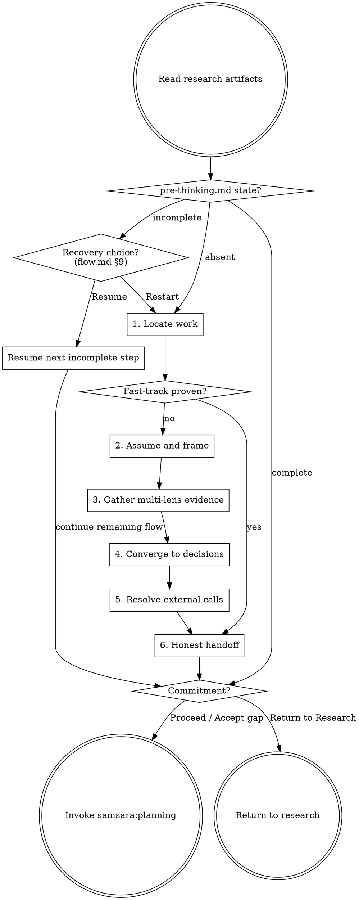

# Pre-thinking — Think the Design Through Before Planning

Prepare the design decisions and evaluation standard that planning needs while
keeping future change possible. Minimize human input without hiding uncertainty.

> 系統實作完沒多久就開始爛、壞了沒人發現，最後新需求進不來只能砍掉重寫——這是 AI 寫程式最常見的結局。pre-thinking 保護的是「之後還改得動」。

## Prerequisites

Read `1-kickoff.md` and `problem-autopsy.md` from `changes/<feature>/`. When the
autopsy contains non-null `decision_refs`, resolve them from `auto-decisions.md`
before framing; the autopsy conclusion remains Research's stage-owned content.

## Instruction Ownership

- `flow.md` is the sole owner of executable procedure, failure handling, and
  execution-mode routing. Read it before acting.
- `templates/pre-thinking.md` owns the persisted artifact shape.
- `templates/lens-report.md` owns the searcher return shape.
- The skill-local `references/lenses.md` owns the lens catalog and lifecycle.

If this summary conflicts with `flow.md`, `flow.md` wins.

## Process

```dot
digraph pre_thinking {
    node [shape=box];
    start [label="Read research artifacts" shape=doublecircle];
    state [label="pre-thinking.md state?" shape=diamond];
    recover [label="Recovery choice?\n(flow.md §9)" shape=diamond];
    resume [label="Resume next incomplete step"];
    locate [label="1. Locate work"];
    fast [label="Fast-track proven?" shape=diamond];
    frame [label="2. Assume and frame"];
    evidence [label="3. Gather multi-lens evidence"];
    decide [label="4. Converge to decisions"];
    ask [label="5. Resolve external calls"];
    handoff [label="6. Honest handoff"];
    commitment [label="Commitment?" shape=diamond];
    planning [label="Invoke samsara:planning" shape=doublecircle];
    research [label="Return to research" shape=doublecircle];

    start -> state;
    state -> recover [label="incomplete"];
    state -> locate [label="absent"];
    state -> commitment [label="complete"];
    recover -> locate [label="Restart"];
    recover -> resume [label="Resume"];
    resume -> commitment [label="continue remaining flow"];
    locate -> fast;
    fast -> handoff [label="yes"];
    fast -> frame [label="no"];
    frame -> evidence -> decide -> ask -> handoff -> commitment;
    commitment -> planning [label="Proceed / Accept gap"];
    commitment -> research [label="Return to Research"];
}
```

## Step Index

1. **Locate:** classify work and apply the uncertainty × blast-radius depth gate.
2. **Frame:** write decision-relevant assumptions, live context, and core identity.
3. **Evidence:** derive dynamic multi-lens evidence strategy and gather facts.
4. **Decide:** converge sequentially into named decisions and real seams.
5. **External calls:** resolve choices the agent cannot authorize; record traces.
6. **Handoff:** write L1, one Evaluation Contract, gaps, and commitment.

Exact procedures and write formats: `flow.md` §§1–9.

## Output

The main agent is the sole writer of `changes/<feature>/pre-thinking.md`, using
`templates/pre-thinking.md`. Planning-ready means Step 6 contains L1, a complete
Evaluation Contract, and `Decision: Proceed` or `Decision: Accept gap`.

## Transition

Follow `flow.md` §§6–7: Proceed or Accept gap invokes `samsara:planning`; Return
to Research records unresolved gaps and stops.

## Auto Mode Gate

Canonical protocol: `references/auto-mode.md` Stage Gate Protocol.

- `workflow_prompt` source: the exact Step 5 choice, Evaluation Contract
  question, or Step 6 commitment prompt defined by `flow.md`.
- Gate IDs: `pre-thinking.step5.<group>.<question>`,
  `pre-thinking.evaluator`, and `pre-thinking.commitment`.
- Decision points: Step 5 external calls, Evaluation Contract selection, and
  Step 6 commitment. The Gatekeeper is the sole decision-log writer.
- Pre-thinking writes each answer to `pre-thinking.md`; the Gatekeeper records
  the matching append-only decision.
- `proceed` continues or invokes planning after `Decision: Proceed`; `revise`
  updates the artifact and re-runs the gate; `accept_gap` invokes planning only
  after `Decision: Accept gap`.
