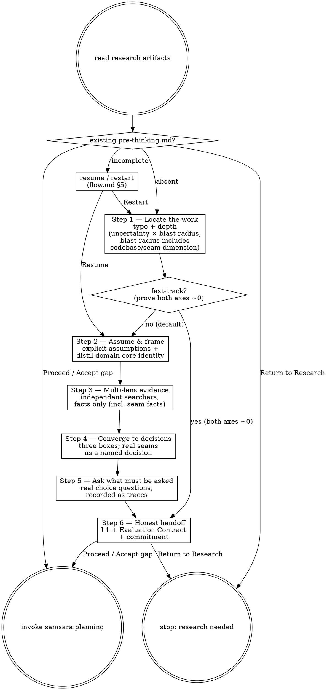

# Pre-thinking — Think the Design Through Before Planning

Before planning, think the problem through: what this change really solves, how the system should be structured, where the real seams are, and the single agent-evaluable standard that will drive feedback. Pre-thinking's job is to get planning the information and aligned decisions it needs — including the **structural identity** the downstream implementer will build on.

> 系統實作完沒多久就開始爛、壞了沒人發現，最後新需求進不來只能砍掉重寫——這是 AI 寫程式最常見的結局。pre-thinking 保護的是「之後還改得動」。它不猜未來長什麼樣，只做一件事：現在別把以後想改的路堵死。

**Primary goal is auto mode:** the agent thinks the design through on its own, needing a human only where a decision is genuinely not the agent's to make. Success = *fewest humans needed without getting it wrong*, not "asking pretty questions."

## Prerequisites

Read from `changes/<feature>/`:
- `1-kickoff.md`
- `problem-autopsy.md`

## Process

```dot
digraph pre_thinking {
    node [shape=box];
    start [label="read research artifacts" shape=doublecircle];
    k3b [label="existing pre-thinking.md?" shape=diamond];
    recover [label="resume / restart\n(flow.md §5)"];
    s1 [label="Step 1 — Locate the work\ntype + depth\n(uncertainty × blast radius,\nblast radius includes\ncodebase/seam dimension)"];
    ft [label="fast-track?\n(prove both axes ~0)" shape=diamond];
    s2 [label="Step 2 — Assume & frame\nexplicit assumptions +\ndistil domain core identity"];
    s3 [label="Step 3 — Multi-lens evidence\nindependent searchers,\nfacts only (incl. seam facts)"];
    s4 [label="Step 4 — Converge to decisions\nthree boxes; real seams\nas a named decision"];
    s5 [label="Step 5 — Ask what must be asked\nreal choice questions,\nrecorded as traces"];
    s6 [label="Step 6 — Honest handoff\nL1 + Evaluation Contract\n+ commitment"];
    planning [label="invoke samsara:planning" shape=doublecircle];
    stop [label="stop: research needed" shape=doublecircle];

    start -> k3b;
    k3b -> recover [label="incomplete"];
    k3b -> planning [label="Proceed / Accept gap"];
    k3b -> stop [label="Return to Research"];
    k3b -> s1 [label="absent"];
    recover -> s2 [label="Resume"];
    recover -> s1 [label="Restart"];
    s1 -> ft;
    ft -> s6 [label="yes (both axes ~0)"];
    ft -> s2 [label="no (default)"];
    s2 -> s3;
    s3 -> s4;
    s4 -> s5;
    s5 -> s6;
    s6 -> planning [label="Proceed / Accept gap"];
    s6 -> stop [label="Return to Research"];
}
```

`flow.md` holds the agent-executable detail for every step. Read it alongside this file — the summaries below are not a standalone script.

## Step 1 — Locate the work

Judge two things from the research output + one look at the codebase, write them down, revisable later:

- **Type** (can be several at once): feature / perf / infra / refactor / external integration / data-structure change. Can't tell → count them all.
- **Depth**, on one ruler: **uncertainty × blast radius**.
  - *uncertainty* — are there design questions still unresolved, requiring a guess?
  - *blast radius* — if this is wrong, how far does the damage spread, and do you know how far? **Blast radius now includes the codebase/structural dimension:** a change that lands on a load-bearing seam (many existing or planned tasks sit on it) has a large radius and warrants deep thinking; a leaf-node addition is small (see `flow.md` §1 and design note 2 §5).
  - **Deep thinking is the default; fast-track is the narrow path you must *prove* into** (both axes ~0). The rule is one-directional and asymmetric: guessing wrong into deep thinking only costs tokens; guessing wrong into fast-track drops blind spots.

## Step 2 — Assume and frame (+ distil core identity)

Turn the research conclusions into a set of **explicitly written assumptions** — this step *converges* (draws a box the later thinking happens inside), it does not brainstorm. An assumption earns its place only if "were this wrong, would the design change?" is yes.

"Confident / not confident" is judged by an objective test, not a feeling: **confident = can point, right now, to a concrete, checkable basis** (file:line / an existing test / a research finding / an existing contract). Claim confidence and you must write the basis; no basis written = not confident.

**Codebase-craft extension — domain core identity:** while framing, distil the one-or-two-line **core identity** — what this system, within the feature's scope, essentially *is*. It is the thing structural decisions must serve. Operability test (guards against empty slogans): the identity must be able to adjudicate a concrete structural choice — if two opposite structural choices both "serve" it, it is too vague, rewrite it (`flow.md` §2, design note 2 §4.1).

## Step 3 — Multi-lens evidence

Send **independent searchers** at the not-confident assumptions to gather **facts only** — no "recommendation" field. Multi-lens exists for exactly one reason: to cover blind spots (the main agent only searches where it already thought to look). Lens count is emergent from Step 2's not-confident-assumption count — 0 not-confident assumptions → 0 searchers.

Among the default lenses (`references/lenses.md`), the **structure / evolution / boundary** lenses gather the facts that feed the real-seam decision in Step 4: existing boundaries, coupling, existing patterns, and how this area has historically changed (the **already-happened** evidence tier). Each searcher returns facts (with sources), side-path discoveries, and gaps — never judgment (design note 2 §4.2).

## Step 4 — Converge to design decisions

The main agent, **alone and in sequence** (decisions are interdependent), turns evidence into decisions. Each decision lands in **one of three boxes — there is no fourth box called "I feel"**:

1. **Evidence-decided** — the facts forced a single answer; cite the source.
2. **Self-derived** — evidence didn't force it, but you can derive it from a **named root** (Samsara axiom + the problem's hard requirements + existing convention/contract *if found and confirmed not rotten*) **and you write the derivation chain out**.
3. **Needs an external call** — several answers stand up; the choice needs a preference/priority the agent has no authority to invent. Answered by the human, or in auto mode by the gatekeeper (a genuinely-human-only answer must be marked "unconfirmed guess").

**Codebase-craft extension — real seams as a named decision category:** the domain's essential boundaries this feature will *sit on or create* are a **named decision** in Step 4, run through the same three boxes (not a separate structural pass). Each seam carries an **evidence-tier marker**. The full tier order is `already-happened (git history) > planned change > domain-essential boundary > imagination`, but **evidence accrues along the pipeline**: pre-thinking can only mark **already-happened / domain-essential** (or "needs external call"); the **planned-change** tier is added later by planning once it decomposes tasks. A seam that can be marked with no checkable tier at pre-thinking time is not a real seam (cargo-cult). Scope is feature-limited — do not redraw the whole project's architecture (guards against seam astronomy). See `flow.md` §4 and design note 2 §4.2/§7.

**Granularity floor:** the codebase layer descends only to **function / module / abstraction boundary**, no lower (control-flow / naming / line-shaping are not the disease here). See design direction §3.2.

## Step 5 — Ask what must be asked

Step 4 marked which decisions "need an external call"; this step actually asks, and records the answers as traces. Two rules: **every question is a real multiple-choice** (≥2 options + each option's trade-off — never "shall we do it my way?"), and **answers are recorded as traces** (which was chosen / why not the others / what this assumes / what rots first if that assumption breaks). Grouping, overflow (≤3 per call), and file-edit detection are in `flow.md` §5.

Route by execution mode:

- If `Execution mode: human-in-the-loop`, ask each question group via AskUserQuestion.
- If `Execution mode: auto`, do not ask the user. Use the Auto Mode Gate below to dispatch `samsara:auto-gatekeeper` for each question group, append the decision to `auto-decisions.md`, and write the answer back to `pre-thinking.md`.

## Step 6 — Honest handoff

Hand three things to planning, and be honest about your own state:

- **L1 (codebase-craft output)** — the feature-level **core identity + real seams** distilled in Steps 2/4 are **design decisions**, so they travel through the **existing "planning Key Decisions single source" channel** — planning cites them, does not re-derive or add new placement decisions. This is the L1 contract the implementer's global-thinking channel later consumes (design notes 1 §10, 2 §7). No new mechanism.
- **Evaluation Contract** — exactly one Primary evaluator (see below). Defined here, at the last moment design intent is fully in view and no code is written yet.
- **Commitment (one of three) + residual list** — `Proceed` / `Accept gap` / `Return to Research`. Only the first two may invoke `samsara:planning`.

## Atomic Context Boundary

Before Step 2's framing is complete, derive the useful system facts from live codebase artifacts:

- module ownership and responsibility boundaries
- public interfaces and runtime entrypoints
- config/env sources and deployment/runtime assumptions
- external services, data flow, and side-effect boundaries
- existing tests or evaluators that define current behavior

Check `.samsara/codebase-map.yaml` first when it exists. Use it as derived
context, not as truth over the live codebase: if the map and live artifacts
disagree, live artifacts win and the drift must be surfaced.

If the map is present but stale and churn (changed source files since
`last_updated`, excluding paths under `changes/`, `docs/`, `bugfix/`) exceeds
`staleness_churn_threshold` (canonical definition: codebase-map SKILL.md
Triggers), auto-initiate `samsara:codebase-map` regeneration before
proceeding. In human-in-the-loop mode, Phase 4 human review is retained. Do
not continue with a stale map when churn is over threshold; auto-initiate so
planning is not built on outdated context. If auto-initiated regeneration
fails, aborts, or is rejected at Phase 4 review, do NOT treat it as completed
and do NOT block indefinitely: proceed with the map explicitly marked stale,
record an information gap noting the failed regeneration, and continue
planning on that basis.

If the map is present but stale and churn is at or below
`staleness_churn_threshold`, use it only as a starting hypothesis: verify
facts needed for planning against live codebase artifacts and record stale or
unverifiable facts as information gaps.

If the map is missing, either run targeted local inspection for the task scope
or record an information gap recommending `samsara:codebase-map`.

Boundary and environment facts are prerequisite design context; do not let
yin/yang framing substitute for this map.

## Evaluation Contract

Evaluation is never optional — even a fast-track run must define it before commitment. Exactly one **Primary evaluator**: how the agent can run/inspect/apply it consistently, plus pass signal, fail signal, feedback loop, and out-of-scope validation. Full format in `flow.md` §6.

- If `Execution mode: human-in-the-loop`, ask the user to define it.
- If `Execution mode: auto`, do not ask the user. Use the Auto Mode Gate below to dispatch `samsara:auto-gatekeeper`, which selects exactly one and records the decision.

TDD/death tests may support it but are not the Primary evaluator unless the human or recorded gatekeeper decision explicitly chooses them as the only standard. Planning, iteration, debugging, and validate-and-ship reuse this same Primary evaluator instead of inventing a new success standard.

## Commitment

Route by execution mode:

- If `Execution mode: human-in-the-loop`, collect commitment via AskUserQuestion.
- If `Execution mode: auto`, do not ask the user. Use the Auto Mode Gate below to dispatch `samsara:auto-gatekeeper`, append the commitment decision to `auto-decisions.md`, and write it back to `pre-thinking.md`.

Only `Decision: Proceed` or `Decision: Accept gap` may invoke `samsara:planning`. `Decision: Return to Research` writes unresolved gaps and stops. See `flow.md` §7 for exact formats.

## Output

`changes/<feature>/pre-thinking.md`. A run is planning-ready only when Step 6 records `Decision: Proceed` or `Decision: Accept gap`, a complete Evaluation Contract, and the L1 (core identity + real seams) design decisions.

## Auto Mode Gate

Canonical protocol: `references/auto-mode.md` Stage Gate Protocol —
dispatch, the append-only decision log, and what `proceed`/`revise`/
`reject`/`accept_gap` mean all live there; this section only names what
Pre-thinking adds.

- `workflow_prompt` source: the exact Step 5 real-choice question, Evaluation
  Contract question, or Step 6 commitment prompt being answered.
- Decision points this gate covers: every Step 5 external-call question, every
  Evaluation Contract question, and the Step 6 commitment question.
- Stage-specific: the gatekeeper's answer must be written back into
  `pre-thinking.md` exactly as a human answer would be written, in addition
  to the append-only decision record.
- `proceed` continues the pre-thinking flow, or invokes `samsara:planning`
  when Step 6 is `Decision: Proceed`; `revise` revises `pre-thinking.md`
  then re-runs the relevant gate; `accept_gap` invokes `samsara:planning`
  only if Step 6 records `Decision: Accept gap`.
