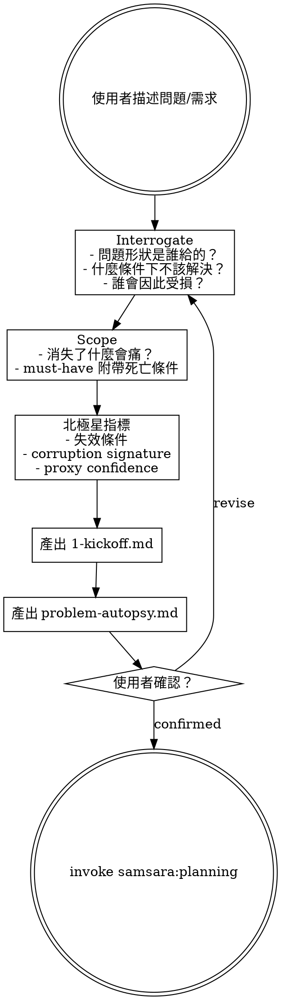

# Research — Interrogate, Scope, Define

The starting point for any new work in samsara. Before building anything, interrogate the problem itself.

> 陽面問「怎麼解決這個問題」，陰面先問「這個問題的定義是誰給的」。

## Process

## Phase 0: Interrogate

先嘗試殺死問題本身。問題活下來了，才值得往下走。

Ask these questions **one at a time** (not all at once):

1. **問題的形狀是誰給的？** 重述問題的來源。記錄原始措辭與你理解的措辭之間的差異。差異本身就是翻譯損失的第一層。
2. **這個問題在什麼條件下不應該被解決？** 列出至少兩個「即使技術上可行，也應該拒絕實作」的情境。
3. **誰會因為這個問題被解決而受損？** 任何解決方案都有成本轉移——找到承受者。
4. **「解決」狀態長什麼樣？** 三句話內描述「解決」和「沒解決」之間的可觀測差異。描述不了代表問題還沒被真正理解。

## Step 1: Scope

陰面的 scope 問：如果這個功能明天消失，系統哪個部分會痛？

- 痛的部分是真正的 scope。不痛的部分是裝飾。
- 每個 must-have 附帶**死亡條件**：在什麼度量指標低於什麼閾值時，這個 must-have 應被降級為 nice-to-have，並最終移除。
- 減法的終點不是「功能少」，而是「剩下的每一個東西都有人為它的腐爛負責」。

## Step 1.5: North Star

定義北極星指標，同時定義：

- **失效條件**：在什麼條件下這個目標本身是錯的？
- **Corruption signature**：如果指標被 game 了（數字上升但實質惡化），怎麼偵測？
- **Proxy confidence**：proxy metrics 標記為 `high | medium | low`，並定義 proxy 和 main 脫鉤的偵測機制。

## Output

產出文件存放在目標專案的 `changes/YYYY-MM-DD_<feature-name>/` 目錄下：

1. **1-kickoff.md** — 使用 `templates/kickoff.md` 模板
2. **problem-autopsy.md** — 使用 `templates/problem-autopsy.md` 模板

Format details: read support file `problem-autopsy.md`

## Transition

產出完成後，詢問使用者：

> 「Research 完成。1-kickoff.md 和 problem-autopsy.md 已寫入 `changes/<feature>/`。確認後進入 Planning？」

使用者確認後，invoke `samsara:planning` skill。
