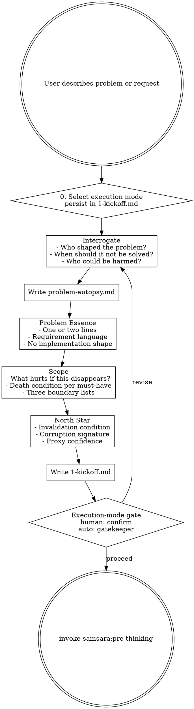

# Research — Interrogate, Scope, Define

The starting point for any new work in samsara. Before building anything, interrogate the problem itself.

> 陽面問「怎麼解決這個問題」，陰面先問「這個問題的定義是誰給的」。

## Language

Follow the Bootstrap Language Contract. Write artifact prose in the user's language.
Keep template headings and schema keys in English.

## Step 0: Execution Mode Selection

Research owns the **workflow-run execution mode**. Bootstrap routes feature work
here but does not select the mode.

Before Step 1:

1. Resolve `changes/YYYY-MM-DD_<feature-name>/` and create it when absent.
2. If that feature's `1-kickoff.md` already records exactly one valid
   `Execution mode:`, reuse it. Do not inherit a mode from another feature.
3. Otherwise ask:

   > Execution mode? Choose `human-in-the-loop` or `auto`.

   - `human-in-the-loop` is the default and waits for the user at workflow gates.
   - `auto` routes those same gates to `samsara:auto-gatekeeper`.
4. If the user does not choose, record
   `Execution mode: human-in-the-loop` and proceed. An unknown mode is invalid
   and must never silently become `auto`.
5. Initialize `1-kickoff.md` from its template and persist the exact mode before
   interrogation. Research remains the sole writer of the kickoff artifact.

Persistent config, including `samsara_config.yaml`, is out of scope. The
mode belongs to this workflow run and feature directory, not the whole session.
Later stages read it from `1-kickoff.md`.

### Debugging Handoff

When Debugging routes a repair here, consume
`bugfix/<bug>/bug-report.yaml` and `bugfix/<bug>/root-cause.yaml` as diagnosis
evidence. Record their refs in Research artifacts and do not restate the
diagnosis. Research still owns execution mode, Problem Essence, Scope Contract,
and every downstream feature artifact.

## Process

```dot
digraph research {
    node [shape=box];

    start [label="User describes problem or request" shape=doublecircle];
    mode [label="0. Select execution mode\npersist in 1-kickoff.md" shape=diamond];
    interrogate [label="Interrogate\n- Who shaped the problem?\n- When should it not be solved?\n- Who could be harmed?"];
    output_autopsy [label="Write problem-autopsy.md"];
    essence [label="Problem Essence\n- One or two lines\n- Requirement language\n- No implementation shape"];
    scope [label="Scope\n- What hurts if this disappears?\n- Death condition per must-have\n- Three boundary lists"];
    north_star [label="North Star\n- Invalidation condition\n- Corruption signature\n- Proxy confidence"];
    output_kickoff [label="Write 1-kickoff.md"];
    gate [label="Execution-mode gate\nhuman: confirm\nauto: gatekeeper" shape=diamond];
    next [label="invoke samsara:pre-thinking" shape=doublecircle];

    start -> mode;
    mode -> interrogate;
    interrogate -> output_autopsy;
    output_autopsy -> essence;
    essence -> scope;
    scope -> north_star;
    north_star -> output_kickoff;
    output_kickoff -> gate;
    gate -> next [label="proceed"];
    gate -> interrogate [label="revise"];
}
```

## Step 1: Interrogate

Attempt to kill the problem itself. Continue only if it survives.

Present these user-facing prompts **one at a time**, then apply the instruction
beneath each prompt. In `Execution mode: human-in-the-loop`, ask the user. In
`Execution mode: auto`, dispatch `samsara:auto-gatekeeper` for each Step 1 prompt,
then wait for its validated decision. Gatekeeper writes only
`auto-decisions.md`. Research applies the returned conclusion to the section it
owns and records `auto-decisions.md#decision-NNN` under `decision_refs`; Research
remains the sole writer of its artifacts. It does not copy `reason`,
`uncertainty`, or decision metadata. Resolve the ref when that detail is needed.
The stable gate IDs are listed beside each prompt.

1. `research.problem-source` — User-facing prompt:
   > 問題的形狀是誰給的？

   Restate the problem's source. Record the original wording, your reframe, and
   every difference. Every difference is the first layer of translation loss.
2. `research.do-not-solve` — User-facing prompt:
   > 這個問題在什麼條件下不應該被解決？

   Seek independent cases where implementation should be refused even if
   technically feasible. Record every case supported by the available evidence.
   Do not invent cases to satisfy a count.
3. `research.damage-recipient` — User-facing prompt:
   > 誰會因為這個問題被解決而受損？

   Every solution transfers cost. Identify each recipient and the cost or harm
   they bear.
4. `research.done-state` — User-facing prompt:
   > 「解決」狀態長什麼樣？

   State the observable difference between solved and unsolved in no more than
   three sentences. If it cannot be stated, the problem is not understood.

## Step 2: Problem Essence — a named product

Distill the surviving problem into a one- or two-line **Problem Essence** in
requirement language. Strip all implementation shape from it.

- This is the named handoff to pre-thinking.
- Research owns the requirement-language Problem Essence. Pre-thinking derives
  the structure-language Core Identity: what the code must essentially be to
  serve it. Keep them distinct.
- If the essence names a mechanism such as a cache or hook, rewrite it as a need.

## Step 3: Scope Contract

Ask which part of the system would hurt if the feature disappeared tomorrow.

- What hurts defines the real scope; what does not is decoration.
- Give every must-have a **death condition**: the metric and threshold below which
  it is demoted to nice-to-have and ultimately removed.
- The goal of subtraction is not fewer features; it is for every retained item
  to have an owner responsible for its decay.

Write one **Scope Contract** for pre-thinking. It is the sole scope authority:

1. What must be solved
2. Areas involved
3. Must-haves, each with its death condition
4. Nice-to-haves
5. What is not solved now, with one reason per item; an unexplained cut silently
   grows back

Do not restate these facts in a second boundary or scope section. Without the
must-solve boundary, involved areas, and explicit not-now boundary, pre-thinking
cannot distinguish this feature's real seams from someone else's territory.

## Step 4: North Star

Define the North Star together with:

- **Role boundary:** The North Star is the product outcome direction. It is not
  `PT-EVAL`; Pre-thinking later defines the one agent-executable evaluator.

- **Invalidation condition:** When is the goal itself wrong?
- **Corruption signature:** How will metric improvement with real-world
  degradation be detected?
- **Proxy confidence:** Mark each proxy `high | medium | low` and define a
  mechanism that detects divergence from the main metric.
- **Evidence boundary:** Do not infer metric values. Use `unknown` when a current
  value or target lacks support. Record the measurement source or missing input
  in `current_basis`, and the decision rationale or missing input in `target_basis`.

## Output

Write these files under `changes/YYYY-MM-DD_<feature-name>/` in the target project:

1. **problem-autopsy.md** — use `templates/problem-autopsy.md`
2. **1-kickoff.md** — use `templates/kickoff.md`

Artifact ownership is non-overlapping:

- **problem-autopsy.md owns** source wording, reframe, translation delta, kill
  conditions, damage recipients, the observable done state, and source refs for
  auto-mode conclusions.
- **1-kickoff.md owns** the decision-ready handoff: problem essence, one scope
  contract, evidence, risk of inaction, North Star, and
  delivery stakeholders.
- Do not restate autopsy-owned content in the kickoff; link to
  `problem-autopsy.md` instead.

Format details: read `problem-autopsy-guide.md`; write from
`templates/problem-autopsy.md`.

## Transition

After writing both artifacts, use the same transition prompt to determine the next step:

> 「Research 完成。1-kickoff.md 和 problem-autopsy.md 已寫入 `changes/<feature>/`。確認後進入 Pre-thinking？」

- If `Execution mode: human-in-the-loop`, ask the user this question. After
  confirmation, invoke `samsara:pre-thinking`; if the user asks for revision,
  revise the research artifacts and ask again.
- If `Execution mode: auto`, do not ask the user. Use the Auto Mode Gate below
  to dispatch `samsara:auto-gatekeeper`, wait for its validated
  `research.transition` decision, and follow it.

## Auto Mode Gate

Canonical protocol: `references/auto-mode.md` Stage Gate Protocol. The
Gatekeeper is the sole decision-log writer; Research writes only its own
artifacts.

- `workflow_prompt` sources and gate IDs: each Step 1 prompt uses its adjacent ID;
  `research.transition` uses the exact prompt in `## Transition`; do not restate
  it here.
- Decision points: all four Research questions and the transition.
- `proceed` invokes `samsara:pre-thinking`; `revise` revises the research
  artifacts (1-kickoff.md, problem-autopsy.md) then re-runs this gate;
  `accept_gap` first records the named gap under `problem-autopsy.md` accepted
  gaps and its ref in `1-kickoff.md`, then invokes `samsara:pre-thinking`.
