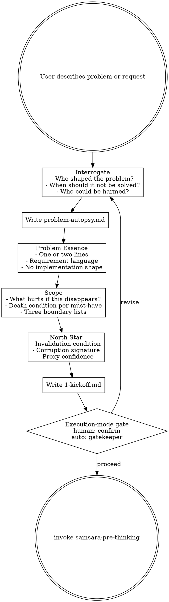

# Research — Interrogate, Scope, Define

The starting point for any new work in samsara. Before building anything, interrogate the problem itself.

> 陽面問「怎麼解決這個問題」，陰面先問「這個問題的定義是誰給的」。

## Language

Follow the Bootstrap Language Contract. Write artifact prose in the user's language.
Keep template headings and schema keys in English.

## Process

```dot
digraph research {
    node [shape=box];

    start [label="User describes problem or request" shape=doublecircle];
    interrogate [label="Interrogate\n- Who shaped the problem?\n- When should it not be solved?\n- Who could be harmed?"];
    output_autopsy [label="Write problem-autopsy.md"];
    essence [label="Problem Essence\n- One or two lines\n- Requirement language\n- No implementation shape"];
    scope [label="Scope\n- What hurts if this disappears?\n- Death condition per must-have\n- Three boundary lists"];
    north_star [label="North Star\n- Invalidation condition\n- Corruption signature\n- Proxy confidence"];
    output_kickoff [label="Write 1-kickoff.md"];
    gate [label="Execution-mode gate\nhuman: confirm\nauto: gatekeeper" shape=diamond];
    next [label="invoke samsara:pre-thinking" shape=doublecircle];

    start -> interrogate;
    interrogate -> output_autopsy;
    output_autopsy -> essence;
    essence -> scope;
    scope -> north_star;
    north_star -> output_kickoff;
    output_kickoff -> gate;
    gate -> next [label="proceed"];
    gate -> interrogate [label="revise"];
}
```

## Step 1: Interrogate

Attempt to kill the problem itself. Continue only if it survives.

Present these user-facing prompts **one at a time**, then apply the instruction
beneath each prompt:

1. User-facing prompt:
   > 問題的形狀是誰給的？

   Restate the problem's source. Record the original wording, your reframe, and
   every difference. Every difference is the first layer of translation loss.
2. User-facing prompt:
   > 這個問題在什麼條件下不應該被解決？

   Seek independent cases where implementation should be refused even if
   technically feasible. Record every case supported by the available evidence.
   Do not invent cases to satisfy a count.
3. User-facing prompt:
   > 誰會因為這個問題被解決而受損？

   Every solution transfers cost. Identify each recipient and the cost or harm
   they bear.
4. User-facing prompt:
   > 「解決」狀態長什麼樣？

   State the observable difference between solved and unsolved in no more than
   three sentences. If it cannot be stated, the problem is not understood.

## Step 2: Problem Essence — a named product

Distill the surviving problem into a one- or two-line **Problem Essence** in
requirement language. Strip all implementation shape from it.

- This is the named handoff to pre-thinking.
- Research owns the requirement-language Problem Essence. Pre-thinking derives
  the structure-language Core Identity: what the code must essentially be to
  serve it. Keep them distinct.
- If the essence names a mechanism such as a cache or hook, rewrite it as a need.

## Step 3: Scope

Ask which part of the system would hurt if the feature disappeared tomorrow.

- What hurts defines the real scope; what does not is decoration.
- Give every must-have a **death condition**: the metric and threshold below which
  it is demoted to nice-to-have and ultimately removed.
- The goal of subtraction is not fewer features; it is for every retained item
  to have an owner responsible for its decay.

Define the **Boundary Scope** for pre-thinking with three lists:

1. What must be solved
2. Areas involved
3. What is not solved now, with one reason per item; an unexplained cut silently
   grows back

Without all three lists, pre-thinking cannot distinguish this feature's real
seams from someone else's territory.

## Step 4: North Star

Define the North Star together with:

- **Invalidation condition:** When is the goal itself wrong?
- **Corruption signature:** How will metric improvement with real-world
  degradation be detected?
- **Proxy confidence:** Mark each proxy `high | medium | low` and define a
  mechanism that detects divergence from the main metric.

## Output

Write these files under `changes/YYYY-MM-DD_<feature-name>/` in the target project:

1. **problem-autopsy.md** — use `templates/problem-autopsy.md`
2. **1-kickoff.md** — use `templates/kickoff.md`

Artifact ownership is non-overlapping:

- **problem-autopsy.md owns** source wording, reframe, translation delta, kill
  conditions, damage recipients, and the observable done state.
- **1-kickoff.md owns** the decision-ready handoff: problem essence, boundary
  scope, evidence, risk of inaction, scoped commitments, North Star, and
  delivery stakeholders.
- Do not restate autopsy-owned content in the kickoff; link to
  `problem-autopsy.md` instead.

Format details: read `problem-autopsy-guide.md`; write from
`templates/problem-autopsy.md`.

## Transition

After writing both artifacts, use the same transition prompt to determine the next step:

> 「Research 完成。1-kickoff.md 和 problem-autopsy.md 已寫入 `changes/<feature>/`。確認後進入 Pre-thinking？」

- If `Execution mode: human-in-the-loop`, ask the user this question. After
  confirmation, invoke `samsara:pre-thinking`; if the user asks for revision,
  revise the research artifacts and ask again.
- If `Execution mode: auto`, do not ask the user. Use the Auto Mode Gate below
  to dispatch `samsara:auto-gatekeeper`, record the decision, and follow the
  recorded decision.

## Auto Mode Gate

Canonical protocol: `references/auto-mode.md` Stage Gate Protocol —
dispatch, the append-only decision log, and what `proceed`/`revise`/
`reject`/`accept_gap` mean all live there; this section only names what
Research adds.

- `workflow_prompt` source: the transition prompt below.

  > 「Research 完成。1-kickoff.md 和 problem-autopsy.md 已寫入 `changes/<feature>/`。確認後進入 Pre-thinking？」

- Decision points this gate covers: the research → pre-thinking transition
  (one decision point).
- `proceed` invokes `samsara:pre-thinking`; `revise` revises the research
  artifacts (1-kickoff.md, problem-autopsy.md) then re-runs this gate;
  `accept_gap` invokes `samsara:pre-thinking` with the gap visible.
