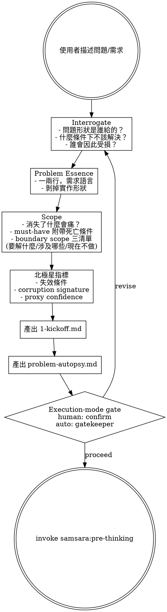

# Research — Interrogate, Scope, Define

The starting point for any new work in samsara. Before building anything, interrogate the problem itself.

> 陽面問「怎麼解決這個問題」，陰面先問「這個問題的定義是誰給的」。

## Process

```dot
digraph research {
    node [shape=box];

    start [label="使用者描述問題/需求" shape=doublecircle];
    interrogate [label="Interrogate\n- 問題形狀是誰給的？\n- 什麼條件下不該解決？\n- 誰會因此受損？"];
    essence [label="Problem Essence\n- 一兩行，需求語言\n- 剝掉實作形狀"];
    scope [label="Scope\n- 消失了什麼會痛？\n- must-have 附帶死亡條件\n- boundary scope 三清單\n(要解什麼/涉及哪些/現在不做)"];
    north_star [label="北極星指標\n- 失效條件\n- corruption signature\n- proxy confidence"];
    output_kickoff [label="產出 1-kickoff.md"];
    output_autopsy [label="產出 problem-autopsy.md"];
    gate [label="Execution-mode gate\nhuman: confirm\nauto: gatekeeper" shape=diamond];
    next [label="invoke samsara:pre-thinking" shape=doublecircle];

    start -> interrogate;
    interrogate -> essence;
    essence -> scope;
    scope -> north_star;
    north_star -> output_kickoff;
    output_kickoff -> output_autopsy;
    output_autopsy -> gate;
    gate -> next [label="proceed"];
    gate -> interrogate [label="revise"];
}
```

## Phase 0: Interrogate

先嘗試殺死問題本身。問題活下來了，才值得往下走。

Ask these questions **one at a time** (not all at once):

1. **問題的形狀是誰給的？** 重述問題的來源。記錄原始措辭與你理解的措辭之間的差異。差異本身就是翻譯損失的第一層。
2. **這個問題在什麼條件下不應該被解決？** 列出至少兩個「即使技術上可行，也應該拒絕實作」的情境。
3. **誰會因為這個問題被解決而受損？** 任何解決方案都有成本轉移——找到承受者。
4. **「解決」狀態長什麼樣？** 三句話內描述「解決」和「沒解決」之間的可觀測差異。描述不了代表問題還沒被真正理解。

## Step 0.5: Problem Essence — a named product

Interrogation 存活下來的問題，蒸餾成一兩行的**問題本質（需求語言）**：真正要解的是什麼，剝掉任何實作形狀。這是交棒給 pre-thinking 的具名產物——pre-thinking 會從它蒸餾出「結構身分（結構語言：code 本質上該是什麼才服務得了它）」，兩者是**兩個不同的產物**，research 只負責前者。

檢驗：本質若寫出了機制（「加一個 cache」「用一個 hook」），那是解法穿著問題的衣服——重寫成需求。

## Step 1: Scope

陰面的 scope 問：如果這個功能明天消失，系統哪個部分會痛？

- 痛的部分是真正的 scope。不痛的部分是裝飾。
- 每個 must-have 附帶**死亡條件**：在什麼度量指標低於什麼閾值時，這個 must-have 應被降級為 nice-to-have，並最終移除。
- 減法的終點不是「功能少」，而是「剩下的每一個東西都有人為它的腐爛負責」。

**Boundary Scope（給 pre-thinking 的邊界範圍）**：用三個清單把「結構思考發生在哪個範圍內」框出來——**真正要解什麼／涉及哪些／哪些現在不做**。沒有這個範圍，pre-thinking 分不清哪些是本 feature 的真接縫、哪些是別人的地盤。「現在不做」的每一項附一行為什麼現在不做——沒有理由的減法會靜默長回來。

## Step 1.5: North Star

定義北極星指標，同時定義：

- **失效條件**：在什麼條件下這個目標本身是錯的？
- **Corruption signature**：如果指標被 game 了（數字上升但實質惡化），怎麼偵測？
- **Proxy confidence**：proxy metrics 標記為 `high | medium | low`，並定義 proxy 和 main 脫鉤的偵測機制。

## Output

產出文件存放在目標專案的 `changes/YYYY-MM-DD_<feature-name>/` 目錄下：

1. **1-kickoff.md** — 使用 `templates/kickoff.md` 模板
2. **problem-autopsy.md** — 使用 `templates/problem-autopsy.md` 模板

Format details: read support file `problem-autopsy.md`

## Transition

產出完成後，使用同一個 transition prompt 決定下一步：

> 「Research 完成。1-kickoff.md 和 problem-autopsy.md 已寫入 `changes/<feature>/`。確認後進入 Pre-thinking？」

- If `Execution mode: human-in-the-loop`, ask the user this question. After
  confirmation, invoke `samsara:pre-thinking`; if the user asks for revision,
  revise the research artifacts and ask again.
- If `Execution mode: auto`, do not ask the user. Use the Auto Mode Gate below
  to dispatch `samsara:auto-gatekeeper`, record the decision, and follow the
  recorded decision.

## Auto Mode Gate

Canonical protocol: `references/auto-mode.md` Stage Gate Protocol —
dispatch, the append-only decision log, and what `proceed`/`revise`/
`reject`/`accept_gap` mean all live there; this section only names what
Research adds.

- `workflow_prompt` source: the transition prompt below.

  > 「Research 完成。1-kickoff.md 和 problem-autopsy.md 已寫入 `changes/<feature>/`。確認後進入 Pre-thinking？」

- Decision points this gate covers: the research → pre-thinking transition
  (one decision point).
- `proceed` invokes `samsara:pre-thinking`; `revise` revises the research
  artifacts (1-kickoff.md, problem-autopsy.md) then re-runs this gate;
  `accept_gap` invokes `samsara:pre-thinking` with the gap visible.
