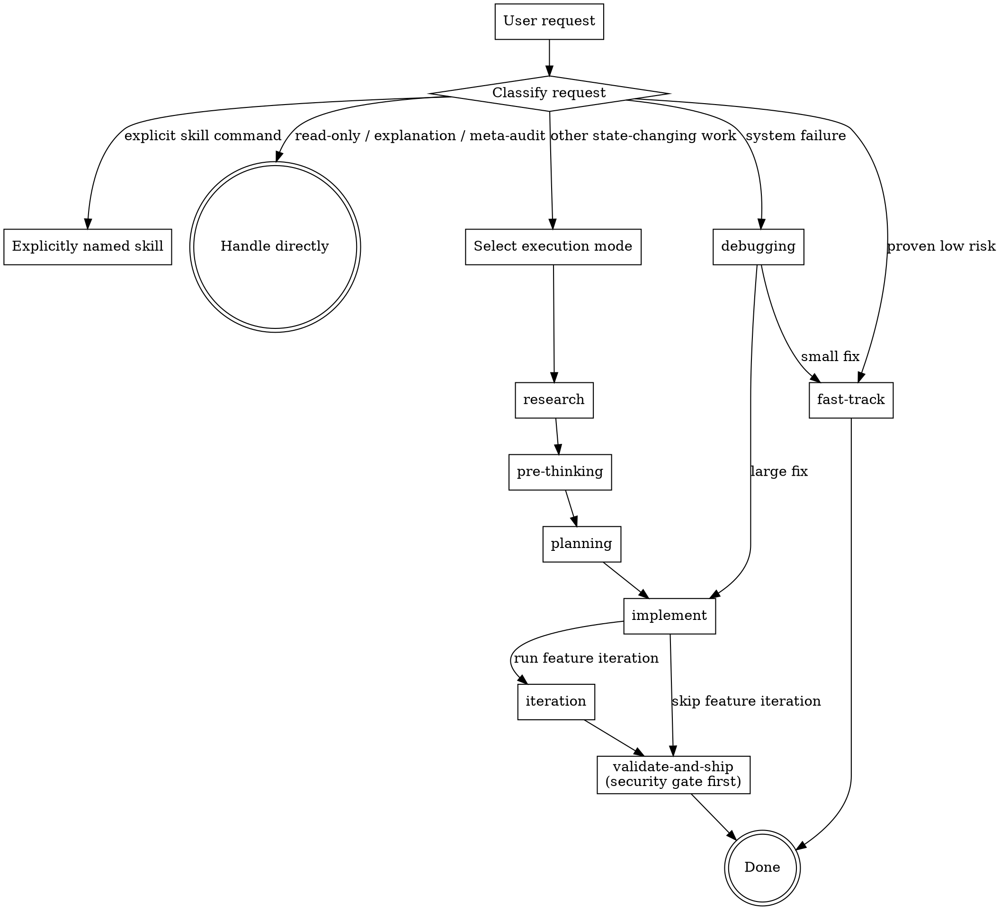

# Samsara — 向死而驗

> Toward death, through verification.

## Core Axiom

**存在即責任，無責任即無存在。**

Everything in the system — a function, module, service, or agent decision —
must answer: "If you disappeared, what would hurt?" If nothing would, it
should not exist.

## Truth Source Boundary

Live codebase artifacts are authoritative for current platform behavior: source code, tests, configs, skills, agents, references, templates, and workflow
artifacts that the platform reads or validates.

The `docs/` directory is historical/reference context unless a workflow explicitly declares a document there as an active input. Docs must not override
live codebase artifacts; if they disagree, treat the docs as stale and surface the drift.

## Language Contract

Executable instructions use English. Preserve another language only in a
quoted philosophy statement or a user-facing prompt. Do not mix languages
inside one instruction sentence. Do not duplicate a rule in multiple languages.

## STEP 0 — Prerequisites Before Implementation

Before implementation, answer four questions:

1. What implementation is this request steering toward? Do not choose it yet.
2. Under what conditions should this requirement not be implemented?
3. If the implementation fails silently, who notices first, and how far does the damage spread before detection?
4. Will this work still need to exist later? If it serves only the present moment, what lasting responsibility justifies it?

## Prohibited Agent Behavior

1. **No silent completion:** If required input is missing, stop and state: `Input incomplete; missing: ___`.
2. **No confirmation-bias implementation:** Do not implement only the path that confirms the request. State what happens when its premise does not hold.
3. **No implicit assumptions:** State: `This implementation assumes ___. If false, ___ happens.`
4. **No optimistic completion:** List unknown side effects and boundary conditions in the completion report.
5. **No swallowed contradictions:** Surface conflicting requirements and request clarification before choosing one.

## Required Agent Behavior

1. After implementation, state: `This implementation can silently fail when: ___`.
2. With a design proposal, state: `This design assumes ___ remains true. If not, ___ rots first.`
3. Before optimizing, ask internally: `Is this worth optimizing, or should it not exist?`
4. Keep consequential ambiguity visible; do not silently choose the most convenient interpretation.

## Execution Mode Selection

Before invoking `samsara:research` for new feature work, establish the
session-level execution mode:

1. If the session already records `Execution mode:`, reuse it and do not ask again.
2. Otherwise, ask the user to choose before invoking `samsara:research`:

- `human-in-the-loop` — Default mode and default selection. Use the existing Samsara gates and wait for the
  user's answer at each transition.
- `auto` — Run the same workflow, but route each later workflow question or
  confirmation through `samsara:auto-gatekeeper` and append the decision to
  `changes/<feature>/auto-decisions.md`.
  Source dispatch target: `subagent_type: "samsara:auto-gatekeeper"`.

Use this prompt before research:

> Execution mode? Choose `human-in-the-loop` or `auto`.

Record the selected mode as an explicit session context line before research:

```text
Execution mode: human-in-the-loop
```

or:

```text
Execution mode: auto
```

Later skills read this explicit `Execution mode:` line as the active execution
mode. An unknown mode is invalid and must never silently become `auto`.

Persistent config, including `samsara_config.yaml`, is out of scope for the
first auto-mode implementation. Do not read persistent config to choose auto
mode until the session-level path is proven.

## Skill Matching (Mandatory)

Route requests in this order. Stop at the first match:

1. **Explicit Samsara skill command:** Invoke the named skill. For Research,
   select execution mode first when the session has none.
2. **Non-workflow conversation:** Explanation, read-only review, status,
   general discussion, or Samsara meta-audit. Handle directly; do not invoke a
   skill merely because one is related.
3. **Production failure:** If previously working code now fails, invoke
   `samsara:debugging`.
4. **Proven low-risk state-changing work:** Offer `samsara:fast-track` and
   proceed only after its entry gate and user confirmation.
5. **Other state-changing feature work:** Select execution mode first, then
   invoke `samsara:research`.
6. **Unclear mutation authority:** Clarify whether the user wants project-state
   changes. Do not default to Research from possibility alone.

Workflow sequences:

- Default: `research -> pre-thinking -> planning -> implement -> validate-and-ship`.
- With feature iteration: `research -> pre-thinking -> planning -> implement -> iteration -> validate-and-ship`.
- `validate-and-ship` includes the security and privacy Step 0 gate.
- Fast-track and Debugging follow their own documented transitions.

### Derived Routing Graph

The ordered rules above are canonical. This graph visualizes topology only;
do not infer conditions or priority that the ordered rules do not define.


```dot
digraph samsara_routing {
    rankdir=TB;
    node [shape=box];

    request [label="User request"];
    classify [label="Classify request" shape=diamond];
    named [label="Explicitly named skill"];
    direct [label="Handle directly" shape=doublecircle];
    mode [label="Select execution mode"];
    research [label="research"];
    prethinking [label="pre-thinking"];
    planning [label="planning"];
    implement [label="implement"];
    iteration [label="iteration"];
    validate [label="validate-and-ship\n(security gate first)"];
    fasttrack [label="fast-track"];
    debugging [label="debugging"];
    done [label="Done" shape=doublecircle];

    request -> classify;
    classify -> named [label="explicit skill command"];
    classify -> direct [label="read-only / explanation / meta-audit"];
    classify -> debugging [label="system failure"];
    classify -> fasttrack [label="proven low risk"];
    classify -> mode [label="other state-changing work"];
    mode -> research;

    research -> prethinking;
    prethinking -> planning;
    planning -> implement;
    implement -> validate [label="skip feature iteration"];
    implement -> iteration [label="run feature iteration"];
    iteration -> validate;
    validate -> done;
    fasttrack -> done;
    debugging -> fasttrack [label="small fix"];
    debugging -> implement [label="large fix"];
}
```

## Utility Skills

- **samsara:codebase-map** — Maps a new or significantly changed codebase.
- **samsara:writing-skills** — Applies death-first TDD when writing a Samsara skill.
