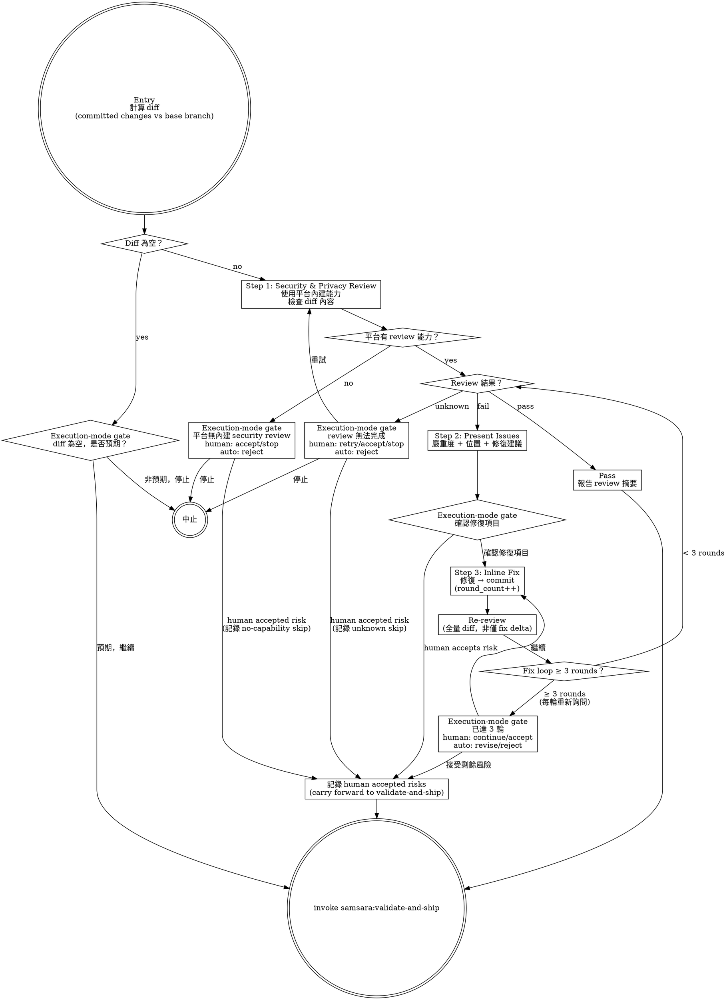

# Security & Privacy Review — Gate Before Ship

Review committed changes for security and privacy issues before entering validation. Uses the platform's built-in security review capability — no custom tooling.

> 陽面問「功能做完了嗎」，陰面問「功能做完的同時，有沒有把鑰匙也一起交出去」。

## Prerequisites

- All implementation tasks completed and committed (from implement or iteration)
- A feature branch with commits ahead of the base branch (typically `main`)

## Process



## Entry: Compute Diff

Compute the diff of committed changes against the base branch:

```bash
git diff <base-branch>...HEAD
```

Before proceeding, check for two edge cases:

**Empty diff:**
> 「Diff 為空 — implement/iteration 後沒有新的 committed changes。這是預期的嗎？
>
> (A) 預期，跳過 security review 繼續
> (B) 非預期，停止檢查」

**Cannot determine base branch:**
> 「無法判斷 base branch。請指定 diff 的比較基準（例如 `main`、`develop`）。」

Route both edge-case decisions by execution mode:

- If `Execution mode: human-in-the-loop`, ask the user the relevant edge-case
  prompt and follow the selected action.
- If `Execution mode: auto`, do not ask the user. Use the Auto Mode Gate below
  to dispatch `samsara:auto-gatekeeper`, append the decision to
  `auto-decisions.md`, and follow the recorded decision. Missing base branch or
  unexpected empty diff must record high-uncertainty `reject`.

## Step 1: Security & Privacy Review

Use the current platform's built-in security and privacy review capability to analyze the diff.

**Platform-agnostic instruction:** This skill does NOT specify which tool to invoke. The executing agent determines the mechanism based on the current platform's available capabilities. Examples:
- Claude Code: may use built-in `security-review` skill or equivalent
- Other platforms: use whatever security review capability is available

**If the platform has no built-in security review capability:**
> 「當前平台無內建 security & privacy review 能力。
>
> (A) 你自行檢查後確認繼續
> (B) 停止」

This is a visible degradation, not a silent skip.

- If `Execution mode: human-in-the-loop`, ask the user this question. If the
  human chooses (A), record it as an accepted risk and carry it forward to
  validate-and-ship (see `accept_risk` node in the process graph).
- If `Execution mode: auto`, do not ask the user. Use the Auto Mode Gate below
  to dispatch `samsara:auto-gatekeeper`; absent review capability must append a
  high-uncertainty `reject` decision to `auto-decisions.md`.

**Review scope:** The review should cover the FULL diff — all files changed in the feature branch relative to the base branch. The agent should report which files were included in the review.

## Step 2: Result Handling

Review results must be exactly one of three states:

### Pass

No security or privacy issues detected. Report:
- Summary of what was reviewed (file count, file types)
- Transition to validate-and-ship

### Fail

Issues detected. Report:
- Each issue with: severity (critical / high / medium / low), file and location, description, suggested fix
- Group by severity, critical first

Then route the issue decision by execution mode:
> 「Security & privacy review 發現以下問題：
>
> [issue list]
>
> (A) 修復以上問題
> (B) 選擇要修復的項目（輸入編號）
> (C) 接受風險，繼續（必須說明理由）」

- If `Execution mode: human-in-the-loop`, ask the user this question and follow
  the selected action.
- If `Execution mode: auto`, do not ask the user. Use the Auto Mode Gate below
  to dispatch `samsara:auto-gatekeeper`, append the decision to
  `auto-decisions.md`, and follow the recorded fix selection. Accepted risk is
  invalid in auto mode for security/privacy gates.

### Unknown

Review could not complete (timeout, partial results, tool error). This is NOT a pass.
> 「Security review 無法完成。原因：___
>
> (A) 重試
> (B) 你自行確認後繼續
> (C) 停止」

Route the unknown-result decision by execution mode:

- If `Execution mode: human-in-the-loop`, ask the user this question. If the
  human chooses (B), record it as an accepted risk and carry it forward to
  validate-and-ship.
- If `Execution mode: auto`, do not ask the user. Use the Auto Mode Gate below
  to dispatch `samsara:auto-gatekeeper`; unknown, partial, timed-out, or errored
  review must append a high-uncertainty `reject` decision to
  `auto-decisions.md`.

## Step 3: Fix Loop

When issues are selected for fixing:

- If `Execution mode: human-in-the-loop`, the selection comes from the human
  gate in Step 2.
- If `Execution mode: auto`, do not ask the user. Use the Auto Mode Gate below
  to dispatch `samsara:auto-gatekeeper`; fix selection must be recorded in
  `auto-decisions.md` before any fix begins.

1. Agent performs inline fix (no subagent dispatch)
2. Commit the fix
3. Increment round counter (one round = one `fix → commit → re-review` cycle)
4. Re-run security review on the **full diff** (not just the fix delta) — fixes can introduce new issues
5. Return to Step 2 result handling

**Round counting:** A round is one complete `fix → commit → re-review` cycle. The counter starts at 0 on entry and increments after each commit. Partial fixes (started but not committed) do not count.

**Safety valve:** From round 3 onward, the safety gate triggers every round (not just once):
> 「已執行 3 輪修復。剩餘問題：
>
> [remaining issues]
>
> (A) 繼續修復（超出常規輪數）
> (B) 接受剩餘風險，繼續」

- If `Execution mode: human-in-the-loop`, ask the user this safety prompt and
  follow the selected action.
- If `Execution mode: auto`, do not ask the user. Use the Auto Mode Gate below
  to dispatch `samsara:auto-gatekeeper`; continuing requires a recorded
  `revise` decision, while accepting remaining security/privacy risk is invalid
  in auto mode.

**Accepted risks carry forward:** If the human accepts remaining risks in
`human-in-the-loop` mode, these must be mentioned when presenting the transition
to validate-and-ship, so the ship manifest can record them. Auto mode must not
accept security/privacy risk; it records `revise` for fixable issues or
high-uncertainty `reject` when safe fixing is not possible.

## Yin-Side Constraints

- **No silent pass-through:** empty diff, unknown results, absent platform capability — all must go through the active execution-mode gate, never silently treated as pass
- **Full diff re-review:** fix loop must re-review the entire diff, not just the fix delta. Fixes can introduce new vulnerabilities
- **Unknown ≠ pass:** partial, timed-out, or errored review results are `unknown`, never `pass`
- **Accepted risks are explicit:** any risk acceptance by a human in
  `human-in-the-loop` mode must carry forward to validate-and-ship; auto mode
  must reject rather than accept security/privacy risk

## Red Flags

**Never:**
- Silently skip the review step (even if diff is small or "looks safe")
- Treat unknown/partial review results as pass
- Re-review only the fix delta instead of the full diff
- Accept risks on human's behalf — only a human in `human-in-the-loop` mode can
  accept security risks; auto mode must reject instead
- Name a specific platform tool in this skill (maintain platform-agnostic)

**Watch for:**
- Review that always passes — may indicate narrow review scope
- Same issue reappearing across fix rounds — may indicate architectural problem, not point fix
- Human accepting all risks without reading — gate losing effectiveness

## Transition

Review passed (or a human accepted remaining risks in `human-in-the-loop` mode).
Then use the security/privacy completion prompt to decide the next workflow path:

> 「Security & privacy review 完成。[N files reviewed, M issues found in final review, K fixed across R rounds, J accepted as risk]。進入 Validation。」

- If `Execution mode: human-in-the-loop`, present the completion prompt to the
  user and invoke `samsara:validate-and-ship`.
- If `Execution mode: auto`, do not ask the user. Use the Auto Mode Gate below
  to dispatch `samsara:auto-gatekeeper`, append the decision to
  `auto-decisions.md`, and invoke `samsara:validate-and-ship` only when the
  recorded decision has concrete pass evidence.

## Auto Mode Gate

When the session context contains `Execution mode: auto`, keep the security and
privacy gate but route every transition decision through
`samsara:auto-gatekeeper` instead of pausing for input.
Dispatch it with the Agent tool using `subagent_type: "samsara:auto-gatekeeper"`.

The gatekeeper must append an append-only entry to
`changes/<feature>/auto-decisions.md` before continuing. Use the canonical
schema in `references/auto-mode.md`; this stage must provide `prompt_type`,
`workflow_prompt`, and `gatekeeper_answer` for each entry.

Use the security/privacy review result prompt as `workflow_prompt`, including
the diff scope, capability state, review result, issues found, and evidence
checked.

Auto mode may proceed only when review evidence is pass. If review capability is
absent, review result is `unknown`, review result is failing, or evidence is
partial, the gatekeeper must record a high-uncertainty `reject` decision and
must not transition to validate-and-ship.

The auto gate overrides every internal security/privacy decision point:

- empty diff: proceed only when the gatekeeper records evidence that the empty
  diff is expected; otherwise record high-uncertainty `reject`.
- base branch cannot be determined: record high-uncertainty `reject`.
- no built-in security review capability: record high-uncertainty `reject`.
- unknown result, timeout, partial result, or tool error: record high-uncertainty
  `reject`.
- fail result or unresolved issues: record `revise` for fixable issues or
  high-uncertainty `reject` when the issue set cannot be fixed safely.
- accepted risk: invalid in auto mode for security/privacy gates.

Then follow the recorded decision:

- `proceed` — invoke `samsara:validate-and-ship` only when the decision records
  concrete pass evidence.
- `revise` — fix the recorded security/privacy issues, then re-run this gate.
- `reject` — stop the auto run and leave the rejection in `auto-decisions.md`.
- `accept_gap` — invalid for absent, unknown, failing, or partial security/privacy
  evidence in auto mode.
