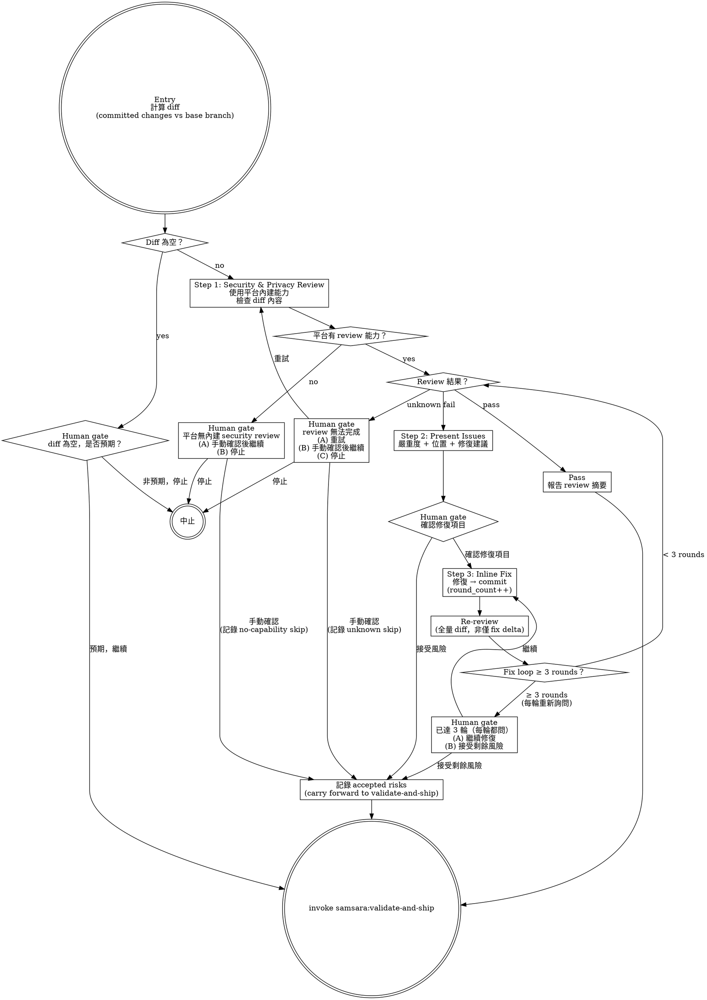

# Security & Privacy Review — Gate Before Ship

Review committed changes for security and privacy issues before entering validation. Uses the platform's built-in security review capability — no custom tooling.

> 陽面問「功能做完了嗎」，陰面問「功能做完的同時，有沒有把鑰匙也一起交出去」。

## Prerequisites

- All implementation tasks completed and committed (from implement or iteration)
- A feature branch with commits ahead of the base branch (typically `main`)

## Process



## Entry: Compute Diff

Compute the diff of committed changes against the base branch:

```bash
git diff <base-branch>...HEAD
```

Before proceeding, check for two edge cases:

**Empty diff:**
> 「Diff 為空 — implement/iteration 後沒有新的 committed changes。這是預期的嗎？
>
> (A) 預期，跳過 security review 繼續
> (B) 非預期，停止檢查」

**Cannot determine base branch:**
> 「無法判斷 base branch。請指定 diff 的比較基準（例如 `main`、`develop`）。」

## Step 1: Security & Privacy Review

Use the current platform's built-in security and privacy review capability to analyze the diff.

**Platform-agnostic instruction:** This skill does NOT specify which tool to invoke. The executing agent determines the mechanism based on the current platform's available capabilities. Examples:
- Claude Code: may use built-in `security-review` skill or equivalent
- Other platforms: use whatever security review capability is available

**If the platform has no built-in security review capability:**
> 「當前平台無內建 security & privacy review 能力。
>
> (A) 你自行檢查後確認繼續
> (B) 停止」

This is a visible degradation, not a silent skip. If human chooses (A), this is recorded as an accepted risk and carried forward to validate-and-ship (see `accept_risk` node in the process graph).

**Review scope:** The review should cover the FULL diff — all files changed in the feature branch relative to the base branch. The agent should report which files were included in the review.

## Step 2: Result Handling

Review results must be exactly one of three states:

### Pass

No security or privacy issues detected. Report:
- Summary of what was reviewed (file count, file types)
- Transition to validate-and-ship

### Fail

Issues detected. Present to human:
- Each issue with: severity (critical / high / medium / low), file and location, description, suggested fix
- Group by severity, critical first

Then human gate:
> 「Security & privacy review 發現以下問題：
>
> [issue list]
>
> (A) 修復以上問題
> (B) 選擇要修復的項目（輸入編號）
> (C) 接受風險，繼續（必須說明理由）」

### Unknown

Review could not complete (timeout, partial results, tool error). This is NOT a pass.
> 「Security review 無法完成。原因：___
>
> (A) 重試
> (B) 你自行確認後繼續
> (C) 停止」

If human chooses (B), this is recorded as an accepted risk and carried forward to validate-and-ship.

## Step 3: Fix Loop

When human confirms issues to fix:

1. Agent performs inline fix (no subagent dispatch)
2. Commit the fix
3. Increment round counter (one round = one `fix → commit → re-review` cycle)
4. Re-run security review on the **full diff** (not just the fix delta) — fixes can introduce new issues
5. Return to Step 2 result handling

**Round counting:** A round is one complete `fix → commit → re-review` cycle. The counter starts at 0 on entry and increments after each commit. Partial fixes (started but not committed) do not count.

**Safety valve:** From round 3 onward, the safety gate triggers every round (not just once):
> 「已執行 3 輪修復。剩餘問題：
>
> [remaining issues]
>
> (A) 繼續修復（超出常規輪數）
> (B) 接受剩餘風險，繼續」

**Accepted risks carry forward:** If human accepts remaining risks, these must be mentioned when presenting the transition to validate-and-ship, so the ship manifest can record them.

## Yin-Side Constraints

- **No silent pass-through:** empty diff, unknown results, absent platform capability — all must be made visible to human, never silently treated as pass
- **Full diff re-review:** fix loop must re-review the entire diff, not just the fix delta. Fixes can introduce new vulnerabilities
- **Unknown ≠ pass:** partial, timed-out, or errored review results are `unknown`, never `pass`
- **Accepted risks are explicit:** any risk acceptance by human must carry forward to validate-and-ship

## Red Flags

**Never:**
- Silently skip the review step (even if diff is small or "looks safe")
- Treat unknown/partial review results as pass
- Re-review only the fix delta instead of the full diff
- Accept risks on human's behalf — only human can accept security risks
- Name a specific platform tool in this skill (maintain platform-agnostic)

**Watch for:**
- Review that always passes — may indicate narrow review scope
- Same issue reappearing across fix rounds — may indicate architectural problem, not point fix
- Human accepting all risks without reading — gate losing effectiveness

## Transition

Review passed (or human accepted remaining risks). Then:

> 「Security & privacy review 完成。[N files reviewed, M issues found in final review, K fixed across R rounds, J accepted as risk]。進入 Validation。」

Invoke `samsara:validate-and-ship` skill.
