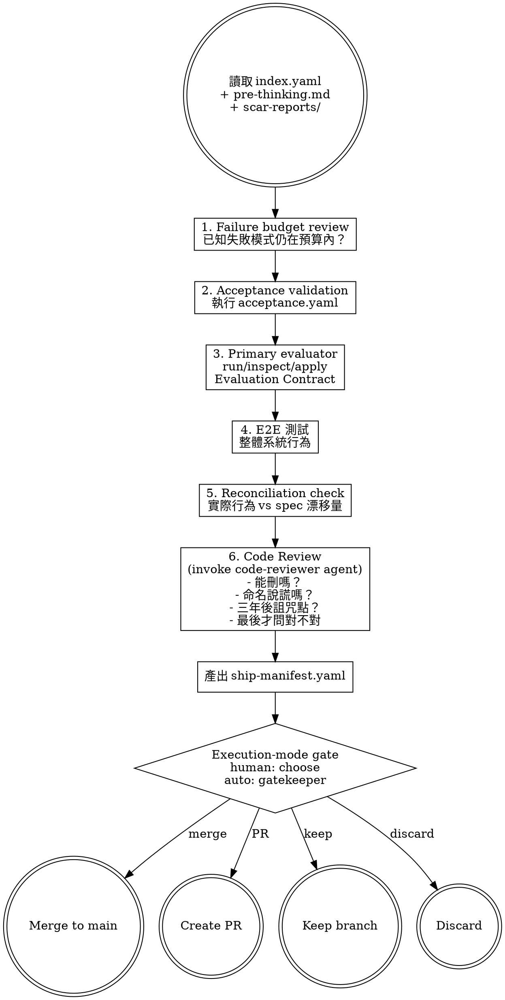

# Validate and Ship — Autopsy Before Release

Run yin-side validation, review failure budgets, and prepare a ship manifest that documents what you're delivering along with its known wounds.

> 陽面交付功能。陰面交付功能加上它的死法清單。

## Prerequisites

Read from the feature's `changes/` directory:
- `index.yaml` — all tasks should be `done` or `done_with_concerns`
- `pre-thinking.md` — Evaluation Contract and Primary evaluator
- `acceptance.yaml` — acceptance criteria to validate against
- `scar-reports/` — all scar reports from implementation

## Process

## Validation Steps (Yin-Side Order)

### 1. Failure Budget Review

Aggregate all scar reports. Answer:
- How many `silent_failure_conditions` across all tasks?
- How many `unverified assumptions`?
- Are these within acceptable limits for shipping?
- Any new silent failure paths discovered during implementation that weren't in the original death cases?

### 2. Acceptance Validation

Run acceptance criteria from `acceptance.yaml`:
- Execute death_path scenarios first
- Then degradation scenarios
- Then happy_path scenarios
- Report: which passed, which failed, which could not be tested

### 3. Primary Evaluator

Read the Evaluation Contract from `pre-thinking.md`. Run, inspect, or apply the **Primary evaluator** exactly as specified:
- Report the `Pass signal` or `Fail signal`
- If it fails, follow the documented `Feedback loop` before declaring validation complete
- If the evaluator cannot be performed, mark validation `blocked_by_evaluator`, not passed

Acceptance criteria, TDD, death-path tests, and E2E tests are supporting evidence. They do not replace the Primary evaluator.

### 4. E2E Testing

If the project has E2E tests, run them. Report results.

### 5. Reconciliation Check

Compare the actual implementation against the spec (`2-plan.md`):
- Did any behavior drift from what was specified?
- Is the drift within acceptable tolerance?
- Document any intentional deviations and their rationale

### 6. Code Review

Invoke the `code-reviewer` agent. The reviewer follows yin-side question order:
1. Can this code be deleted?
2. Are there dishonest names? (variable says `is_done` but unknown outcomes are also marked done)
3. Where would a maintainer curse you in three years?
4. Only then: is this code correct?

## Output

Write `ship-manifest.yaml` using the template. See support file `ship-manifest.md` for format details.

## Transition

Ship manifest complete. Use the validation completion and delivery prompt to
decide the final workflow path:

> 「Validation 完成。Ship manifest 已寫入。選擇交付方式：
>
> (A) Merge to main
> (B) Create PR
> (C) Keep branch（不合併）
> (D) Discard（放棄此分支）」

- If `Execution mode: human-in-the-loop`, present exactly these four options to
  the user and execute the user's choice.
- If `Execution mode: auto`, do not ask the user. Use the Auto Mode Gate below
  to dispatch `samsara:auto-gatekeeper`, append the final delivery decision to
  `auto-decisions.md`, verify the full decision trace, and prepare the recorded
  delivery action.

## Auto Mode Gate

When the session context contains `Execution mode: auto`, keep validation and
ship readiness checks but route the final completion decision through
`samsara:auto-gatekeeper` instead of pausing for input.
Dispatch it with the Agent tool using `subagent_type: "samsara:auto-gatekeeper"`.

Before the final validation decision, validate prior gate entries in the
append-only decision trace at `changes/<feature>/auto-decisions.md`. The
validation must confirm that every workflow question or confirmation before the
current validation completion gate has a matching entry with `workflow_prompt`
and `gatekeeper_answer`. Missing, malformed, generic, or contradictory entries
must fail validation.

The gatekeeper must append an append-only entry to
`changes/<feature>/auto-decisions.md` before continuing. Use the canonical
schema in `references/auto-mode.md`; this stage must provide `prompt_type`,
`workflow_prompt`, and `gatekeeper_answer` for the entry.

Use the validation completion and delivery choice as `workflow_prompt`, including
the primary evaluator result, acceptance validation result, failure budget, and
ship manifest status.

after appending the final validation decision, run the trace check again. The
second check must include the final validation `workflow_prompt` and
`gatekeeper_answer`; if the final entry is missing, malformed, generic, or
contradictory, the run must fail validation before completion.

Then follow the recorded decision:

- `proceed` — complete validation and prepare the recorded delivery action.
- `revise` — revise validation outputs or ship manifest, then re-run this gate.
- `reject` — stop the auto run and leave the rejection in `auto-decisions.md`.
- `accept_gap` — continue only if the accepted gap is recorded in both
  `auto-decisions.md` and the ship manifest.
