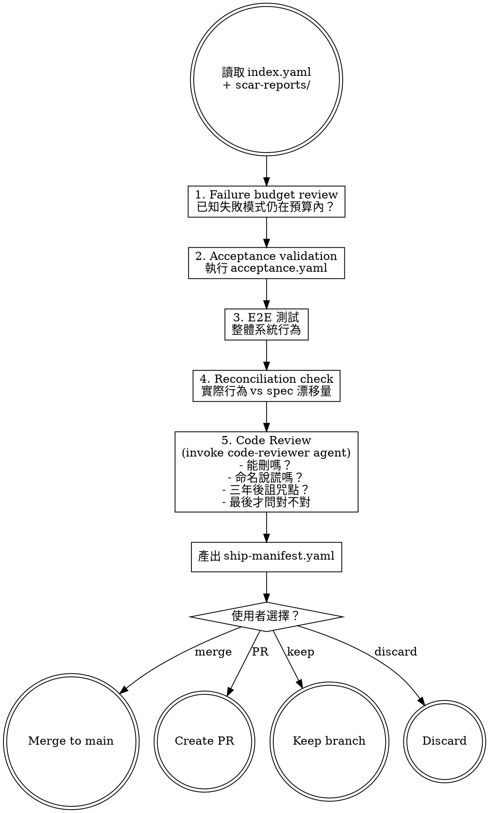

# Validate and Ship — Autopsy Before Release

Run yin-side validation, review failure budgets, and prepare a ship manifest that documents what you're delivering along with its known wounds.

> 陽面交付功能。陰面交付功能加上它的死法清單。

## Prerequisites

Read from the feature's `changes/` directory:
- `index.yaml` — all tasks should be `done` or `done_with_concerns`
- `acceptance.yaml` — acceptance criteria to validate against
- `scar-reports/` — all scar reports from implementation

## Process

## Validation Steps (Yin-Side Order)

### 1. Failure Budget Review

Aggregate all scar reports. Answer:
- How many `silent_failure_conditions` across all tasks?
- How many `unverified assumptions`?
- Are these within acceptable limits for shipping?
- Any new silent failure paths discovered during implementation that weren't in the original death cases?

### 2. Acceptance Validation

Run acceptance criteria from `acceptance.yaml`:
- Execute death_path scenarios first
- Then degradation scenarios
- Then happy_path scenarios
- Report: which passed, which failed, which could not be tested

### 3. E2E Testing

If the project has E2E tests, run them. Report results.

### 4. Reconciliation Check

Compare the actual implementation against the spec (`2-plan.md`):
- Did any behavior drift from what was specified?
- Is the drift within acceptable tolerance?
- Document any intentional deviations and their rationale

### 5. Code Review

Invoke the `code-reviewer` agent. The reviewer follows yin-side question order:
1. Can this code be deleted?
2. Are there dishonest names? (variable says `is_done` but unknown outcomes are also marked done)
3. Where would a maintainer curse you in three years?
4. Only then: is this code correct?

## Output

Write `ship-manifest.yaml` using the template. See support file `ship-manifest.md` for format details.

## Transition

Ship manifest complete. Present exactly four options:

> 「Validation 完成。Ship manifest 已寫入。選擇交付方式：
>
> (A) Merge to main
> (B) Create PR
> (C) Keep branch（不合併）
> (D) Discard（放棄此分支）」

Execute the user's choice.
