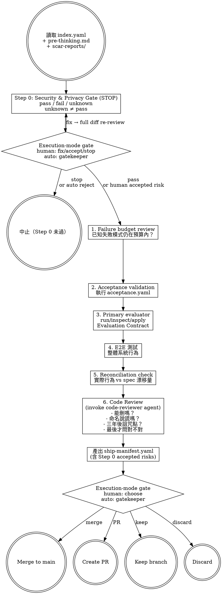

# Validate and Ship — Autopsy Before Release

Run yin-side validation, review failure budgets, and prepare a ship manifest that documents what you're delivering along with its known wounds. Step 0 is a security & privacy review STOP gate — it runs first and cannot be skipped.

> 陽面交付功能。陰面交付功能加上它的死法清單。

## Prerequisites

Read from the feature's `changes/` directory:
- `index.yaml` — all tasks should be `done` or `done_with_concerns`
- `pre-thinking.md` — Evaluation Contract and Primary evaluator
- `acceptance.yaml` — acceptance criteria to validate against
- `scar-reports/` — all scar reports from implementation
- `overview.md` (Real Seams) and `index.yaml` (`seam`/`affects`/`anchors`) — inputs to the terminal format audit (Step 1)

The feature branch must have committed changes ahead of the base branch (typically `main`) — Step 0's diff gate depends on committed changes existing.

## Process


```dot
digraph validate_and_ship {
    node [shape=box];

    start [label="讀取 index.yaml\n+ pre-thinking.md\n+ scar-reports/" shape=doublecircle];
    step0 [label="Step 0: Security & Privacy Gate (STOP)\npass / fail / unknown\nunknown ≠ pass"];
    step0_gate [label="Execution-mode gate\nhuman: fix/accept/stop\nauto: gatekeeper" shape=diamond];
    abort [label="中止（Step 0 未過）" shape=doublecircle];
    failure_budget [label="1. Failure budget review\n已知失敗模式仍在預算內？"];
    acceptance [label="2. Acceptance validation\n執行 acceptance.yaml"];
    primary_eval [label="3. Primary evaluator\nrun/inspect/apply\nEvaluation Contract"];
    e2e [label="4. E2E 測試\n整體系統行為"];
    reconciliation [label="5. Reconciliation check\n實際行為 vs spec 漂移量"];
    code_review [label="6. Code Review\n(invoke code-reviewer agent)\n- 能刪嗎？\n- 命名說謊嗎？\n- 三年後詛咒點？\n- 最後才問對不對"];
    ship [label="產出 ship-manifest.yaml\n(含 Step 0 accepted risks)"];
    choose [label="Execution-mode gate\nhuman: choose\nauto: gatekeeper" shape=diamond];
    merge [label="Merge to main" shape=doublecircle];
    pr [label="Create PR" shape=doublecircle];
    keep [label="Keep branch" shape=doublecircle];
    discard [label="Discard" shape=doublecircle];

    start -> step0;
    step0 -> step0_gate;
    step0_gate -> failure_budget [label="pass\nor human accepted risk"];
    step0_gate -> step0 [label="fix → full diff re-review"];
    step0_gate -> abort [label="stop\nor auto reject"];
    failure_budget -> acceptance;
    acceptance -> primary_eval;
    primary_eval -> e2e;
    e2e -> reconciliation;
    reconciliation -> code_review;
    code_review -> ship;
    ship -> choose;
    choose -> merge [label="merge"];
    choose -> pr [label="PR"];
    choose -> keep [label="keep"];
    choose -> discard [label="discard"];
}
```

## Step 0: Security & Privacy Gate（STOP）

This gate runs before every other validation step (Failure Budget Review, Acceptance, Primary Evaluator, E2E, Reconciliation, Code Review) and cannot be skipped, no matter how small or "safe-looking" the diff is. It replaces the standalone `samsara:security-privacy-review` skill — the semantics are unchanged, only the skill boundary is folded away so there is one gate transition instead of two.

**Entry — compute diff:**

```bash
git diff <base-branch>...HEAD
```

Two edge cases must go through the active execution-mode gate below, never silently treated as "continue":
- **Empty diff** — ask whether an empty diff is expected; unexpected empty diff aborts.
- **Cannot determine base branch** — ask the user to name the comparison base (e.g. `main`, `develop`).

**Review — platform capability:** use the current platform's built-in security & privacy review capability to analyze the FULL diff (every file changed vs. the base branch — the agent reports which files were included). This gate does NOT name which tool to invoke; the executing agent determines the mechanism from the platform's available capabilities (platform-agnostic — see Red Flags below).

If the platform has no built-in review capability, this is a **visible degradation gate, never a silent skip**: ask the human to self-review and confirm before continuing, or stop.

**Result — exactly one of three states:**
- **Pass** — no issues. Report the file count/types reviewed, then continue to Failure Budget Review.
- **Fail** — issues found. Report each with severity (critical / high / medium / low), file, location, description, and suggested fix — critical first. Route the fix decision (fix all / fix selected items / accept risk) through the execution-mode gate.
- **Unknown** — review could not complete (timeout, partial result, tool error). **Unknown is never treated as pass.** Route retry / self-confirm / stop through the execution-mode gate.

**Fix loop** (on fail, when issues are selected for fixing):
1. Inline fix (no subagent dispatch) → commit → increment the round counter (one round = one `fix → commit → re-review` cycle; partial fixes that are not committed do not count)
2. Re-run the review on the **full diff, not just the fix delta** — a fix can introduce a new issue elsewhere in the same diff
3. Return to Result Handling above
4. From round 3 onward, the safety-valve gate fires **every round** (not just once): continue fixing vs. accept remaining risk, routed through the execution-mode gate

**Accepted risk carries forward:** any risk a human accepts in `human-in-the-loop` mode — at ANY Step 0 decision point (no-capability skip, unknown-result skip, fail-result risk acceptance, or remaining fix-loop risk) — must be recorded and carried into `ship-manifest.yaml`'s `accepted_risks` field (see Output below). Auto mode must never accept security/privacy risk — see Auto Mode Gate.

- If `Execution mode: human-in-the-loop`, ask the user each prompt above (edge
  case, capability-absent, result handling (fail or unknown), fix selection,
  safety valve) at the point it occurs, and follow the selected action.
- If `Execution mode: auto`, do not ask the user. Use the Auto Mode Gate below
  to dispatch `samsara:auto-gatekeeper` for every Step 0 decision point,
  append each decision to `auto-decisions.md`, and follow the recorded
  decision.

Only after Step 0 records a pass (or a human-accepted risk in
`human-in-the-loop` mode) does validation continue to Failure Budget Review.

**Red Flags (Step 0):**
- Never silently skip Step 0, even for a small or "looks safe" diff
- Never treat unknown/partial review results as pass
- Never re-review only the fix delta instead of the full diff
- Never accept risk on the human's behalf — only a human in
  `human-in-the-loop` mode can accept; auto mode must reject instead
- Never name a specific platform tool in this gate (platform-agnostic)

## Validation Steps (Yin-Side Order)

### 1. Failure Budget Review

Aggregate all scar reports. Answer:
- How many `silent_failure_conditions` across all tasks?
- How many `unverified assumptions`?
- Are these within acceptable limits for shipping?
- Any new silent failure paths discovered during implementation that weren't in the original death cases?

**systemic_ref resolution (mandatory when Level 2 iteration was skipped):**
resolve every `systemic_ref: <id>` against `.samsara/systemic-scars.yaml` using
the same three-branch procedure as iteration SKILL.md Step 1 (canonical there).
A dangling id is a parse failure — list the scar file + id explicitly, never
silently skip it. Without this check, a feature that default-skips iteration
would carry dangling systemic_refs all the way to ship with nothing resolving
them.

**Terminal format audit (mandatory, DC-1 terminal defense line; referential
integrity only — whether the shipped structure honors its declarations is
review's judgment lane, not this audit):** re-run both per-skill format
validators against the feature directory and paste their output:

```bash
python skills/planning/scripts/validate_format.py changes/<feature>/
python skills/implement/scripts/validate_format.py changes/<feature>/ --repo-root <repo-root>
```

Any `FINDING` (dangling seam id, affects pointing at no task, forced_by
resolving to nothing checkable, dangling systemic_ref) is a **blocking
finding** — list it explicitly, never silently pass. A `CANNOT VALIDATE`
exit is an unknown, not a pass and not a skip — surface it through the gate
like any other unknown. A feature planned before the global thinking channel
(no seam fields anywhere) records `global_channel: absent` and skips only the
planning-side checks — absence is recorded, never silent.

### 2. Acceptance Validation

Run acceptance criteria from `acceptance.yaml`:
- Execute death_path scenarios first
- Then degradation scenarios
- Then happy_path scenarios
- Report: which passed, which failed, which could not be tested

### 3. Primary Evaluator

Read the Evaluation Contract from `pre-thinking.md`. Run, inspect, or apply the **Primary evaluator** exactly as specified:
- Report the `Pass signal` or `Fail signal`
- If it fails, follow the documented `Feedback loop` before declaring validation complete
- If the evaluator cannot be performed, mark validation `blocked_by_evaluator`, not passed

Acceptance criteria, TDD, death-path tests, and E2E tests are supporting evidence. They do not replace the Primary evaluator.

### 4. E2E Testing

If the project has E2E tests, run them. Report results.

### 5. Reconciliation Check

Compare the actual implementation against the spec (`2-plan.md`):
- Did any behavior drift from what was specified?
- Is the drift within acceptable tolerance?
- Document any intentional deviations and their rationale

### 6. Code Review

Invoke the `code-reviewer` agent. The reviewer follows yin-side question order:
1. Can this code be deleted?
2. Are there dishonest names? (variable says `is_done` but unknown outcomes are also marked done)
3. Where would a maintainer curse you in three years?
4. Only then: is this code correct?

## Output

Write `ship-manifest.yaml` using the template. See support file `ship-manifest.md` for format details. Include Step 0's accepted risks (if any) in `accepted_risks`.

## Transition

Ship manifest complete. Use the validation completion and delivery prompt to
decide the final workflow path:

> 「Validation 完成。Ship manifest 已寫入。選擇交付方式：
>
> (A) Merge to main
> (B) Create PR
> (C) Keep branch（不合併）
> (D) Discard（放棄此分支）」

- If `Execution mode: human-in-the-loop`, present exactly these four options to
  the user and execute the user's choice.
- If `Execution mode: auto`, do not ask the user. Use the Auto Mode Gate below
  to dispatch `samsara:auto-gatekeeper`, append the final delivery decision to
  `auto-decisions.md`, verify the full decision trace, and prepare the recorded
  delivery action.

## Auto Mode Gate

Canonical protocol: `references/auto-mode.md` Stage Gate Protocol —
dispatch, the append-only decision log, and what `proceed`/`revise`/
`reject`/`accept_gap` mean all live there. This section names what
Validate & Ship adds: two `workflow_prompt` sources, the full Step 0
decision-point list, Step 0's auto overrides (Step 0 never allows
`accept_gap`), and the double decision-trace check around the final gate.

- `workflow_prompt` sources: (1) each Step 0 decision point below; (2) the
  validation completion and delivery choice, including the primary
  evaluator result, acceptance validation result, failure budget, and ship
  manifest status.
- Decision points this gate covers: every Step 0 decision point (empty diff,
  base branch, capability, result, fix selection, safety valve) plus the
  final delivery decision (merge / PR / keep / discard).

**Step 0 auto overrides** — Step 0 above describes what each case IS; this
list states only the auto-mode decision VALUE for each case, evaluated
before Failure Budget Review (every internal Step 0 human fallback is
overridden):

- empty diff (Step 0 Entry): `reject` unless the gatekeeper records evidence
  the empty diff is expected.
- base branch cannot be determined (Step 0 Entry): `reject`.
- no built-in security review capability (Step 0 Review): `reject`.
- unknown result, timeout, partial result, or tool error (Step 0 Result):
  record a high-uncertainty `reject`. The gatekeeper must not proceed past Step 0
  to Failure Budget Review unless review evidence is a concrete pass.
- fail result (Step 0 Result): `revise` when fixable, else `reject`.
- accepted risk (Step 0 Accepted risk carries forward): invalid in auto mode
  — always `reject`, never `accept_gap`.

Before the final validation decision, validate prior gate entries in the
append-only decision trace at `changes/<feature>/auto-decisions.md`: every
workflow question or confirmation before the current validation completion
gate — including every Step 0 decision point — must have a matching entry
with `workflow_prompt` and `gatekeeper_answer`. Missing, malformed, generic,
or contradictory entries must fail validation before completion.

after appending the final validation decision, run the trace check again:
the second check must include the final `workflow_prompt` and
`gatekeeper_answer`; if the final entry is missing, malformed, generic, or
contradictory, the run must fail validation before completion.

Then follow the recorded decision:

- `proceed` — Step 0: continue to Failure Budget Review only when the
  decision records concrete pass evidence. Final gate: complete validation
  and prepare the recorded delivery action.
- `revise` — Step 0: fix the recorded security/privacy issues, then re-run
  Step 0. Final gate: revise validation outputs or ship manifest, then
  re-run this gate.
- `reject` — stop the auto run and leave the rejection in `auto-decisions.md`.
- `accept_gap` — invalid for Step 0. Final gate: continue only if the
  accepted gap is recorded in both `auto-decisions.md` and the ship
  manifest.
