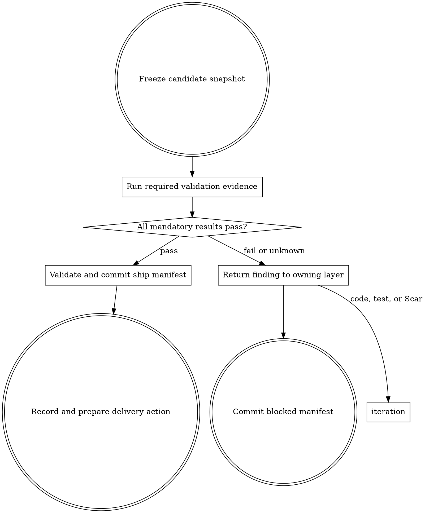

# Validate and Ship — Evidence Before Delivery

Validate one committed candidate. This layer consumes upstream authority; it
does not modify code, tests, Scar lifecycle, acceptance criteria, or design
decisions. The LLM is the sole writer of `ship-manifest.yaml`.
Validation is a read-only consumer of Scar dispositions.

> 陽面交付功能。陰面交付功能加上它的死法與證據。

## Prerequisites and Frozen Snapshot

Read `index.yaml`, `pre-thinking.md`, `2-plan.md`, `acceptance.yaml`, every Scar
report, and `review-record.md`. Read `auto-decisions.md` when auto mode was used.

Require all of the following before validation:

- `index.yaml` tasks are complete.
- The `status` field under `iteration_entry` in `index.yaml` is
  `ready_for_validation`, and `last_commit` resolves.
- The working tree is clean.
- The branch contains committed changes ahead of the resolved base branch.

Resolve and record immutable `base_commit` and `candidate_commit`; the candidate
is the `last_commit` value under `iteration_entry`. Every check uses this
snapshot. Any code or test change invalidates all results and requires a new
run from Step 0.

## Derived Process Overview

The executable steps below are canonical. This graph shows topology only.


```dot
digraph validate_and_ship {
    node [shape=box];
    start [label="Freeze candidate snapshot" shape=doublecircle];
    validate [label="Run required validation evidence"];
    result [label="All mandatory results pass?" shape=diamond];
    manifest [label="Validate and commit ship manifest"];
    delivery [label="Record and prepare delivery action" shape=doublecircle];
    owner [label="Return finding to owning layer"];
    blocked [label="Commit blocked manifest" shape=doublecircle];

    start -> validate;
    validate -> result;
    result -> manifest [label="pass"];
    result -> owner [label="fail or unknown"];
    owner -> blocked;
    owner -> iteration [label="code, test, or Scar"];
    manifest -> delivery;
}
```

## Step 0: Security & Privacy Gate（STOP）

Security and privacy review runs before every other validation step. Unknown is never treated as pass, and no later gate can waive this step.

Resolve `<base-branch>` and `HEAD` to the frozen commits before running:

```bash
git diff <base-branch>...HEAD
```

- **Empty diff:** route the expected/unexpected decision through the active
  execution-mode gate. Unexpected empty diff blocks.
- **Cannot determine base branch:** human mode asks for the base; auto mode
  rejects. Never guess.
- **Review capability:** use the current platform's built-in security and
  privacy review capability on the full diff and report its scope. This is
  platform-agnostic; the skill does not name a tool.
- **No capability:** this is visible degradation. Human mode may self-review
  and accept the risk; auto mode rejects.

Record exactly one result:

- **Pass** — record scope and evidence refs.
- **Fail** — record critical, high, medium, and low findings with file and
  location. Return the findings to `samsara:iteration`; Implement owns code and
  test changes.
- **Unknown** — record the missing evidence and block delivery.

When Iteration returns a new committed candidate, rerun Step 0 against the full diff, not just the fix delta. Iteration owns the round counter and the round 3 safety valve; Validate owns neither repair nor retry policy.

With `Execution mode: human-in-the-loop`, only the human may accept a security/privacy risk; write it to `validation.security_privacy.accepted_risks`. With `Execution mode: auto`, do not ask the user: dispatch `samsara:auto-gatekeeper`; accepted risk is invalid.

## Validation Steps

### 1. Remaining Exposure Check

Read Scar items directly; never create another inventory or reclassify an item.

- `resolved` is excluded.
- `accepted` and `deferred` remain visible through full Scar refs.
- `open`, `blocked`, and unresolved legacy items block delivery.
- `iteration: null` never means resolved.
- Resolve `systemic_ref` through `.samsara/systemic-scars.yaml` using Iteration
  Step 1. A dangling or unreadable ref is unknown.

Run the Planning and Implement format validators. `FINDING` returns to the
artifact owner; `CANNOT VALIDATE` is unknown. This audit checks shape and refs,
not evidence relevance or structural judgment.

### 2. Acceptance Validation

Execute every scenario declared in `acceptance.yaml`, preserving file order:
`death_path`, applicable `degradation`, applicable `unknown_outcome`, then
`happy_path`. Record each `AC-*` result and evidence. A declared scenario may
not disappear because it could not run; record `unknown` instead.

### 3. Primary Evaluator

Run, inspect, or apply `PT-EVAL` exactly as written in `pre-thinking.md`.
Supporting tests do not replace it. Record pass, fail, or unknown plus evidence.
On fail, follow its Feedback loop and return to the layer it names. If it names
no owner for a code/test correction, return to `samsara:iteration`.

### 4. E2E

Run project E2E tests when they exist. Otherwise record `not_applicable` with an
evidence pointer showing why. Fail returns to Iteration; inability to determine
applicability is unknown.

### 5. Reconciliation

Compare behavior with `AC-*` and `PT-EVAL`, file/task allocation with `PL-D*`,
and design consequences with `PT-*`. Record drift by source ref. Implementation
drift returns to Iteration; stale authority returns to Planning or Pre-thinking.
The derived Overview is not authority.

### 6. Review Evidence Check

Read `review-record.md`. Each task and Iteration fix must have both Yin and
Quality reviewer results with reasoning. Missing output, `UNKNOWN`, or an
unresolved Critical returns to Implement. Do not invoke the `code-reviewer`
again or create a second review authority in this layer.

## Result Routing

- Fail returns to the owning layer; Validate never repairs another layer's
  artifact.
- Unknown blocks delivery and records the exact missing evidence.
- Code, test, or Scar findings return to `samsara:iteration`.
- Planning shape/authority findings return to Planning; PT-EVAL definition
  findings return to Pre-thinking.
- Only `ready_for_delivery` may reach the delivery gate.

Before returning, write `validation_status: blocked`, run Validate's format
validator, and commit the manifest as durable handoff evidence.

## Output and Format Validation

Write `changes/<feature>/ship-manifest.yaml` from
`templates/ship-manifest.yaml`; `ship-manifest.md` defines field meaning.
Evidence is referenced, not restated. Empty exposure lists and absent or
not-applicable operational controls are valid after inspection.

Validate the draft with `validation_status: in_progress` and `delivery.action:
pending`:

```bash
uv run python <installed-validate-and-ship-skill-directory>/scripts/validate_format.py changes/<feature>/ --repo-root <repo-root>
```

Resolve the placeholder from this skill's installed skill directory; do not
assume the target repository contains Samsara's source tree.

After the delivery decision, set `ready_for_delivery`, run the validator again,
and commit the manifest. A finding blocks transition; `CANNOT VALIDATE` is
unknown, never pass.

## Transition

Present these actions only after the final validator is clean:

- `merge`
- `create_pr`
- `keep_branch`
- `discard`

With `Execution mode: human-in-the-loop`, ask the user to select one. With
`Execution mode: auto`, do not ask the user; dispatch
`samsara:auto-gatekeeper` and record its answer. Write the choice to
`delivery.action`, add preparation commands or instructions, validate, and
commit the manifest.

This skill records and prepares the action only. Do not merge, do not create the
PR, and do not discard the branch. External execution requires separate explicit
authority.

## Auto Mode Gate

Canonical protocol: `references/auto-mode.md` Stage Gate Protocol. This section
owns only Step 0 overrides, final delivery selection, and the double trace check.

- `workflow_prompt` sources: each Step 0 question and final
  validation-completion delivery selection.
- Decision points: empty diff, base branch, capability/result handling, and
  final delivery selection.
- Step 0 prompts cover empty diff, base branch, no built-in security review capability, unknown result or partial result, fail result, and accepted risk.
- Empty expected diff may proceed with evidence. Unknown result, partial result, or missing capability records a high-uncertainty `reject`; the run must not proceed past Step 0. Fail result revises through Iteration when fixable, otherwise rejects. Accepted risk is invalid in auto mode.
- Before the final decision, validate prior gate entries in
  `auto-decisions.md` against every workflow prompt.
- Trace re-check: after appending the final validation decision, validate the trace again and write its ref to `delivery.decision_ref`.
- A missing or invalid decision-log entry must fail validation before completion.
- `accept_gap` cannot override security, Primary evaluator, format, open or
  blocked Scar, or missing reviewer failures. The final gate selects an action;
  it cannot rewrite a mandatory validation result.
- A valid auto decision prepares the recorded action only. It does not execute
  merge, PR creation, or discard.
