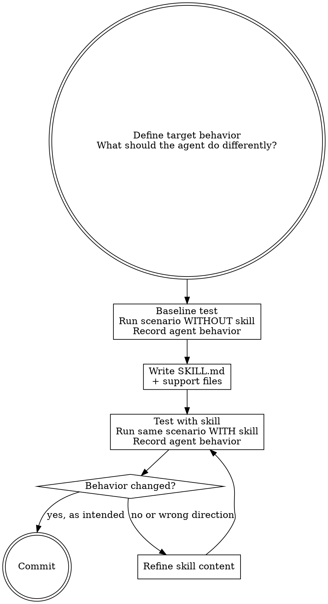

# Writing Skills — Death-First TDD for Skills

Skills are behavior-shaping code. They are subject to the same rigor as production code: test first, verify behavior change, document assumptions.

## Process



## SKILL.md Conventions

### Frontmatter

```yaml
---
name: kebab-case-name
description: Use when [triggering conditions — symptoms, not workflow summary]
---
```

- `name`: letters, numbers, hyphens only
- `description`: starts with "Use when", describes TRIGGERING CONDITIONS, not the process
  - **CSO critical:** If the description summarizes the workflow, agents read the description and skip the full skill. Tested and confirmed.
- Max 1024 characters total frontmatter

### Token Budget

- SKILL.md body: < 500 words
- Heavy reference material: split into support files in the same directory
- Templates: put in `templates/` subdirectory

### Content Structure

1. **Core principle** — 1-2 sentences
2. **Process** — Graphviz digraph showing decision points and steps
3. **Steps** — concrete instructions with yin-side constraints inline
4. **Output** — what files are produced, where they go
5. **Transition** — what skill to invoke next (if applicable)

### Digraph Conventions

- Use `shape=doublecircle` for start/end nodes
- Use `shape=diamond` for decision points
- Use `shape=box` for action steps (default)
- Use `style=dashed` for optional/conditional steps
- Use `label="condition"` on edges for decision outcomes

### Anti-Patterns

- **Narrative storytelling** — skills are instructions, not essays
- **Multi-language examples** — one excellent example beats mediocre coverage
- **Describing what NOT to do without saying what TO do** — always pair negatives with positives
- **Flowcharts for linear processes** — use digraph only for decision points, not for step-1-step-2-step-3

## Yin-Side Check for Skills

Before committing a new skill, answer:
1. **If this skill disappeared, would agent behavior degrade?** If no, the skill shouldn't exist.
2. **What behavior does this skill assume will never change?** Document that assumption.
3. **How would you know if this skill stopped working?** Define the observable signal.
