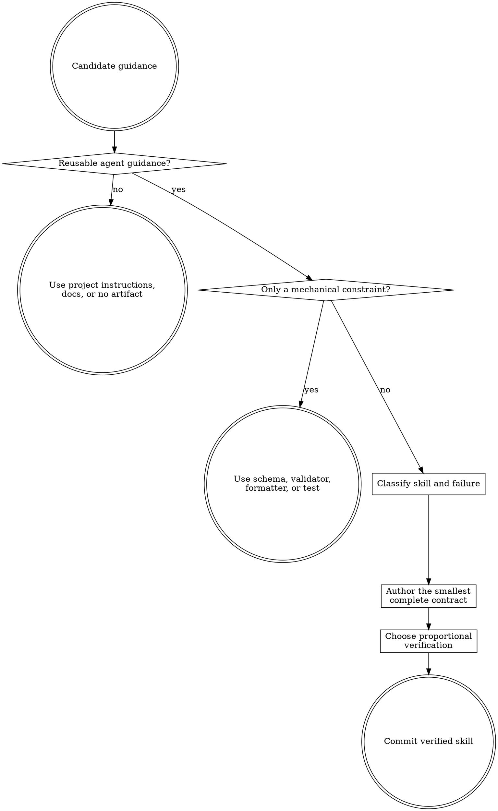

# Writing Skills — Authoring Guide

Match a skill's form and verification method to the behavior it must shape.
Put mechanical constraints in tools; keep reusable judgment and guidance in the
skill. This is a support tool, not a Samsara workflow stage.

## Authoring Decision


```dot
digraph writing_skills {
    node [shape=box];

    start [label="Candidate guidance" shape=doublecircle];
    reusable [label="Reusable agent guidance?" shape=diamond];
    local [label="Use project instructions,\ndocs, or no artifact" shape=doublecircle];
    mechanical [label="Only a mechanical constraint?" shape=diamond];
    automate [label="Use schema, validator,\nformatter, or test" shape=doublecircle];
    classify [label="Classify skill and failure"];
    author [label="Author the smallest\ncomplete contract"];
    verify [label="Choose proportional\nverification"];
    done [label="Commit verified skill" shape=doublecircle];

    start -> reusable;
    reusable -> local [label="no"];
    reusable -> mechanical [label="yes"];
    mechanical -> automate [label="yes"];
    mechanical -> classify [label="no"];
    classify -> author -> verify -> done;
}
```

## 1. Decide Whether a Skill Should Exist

Create a skill for reusable techniques, workflows, patterns, references, or
advice that agents must discover and apply across tasks.

- Put project-specific rules in project instructions.
- Put one-off explanations in docs or the work artifact that consumes them.
- Automate constraints that can be decided from syntax, shape, type, enum, or
  reference resolution.
- For mixed cases, tools own mechanical validity; the skill owns judgment and
  tool usage.

## 2. Classify Before Writing

Name one primary type; preserve secondary types only when they affect use.

- **Workflow:** authority, inputs, decisions, artifacts, failure routes, and
  transitions.
- **Technique:** ordered method, conditions, evidence, and recovery.
- **Pattern:** recognition signals, application, trade-offs, and counter-cases.
- **Reference:** retrieval structure, exact facts, and application examples.
- **Advisory:** evidence, perspectives, options, and an explicit non-decision
  boundary.

## 3. Author the Contract

Frontmatter is a discovery contract:

```yaml
---
name: kebab-case-name
description: Use when [observable triggering conditions]
---
```

- Use only letters, numbers, and hyphens in `name`.
- Start `description` with `Use when`; describe triggers, not the process.
- Keep frontmatter within 1024 characters.
- Use stable domain terms. Define IDs or abbreviations before human-facing use.
- Identify canonical authority and label every repeated view as derived.
- Choose sections from the skill type; do not force one universal outline.

For a persisted artifact, define its workflow owner, consumers, format
authority, lifecycle, and failure route. Humans and dispatched agents may
provide input, but only the declared workflow owner writes it. Split
owner-written and user-editable state instead of creating a dual-writer file.

Keep principles and short examples inline. Put heavy reference, reusable tools,
scripts, and templates in named support files only when a step consumes them.

## 4. Match Form to Failure

- Wrong output shape: give a positive recipe or template.
- Omitted required data: add a structural field or slot.
- Conditional behavior: key the rule to an observable predicate.
- Discipline skipped under pressure: state the prohibition and test the actual
  rationalization.
- Non-obvious branching: use a small graph with semantic labels; read
  `graphviz-conventions.dot` before writing it.
- Linear procedure: use numbered steps.

Word counts are optimization targets, not validity gates. Frequently loaded
skills should be shortest; other skills should aim for fewer than 500 words
when completeness and authority remain intact. Remove duplicate authority
before splitting a coherent contract.

## 5. Verify Proportionally

- Schema, enum, field, or reference change: deterministic validator and unit
  tests.
- Behavior or discipline change: compare the same realistic scenario without
  and with the guidance; use pressure only when an incentive to violate exists.
- Discovery change: test representative trigger and non-trigger requests.
- Reference change: test retrieval and application.
- Editorial, translation, or clarity change: semantic review plus format
  checks; no fabricated behavior baseline.
- Derived overview change: verify visibility and source links, not exact prose.

Tests assert stable contracts or observable outputs. Do not pin natural wording
unless the literal text is itself a protocol. If a baseline does not exhibit
the target failure, do not invent a test to justify more guidance.

## 6. Commit Discipline

If a change alters a route, gate, required field, or other observable workflow
behavior, the commit body must state `Behavior change: <old> -> <new>`. Pure
rewording or file movement may omit this line.

## 7. Yin-Side Check

Before committing:

1. If this skill disappeared, what observable agent behavior would degrade?
2. What assumption or authority could drift without detection?
3. Which instruction could a weak model interpret in two valid ways?
4. Does each persisted artifact have one writer and named consumers?
5. Does verification test the contract rather than its current wording?
